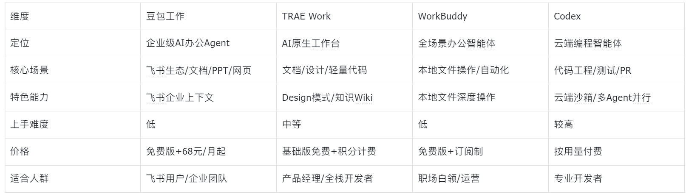

**一句话结论先行**：如果你在飞书生态里工作，**豆包工作**是当前企业级Agent最接近“终局形态”的选择；如果你只想让AI帮你处理本地杂活，**WorkBuddy**依然最省心；如果你是产品经理或独立开发者，**TRAE Work**的全链路覆盖最完整；如果你是专业程序员，**Codex**的工程能力仍然是天花板。

# 它们分属两条赛道

**工作智能体**（Work Agent）帮你写文档、做分析、跑流程、出PPT，代表是**豆包工作、TRAE Work、WorkBuddy**。**编程智能体**（Coding Agent）帮你写代码、改代码、跑工程，代表是**Codex**。

当然边界正在模糊——但主线很清楚，下面一个个聊。

# 豆包工作：字节“四合一”后的最强杀招

2026年8月25日，字节正式发布豆包工作，定位为面向生产力场景的全新Agent产品。

这款产品最大的特点，是字节在过去一个月里完成了一场“四合一”整合：7月底飞书产品团队并入豆包，8月24日TRAE、扣子团队也整体并入，字节旗下所有生产力Agent相关团队集中到豆包工作，战略从多线并行正式转向单点突破。

整合带来的最直接好处，就是**与飞书的深度打通**。用飞书账号登录后，豆包工作能继承你权限范围内的全部企业资产——群聊记录、会议纪要、文档、日程等等，Agent不再需要每次从头认识一遍公司，而是沿着团队已有的讨论、数据和工作流继续往下干。

功能层面，豆包工作覆盖写文档、做表格、画PPT、生成图片视频、搭建网页系统等场景，还能直接操作浏览器和电脑，甚至可以调用云电脑在后台持续执行任务，即使你的电脑关机也能继续推进。实测中，它完成了一份2.5万字的行研报告，引用47条可溯源资料，还生成了14页带演讲者备注的PPT。它的操作额度消耗也压得很低——生成三份原生可编辑文件（Word、Excel、PPT），5小时额度只用了1%。

价格方面，豆包工作随豆包专业版收费：标准套餐连续包月68元，加强套餐200元，高级套餐500元，免费版可完成一般性工作。目前下载电脑版可免费领取30天订阅权益。

**一句话总结：与飞书深度打通让Agent真正“进入组织”，企业上下文理解能力无人能及，适合深度使用飞书生态的团队和个人。**

# TRAE Work：什么都能干一点的“多面手”

TRAE Work是字节从AI编程工具TRAE升级来的AI原生工作台，目前有Work（聊需求）、Code（写代码）、Design（做设计）三个模式。

Design模式是它的独特亮点。你用自然语言描述一个页面或产品，它能直接生成可交互的可视化界面，而且生成之后还能继续编辑——先让AI读懂设计系统再生成，框选局部精准修改，最终还能导出Figma和代码。这解决了一个长期痛点：AI设计稿不再是一次性的，你可以对着一个跑起来的成品边看边说、边改边预览。

TRAE Work的知识Wiki功能也值得一提。有用户把上千篇文稿丢给它，系统自动完成文档分类、标签提取、全文索引和关联推荐，把“死材料”激活为可检索的活知识体系。

2026年8月最新更新中，TRAE Work还上线了“电脑控制”（Computer Use）功能和Design模式的图片编辑能力。

**一句话总结：功能全面，中文支持好，需求→设计→代码全链路在一个平台跑通，适合产品经理和全栈开发者。**

# WorkBuddy：在你电脑里“替你干活”的腾讯选手

WorkBuddy是腾讯云CodeBuddy团队于2026年3月推出的AI Agent桌面智能体，定位为“全场景职场AI智能体”。它跑的是一个完整闭环：感知→规划→执行→交付，你丢一句“整理这个乱文件夹并出分析报告”，它自己搞定归类、清洗、画图、导出，成品直接递到你手上。

它提供了三种工作模式：Craft模式（你说我做，直接执行）、Plan模式（先分析需求给出计划，确认后执行）、Ask模式（只回答不动文件），把效率和安全的平衡权交给用户。

2026年9月2日，WorkBuddy正式上线开放平台，首批引入超百家生态伙伴，9款联名硬件首发亮相，30余个行业应用同步接入，面向开发者开放Skill、Expert、Connector三大能力。6月单月访问量突破2000万，上线半年迭代了50多个版本。

**一句话总结：上手门槛低，本地文件操作能力强，生态开放程度高，适合不想折腾、只想把杂活丢出去的职场人。**

# Codex：给程序员的“云端工程机器人”

Codex是OpenAI的AI编程智能体，把任务丢到云端沙箱执行——它自己装依赖、跑测试、出PR，你关电脑它还在干活。

2026年4月Codex迎来重大更新：新增Mac桌面操作能力，支持多智能体并行运行和长期任务执行，还能生成产品概念图和简报名视觉素材。5月进一步推出Appshots功能——按两下Command键就能把当前应用窗口连截图带文字一起“喂”给Codex；目标模式（/goal）正式转正，你可以定义目标结果和成功条件，让Codex持续朝该方向工作。锁定的电脑使用功能让Mac锁屏后Codex仍能远程安全地继续工作。

但Codex的使用门槛和成本也更高，有文章标题直接写“Codex月烧200刀”，交互体验上也有用户吐槽“经常卡，老是显示正在重连”。

**一句话总结：复杂工程能力最强，适合有付费意愿的专业开发者，非程序员上手有门槛。**

# 一张表看懂四款产品

# 到底选哪个？

**如果你在用飞书办公**，豆包工作是当前最自然的选择。它不需要你改变工作习惯，Agent直接进入你已有的组织关系和工作流，理解你的项目群聊、会议纪要和文档。

**如果你不用飞书**，但想找个AI帮忙处理日常办公杂活，WorkBuddy是最省心的选择，本地文件操作能力扎实，上手快。

**如果你是产品经理或独立开发者**，需要从需求到设计到代码全流程走通，TRAE Work的多模式覆盖最全面。

**如果你是专业程序员**，需要AI帮你搞定复杂工程任务，Codex的云端自动化能力目前是天花板级别。

工具不是非此即彼。很多人是豆包工作处理飞书里的团队协作 + Codex搞开发，各取所长。关键是先想清楚：**你的工作流到底长什么样？** 想清楚了，选择就不难了。
