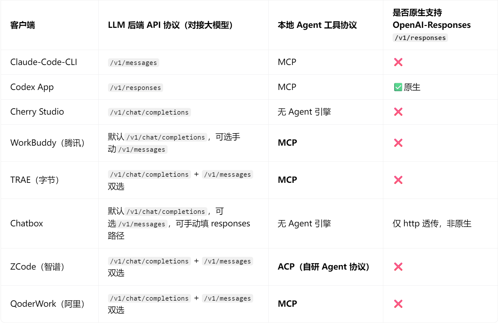

# 一、主流客户端支持的协议



1. **OpenAI Responses **`/v1/responses`** 几乎是 Codex App 独占**；国内所有主流 Agent 客户端全部放弃原生 Responses 路线。

1. **工具调用阵营分裂为两条路线**

  - MCP 阵营：字节 TRAE / 腾讯 WorkBuddy / 阿里 QoderWork / Cursor（生态互通，插件通用）

  - ACP 阵营：智谱 ZCode（独立自研封闭路线）

1. 如果接入支持v1/messages的模型给到国内 Agent 客户端：优先启用`/v1/messages`原生协议，`chat/completions`兼容层会丢失 Computer‑Use、深度思考等高级 Agent 能力。

# 二、一点API URL说明

如果是OpenAI 的协议（供应商）的url为：

https://api.yidianhub.com/v1

如是Anthropic的协议（供应商）的url**为：**

https://api.yidianhub.com

如果是codex同时访问GPT模型和国内模型 的url为：

https://api.yidianhub.com/codex/v1

# 三、一点API模型使用说明

## 1、default分组

**该分组提供免费模型，可供体验使用，可使用的模型有：**

agnes-1.5-flash、agnes-2.0-flash、agnes-video-v2.0，agnes-image-2.0-flash、agnes-image-2.1-flash

glm-4.7-flash、glm-4.5-air:free

glm-5.2，glm-5v-turbo、glm-5-turbo、glm-5、glm-5.1

kimi-k2.7-code-highspeed、kimi-k2.6、kimi-k2.7-code、kimi-k2.5

minimax-m3、minimax-m2.5、minimax-m2.7

deepseek-v4-pro、deepseek-v4-flash、deepseek-v4-pro-202606、deepseek-v4-flash-202605、deepseek-v3.2

qwen3.5-flash、qwen3.5-plus

hunyuan-role-latest、hunyuan-t1-vision-20250916、hunyuan-turbos-vision-video-20250728、hunyuan-lite

hunyuan-standard、hunyuan-standard-256K、hunyuan-pro、hy3、hy3-preview

## 2、codex分组

**可使用系列模型：**

gpt-5.5、gpt-5.4、gpt-image-2、gpt-5.5-openai-compact、gpt-5.6-terra、gpt-5.6-sol、gpt-6-astra

## 3、codex-pro分组

**可使用系列模型：**

gpt-5.5、gpt-5.4、gpt-image-2、gpt-image-2-all、gpt-5.5-openai-compact、gpt-5.6-terra、gpt-5.6-sol、gpt-6-astra

## 4、codex-vip分组

**可使用系列模型：**

gpt-6-astra

## 5、claude-code分组

**可使用系列模型：**

claude-opus-5、claude-sonnet-5、claude-haiku-4-5-20251001、claude-opus-4-8、claude-sonnet-4-6

**缓存：**

大多数时候没有缓存，缓存命中率约等于无

有缓存 60%左右

## 6、claude-code-pro分组

**可使用系列模型：**

claude-fable-5、claude-opus-5、claude-sonnet-5、claude-haiku-4-5-20251001、claude-opus-4-8、claude-sonnet-4-6

**缓存：**

有缓存 60%左右

**注：**

小额测试的不建议用1.5倍的分组，跑大型任务推荐用claude-code-pro分组

openclaw小龙虾的不建议选claude-code-pro分组！！！缓存的命中率比较低

## 7、claude-code-vip分组

**可使用系列模型：**

claude-fable-5-1、claude-fable-5、claude-opus-5、claude-sonnet-5、claude-haiku-4-5-20251001、claude-opus-4-8、claude-sonnet-4-6

**缓存：**

拥有 80~90%的高缓存命中率，走的都是比较优质的渠道，支持 1M 上下文，带缓存（缓存有命中率，并不是所有的都能命中）整体用起来会更顺、更稳定，体验感会好很多

## 8、zh分组 (国内模型)

**可使用系列模型：**

glm-4.6、glm-4.7、glm-5v-turbo、glm-5-turbo、glm-5、glm-5.1、glm-5.2、glm-5.3、glm‑5.3‑flash

# 四、具体协议说明

## OpenAI协议

### /v1/chat/completions 协议

**Python**

```python
from openai import OpenAI

client = OpenAI(
    # 将这里换成你在一点API令牌处拿到的密钥
    api_key="把这段文字替换成你的令牌",
    # 这里将官方的接口访问地址，替换成我们一点API的入口地址
    base_url="https://api.yidianhub.com/v1"
)

chat_completion = client.chat.completions.create(
    messages=[
        {
            "role": "user",
            "content": "你好",
        }
    ],
    model="gpt-5.4",
)

print(chat_completion)
```

**Curl**

```sql
curl https://api.yidianhub.com/v1/chat/completions ^
-H "Content-Type: application/json" ^
-H "Authorization: Bearer 把这段文字替换成你的令牌" ^
-d "{\"model\": \"gpt-5.4\", \"messages\": 
[{\"role\": \"user\", \"content\": \"讲一个三句话的独角兽睡前故事\"}], 
\"text\": {\"format\": {\"type\": \"text\"}}}"
```

### /v1/Responses 协议

**Curl**

```sql
curl https://api.yidianhub.com/v1/responses ^
-H "Content-Type: application/json" ^
-H "Authorization: Bearer 删掉此处文字填写你的令牌" ^
-d "{\"model\": \"gpt-5.4\", \"input\": \"讲一个三句话的关于独角兽的睡前故事。\", 
\"text\": {\"format\": {\"type\": \"text\"}}, \"stream\": false}"
```

## Anthropic

### /v1/messages 协议

**Python**

```python
from anthropic import Anthropic

# ====================== Configuration ======================
API_KEY = "YOUR_API_KEY"  # Please fill in your key manually
API_BASE_URL = "https://api.yidianhub.com"  # Your third-party API address
MODEL_NAME = "claude-sonnet-4-6"
# ===========================================================

# Initialize client with third-party API endpoint
client = Anthropic(
    api_key=API_KEY,
    base_url=f"{API_BASE_URL}/v1"
)

def chat_with_claude(user_message: str):
    try:
        # Send request to API
        response = client.messages.create(
            model=MODEL_NAME,
            max_tokens=4096,
            temperature=0.7,
            messages=[
                {"role": "user", "content": user_message}
            ]
        )

        # Extract and return the answer
        return response.content[0].text

    except Exception as e:
        return f"Request failed: {str(e)}"

# ====================== Test Example ======================
if __name__ == "__main__":
    # Your question here
    question = "Hello, please introduce yourself briefly."

    # Get AI response
    answer = chat_with_claude(question)

    # Print result
    print("AI Response:\n", answer)
```

**Curl**

```sql
curl https://api.yidianhub.com/v1/messages ^
-H "x-api-key: 把这段文字删除替换成你的密钥" ^
-H "Content-Type: application/json" ^
-d "{
    \"model\": \"claude-sonnet-4-6\",
    \"max_tokens\": 1024,
    \"messages\": [
        {\"role\": \"user\", \"content\": \"你好!\"}
    ]
}"
```

## 图像分析响应 ✅

### 调用作图端口提示词

```bash
调用作图接口
key : 删掉这段文字填写自己的codex/codex-pro令牌
url : https://api.yidianhub.com/v1/images
model : gpt-image-2 / gpt -image-2-all （二选一即可）

图片生成
https://api.yidianhub.com/v1/images/generations

图片编辑
https://api.yidianhub.com/v1/images/edits
```

### 文生图

此请求方式，令牌分组支持  codex  /  codex-pro  分组的 gpt 模型

实际调用接口地址为：

```
https://api.yidianhub.com/v1/images/generations
```

```python
import base64
import os
from pathlib import Path

import requests

# 填写你的令牌
API_KEY = os.getenv("OPENAI_API_KEY","填写你自己的令牌")
# 填写URL
BASE_URL = os.getenv("OPENAI_BASE_URL", "https://api.yidianhub.com/v1").rstrip("/")

# 模型设定
MODEL = os.getenv("IMAGE_MODEL", "gpt-image-2")

# 提示词 自行填写
DEFAULT_PROMPT = (
    "帮我生成一个月光女神泰德兰的图片"
)

PROMPT = os.getenv("IMAGE_PROMPT", DEFAULT_PROMPT)

# 图片尺寸，不宜过大
SIZE = os.getenv("IMAGE_SIZE", "1024x1536")
QUALITY = os.getenv("IMAGE_QUALITY", "auto")

# 保存路径
desktop = Path.home() / "Desktop"
save_path = desktop / "1.png"

def main() -> None:
    if not API_KEY:
        raise RuntimeError("Set OPENAI_API_KEY first. Do not hard-code API keys.")

    headers = {
        "Authorization": f"Bearer {API_KEY}",
        "Content-Type": "application/json",
    }

    payload = {
        "model": MODEL,
        "prompt": PROMPT,
        "size": SIZE,
        "quality": QUALITY,
    }

    print("Generating image...")
    response = requests.post(
        f"{BASE_URL}/images/generations",
        json=payload,
        headers=headers,
        timeout=180,
    )

    if not response.ok:
        print("Request failed:")
        print(response.status_code)
        print(response.text)
        response.raise_for_status()

    result = response.json()

    try:
        image_base64 = result["data"][0]["b64_json"]
    except (KeyError, IndexError, TypeError) as exc:
        print("Could not find data[0].b64_json in the response:")
        print(result)
        raise RuntimeError("No base64 image data found") from exc

    image_bytes = base64.b64decode(image_base64)
    save_path.write_bytes(image_bytes)

    print("Done")
    print(f"Saved to: {save_path}")

if __name__ == "__main__":
    main()
```

### 图生图

此请求方式，令牌分组支持  codex /  codex-pro  分组的 gpt 模型

实际调用接口地址为：

```
https://api.yidianhub.com/v1/images/edits
```

```python
import base64
import mimetypes
import os
from pathlib import Path

import requests

# 填写你的令牌，建议优先用环境变量 OPENAI_API_KEY
API_KEY = os.getenv("OPENAI_API_KEY", "填写您自己的令牌")

# 填写 URL
BASE_URL = os.getenv("OPENAI_BASE_URL", "https://api.yidianhub.com/v1").rstrip("/")
MODEL = os.getenv("IMAGE_MODEL", "gpt-image-2")

# 输入图：默认读取桌面 1.png，也可以用环境变量 IMAGE_INPUT 指定
desktop = Path.home() / "Desktop"
INPUT_IMAGE = Path(os.getenv("IMAGE_INPUT", str(desktop / "1.png")))

# 提示词：描述希望基于原图怎么改
DEFAULT_PROMPT = (
    "参考输入图片的人物、姿态和构图，来点千禧年前后的动漫画风"
)
PROMPT = os.getenv("IMAGE_PROMPT", DEFAULT_PROMPT)

# 输出图片尺寸，不宜过大
SIZE = os.getenv("IMAGE_SIZE", "1024x1536")
QUALITY = os.getenv("IMAGE_QUALITY", "auto")

# 保存路径
SAVE_PATH = Path(os.getenv("IMAGE_OUTPUT", str(desktop / "2.png")))

def guess_mime_type(path: Path) -> str:
    mime_type, _ = mimetypes.guess_type(path.name)
    return mime_type or "application/octet-stream"

def main() -> None:
    if not API_KEY or API_KEY == "填写你自己的令牌":
        raise RuntimeError("请先设置 OPENAI_API_KEY，或把 API_KEY 改成你的令牌。")

    if not INPUT_IMAGE.exists():
        raise FileNotFoundError(f"输入图片不存在: {INPUT_IMAGE}")

    headers = {
        "Authorization": f"Bearer {API_KEY}",
    }

    data = {
        "model": MODEL,
        "prompt": PROMPT,
        "size": SIZE,
        "quality": QUALITY,
    }

    print("Editing image...")
    print(f"Input: {INPUT_IMAGE}")

    with INPUT_IMAGE.open("rb") as image_file:
        files = {
            "image": (
                INPUT_IMAGE.name,
                image_file,
                guess_mime_type(INPUT_IMAGE),
            )
        }

        response = requests.post(
            f"{BASE_URL}/images/edits",
            data=data,
            files=files,
            headers=headers,
            timeout=180,
        )

    if not response.ok:
        print("Request failed:")
        print(response.status_code)
        print(response.text)
        response.raise_for_status()

    result = response.json()

    try:
        image_base64 = result["data"][0]["b64_json"]
    except (KeyError, IndexError, TypeError) as exc:
        print("Could not find data[0].b64_json in the response:")
        print(result)
        raise RuntimeError("No base64 image data found") from exc

    image_bytes = base64.b64decode(image_base64)
    SAVE_PATH.write_bytes(image_bytes)

    print("Done")
    print(f"Saved to: {SAVE_PATH}")

if __name__ == "__main__":
    main()
```
