[Astrbot 官方文档](https%3A%2F%2Fdocs.astrbot.app%2F)

[Astrbot Github地址](https%3A%2F%2Fgithub.com%2FAstrBotDevs%2FAstrBot)

# 包管理器（uv）部署（官方推荐）

使用 `uv` 可以快速安装并启动 AstrBot。

## 前置条件安装 uv

如果尚未安装 `uv`，可以按照 [uv 官方文档](https%3A%2F%2Fdocs.astral.sh%2Fuv%2F) 安装

`uv` 支持 Linux、Windows、macOS

### MacOS & Linux

```
curl -LsSf https://astral.sh/uv/install.sh | sh
```

### Windows

```powershell
powershell -ExecutionPolicy ByPass -c "irm https://astral.sh/uv/install.ps1 | iex"
```

---

建议使用管理员PowerShell

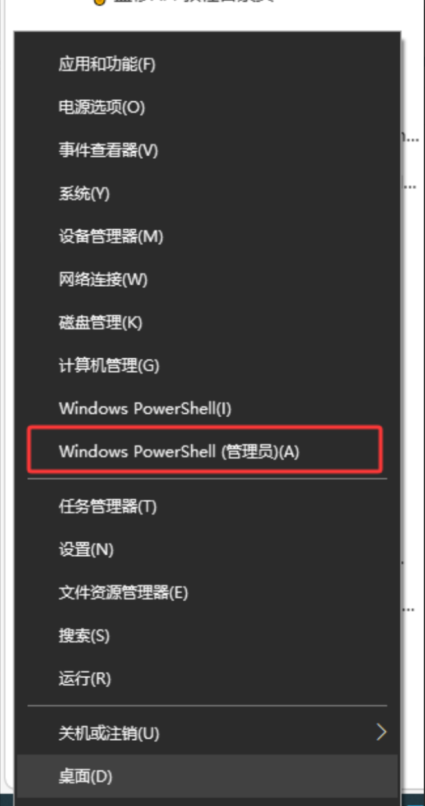

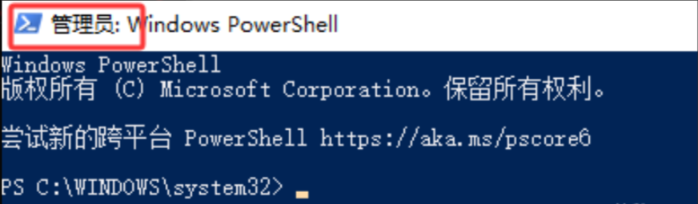

# 安装Astrbot

注意，安装完 `uv`后，要新开一个窗口执行下面的命令，要不然有概率报错或者不生效

```bash
uv tool install astrbot
```

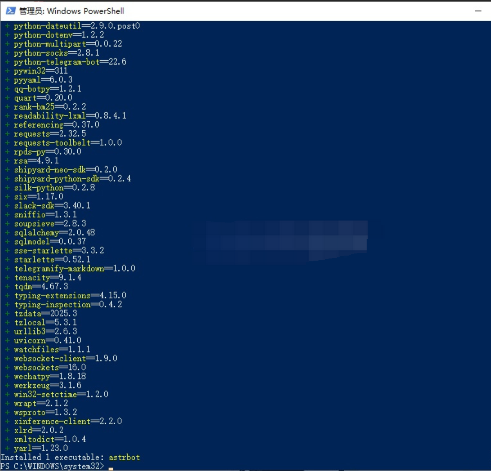

静静等待其安装完成就行，上图为安装完成的界面

# 初始化并启动

```
astrbot init # 只需要在第一次部署时执行，后续启动不需要执行
astrbot
```

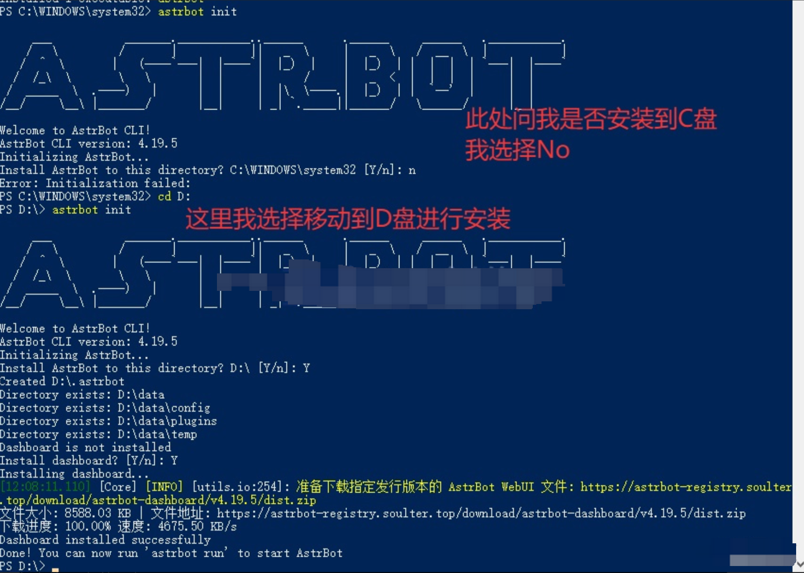

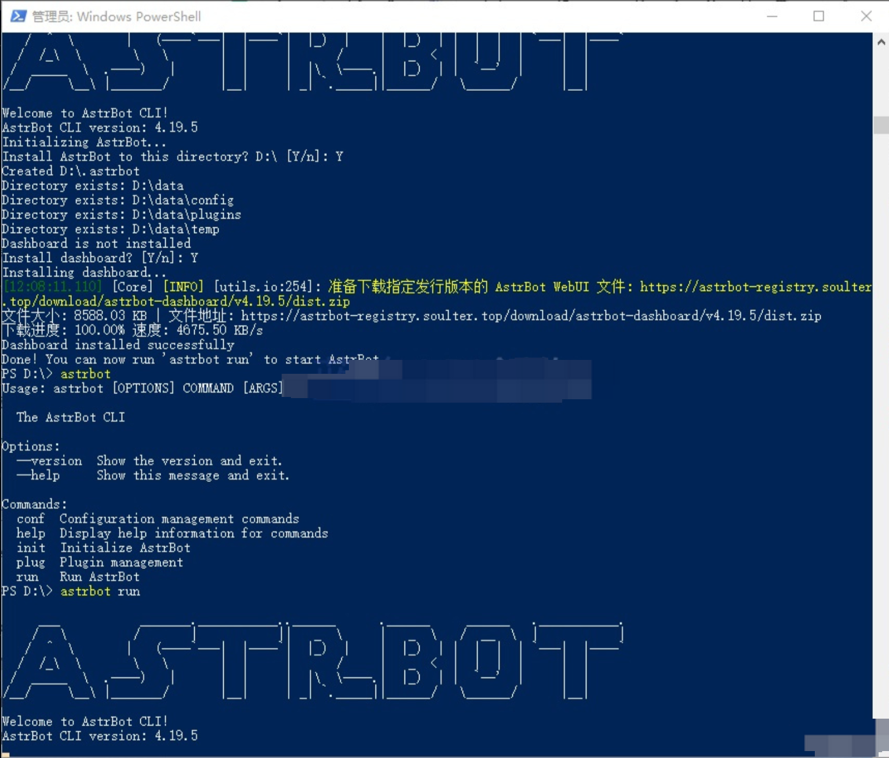

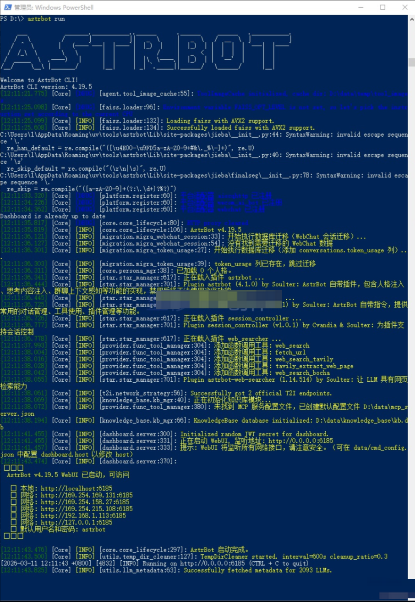

## 登录网页UI

启动完成后，可以通过 [http://localhost:6185/](http%3A%2F%2Flocalhost%3A6185%2F) 去登录网页WebUI

```bash
http://localhost:6185/
```

默认的登录用户密码都是：astrbot

```bash
astrbot
```

---

随后登录进去之后，会提示修改密码和用户名，密码自己填一个，用户名建议留空默认astrbot，方便记忆

修改完账户密码之后，二次登录界面如下

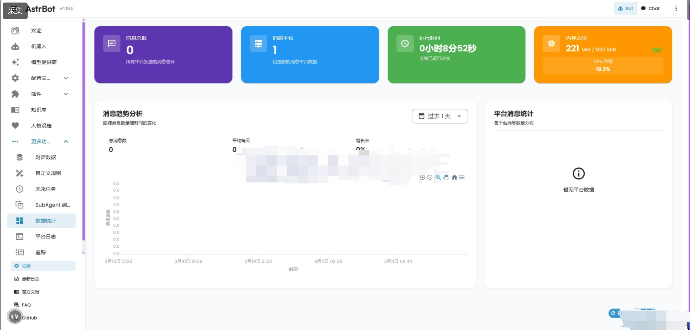

回到欢迎界面，如下

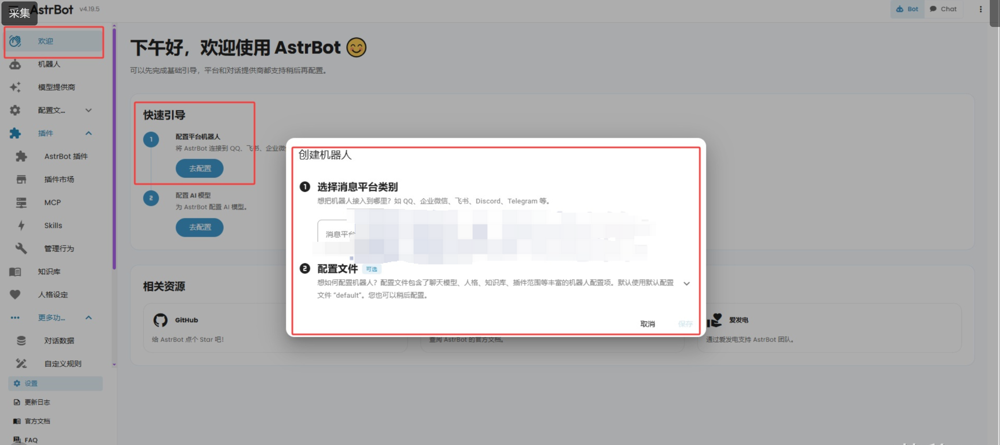

此时提示我们创建一个机器人，那我们就去创建一个机器人。

## 配置API

配置我们的API时，选择OpenAI协议

```
https://api.yidianhub.com
```

API Key（sk密钥）就是在一点API上创建令牌的时候的Key

一切填入就绪后，点击**“获取模型列表”**，随后添加模型，并启动模型

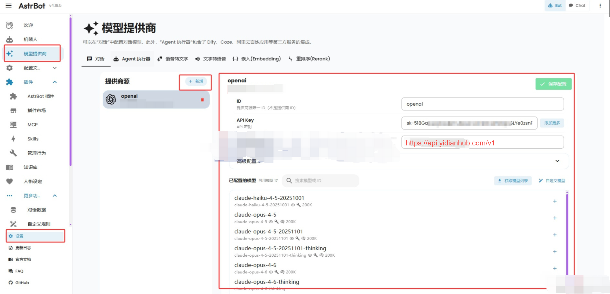

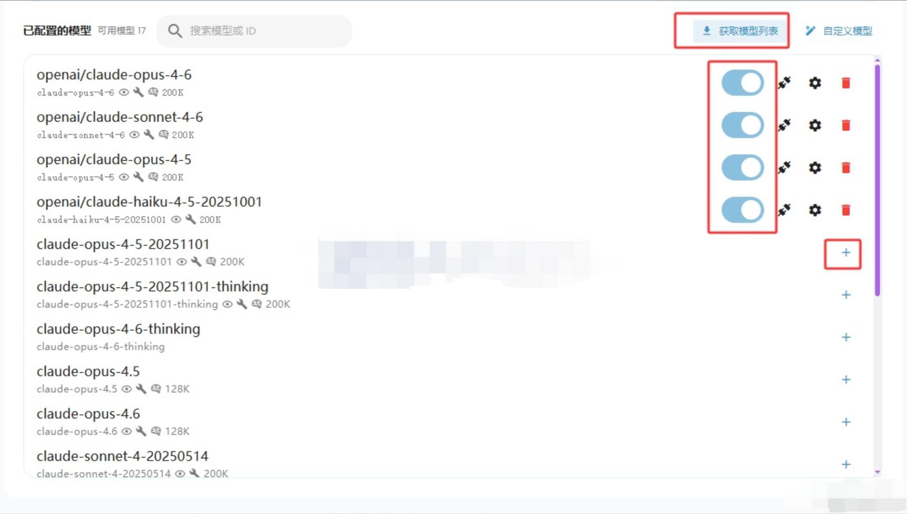

随后可以在对话界面中，选择模型，进行对话，测试是否正常运行

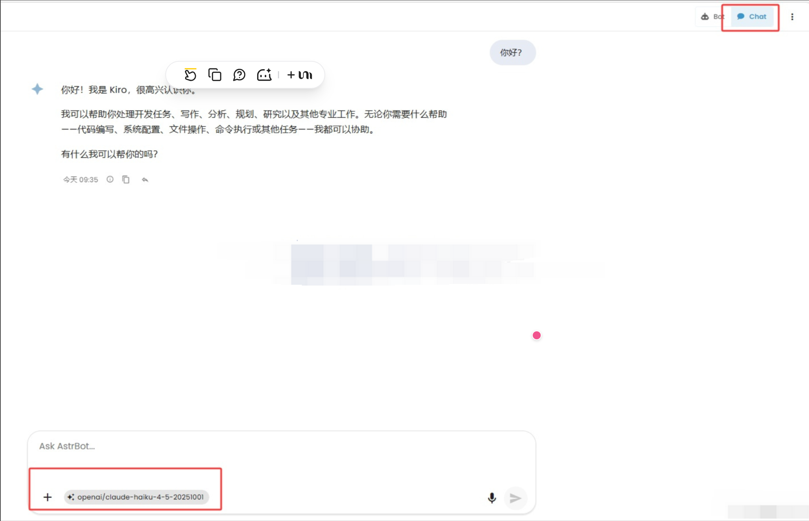
