# 📌 使用简介

***CC Switch**** 是一个跨平台（Windows、macOS、Linux）的桌面图形工具，用于统一管理和快速切换多个 AI CLI 工具（如 Claude Code、Codex、Gemini CLI、OpenCode 等）的 API 配置与环境。*

本教程节选自官方教程，详细版教程可参考[官方指南](https%3A%2F%2Fgithub.com%2Ffarion1231%2Fcc-switch%2Fblob%2Fmain%2FREADME_ZH.md)

***CC-Switch**** 真是管理、配置API最好用的工具了，没有之一！*

——教程作者

# 🧰 下载安装

官方下载地址[ [GitHub CC-Switch\]](https%3A%2F%2Fgithub.com%2Ffarion1231%2Fcc-switch%2Freleases)

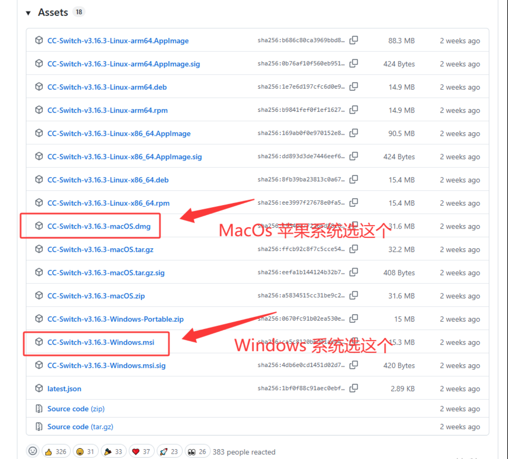

## 📦 Windows

- 下载最新版本的 `.msi` 安装程序或解压 `Portable.zip` 版本安装。

## 🍏 MacOS 苹果芯片

- 推荐通过 **Homebrew** 安装（推荐）：

```bash
brew install --cask cc-switch
```

- 或手动下载 `.zip` 安装。

## 🐧 Linux

- 提供多种格式：`.deb`, `.rpm`, `.AppImage`, `.flatpak`。

- 可用包管理或直接解压运行。

# 🧭 快速开始

## 一键配置

首先打开一点API [https://api.yidianhub.com](https%3A%2F%2Flanyiapi.com)。然后选择“令牌管理”，在任意你已经建立好的令牌右边，点击“聊天”旁边的小三角。

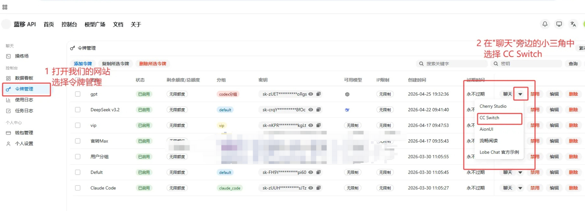

选择一下配置，模型可以随自己喜欢，在下面任选一个

```
# Haiku
claude-haiku-4-5-20251001
  
# Sonnet
claude-sonnet-4-20250514-thinking
claude-sonnet-4-5-20250929-thinking
claude-sonnet-4-5-20250929
claude-sonnet-4-6

# Opus  
claude-opus-4-5-20251101-thinking
claude-opus-4-5-20251101
claude-opus-4-6
claude-opus-4-7
claude-opus-4-8

# Fable（仅限vip分组）
claude-fable-5
```

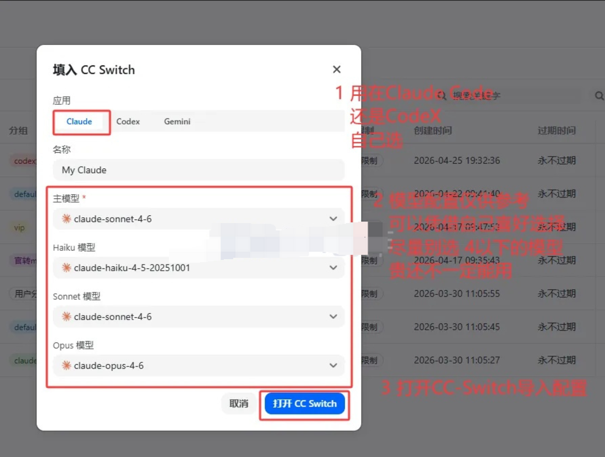

在弹出的窗口中，点击确认，打开CherryStudio

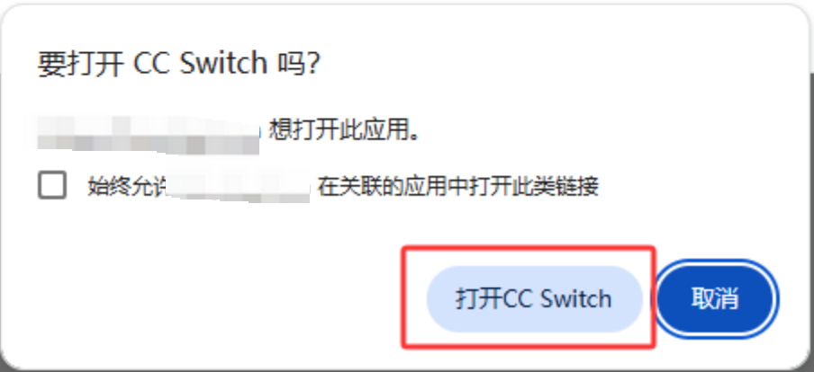

随后会自动唤起已经安装好的CC-Switch，如果没有唤起，就打开后再来一次

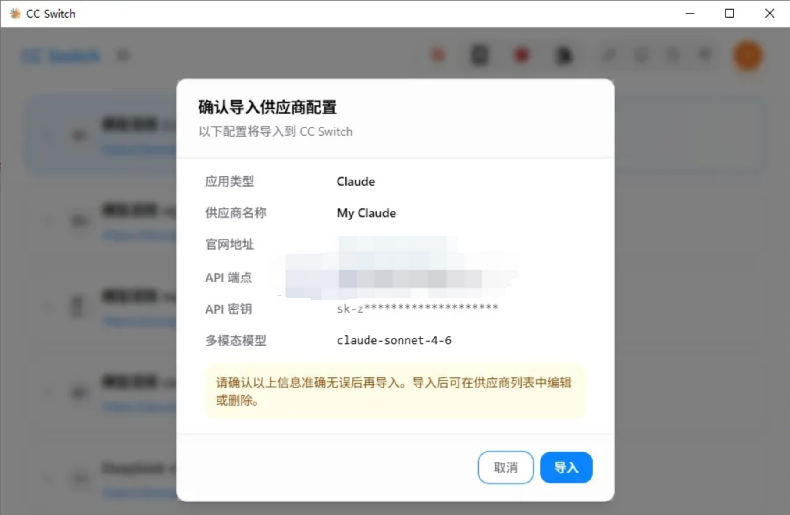

点击导入之后，就可以看到新添加的配置单了，配置完成后

可以直接跳到第三步模型测试

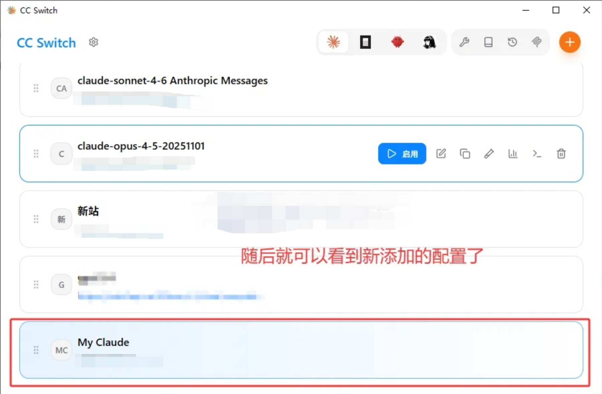

## 传统配置

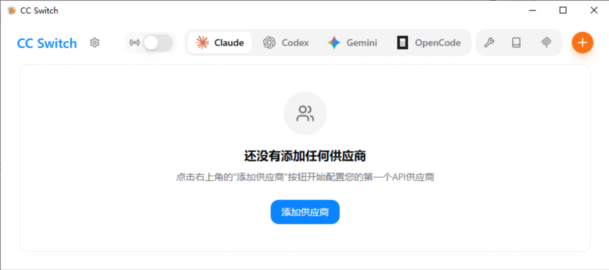

### 1.添加 Provider（供应商配置）

在主界面点击 **Add Provider** → 选择已有预设或创建自定义配置（API 地址、API Key、模型等）。

❗  选择 **Claude** ❗

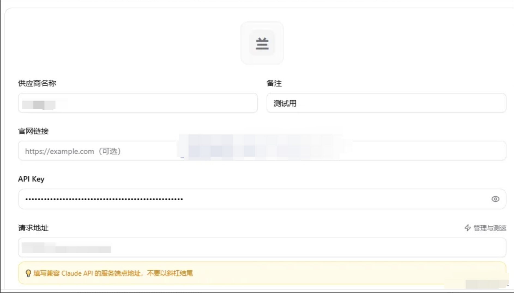

请求地址：https://api.yidianhub.com

### 2.模型配置

API格式选择 ❗  OpenAI Chat Completions ❗

模型随便填，取决于个人，一般推荐使用 ⭐  主模型（必填）+Sonnet模型 ⭐

*省钱小建议：一般不建议把haiku改成主模型，要不然就相当于调用两次opus4.6了，Claude Code默认调用就是1次haiku+1次主模型的*

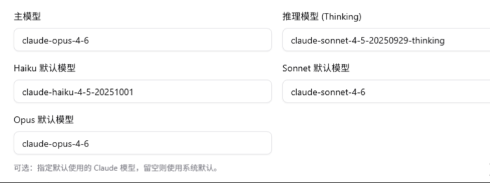

### 3.模型测试

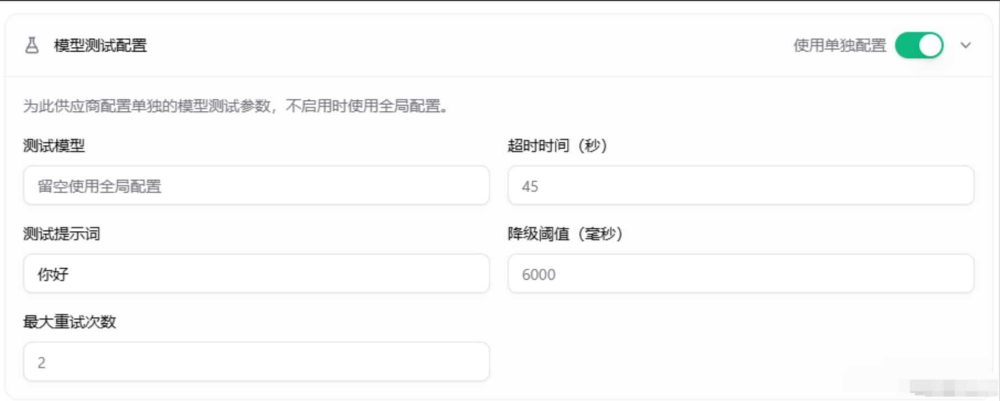

保持默认就可以

### 切换 Provider

选择你想启用的 Provider → 点击 **Enable**。

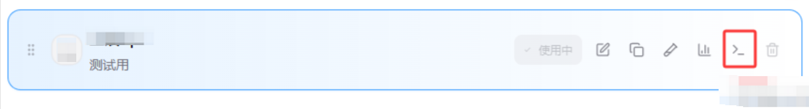

生效后重启对应的 CLI 工具（如 Claude Code）即可使用。

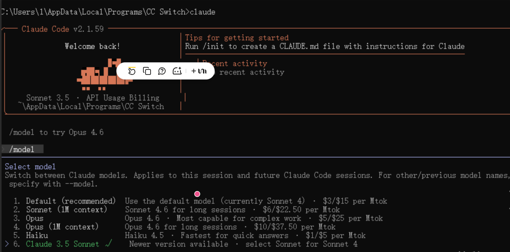

在CC-Switch启动的终端中再启动Claude Code，使用 `/model`命令可以看到多了几种我们配置好的模型的选择，可以让模型的切换变的更加便捷。

### 系统托盘切换

不同供应商的API切换还可以在系统托盘菜单中快速实现，非常方便。

可以在设置中，把不需要的去取消显示，把常用的选出来（比如Claude、OpenCode、OpenClaw）

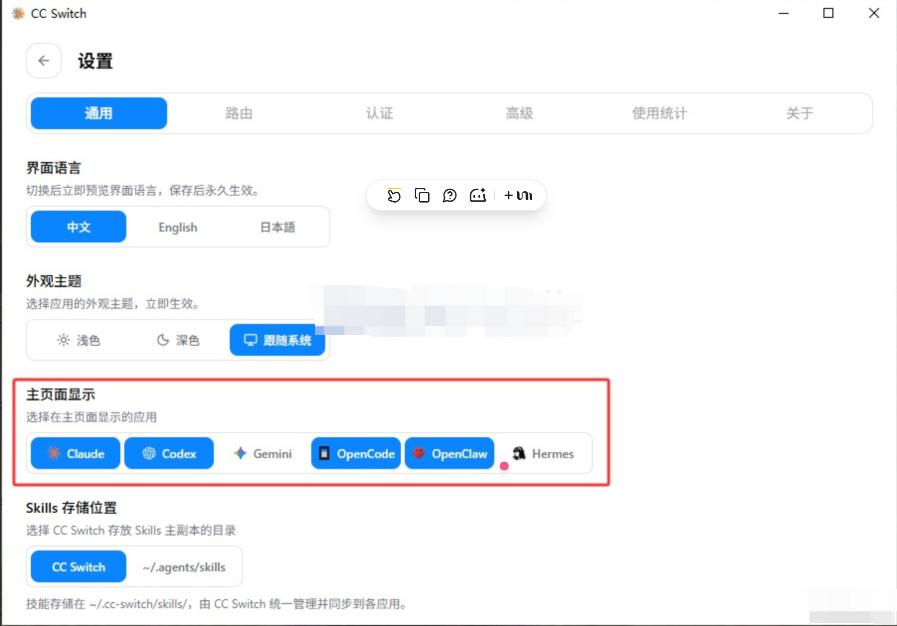

**OpenClaw也可以在这配置和切换**

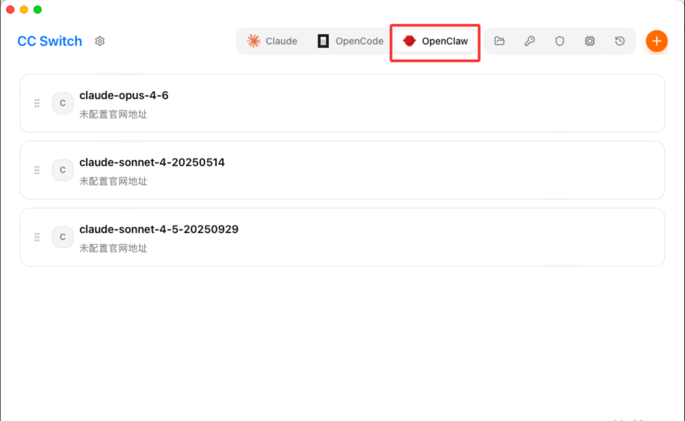

OpenClaw的配置方式和Claude大差不差，唯一不一样的就是URL需要加 v1，既：

https://api.yidianhub.com/v1

# 📦 配置文件位置（常见 CLI）

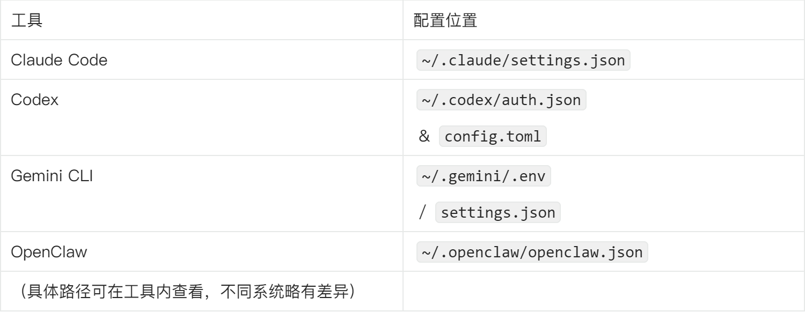
