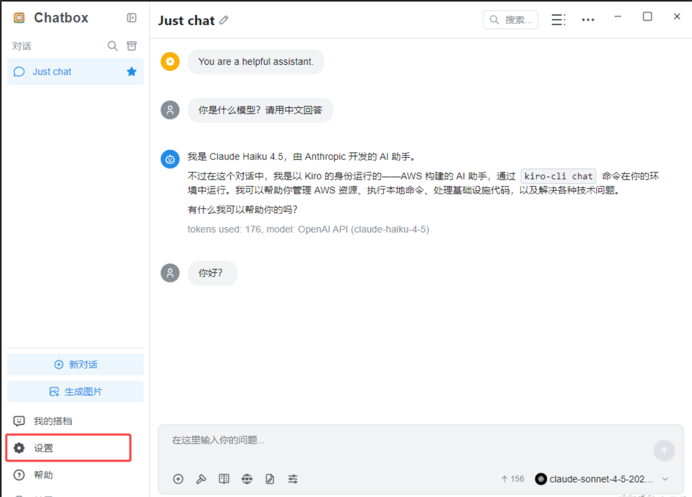
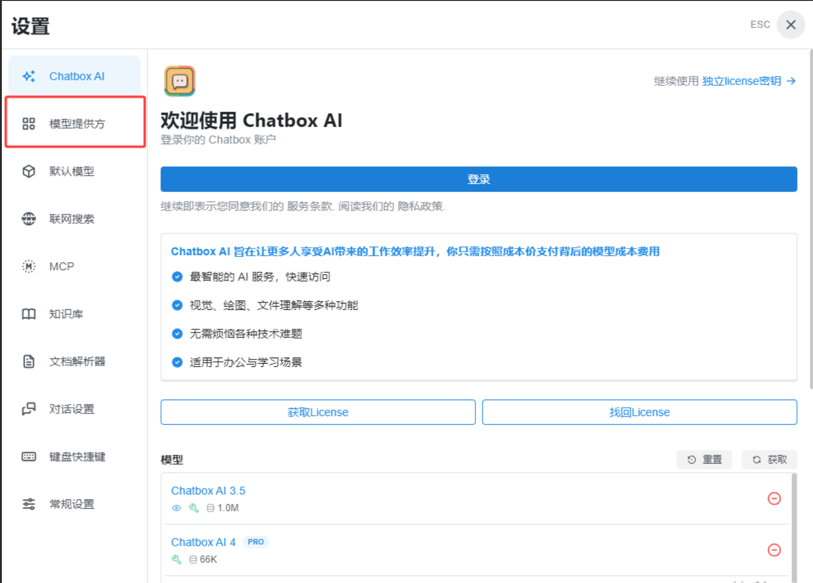
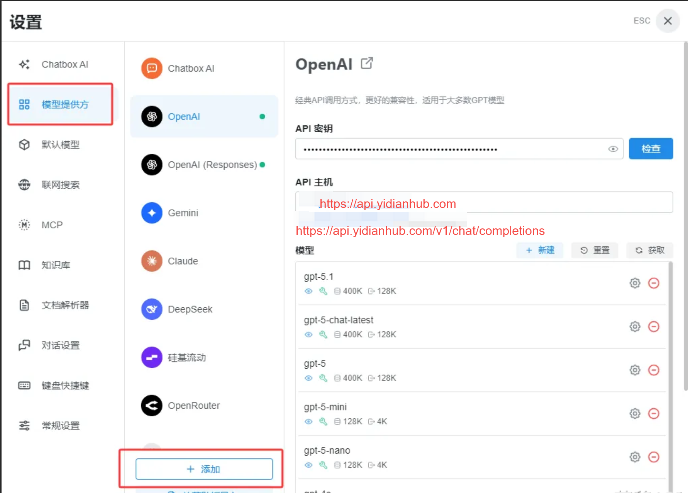
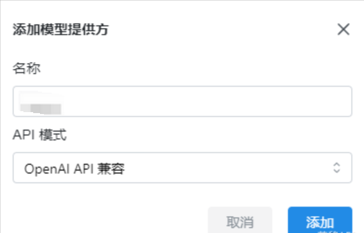
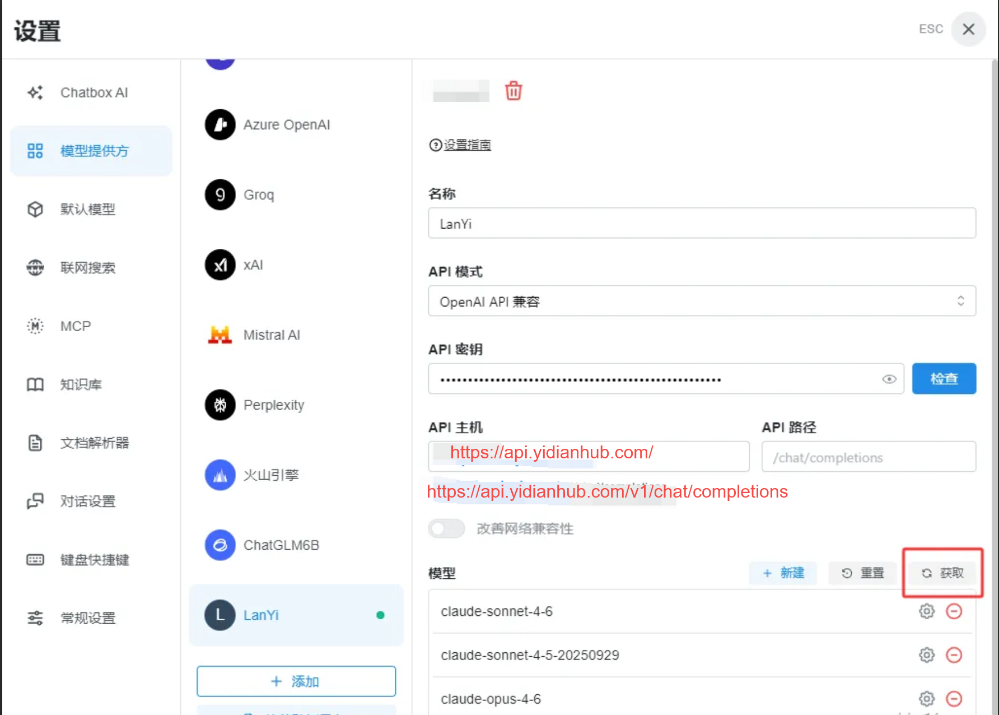
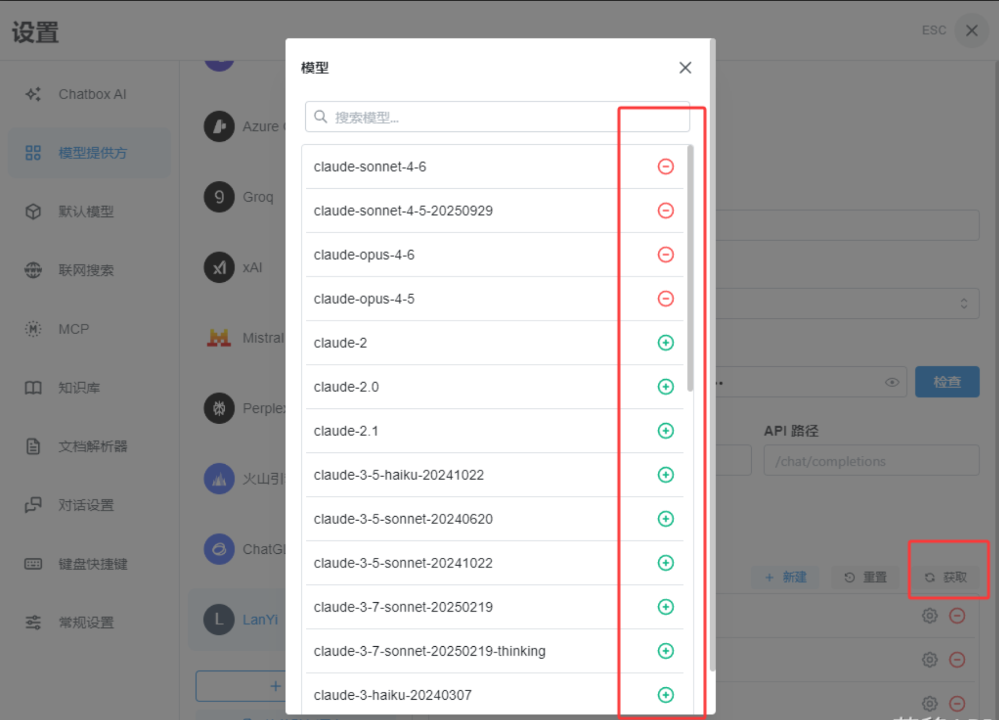
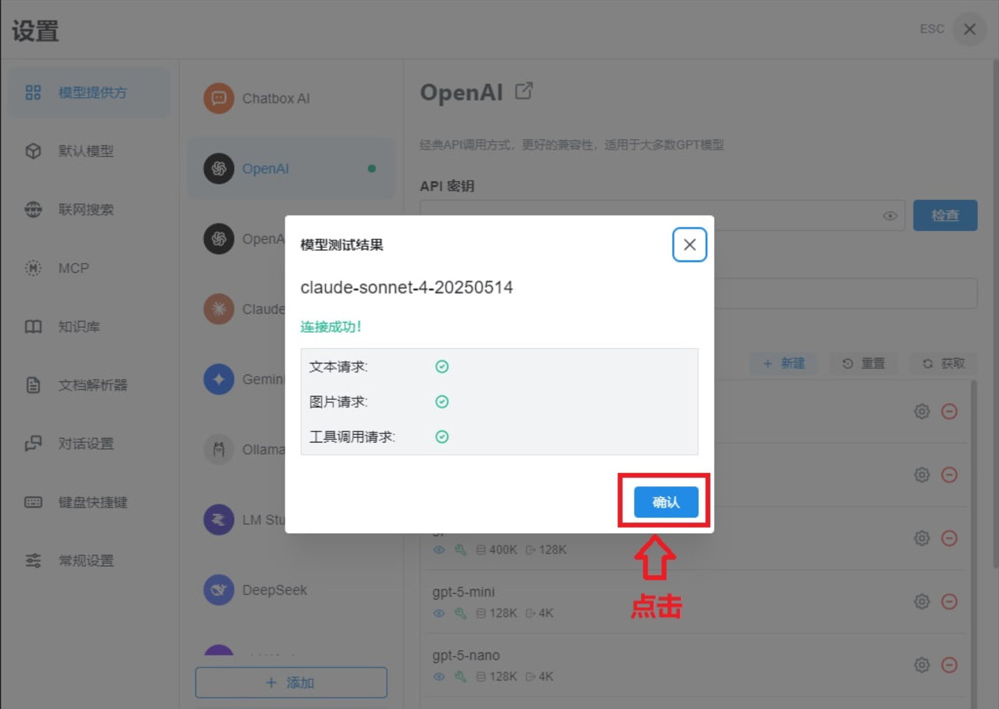
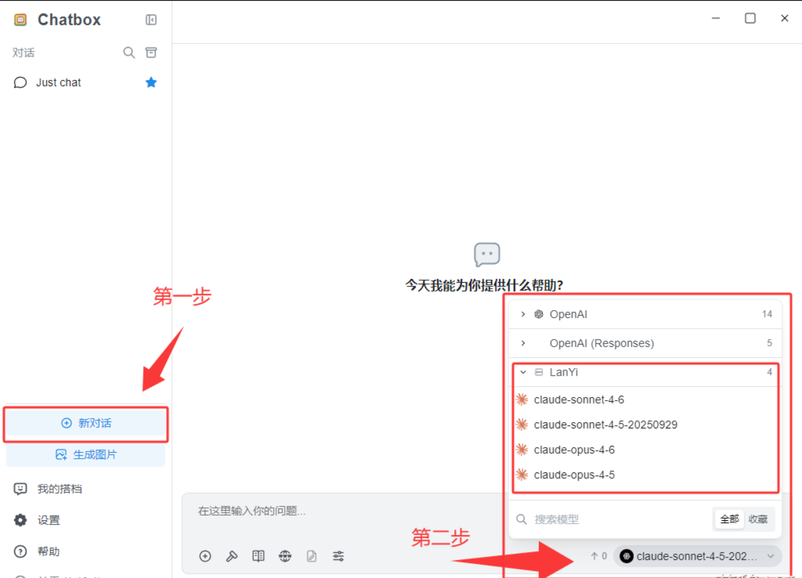
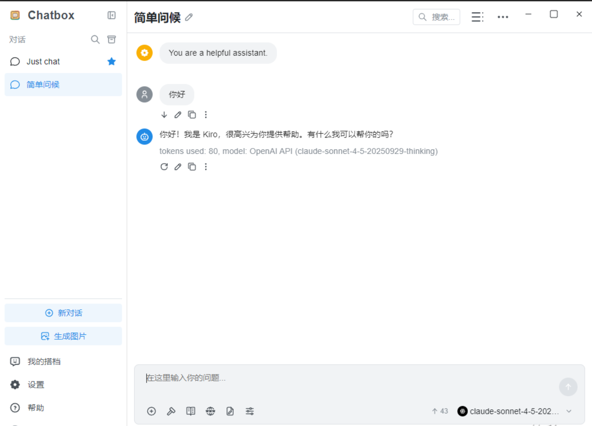

# 第一：下载与安装

官方网站下载（推荐）：[https://chatboxai.app/zh](https%3A%2F%2Fchatboxai.app%2Fzh)

网页版ChatBox：[https://web.chatboxai.app/guide](https%3A%2F%2Fweb.chatboxai.app%2Fguide)（使用、配置方法与本教程类似）

点击首页的 "免费下载"。根据你的电脑系统选择：

Windows：下载 .exe 文件。

Mac：下载 .dmg 文件（M1/M2/M3芯片选 Apple Silicon，老款选 Intel）。

安装：像安装普通软件一样双击运行，一路点击“下一步”即可。

# 第二：配置中转 API (核心步骤)

安装好后打开 Chatbox，点击 设置提供方

如果没有提示设置提供方的页面就点击左下角的小齿轮（设置）

第一步：点击模型提供方 (AI Model Provider)：

第二步：在下拉菜单中选择 OpenAI API

API 密钥 (API Key)：填入你在兰姨API兑换的那个 sk- 开头的密钥。

（注意输入的时候要确保没有空格）

API 主机 (URL)：[https://api.yidianhub.com/](http%3A%2F%2F1.95.142.151%3A3000%2F)

最后点击：获取

添加好后

第一步：点击检查

第二步：找到刚刚添加的模型点击

有个别老旧模型可能不能用

等待测试 看到连接成功之后点击确认

然后返回主页

返回主页之后

第一步：点击新对话，点击下方选择模型

第二步：找你你刚刚添加测试过的模型，选择它

最后：发一个简单的信息试试，比如“你好”

# **第三：特别提醒**

# ChatBox使用时候，Token可能损耗比一般使用要更高，
可能高出1~2倍，请用户特别注意具体原因未知，或许是因为ChatBox的特殊框架调用
