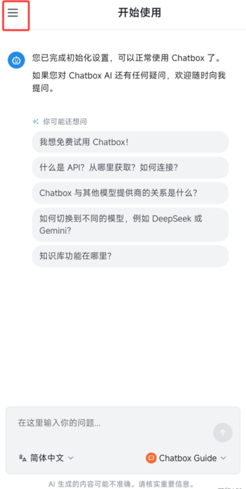
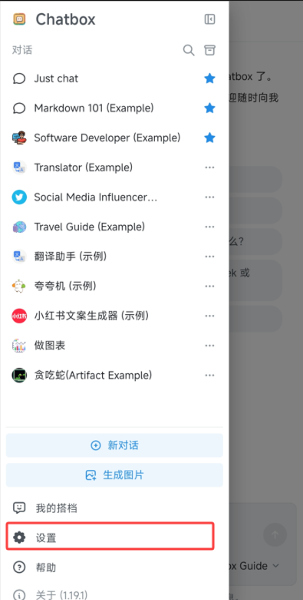
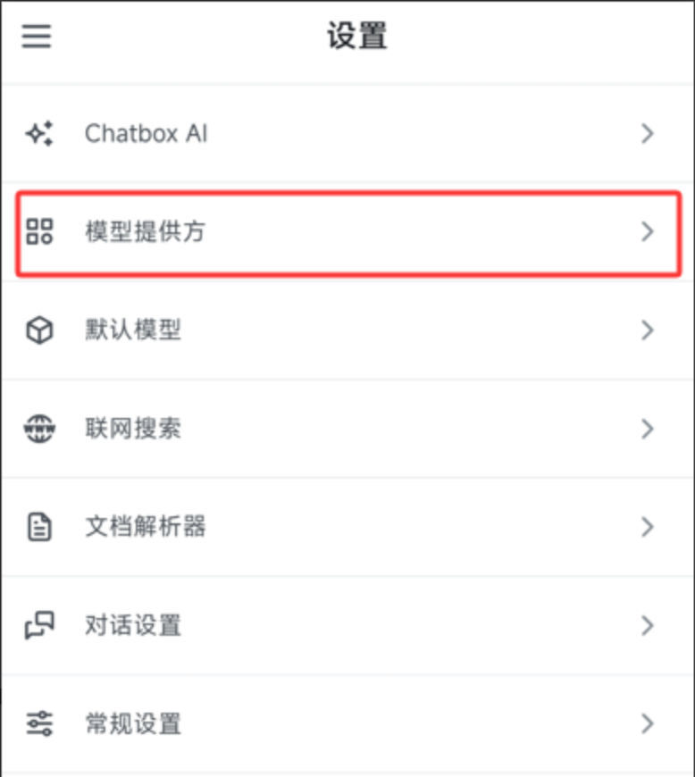
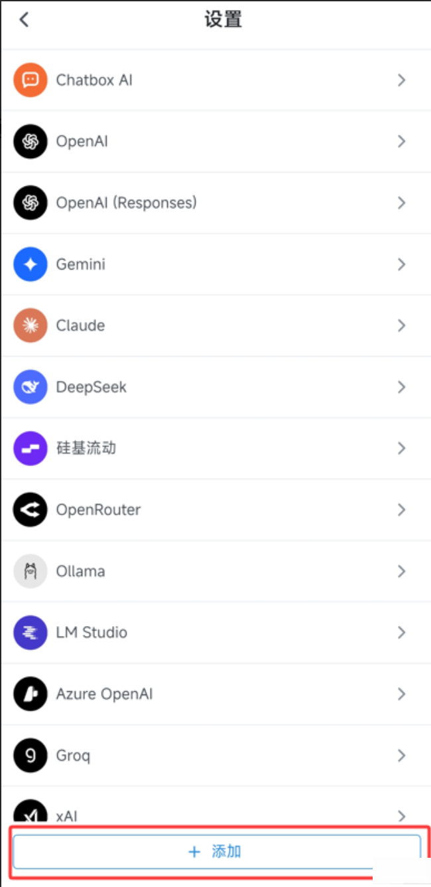
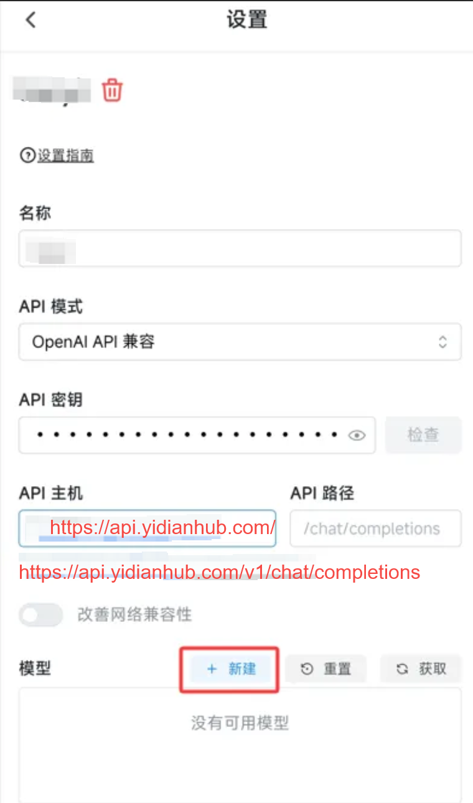
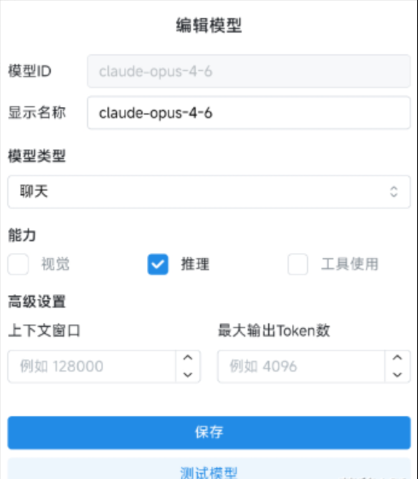
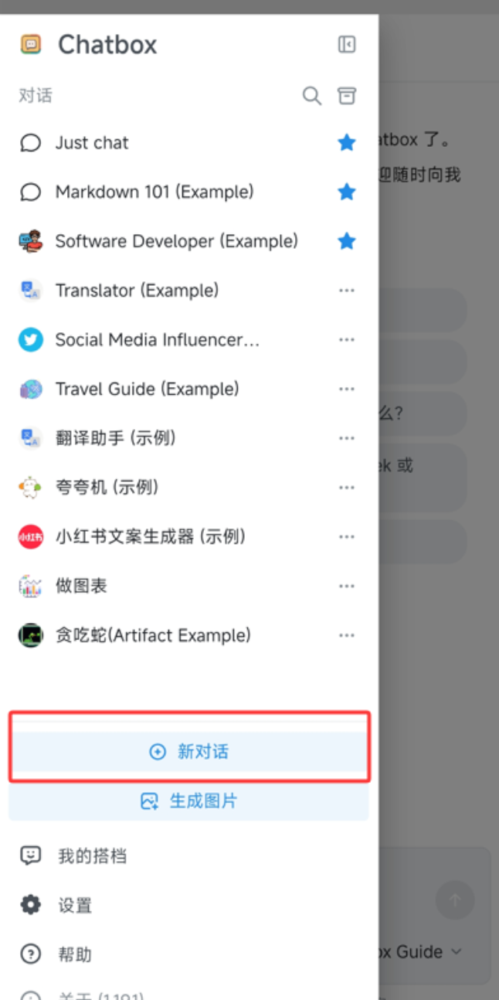
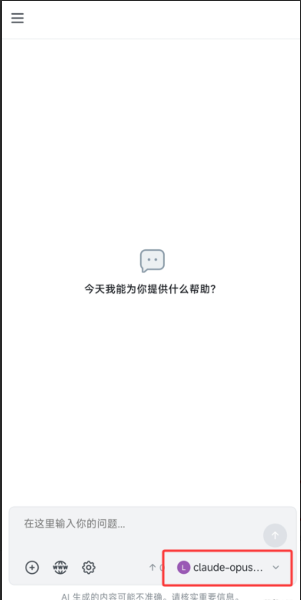
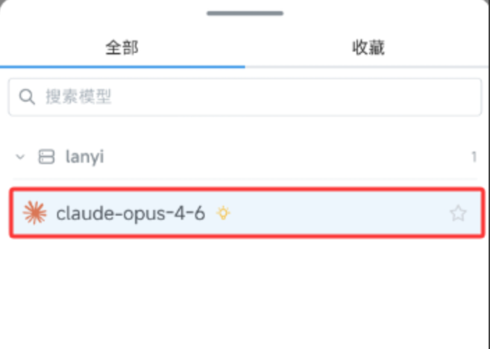
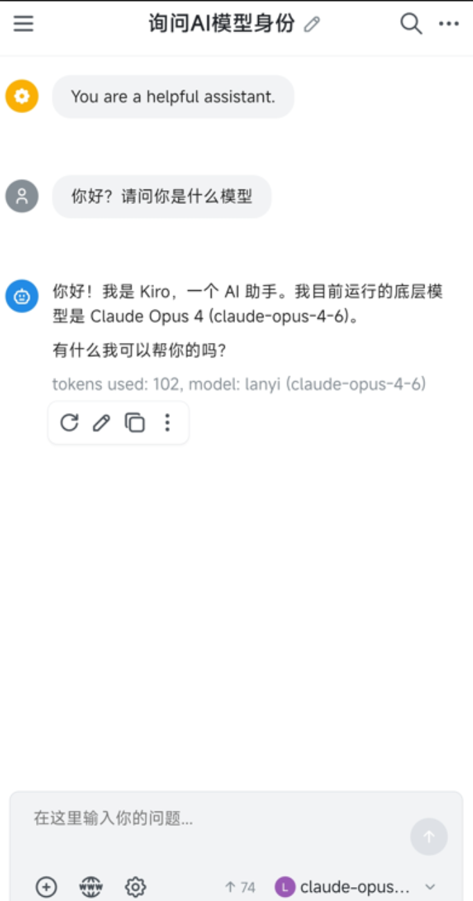

# 第一：下载与安装

官方网站下载（推荐）：网址：[https://chatboxai.app/zh](https%3A%2F%2Fchatboxai.app%2Fzh)

点击首页的 "免费下载"。根据你的手机系统选择：

- Android

- Apple IOS

---

安装：像安装普通软件一样双击运行，一路点击“下一步”即可。

# 第二：配置中转 API (核心步骤)

安装好后打开 Chatbox，跳过引导，点击左上角的小齿轮（设置）



再点击左下角的小齿轮，进入设置



第一步：点击模型提供方 (AI Model Provider)：



第二步：在下拉菜单中选择 OpenAI API 兼容





API 密钥 (API Key)：填入你在兰姨API兑换的那个 sk- 开头的密钥。（注意输入的时候要确保没有可空格）

API 主机 (URL)：[https://api.yidianhub.com/](http%3A%2F%2F1.95.142.151%3A3000%2F)

```bash
[https://api.yidianhub.com/](http%3A%2F%2F1.95.142.151%3A3000%2F)
```

最后点击 **新建** 新建模型



这里是添加你的 Claude 模型

你需要手动把你的便宜又好用的 Claude 模型加进去保存即可。（自行选择）

能力方面，选了推理可以，貌似不支持视觉和工具使用

这里我常的是：

- claude-haiku-4-5-20251001（便宜）

- claude-sonnet-4-5-20250929（均衡）

- claude-opus-4-6（质量）

---

测试对话

保存模型完成后，回到首页，在左侧新建一个对话



随后再在右下角选择模型



选择刚刚配置好的模型，开始对话



然后开始对话即可



# 第三：特别提醒

ChatBox使用时候，Token可能损耗比一般使用要更高

可能高出1~2倍，请用户特别注意

具体原因未知，或许是因为ChatBox的特殊框架调用
