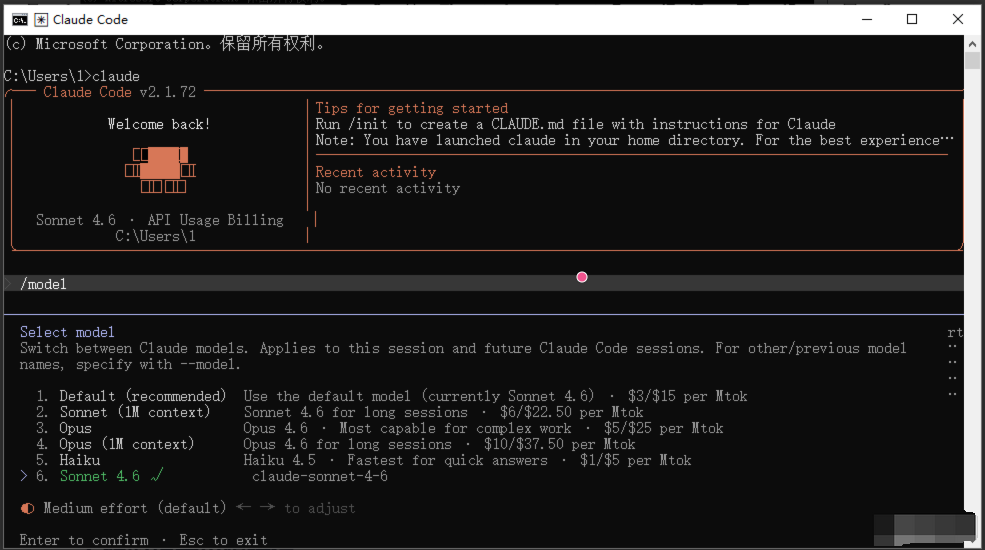

*Claude Code 是 Anthropic 推出的强大 AI 编程工具，能够直接在您的电脑上协助编写代码、操作文件。本教程将教您如何使用Key 来完美运行它。*

# 安装基础环境

**Claude Code** 的运行依赖基础框架：**Node.js** 请务必先安装好

## Linux 安装方法

### 方法一：使用官方仓库（推荐）

```bash
curl -fsSL https://claude.ai/install.sh | bash
```

### 方法二：使用系统包管理器

虽然版本可能不是最新的，但对于基本使用已经足够：

```bash
# Ubuntu/Debian
sudo apt update
sudo apt install nodejs npm
# CentOS/RHEL/Fedora
sudo dnf install nodejs npm
```

**Linux 注意事项**

某些发行版可能需要安装额外的依赖

如果遇到权限问题，使用 `sudo`

确保你的用户在 npm 的全局目录有写权限

安装完成后，验证安装是否成功，打开终端，输入以下命令：

```bash
node --version
npm --version
```

如果显示版本号，说明安装成功了！

---

## 安装 Claude Code

打开终端，运行以下命令：

```bash
npm install -g @anthropic-ai/claude-code@2.1.120
```

如果遇到权限问题，可以使用 sudo：

```bash
sudo npm install -g @anthropic-ai/claude-code@2.1.120
```

**验证 Claude Code 安装**

安装完成后，输入以下命令检查是否安装成功：

```bash
claude --version
```

如果显示版本号，恭喜你！Claude Code 已经成功安装了。

## 设置环境变量

配置 Claude Code 环境变量

为了让 Claude Code 连接到你的中转服务，需要设置两个环境变量：

### 方法一：配置文件（推荐）

配置位置：`~/.claude/settings.json`

```bash
{
  "env": {
    "ANTHROPIC_AUTH_TOKEN": "sk-开头的令牌密钥",
    "ANTHROPIC_BASE_URL": "https://api.yidianhub.com",
    "ANTHROPIC_MODEL": "claude-sonnet-4-6",
    "CLAUDE_CODE_ATTRIBUTION_HEADER": "0"
  },
  "includeCoAuthoredBy": false,
  "model": "Sonnet"
}
```

### 方法二：临时设置（当前会话）

在终端中运行以下命令：

```bash
export ANTHROPIC_BASE_URL="https://api.yidianhub.com/"
export ANTHROPIC_AUTH_TOKEN="你的API密钥"
```

### 方法三：永久设置环境变量

编辑你的 shell 配置文件：

对于 bash (默认)：

```bash
echo 'export ANTHROPIC_BASE_URL="中转ip"' >> ~/.bashrc
echo 'export ANTHROPIC_AUTH_TOKEN="你的API密钥"' >> ~/.bashrc
source ~/.bashrc
```

对于 zsh：

```bash
echo 'export ANTHROPIC_BASE_URL="中转ip"' >> ~/.zshrc
echo 'export ANTHROPIC_AUTH_TOKEN="你的API密钥"' >> ~/.zshrc
source ~/.zshrc
```

---

# 启动Claude

## 启动Claude

配置完成后，你就可以开始使用 Claude Code 了！

```
claude
```

```bash
cd /path/to/your/project
```

```
claude
```

---

## 切换模型命令

```
/model
```



# Linux 常见问题解决

## 安装时提示权限错误

尝试以下解决方法：

```bash
sudo npm install -g @anthropic-ai/claude-code
```

或者

```bash
npm config set prefix ~/.npm-global
```

然后添加到 PATH

```bash
echo 'export PATH=~/.npm-global/bin:$PATH' >> ~/.bashrc
source ~/.bashrc
```

缺少依赖库

```bash
# Ubuntu/Debian
sudo apt install build-essential
# CentOS/RHEL
sudo dnf groupinstall "Development Tools"
```

---

## 环境变量不生效

检查以下几点：

- 确认修改了正确的配置文件（.bashrc 或 .zshrc）

- 重新启动终端或运行`source ~/.bashrc`

- 验证设置`echo $ANTHROPIC_BASE_URL`

🎉 恭喜你！你已经成功安装并配置了 Claude Code，现在可以开始享受 AI 编程助手带来的便利了。
