# 0）事前准备API和URL

**你的中转 API 信息**

先获取以下三项：

- **API Base URL（接口地址）**
蓝移URL链接地址：

```
https://api.yidianhub.com
```

- **API Key（密钥）**
您在蓝移API后台生成的key

```
sk-xxxxxxxxxxxxxxxx
```

- **支持的模型名称：**

```
# Haiku
  claude-haiku-4-5-20251001
  
# Sonnet
  claude-3-7-sonnet-20250219-thinking
  claude-sonnet-4-20250514-thinking
  claude-sonnet-4-5-20250929-thinking
  claude-sonnet-4-5-20250929
  claude-sonnet-4-6

# Opus  
  claude-opus-4-5-20251101-thinking
  claude-opus-4-5-20251101
  claude-opus-4-6
```

复制填写以上信息时，请注意千万不要有空格，会影响进程

---

本教程以 MacOS 12.7.6 Intel 芯片 为范本进行的安装教程

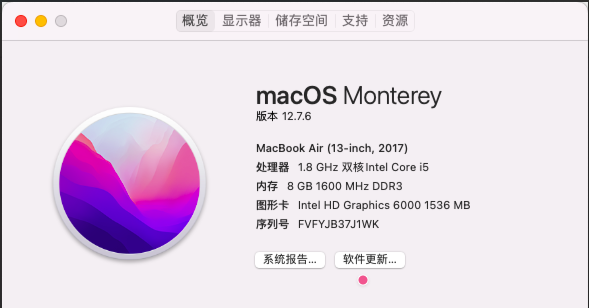

# 1）安装 Node.js

## 下载安装 Node.js

点击 [Node.js官网（](https%3A%2F%2Fnodejs.org%2Fen%2Fdownload)[https://nodejs.org/en/download](https%3A%2F%2Fnodejs.org%2Fen%2Fdownload)[）](https%3A%2F%2Fnodejs.org%2Fen%2Fdownload)进去按图所示下载Node即可

选择 LTS 这种稳定的，长期支持版本，至于装 v24.x 还是v22.x，全看用户个人

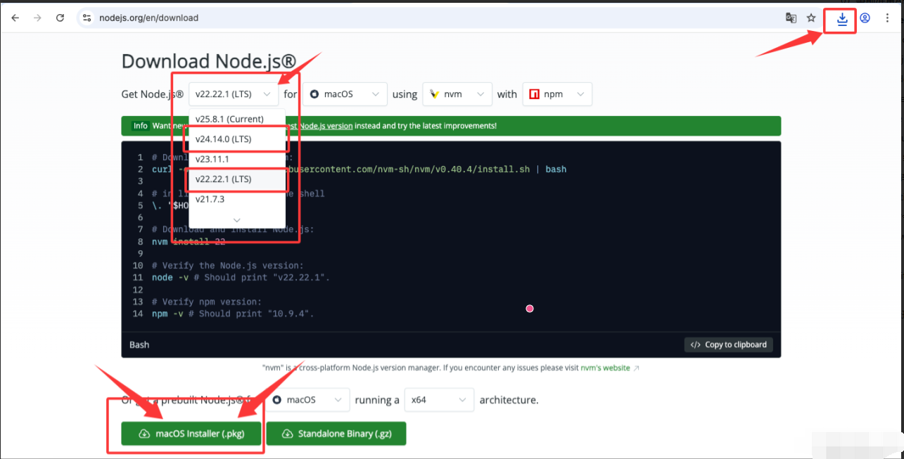

然后点击右上角的下载按钮，打开下载记录

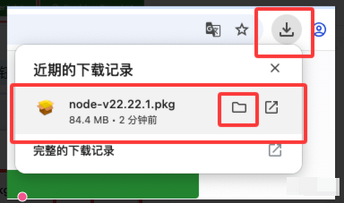

打开下载文件，双击 node 安装包

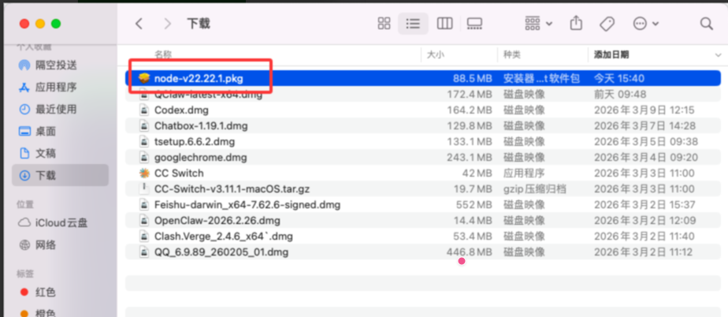

然后打开安装界面，**一路默认，点击下一步即可**

**无脑下一步默认安装到最后，完成安装退出（关闭窗口）即可**

## 验证 Node.js / NPM 安装成功

按下 **command + 空格** ，然后搜索  **终端** 或者 **Ter** （**Terminal** 的缩写）

然后选择终端回车确认，或者用鼠标双击打开都可以

随后再终端中输入如下命令，验证Node.js的安装

```bash
node -v
npm -v
```

成功截图大概如下：

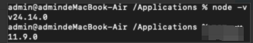

# 2）安装 Claude Code

## 安装 Claude Code

按下 **command + 空格** ，然后搜索  **终端** 或者 **Ter** （**Terminal** 的缩写）打开终端

然后输入下面的命令，通过 npm 安装 Claude Code

```bash
npm install -g @anthropic-ai/claude-code@2.1.120
```

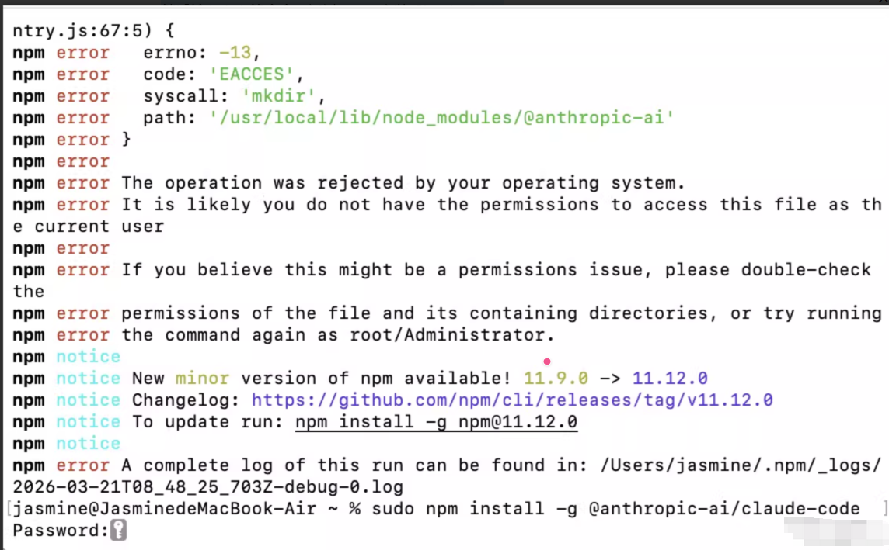

如果安装不顺利，报错，有类似上图的情况。请尝试使用sudo命令。

并在看到 Password  之后，盲打输入自己的电脑密码后回车执行。

```bash
sudo npm install -g @anthropic-ai/claude-code@2.1.120
```

安装完成后如下图

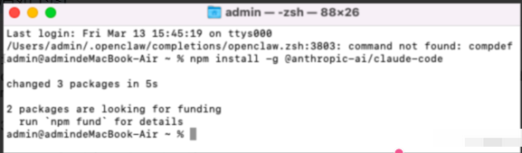

先启动一下claude，能看到如下画面，就说明安装成功，但是现在还不能直接用，但可以开始配置文件和设置API了

启动命令

```
claude
```

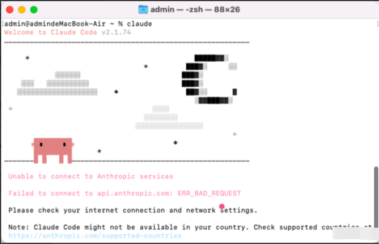

## 配置Claude Code文件和设置API

### 配置 .claude.json

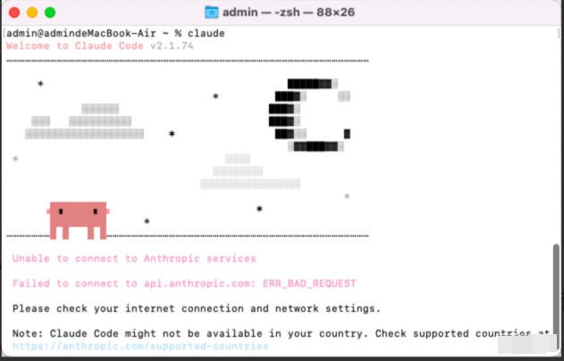

Claude Code might not be available in your country

所在地区不可用（因为本身Claude Code就是外国的软件）

#### Nano 编辑

所以我们需要编辑一些JSON文件来骗过系统

```bash
nano ~/.claude.json
```

```bash
  "hasCompletedOnboarding": true,
```

在任意两行中间回车，插入上述内容然后保存即可

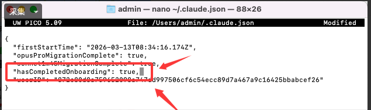

nano 可以直接编辑， 编辑完成后保存退出：

按 **control + O** → **回车确认文件名** → 按 **control + X **退出

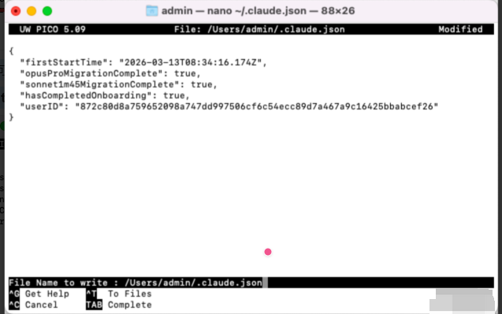

#### vim编辑

部分用户可能无法使用nano保存退出，这时候可以使用vim进行编辑修改

```bash
vim ~/.claude.json
```

打开文件后如图

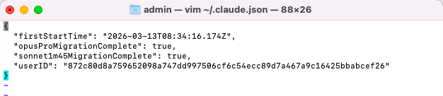

在任意一行插入内容即可

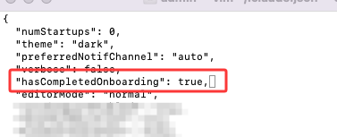

```bash
  "hasCompletedOnboarding": true,
```

随后再 **vim 命令行模式**下 输入** wq**（保存并且退出）然后回车。

**vim 编辑器分三种模式**

- 普通模式 没有任何特别和提示

- 插入（编辑）模式 左下角有** -- INSERT -- **字样

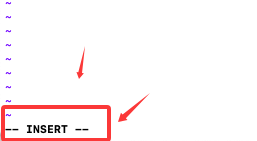

- 命令行模式 需要先用Esc回到普通模式后，

按下** : **（shift+; ）（冒号，一般回车左边第二个）

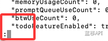

---

有类似如下任意图片内容都算正常

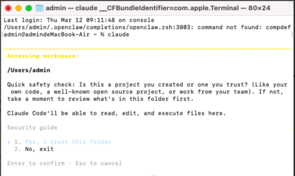

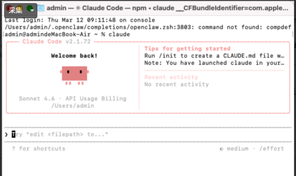

### 配置 settings.json

此时需要配置settings.json文件来搭载我们的API

---

可以使用新建一个终端，使用命令行进行配置

```bash
cat ~/.claude/settings.json
```

**如果查看命令没有文件，也可以直接新建写入的（二选一）**

```bash
nano ~/.claude/settings.json
```

```bash
vim ~/.claude/settings.json
```

添加内容

```bash
{
  "env": {
    "ANTHROPIC_AUTH_TOKEN": "粘贴为Claude Code专用分组令牌key",
    "ANTHROPIC_BASE_URL": "https://api.yidianhub.com",
    "ANTHROPIC_MODEL": "claude-sonnet-4-6",
    "CLAUDE_CODE_ATTRIBUTION_HEADER": "0"
  },
  "includeCoAuthoredBy": false,
  "model": "Sonnet"
}
```

配置完成后，你就可以开始使用 Claude Code 了！

```
claude
```

---

启动成功后，应有类似如下界面

发送你好后，能正常对话，就能正常使用了

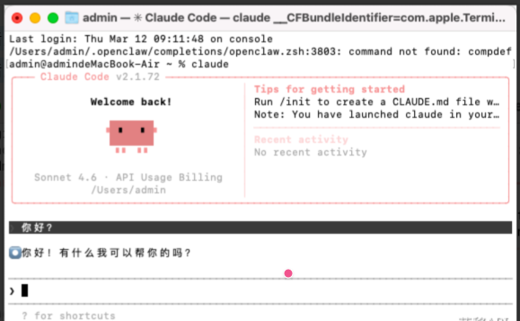

## **切换模型命令**

切换模型

```
/model
```

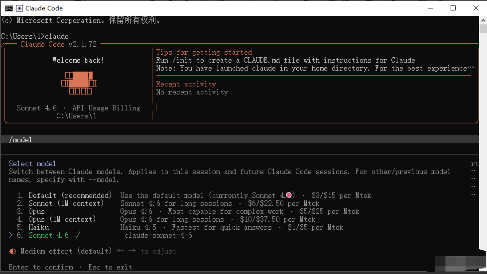

# 3）安装 CC-Switch（选用）

安装完成后，如果不是CLI（命令行）用户，可以什么都不管，直接先关掉。不用配置复杂的环境变量。

**使用伟大的CC-Switch，一步到位解决配置问题！**

## 下载安装

官方下载地址[ [GitHub CC-Switch\]](https%3A%2F%2Fgithub.com%2Ffarion1231%2Fcc-switch%2Freleases%2Ftag%2Fv3.10.3)

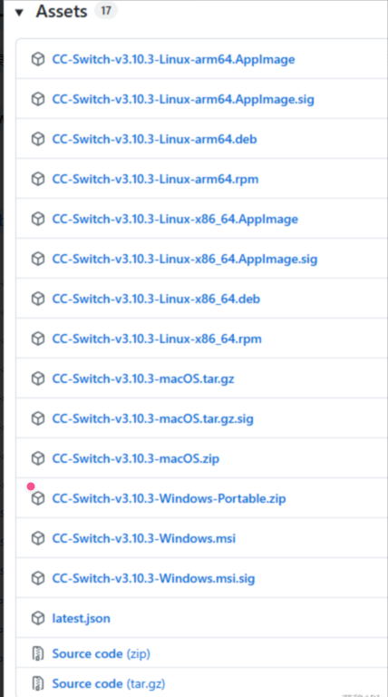

## 配置CC-Switch

安装完成后

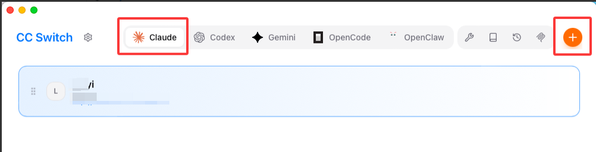

点击 Claude ，然后直接点击右上角的加号，然后按照下图配置填写

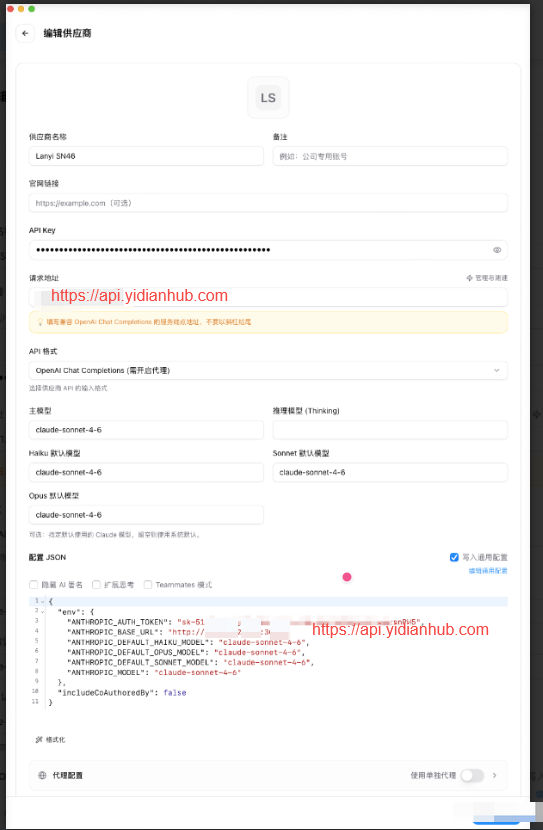

填写完毕后，点击保存按钮，并在首页中，点击启动按钮。随后再 claude 启动 ClaudeCode，这时候就会弹出一些只有Yes和No的选项。

一般无非就2个

1. 是否读取当前文件夹

- Yes（选这个）

- No

1. 是否使用当前API KEY

- Yes（选这个）

- No

随后就可以正常启动claude，进入对话框进行对话了。

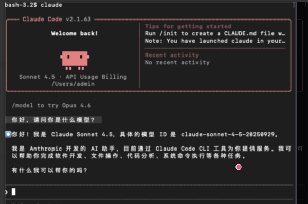

# 4）常见问题

## 黄字，显示环境变量冲突

可以尝试在CC-Switch中删除环境变量

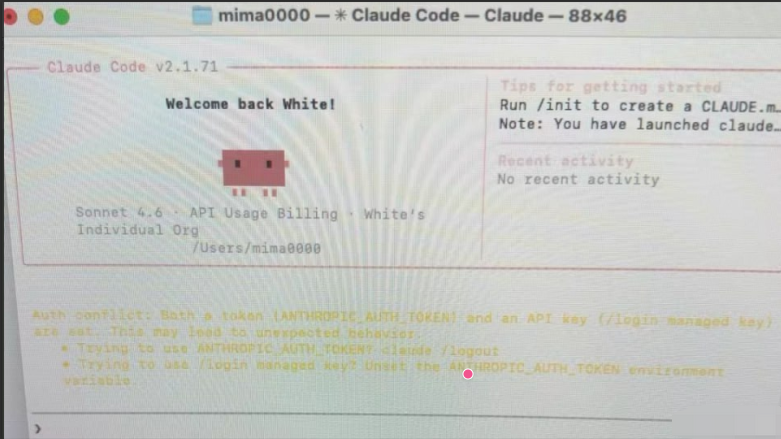

也可以命令行打开 claude后，输入

```bash
/logout
```

然后再重新启动 claude即可

```bash
claude
```

---
