# 新式一键安装

**三选一即可，新式安装大多适合能网络过墙的用户**

**可能大多数都无法使用下面的命令正确安装，可以直接去观看传统NPM安装**

如果你是PowerShell命令行就输入这个：

```powershell
irm https://claude.ai/install.ps1 | iex
```

如果你是CMD命令行就输入这个：

```
curl -fsSL https://claude.ai/install.cmd -o install.cmd && install.cmd && del install.cmd
```

通用：

```bash
winget install Anthropic.ClaudeCode
```

如果这一步安装顺利，直接安装完成的话，可以直接跳转到 配置API 进行文件配置

# 传统NPM安装

## 1.安装 Node.js 环境

几乎适配所有网络环境

Claude Code 需要 Node.js 环境才能运行。

**Node.js 环境安装步骤**

- 打开浏览器 **node.js **官网下载地址： [https://nodejs.org/](https%3A%2F%2Fnodejs.org%2F)

- 点击 "LTS"版本进行下载（推荐长期支持版本）

- 下载完成后双击 .msi 文件

- 按照安装向导完成安装，保持默认设置即可

**Windows 注意事项**

- 建议使用 PowerShell 而不是 CMD

- 如果遇到权限问题，尝试以管理员身份运行

- 某些杀毒软件可能会误报，需要添加白名单

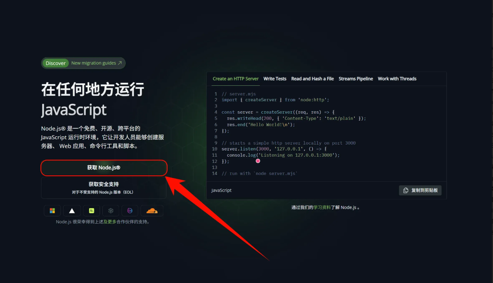

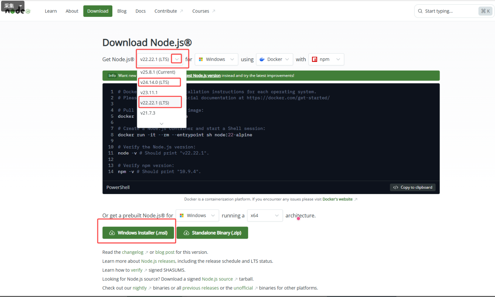

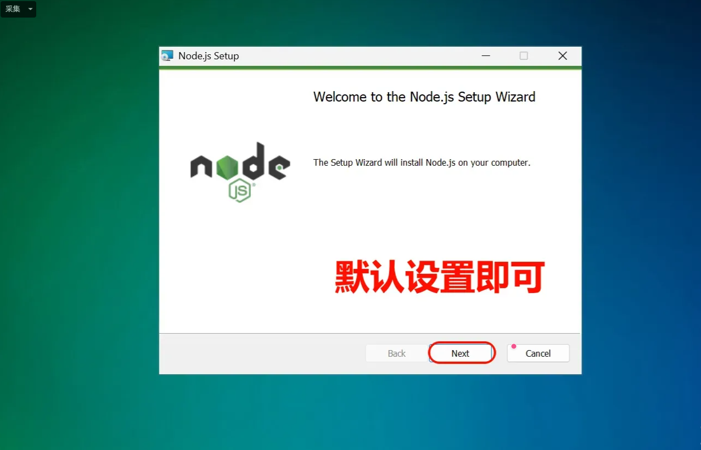

**Windows 注意事项**

使用 PowerShell / CMD 都可以

如果遇到权限问题，尝试以管理员身份运行

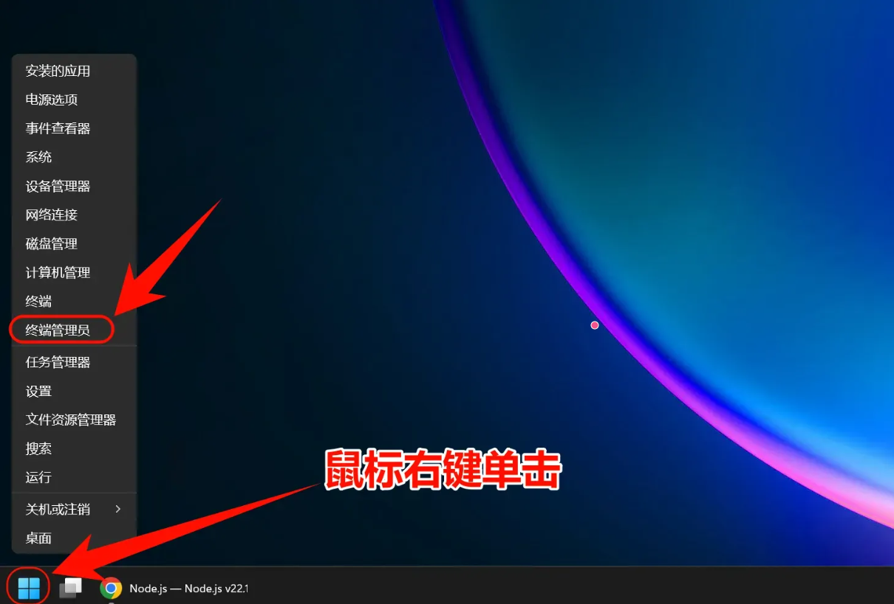

**验证安装是否安装成功，打开 PowerShell 或 CMD，输入以下命令：**

```bash
node --version
```

```bash
npm --version
```

**如果显示版本号，说明安装成功了！**

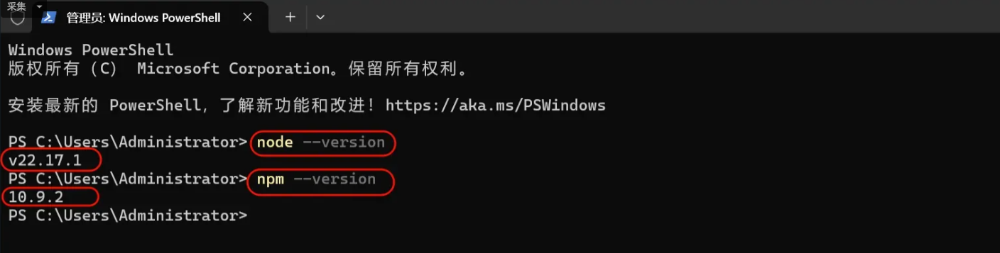

**常见错误**

如果node有显示版本号，而npm没有，参考 **PowerShell 禁止运行脚本**

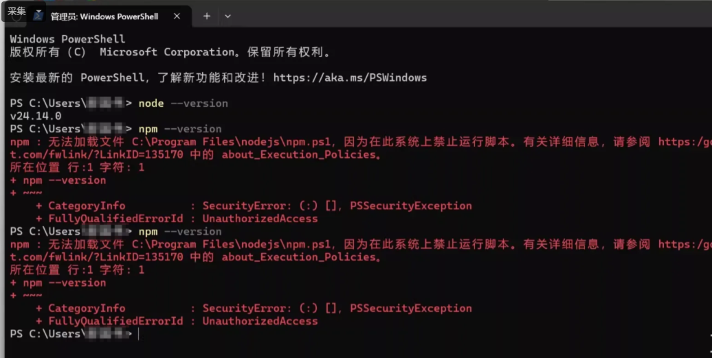

翻到下文中的 **Windows安装常见问题解决 - PowerShell 禁止运行脚本 **有解决办法

## 2.安装 Git Bash

**Windows 注意事项**

Windows 环境下需要使用 Git Bash 安装 Claude code。安装完成后，环境变量设置和使用 Claude Code 仍然在普通的 PowerShell 或 CMD 中进行。

**下载并安装 Git for Windows**

- 访问 **Git 版本控制管理器** 官网下载地址： [https://git-scm.com/downloads/win](https%3A%2F%2Fgit-scm.com%2Fdownloads%2Fwin)

- 点击 "Download for Windows" 下载安装包

- 运行下载的 .exe 安装文件

- 在安装过程中保持默认设置，直接点击 "Next" 完成安装

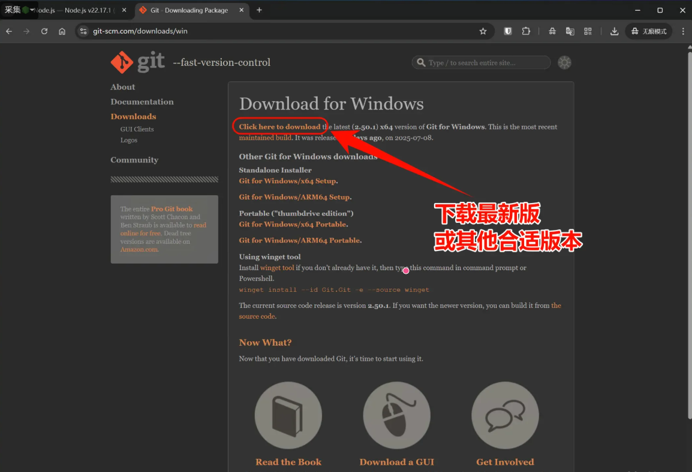

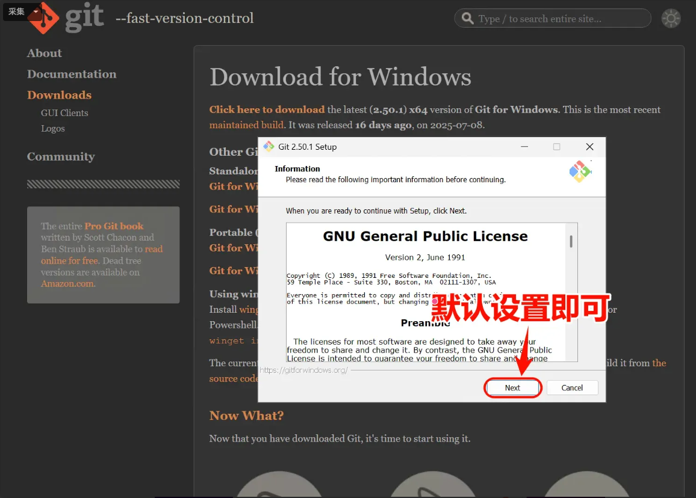

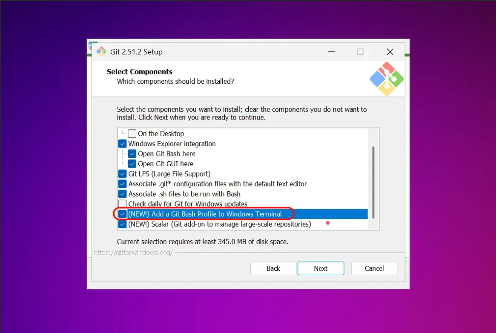

**验证 Git Bash 安装**

安装完成后，打开PowerShell / CMD命令行，输入以下命令验证：

```bash
git --version
```

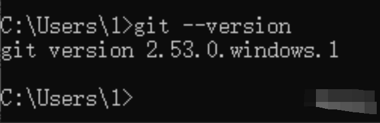

显示类似版本号（版本号不必一模一样）如图，即为安装成功。

## 3.安装 Claude Code

**安装 Claude Code**

打开 PowerShell / CMD，运行以下命令：

```bash
npm install -g @anthropic-ai/claude-code@2.1.120
```

这个命令会从 npm 官方仓库下载并安装 2.1.120 版本的 Claude Code。

如果发现很久都装不好，可以尝试下面这条命令。

```bash
npm install -g @anthropic-ai/claude-code@2.1.120 --registry=https://registry.npmmirror.com
```

**完成如图**

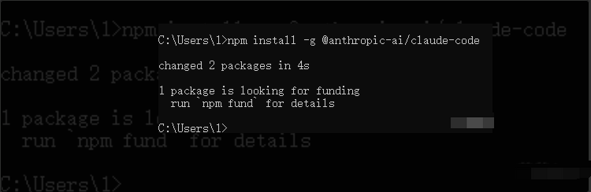

输入 claude 启动Claude Code

```
claude
```

出现下面任意界面都算安装成功

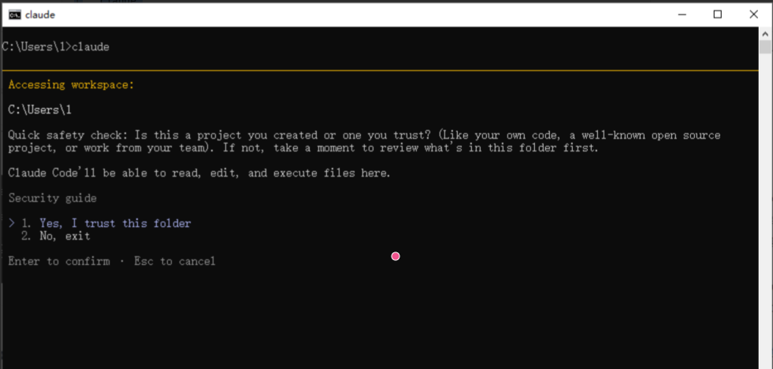

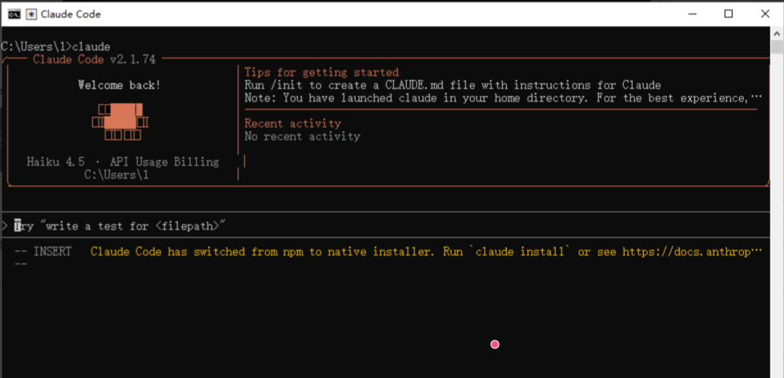

如果正常启动，恭喜你！Claude Code 已经成功安装了 ！！

但现在还不能直接使用，还需要配置我们的API。

## 4.配置API（方法三选一即可）

方法三选一就行，一个方法不行在考虑其他方法

### 方法一（推荐）：通过JSON文件进行设置

#### 配置 .claude.json

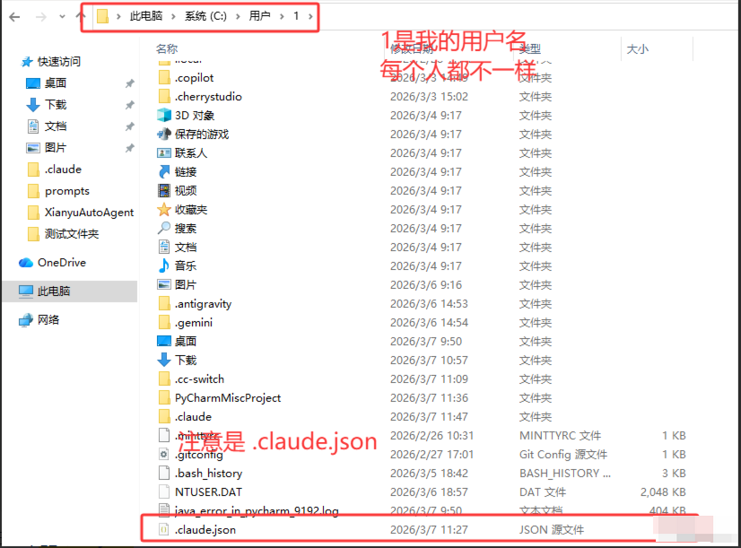

找到 .claude.json 然后双击打开文件

文件中开头添加以下内容

```bash
  "hasCompletedOnboarding": true,
```

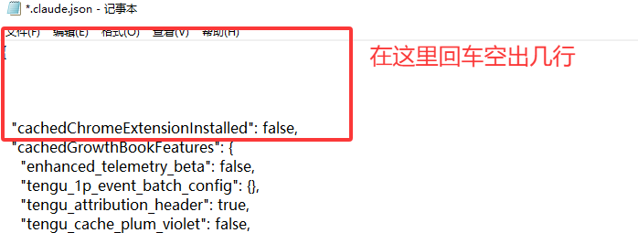

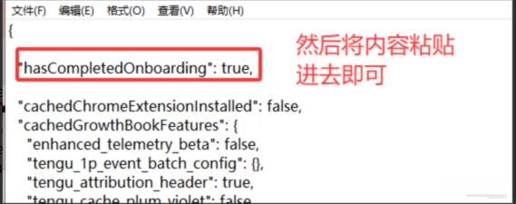

随后 Ctrl + S 保存文件内容再关闭即可。

**如果没有这个文件，请往下看    如果没有这个文件，请往下看**

如果没有这个文件/不显示文件后缀，直接新建一个就行

我们先点击 “查看”- 显示“文件扩展名”

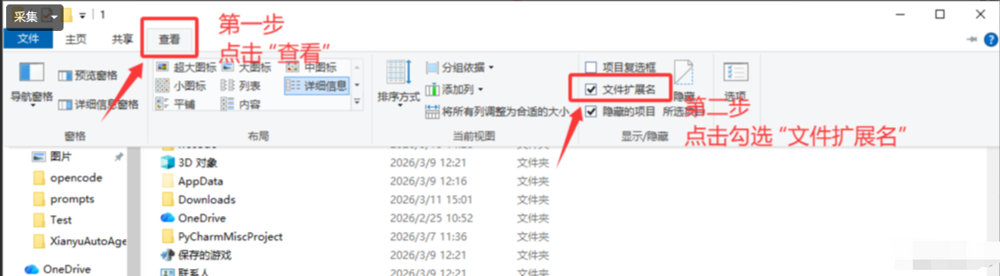

随后我们新建一个文本文档

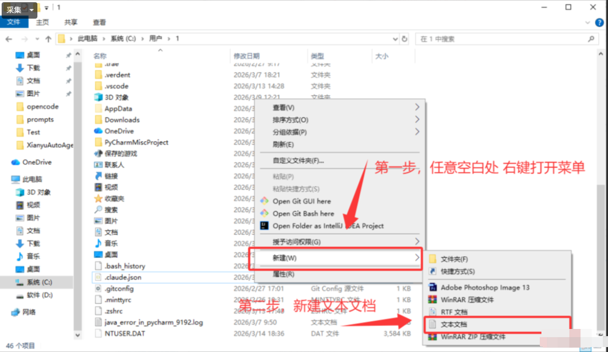

将其更名为 .claude.json

Ctrl+A 全选，然后复制粘贴文件格式，回车保存，确认更改

#### 配置 settings.json

**如果没有settings.json文件，请自行创建，不需要时可随意删除，不影响claude使用**

windows下路径为: C:/Users/你的用户名/.claude

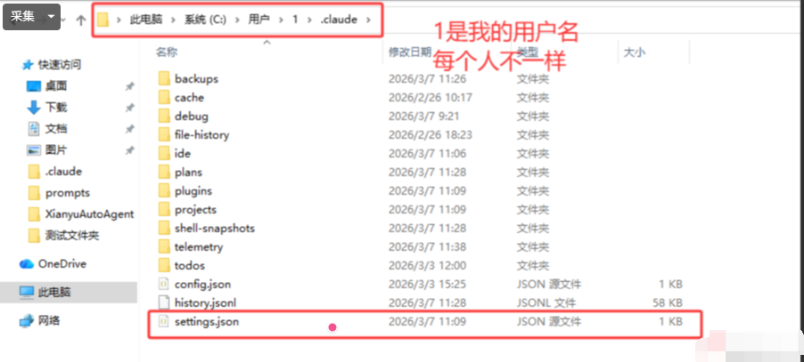

```json
{
  "cleanupPeriodDays": 365,
  "env": {
    "ANTHROPIC_AUTH_TOKEN": "sk开头的 api key 注意不要多空格",
    "ANTHROPIC_BASE_URL": "https://api.yidianhub.com",
    "ANTHROPIC_MODEL": "claude-sonnet-4-6",
    "CLAUDE_CODE_ATTRIBUTION_HEADER": "0"
  },
  "includeCoAuthoredBy": false,
  "model": "Sonnet"
}
```

### 方法二：命令行设置命令 (Windows 系统)

为了让 Claude Code 连接到你的中转服务，需要设置多个环境变量：

```bash
setx ANTHROPIC_AUTH_TOKEN "粘贴令牌key"
setx ANTHROPIC_BASE_URL "https://api.yidianhub.com"
```

输入url地址：[https://a](http%3A%2F%2F1.95.142.151%3A3000%2F)pi.yidianhub.com

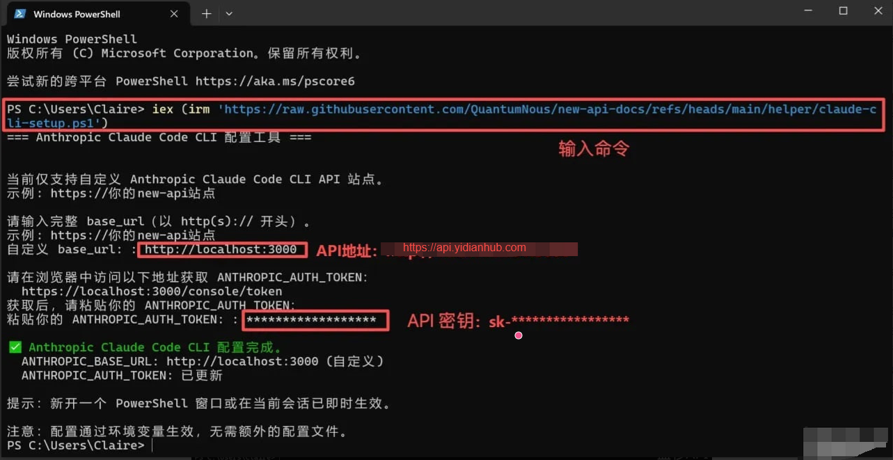

### 方法三：通过系统环境变量配置

**为了让 Claude Code 连接到你的中转服务，需要设置几个环境变量：**

**图形界面配置（推荐）**右键`【此电脑】->【属性】->【高级系统设置】->【环境变量】`

新建用户变量

ANTHROPIC_AUTH_TOKEN: sk-XXXXXXXXXXXXXXXXXXXXXXXXXXXXXXXX

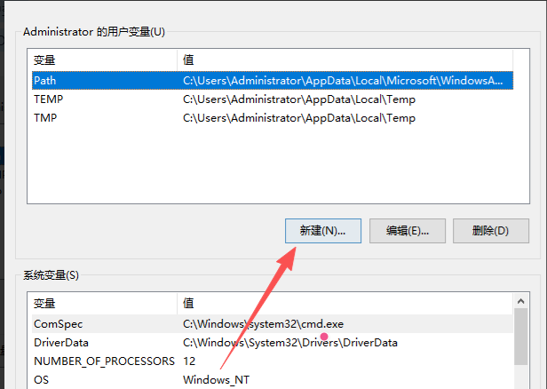

ANTHROPIC_BASE_URL: [https://api.yidianhub.com/](http%3A%2F%2F1.95.142.151%3A3000%2F)

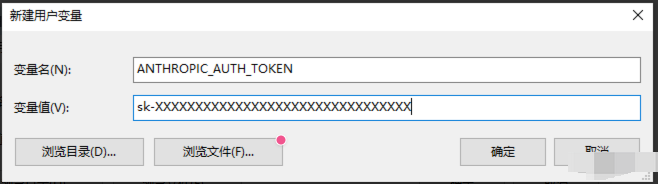

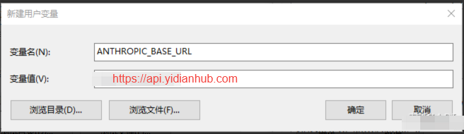

创建完成之后确认即可

**注意**

其中 sk-xxxxxxx 需要替换为你实际的令牌秘钥

查看/验证环境变量设置

设置完环境变量后，可以通过以下命令验证是否设置成功：

**在 PowerShell 中验证：**

```bash
echo $env:ANTHROPIC_BASE_URL
echo $env:ANTHROPIC_AUTH_TOKEN
```

**在 CMD 中验证：**

```bash
echo %ANTHROPIC_BASE_URL%
echo %ANTHROPIC_AUTH_TOKEN%
```

**预期输出示例：**

```
https://api.yidianhub.com/
sk-xxxxxxxxxxxxxxxxxx
```

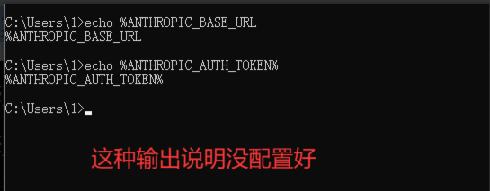

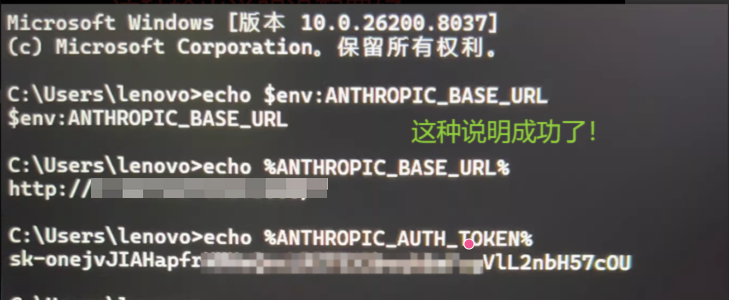

**复制多条命令时，最后一条命令可能会不执行，请尝试按一下回车，不一定是你没配好**

**如果输出为空或显示变量名本身，说明环境变量设置失败，请重新设置**

## 5.开始使用 Claude Code

现在你可以开始使用 Claude Code 了！

**启动 Claude Code**

打开 PowerShell，直接启动 Claude Code：

```
claude
```

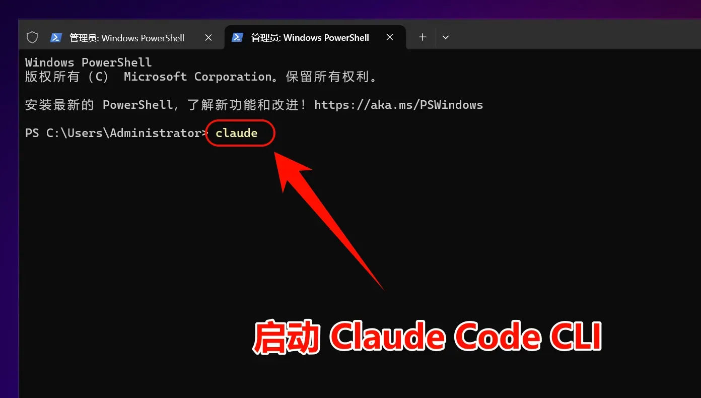

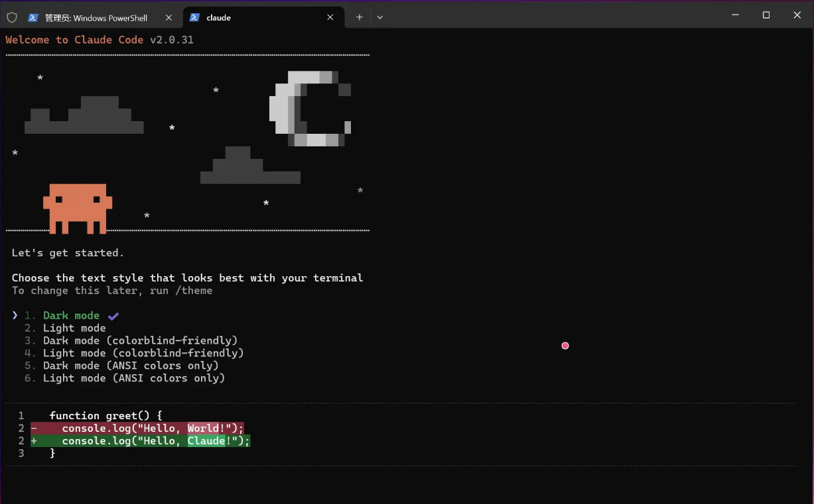

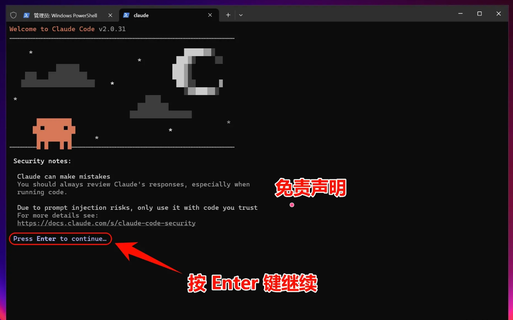

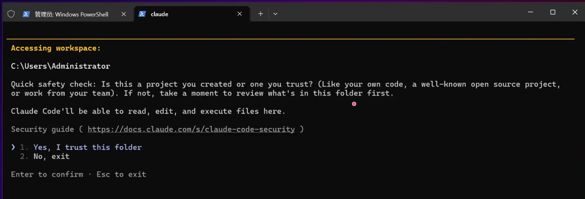

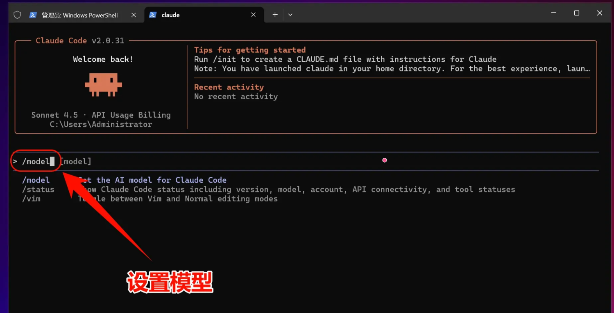

**选择模型**

**输入命令：**

```
/model
```

**按 Enter 进入，选择模型，通常使用默认设置即可。**

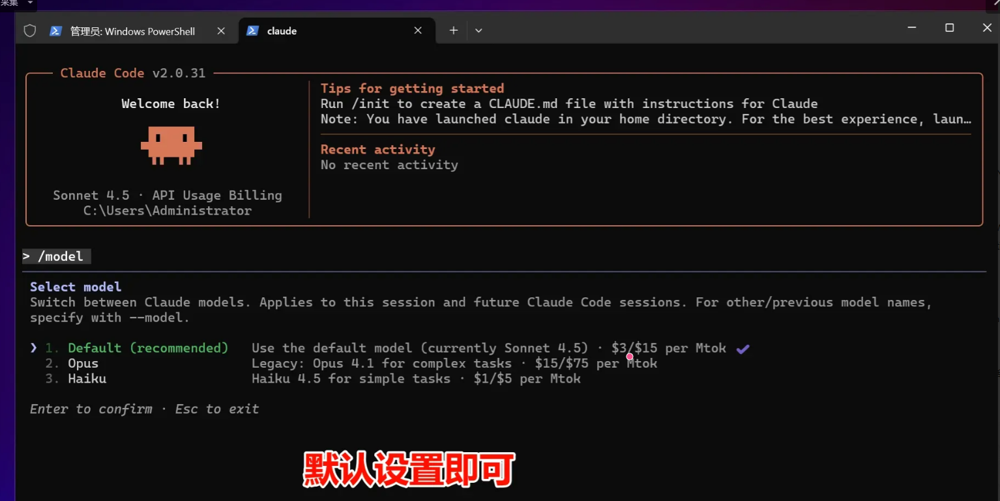

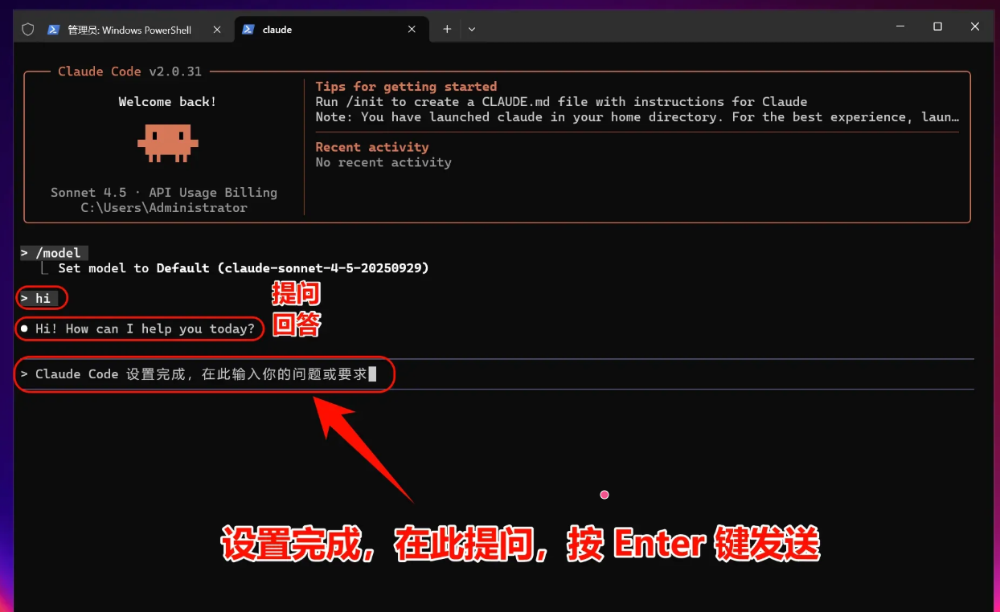

到此为止就算Claude Code安装完成

***注意：设置环境变量修改后，使用所有模型（包括官方预设模型）均调用自定义接入点，而不使用官方账号额度。***

# Windows 安装常见问题解决

## 1 安装时提示 "permission denied" 错误

**这通常是权限问题，尝试以下解决方法：**

以管理员身份运行 PowerShell

或者配置 npm 使用用户目录：`npm config set prefix %APPDATA%\npm`

---

## 2 PowerShell 禁止运行脚本

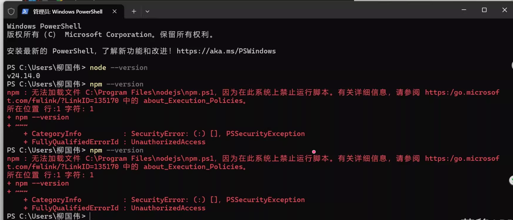

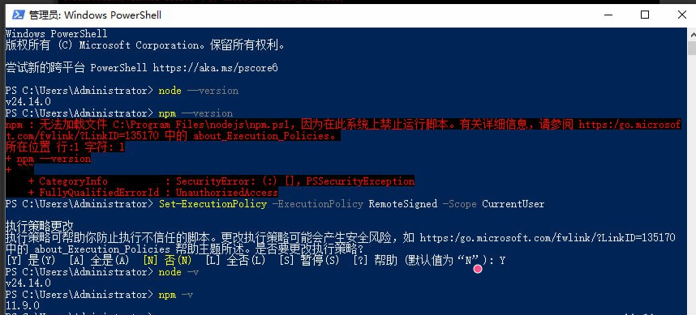

**如果遇到类似上述这些截图 禁止运行脚本，请再终端运行如下命令，然后在回复 Y：**

**有些用户可能不需要输入Y，直接就处理好了，这时候请重试 npm -v 命令**

```bash
Set-ExecutionPolicy -ExecutionPolicy RemoteSigned -Scope CurrentUser
```

---

## 3 环境变量设置后不生效

**配置完环境变量之后需要：**

重新启动 PowerShell 或 CMD 窗口

或者注销并重新登录 Windows（也就是关机重启）

验证设置：

**在 PowerShell 中验证：**

```bash
echo $env:ANTHROPIC_BASE_URL
echo $env:ANTHROPIC_AUTH_TOKEN
```

**在 CMD 中验证：**

```bash
echo %ANTHROPIC_BASE_URL%
echo %ANTHROPIC_AUTH_TOKEN%
```

## 4 命令行启动Claude的时候有乱码闪烁

是因为Windows 终端 + UTF-8 + Bash 输出混合造成的编码显示不一致而导致的

```bash
chcp 65001
```

---

## 5 所在地区不可用

**配置之后如果出现以下情况（选做）（没有这种情况可以跳过）**

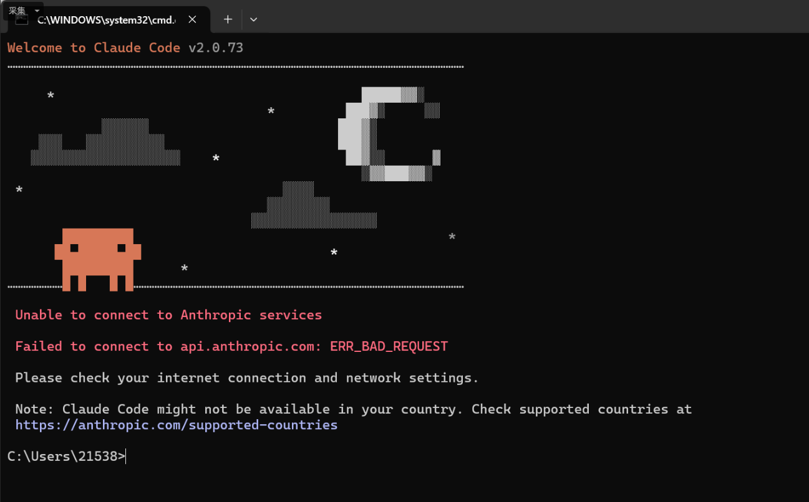

**原因：缺了引导 下图为解决方案**


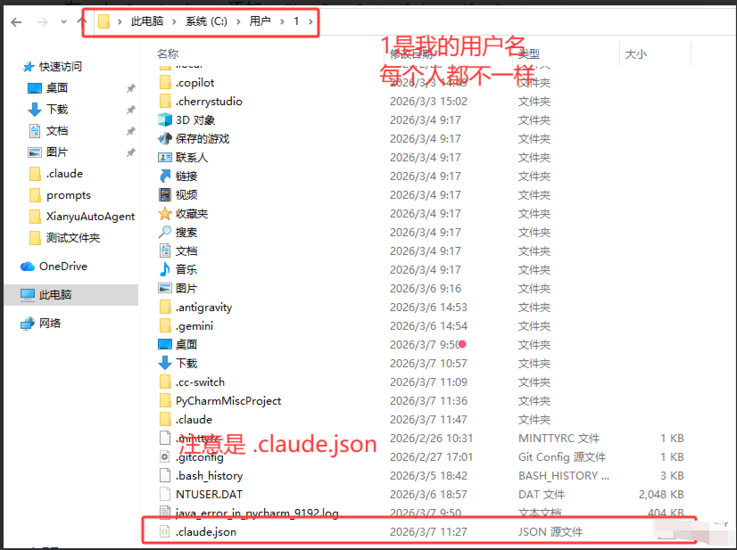

部分人可能 .claude.json 空空如也，随便在任意一行的逗号后面添加内容即可

只添加  `"hasCompletedOnboarding": true,`

```bash
  "hasCompletedOnboarding": true,
```

大概情况如下图，只需要添加`"hasCompletedOnboarding": true, `一行

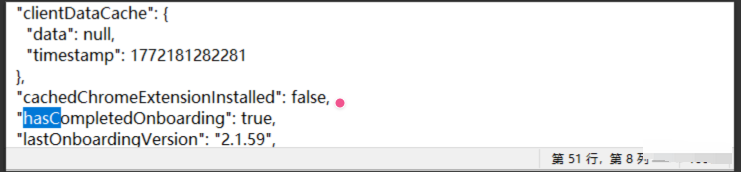

## 6 环境变量冲突

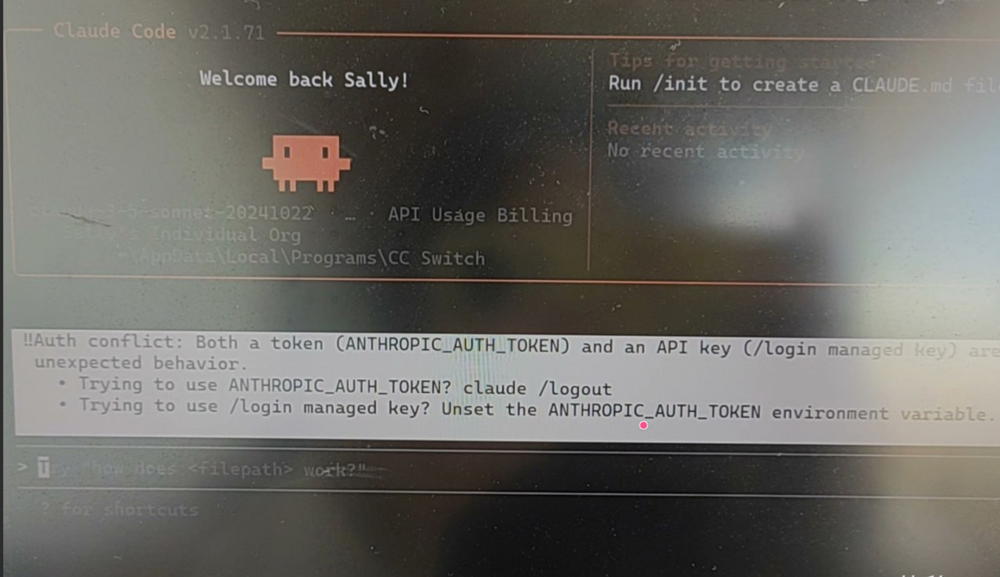

直接输入

```
/logout
```

然后再次启动claude即可

```
claude
```
