# 前言

**Windows 系统**

*经历了二十多个版本，数十次迭代，目前较为稳定*

**v0.2.2 稳定版**

几乎无 bug，node 版本老一点，不影响使用

通过网盘分享的文件：ClaudeCode一键部署 v0.2.2.zip

链接: https://pan.baidu.com/s/12cMyyBfACUWTdAX6wU5BoQ?pwd=h88h 提取码: h88h

**v0.2.4 最新测试版**

主要更新了 5 系列的 model 还有 node 安装包，但可能存在 bug

通过网盘分享的文件：ClaudeCode一键部署 v0.2.4.zip

链接: https://pan.baidu.com/s/17tbSEiOB_6Sj3iBILaIO0Q?pwd=3i19 提取码: 3i19

**MacOS 系统（Intel 芯片）**

*于26.8.31 上线，大概经历了 九次 次迭代，尚且可以*

通过网盘分享的文件：ClaudeCode一键部署.dmg

链接: https://pan.baidu.com/s/1Nu4FQGkn7zRvmspH9i5tqg?pwd=v1im 提取码: v1im

**MacOS 系统（M 芯片）**

*于26.6.20 上线，目前是第一个发布的版本，大概经历了二次迭代*

通过网盘分享的文件：ClaudeCode一键部署_M芯片.dmg

链接: https://pan.baidu.com/s/1sAu1Dd7DkopvnrxXqQTRxg?pwd=iqhb 提取码: iqhb

目前仅限于 Windows 系统、MacOS系统 Intel 芯片的使用

如果一次安装无法成功，建议二次启动再安装一次。

# 下载 解压 安装 部署

解压之后，以管理员身份运行

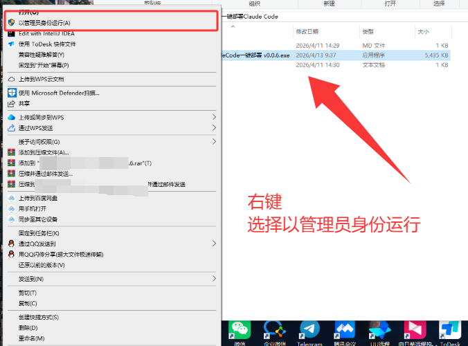

第一次使用，为了安装部署Claude Code的话，就选择第一项

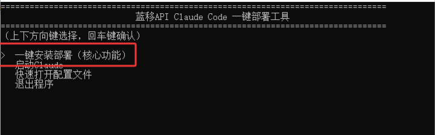

然后选择新站点


随后三选一选择你喜欢的模型

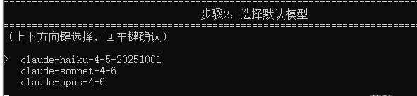

**输入你的令牌，sk 开头的，像下面那样的**

```
sk-SbTYD9ivXXXXXXXXXXXXXXXXXXXXXXXXXXXXXXXXU7li25VJW
```

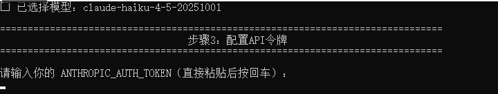

随后就会自动检测环境，安装部署环境和Claude Code本体

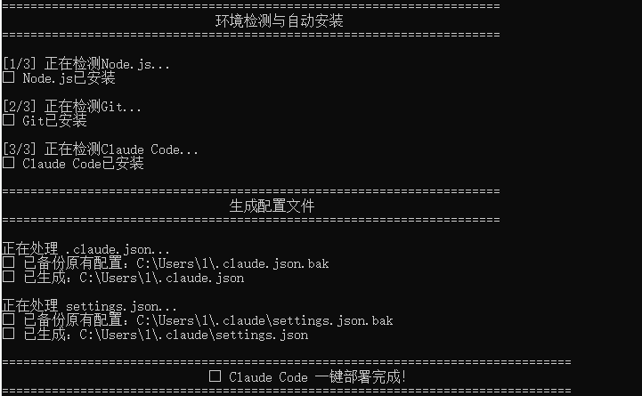

至此，这个软件就一键安装了Claude Code

# 其他用法

## 一键启动 Claude Code

某些方面来说，本软件可以充当启动器作用，很多人可能觉得，每次都要Win+R启动命令行，很麻烦，本软件可以在打开后，直接选择第二项 “启动 Claude”

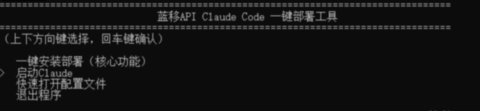

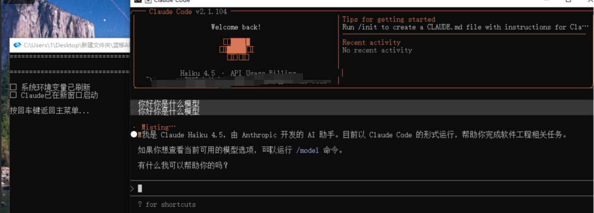

## 快速打开设置文件

主要用于检查错误，更换模型，配置API用，可以一键打开 settings.json 文件

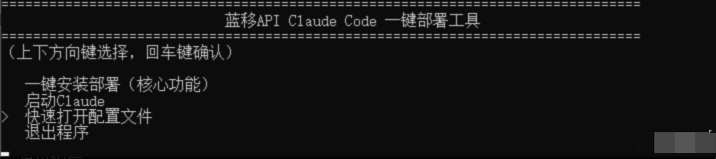

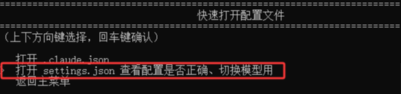

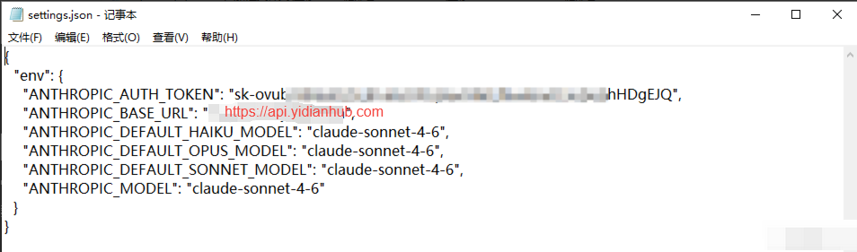

## 切换模型

可以选择一键部署里面的第三项“切换模型”

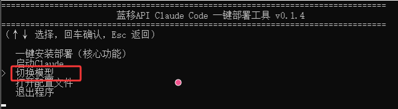

选择你自己喜欢的模型即可，带1m的属于一百上下文模型（会提高价格），仅在Claude官方推出的软件、平台可用。*一键部署暂不支持自定义模型*

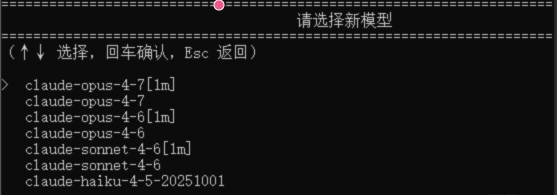

## 方便设置（非必要）

新版本已经可以自动提权到管理员，无需再手动设置到管理员身份

为了方便以后每次启动不用右键管理员，可以

右键 - 属性 - 兼容性 - 以管理员身份运行此程序 - 确认

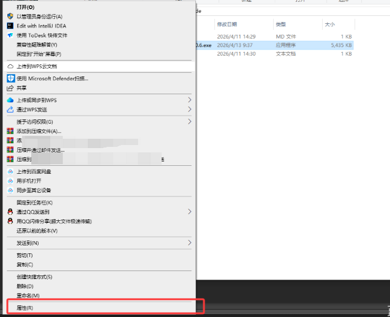

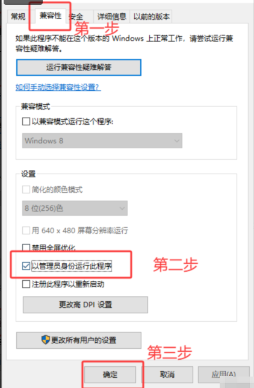

## 其他

本软件其实构成相当简单，你甚至可以在开启“隐藏的项目之后”，找到 node 和 git 的安装包，便于你一键部署失败之后，手动安装

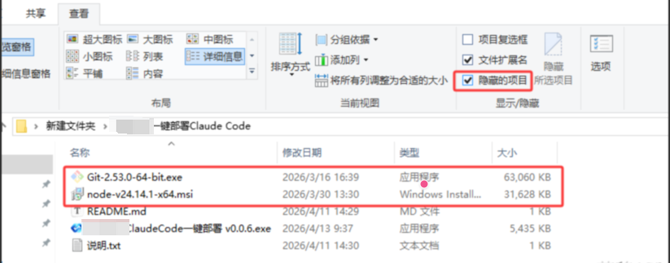
