## 🛠️ 第一步：环境准备

### 1.安装 Node.js 环境

几乎适配所有网络环境

Codex cli 需要 Node.js 环境才能运行。

**Node.js 环境安装步骤**

- 打开浏览器 node.js 官网下载地址：[https://nodejs.org/](https://nodejs.org/)
- 点击 "LTS"版本进行下载（推荐长期支持版本）
- 下载完成后双击 .msi 文件
- 按照安装向导完成安装，保持默认设置即可

**Windows 注意事项**

- 建议使用 PowerShell 而不是 CMD
- 如果遇到权限问题，尝试以管理员身份运行
- 某些杀毒软件可能会误报，需要添加白名单

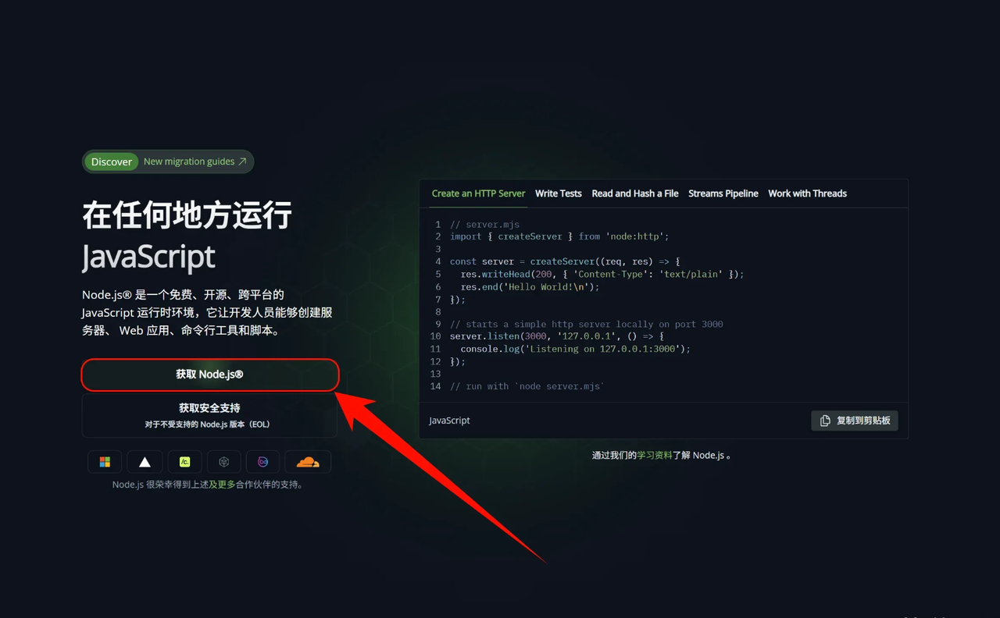

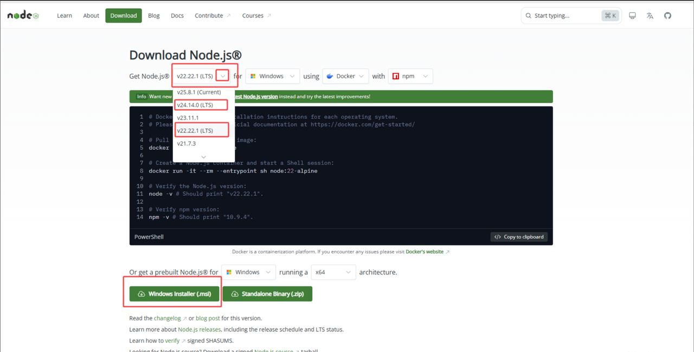

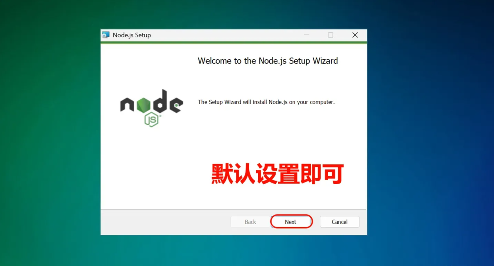

**Windows 注意事项**

使用 PowerShell / CMD 都可以

如果遇到权限问题，尝试以管理员身份运行

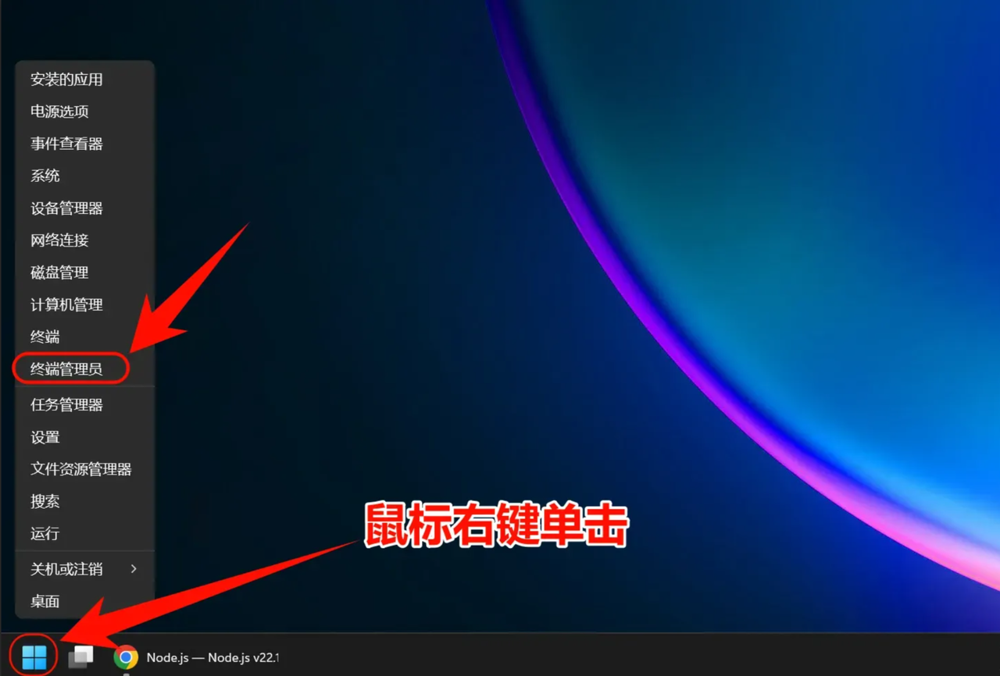

验证安装是否安装成功，打开 PowerShell 或 CMD，输入以下命令：

```shell
node --version
```

```shell
npm --version
```

如果显示版本号，说明安装成功了！

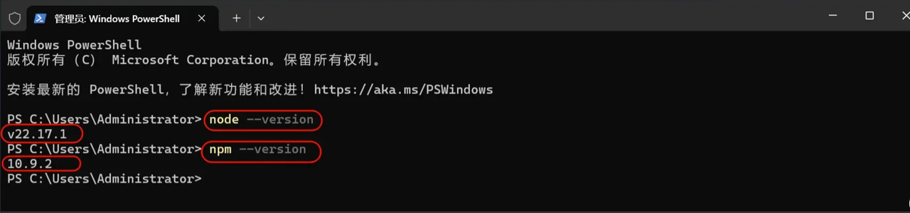

**常见错误**

如果node有显示版本号，而npm没有，参考 PowerShell 禁止运行脚本

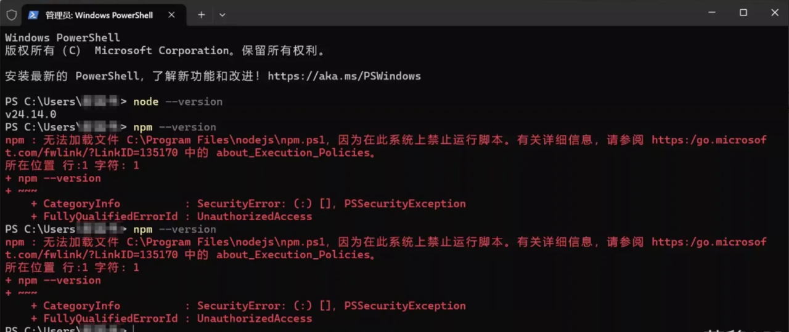

翻到下文中的 Windows安装常见问题解决 - PowerShell 禁止运行脚本 有解决办法

### 2.安装 Git Bash

**Windows 注意事项**

Windows 环境下需要使用 Git Bash 安装 Claude code。安装完成后，环境变量设置和使用 Claude Code 仍然在普通的 PowerShell 或 CMD 中进行。

**下载并安装 Git for Windows**

- 访问 Git 版本控制管理器 官网下载地址：[https://git-scm.com/downloads/win](https://git-scm.com/downloads/win)
- 点击 "Download for Windows" 下载安装包
- 运行下载的 .exe 安装文件
- 在安装过程中保持默认设置，直接点击 "Next" 完成安装

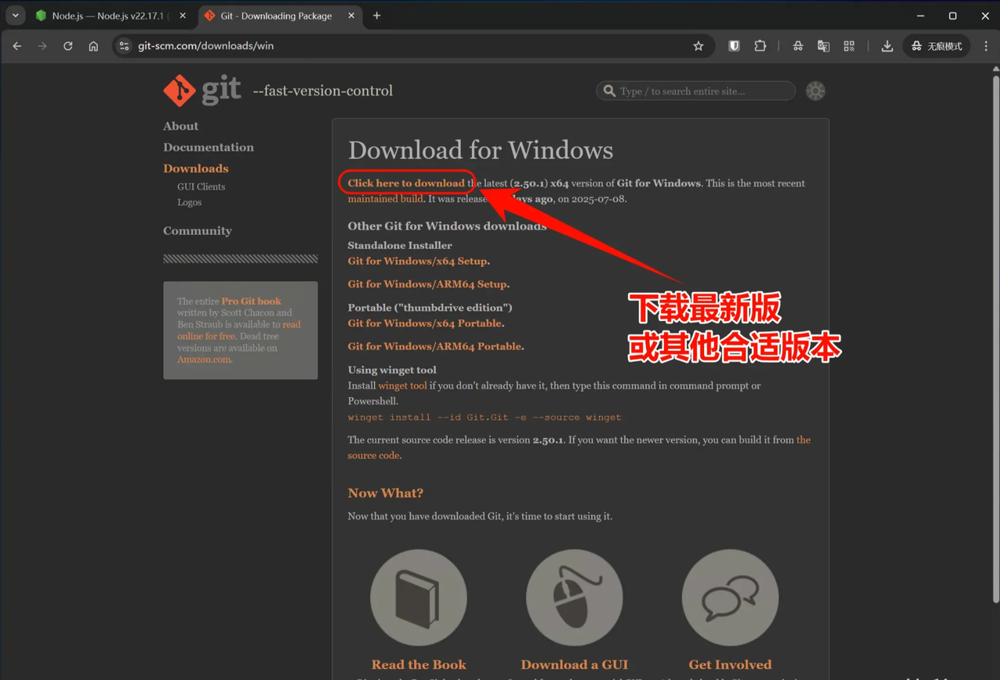

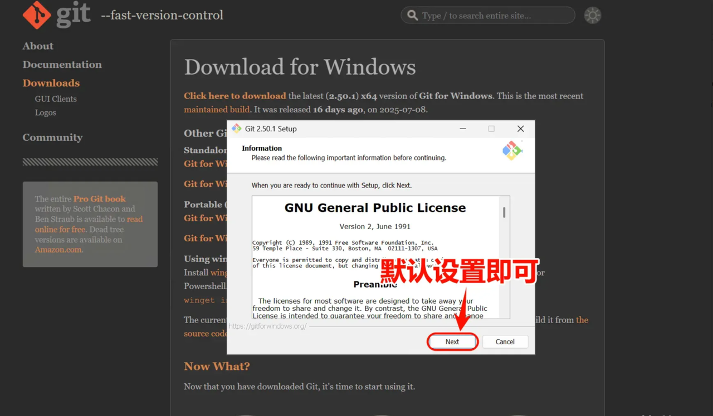

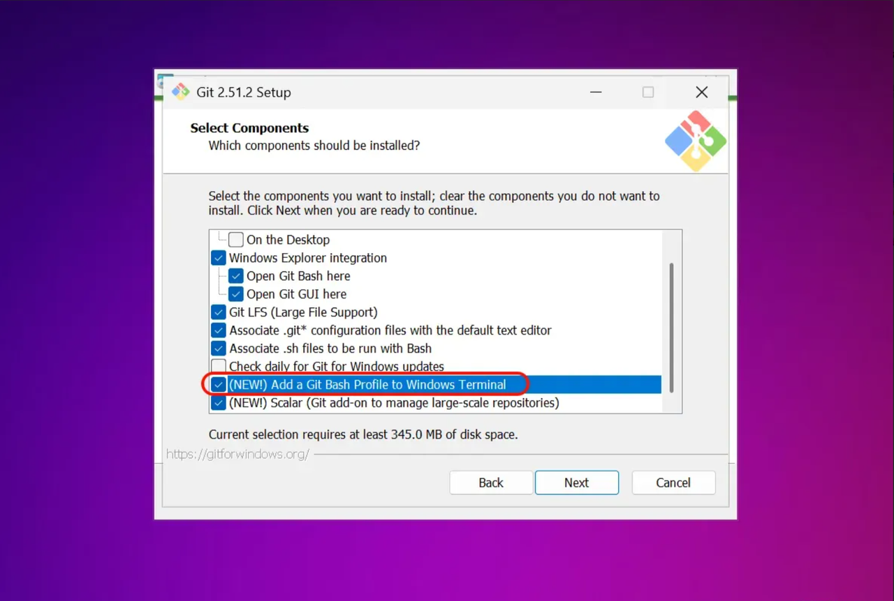

**验证 Git Bash 安装**

安装完成后，打开PowerShell / CMD命令行，输入以下命令验证：

```shell
git --version
```

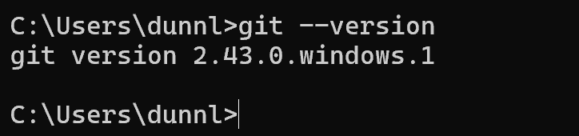

显示类似版本号（版本号不必一模一样）如图，即为安装成功。

## 💻 第二步：安装 Codex CLI

在终端中根据您的系统和偏好选择以下一种命令执行：

- 方法 A：使用 npm 全局安装（所有系统通用）

```shell
npm install -g @openai/codex
```

安装完成后大概如下图：

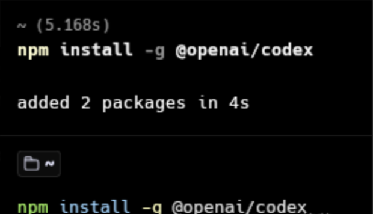

(注：Linux 或 macOS 如果遇到权限报错，请在命令前加上 sudo)

- 方法 B：使用 Homebrew 安装（仅限 macOS）

```shell
brew install codex
```

## 🔑 第三步：配置 API Key 鉴权

要使用 API Key 运行 Codex CLI，您可以通过临时环境变量或全局配置文件来进行配置。请根据您的需求选择以下一种方式：

方式 C：通过全局配置文件（推荐给长期开发者）

Codex CLI 支持通过本地的 `~/.codex/`（Windows 上为 `C:\\Users\\用户名\\.codex\\`）进行配置：

在该目录下找到或创建一个名为 auth.json和config.toml 的文件，加入以下内容以指定首选的 API 认证方式：

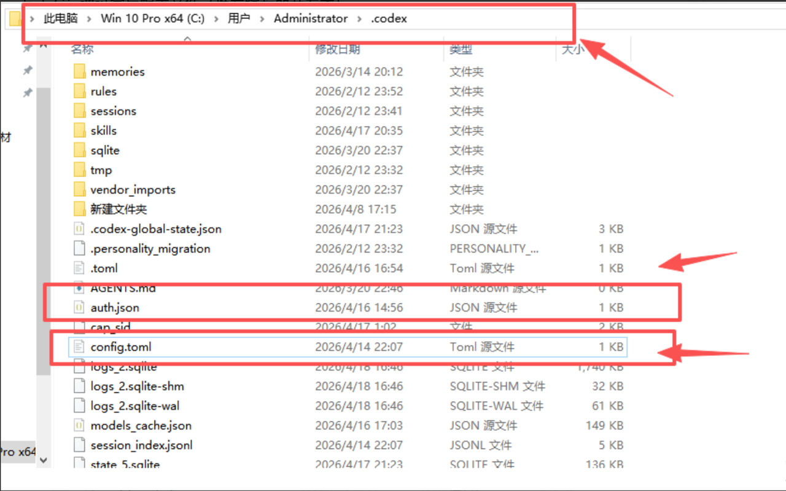

右键文件，选择以记事本打开

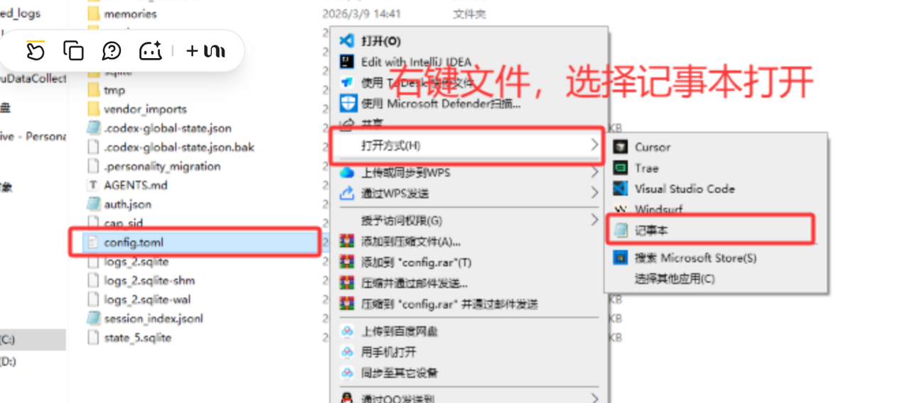

复制以下内容粘贴到文件前面

auth.json

```json
{
  "OPENAI_API_KEY": "填入你自己在一点API获取的令牌key",
  "auth_mode": "apikey"
}
```

config.toml

```toml
model_provider = "OpenAI"
model = "gpt-5.5"
review_model = "gpt-5.5"
model_reasoning_effort = "xhigh"
disable_response_storage = true
network_access = "enabled"
windows_wsl_setup_acknowledged = true
model_context_window = 1000000
model_auto_compact_token_limit = 900000

[model_providers.OpenAI]
name = "YiDian"
base_url = "https://api.yidianhub.com/v1"
wire_api = "responses"
requires_openai_auth = true
```

补充说明，如果要切换成 gpt-image-2 生图模型的话，吧 gpt-5.5 更换成 gpt-image-2 就可以了。

完成后大概如下图，记得按 Ctrl + S 保存你的更改


## 🚀 第四步：启动使用

在您的项目文件夹中新开一个终端窗口，直接输入以下命令即可唤醒 codex cli：

```shell
codex
```

输入你好，AI 有回复就算成功配置

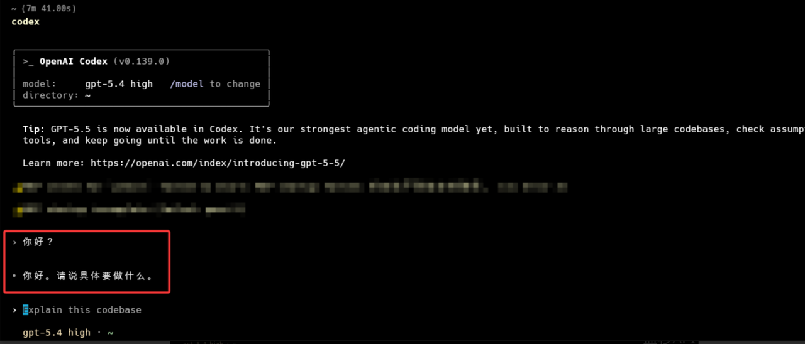
