## 一、前言

**注意：不使用 Codex 的时候，请直接退出，否则因为“心跳机制”（定时自动检查），会造成多次的微额扣费。**

新建令牌的时候，一定要选择codex或codex-pro分组

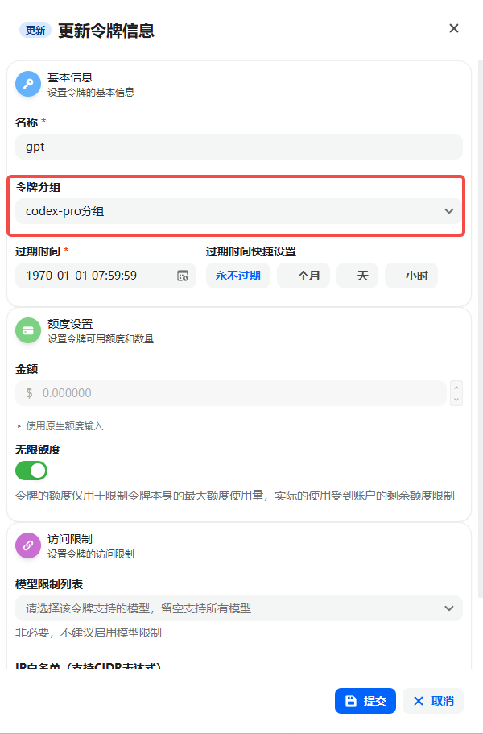

因为codex分组或者codex-pro分组中都是codex可以直接使用的模型

## 二、安装CodeX

### 1. 官网下载CodeX

[CodeX 官网 https://chatgpt.com/zh-Hans-CN/codex/](https://chatgpt.com/zh-Hans-CN/codex/)

需要科学上网，一般客户可能无法下载


选择windows或者macOS

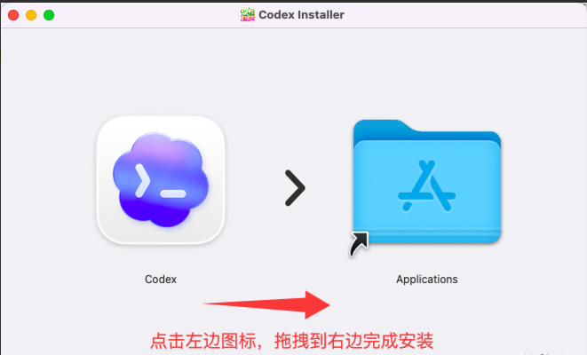

### 2. 在微软商店中下载CodeX

关于CodeX的下载安装方式，这里只列举Windows系统的下载安装方法为例

一般，在任务栏中，可以找到微软应用商店


击打开微软应用商店


在搜索框中搜索CodeX


### 3. 如果你无法下载

此处提供一些CodeX的安装包

windows：

通过网盘分享的文件：Windows-OpenAI.Codex_26.721.4979.0_x64.zip

链接: [https://pan.baidu.com/s/1B4RwjgcTgZPw-DrfVq90hQ](https://pan.baidu.com/s/1B4RwjgcTgZPw-DrfVq90hQ) 提取码: ji4a

MacOS 苹果M芯片：

通过网盘分享的文件：MacOS-M-Codex.zip

链接: [https://pan.baidu.com/s/1WFtgqRqfN2l_D61YgibDgQ](https://pan.baidu.com/s/1WFtgqRqfN2l_D61YgibDgQ) 提取码: du9j

MacOS Intel 芯片：

通过网盘分享的文件：MacOS-Intel-Codex-latest-x64.zip

链接: [https://pan.baidu.com/s/1IgAciMY5mNllCd3Gb9DCSQ](https://pan.baidu.com/s/1IgAciMY5mNllCd3Gb9DCSQ) 提取码: i2ph

### 4. 打开 CodeX 登录

打开 CodeX

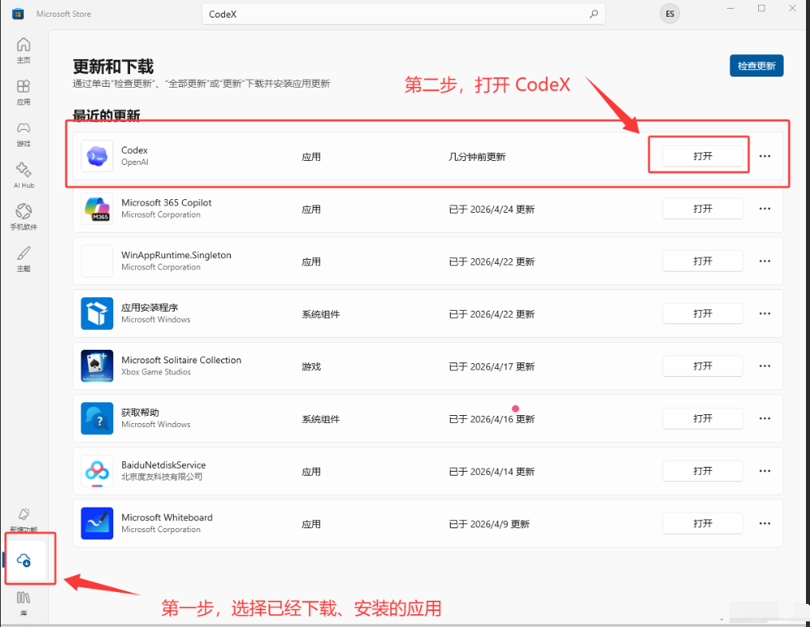

也可以在任务栏的搜索框里面搜索并打开CodeX

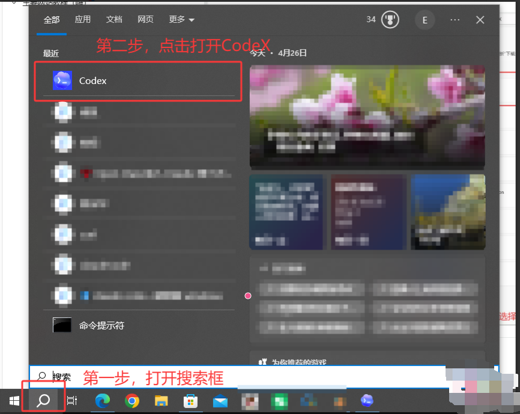


复制我们配置好的分组令牌

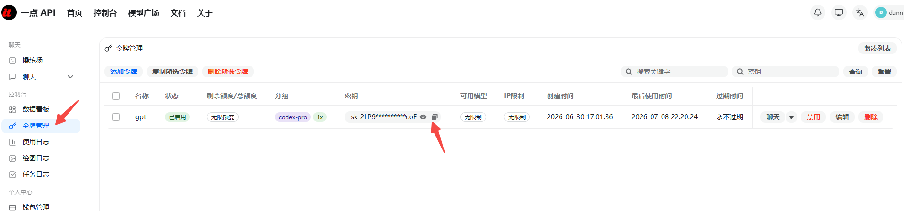

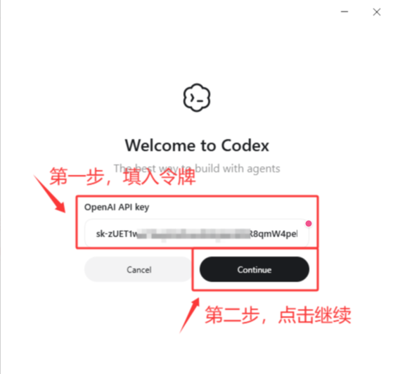

填写完之后，大概有如下界面，不用管，暂时还不能用

在右下角找到并退出CodeX，然后进入下一步更改配置文件

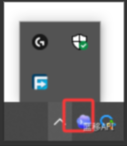

### 5. 配置API（配置方法三选一就行）

#### a. 在软件中配置（推荐）

打开 CodeX 的设置界面

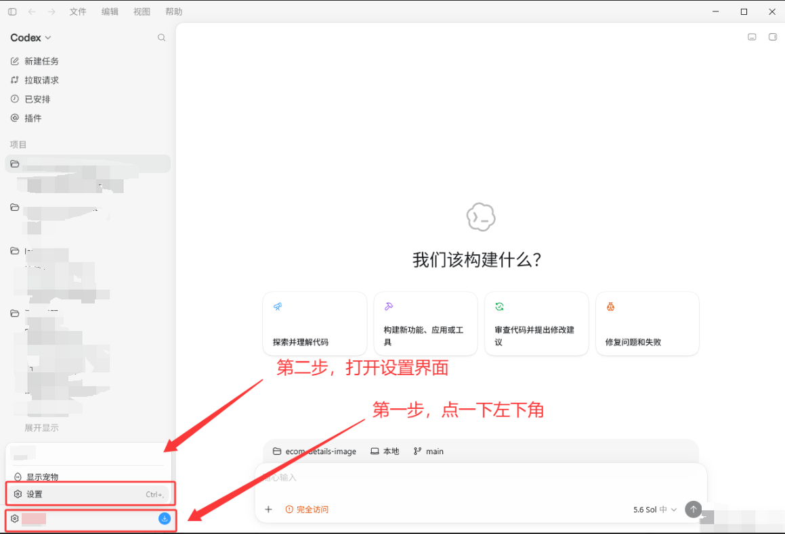

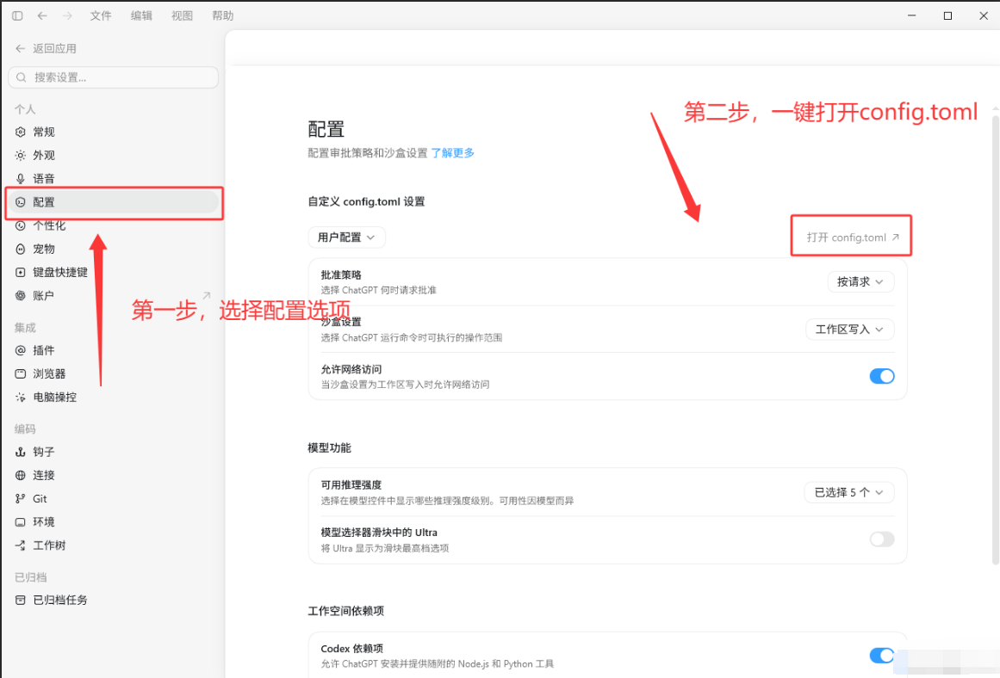

随后以 VSCode 为例子，大概如下图

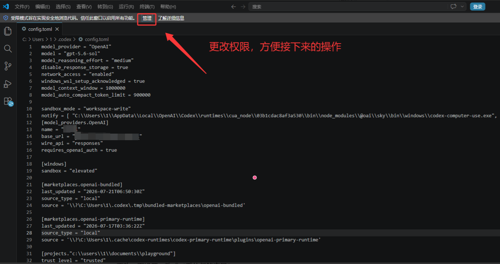

更改一下设置，改成“受信任的窗口”

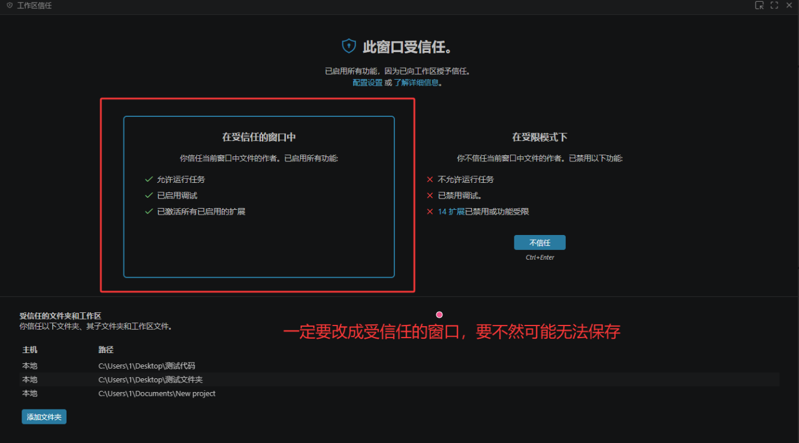

如果你是第一次使用（没有对话记录什么的），我建议是 Ctrl+A 全选之后，把多余内容全删了，只保留我们的配置文件内容。

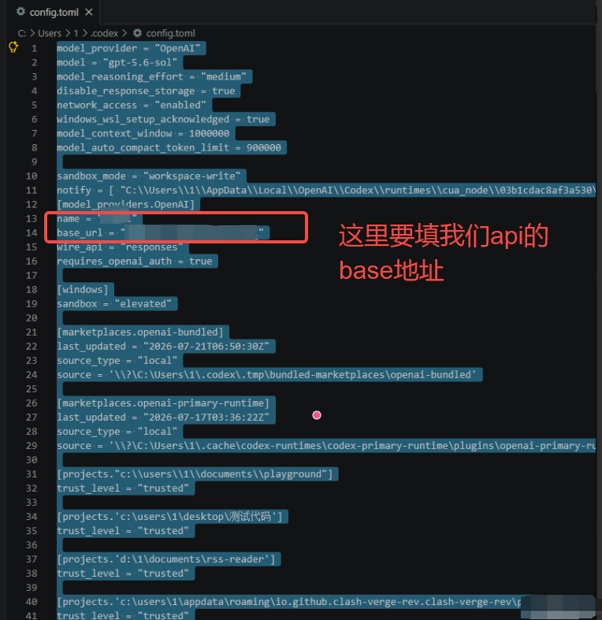

结果如下：

```toml
model_provider = "OpenAI"
model = "gpt-5.6-sol"
model_reasoning_effort = "high"
disable_response_storage = true
network_access = "enabled"
windows_wsl_setup_acknowledged = true
model_context_window = 1000000
model_auto_compact_token_limit = 900000

[model_providers.OpenAI]
name = "YiDian"
base_url = "https://api.yidianhub.com/v1"
wire_api = "responses"
requires_openai_auth = true
```

Crtl+S 保存之后，重启 CodeX 就可以正常使用我们的 API 了。

#### b. 用 CC-Switch 配置（推荐）

CC-Switch 的安装参考如下教程，这里不做详细介绍

如下图，看图即可

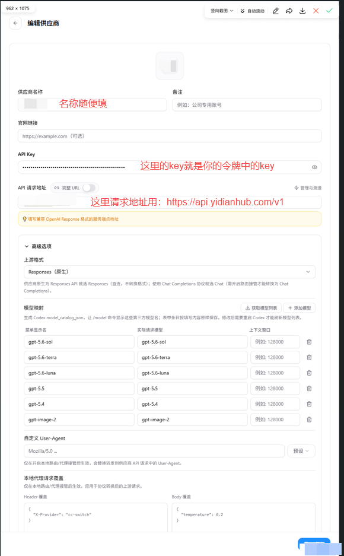

#### c. 底层文件方式（旧版）

##### ⅰ. Windows 系统用户

在 Windows 系统里面，在 `C:\\Users\\用户名\\.codex` 下，一般有 `auth.json` （存储 API_KEY）和 `config.toml` （核心配置文件），一般只需要修改一下config.toml 文件的配置

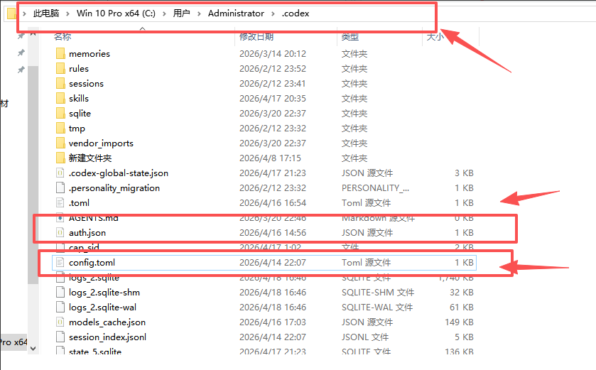

右键文件，选择以记事本打开

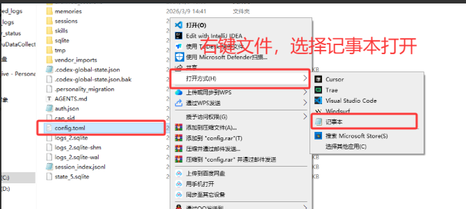

复制以下内容粘贴到文件前面

```toml
model_provider = "OpenAI"
model = "gpt-5.5"
model_reasoning_effort = "xhigh"
disable_response_storage = true
network_access = "enabled"
windows_wsl_setup_acknowledged = true
model_context_window = 1000000
model_auto_compact_token_limit = 900000

[model_providers.OpenAI]
name = "YiDian"
base_url = "https://api.yidianhub.com/v1"
wire_api = "responses"
requires_openai_auth = true
```

补充说明，如果要切换成其他模型，更改 model 那一行里面的模型名称就可以了，比如把 gpt-5.5 改成 gpt-5.6-luna。

完成后大概如下图，记得按 Ctrl + S 保存你的更改

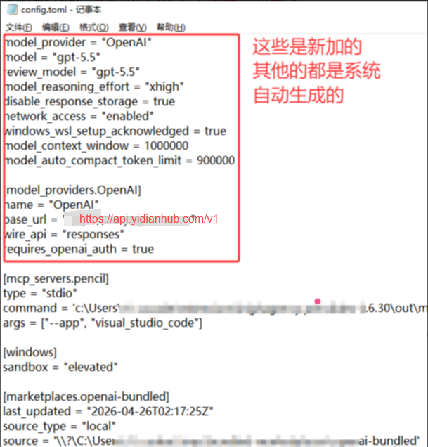

##### ⅱ. MacOS 系统用户

在MacOS系统中，`auth.json` 和 `config.toml` 两个文件的位置在 `~/.codex/` 下，一般只需要修改一下config.toml 文件的配置

Nano 编辑

所以我们需要编辑一些JSON文件来配置我们的API。

首先按下 command 输入终端，打开终端后输入如下命令

```shell
nano ~/.codex/config.toml
```

打开 config.toml 文件后（需要更换 Image-2的，把model那行从gpt-5.5换成gpt-image-2就行）

```toml
model_provider = "OpenAI"
model = "gpt-5.5"
model_reasoning_effort = "xhigh"
disable_response_storage = true
network_access = "enabled"
windows_wsl_setup_acknowledged = true
model_context_window = 1000000
model_auto_compact_token_limit = 900000

[model_providers.OpenAI]
name = "YiDian"
base_url = "https://api.yidianhub.com/v1"
wire_api = "responses"
requires_openai_auth = true
```

回车空出一行，插入上述内容然后保存即可，插入后大概如下图

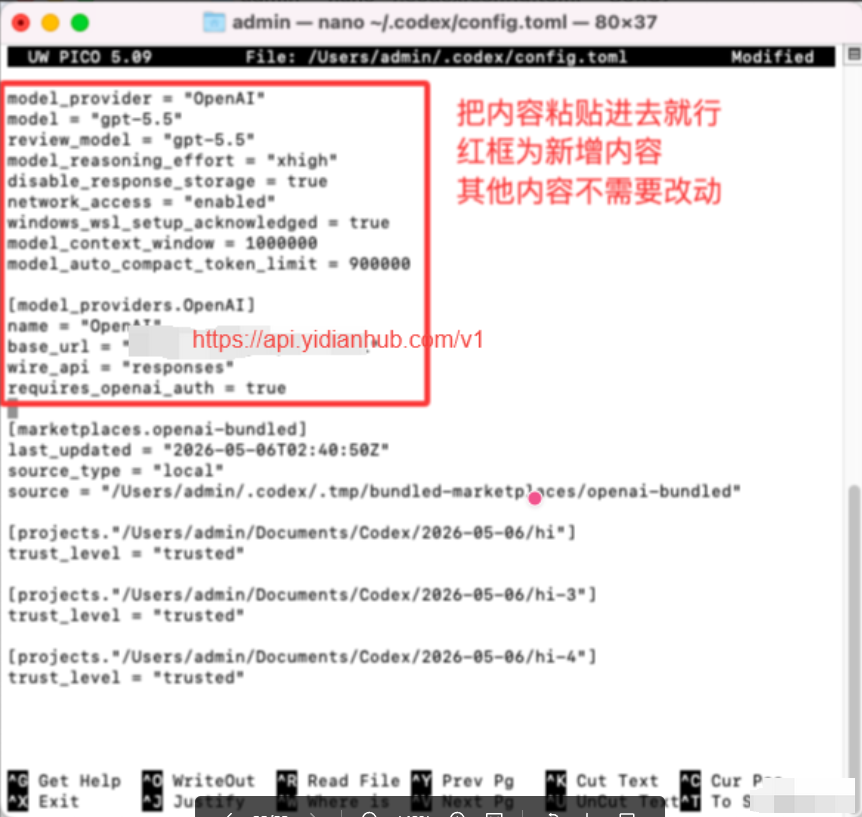

nano 可以直接编辑，编辑完成后保存退出：

按 control + O → 回车确认文件名 → 按 control + X 退出即可

### 6. 使用 CodeX

以上流程都走完了之后，就可以使用 CodeX 了，重新打开CodeX，大概有如下界面，我们选择左边的继续使用即可。

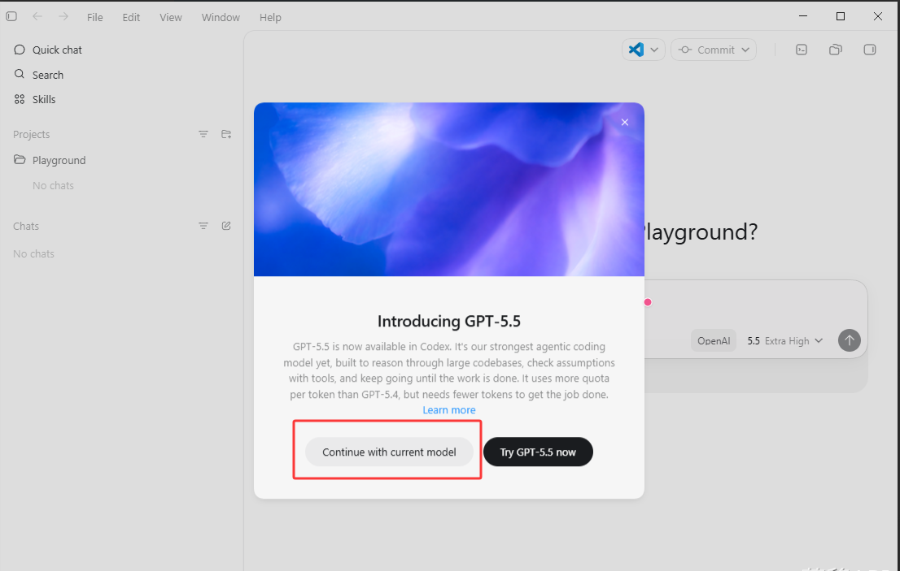

发送你好后，有回复即可正常使用，第一次使用是可能回复较为缓慢

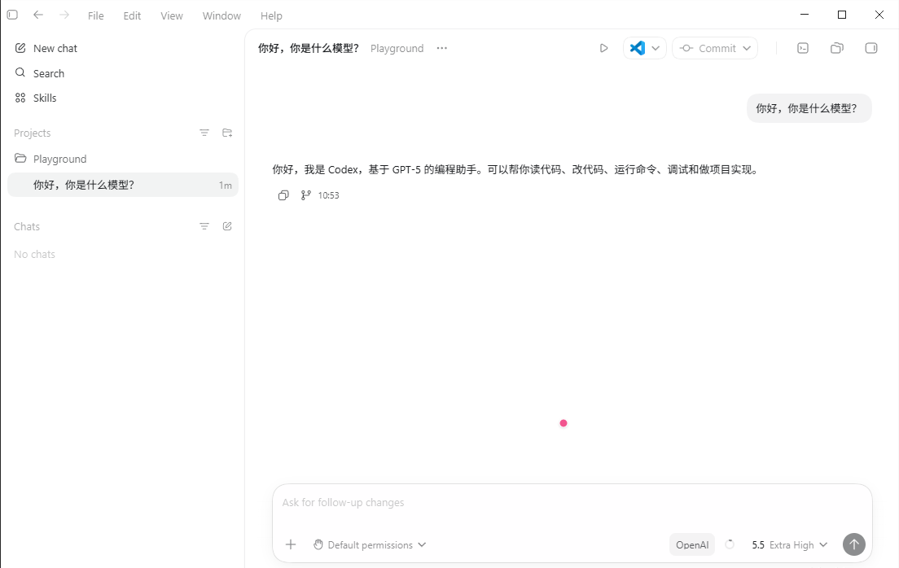
