# 前言

本教程默认观看者拥有可以登录Curosor的账号

Cursor 最新版本的编辑器已经完全取消了插件市场，并不支持配置第三方 API

---

在开始之前，请确保你手边已经有了这三样东西（如果缺少，请先去获取）：

**API Key (密钥)：这个是您在一点API上创建令牌时的key**

```html
sk-518GatoLXXXXXXXXXXXXXXXXXXXXXXXXsSLYe0zsnPH5
```

**Base URL (中转接口地址)：这个是我们固定的中转接口：**[**https://api.yidianhub.com**](http%3A%2F%2F1.95.142.151%3A3000)

（复制的时候看看前后有没有空格，要确保没有空格，否则使用的时候会报错）

```html
[**https://api.yidianhub.com**](http%3A%2F%2F1.95.142.151%3A3000)** **
```

---

# 安装 Cursor

## 第一步：下载安装包 (官网)

❗ 请务必去官网下载，不要去第三方软件园，以免下载到被篡改的版本❗ 
**Cursor 官网地址：  **[**https://cursor.com/**](https%3A%2F%2Fcursor.com%2F)

操作： 点击首页大大的蓝色按钮 "下载Windows版本"

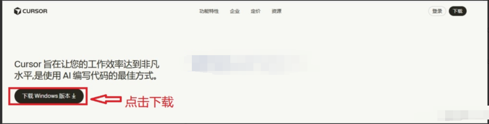

有部分用户可能自动跳转 Cursor 的网页对话中去，

这时候可以点击左下角的 Dashboard - Download Cursor XXXX（这里是Windows是因为作者电脑是Win）

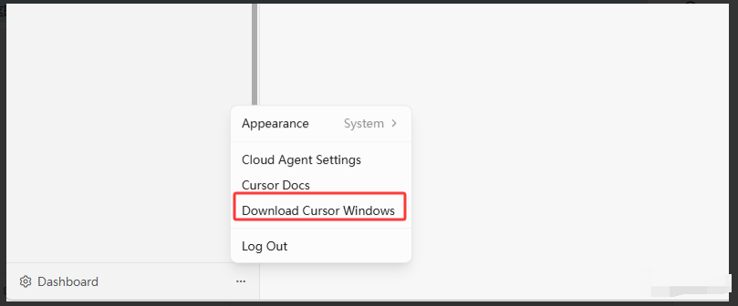

## 第二步：双击下载好的 .exe 文件

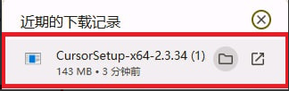

下载好之后，双击打开文件，开始安装即可

## 第三步：安装&打开

打开安装包后如图，然后开始Cursor

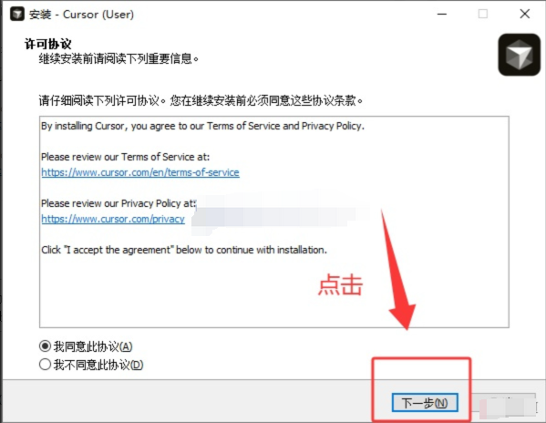

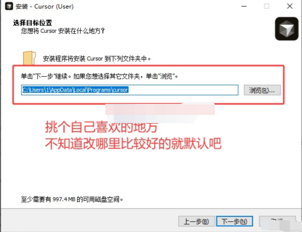

无脑下一步安装*（需要更改路径的请自己设置）*，完成后，打开软件有类似如下界面：

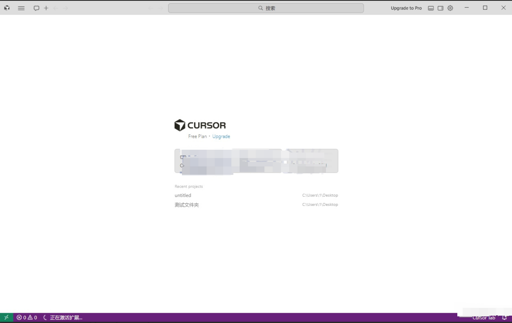

*可以使用 *`Ctrl+M Ctrl+T`*然后选择 来更改主题颜色（默认纯黑）*

## 第四步：安装插件

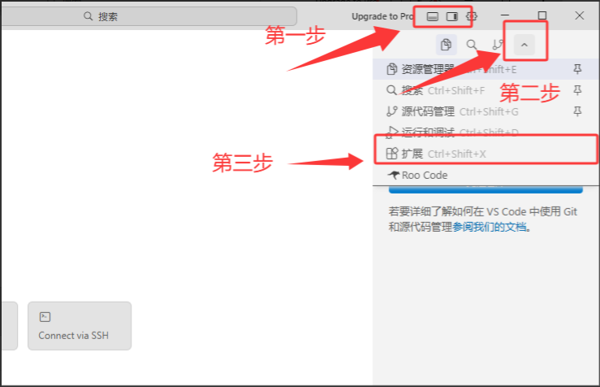

### 0 安装中文（非必要）

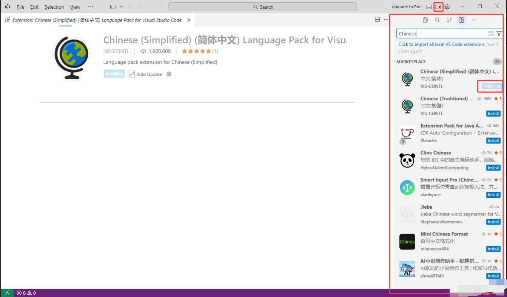

如果不习惯英文的用户，可以按图搜索中文插件（但是也显示不全）

### 1 ❗ 安装 Claude Code for VS Code ❗

安装好Claude Code插件后，还需要配置一些文件才能使用

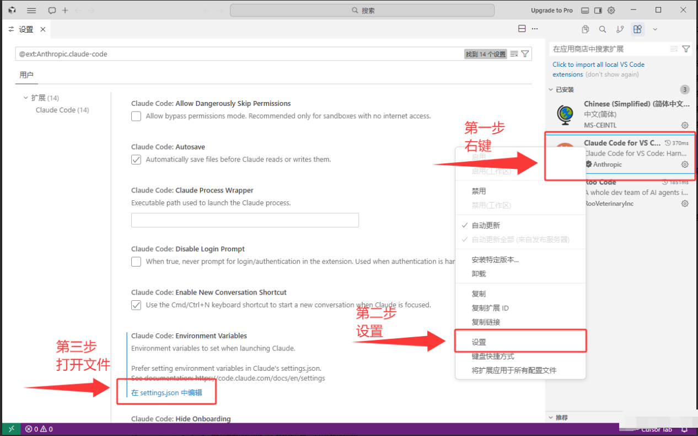

打开后配置文件大概如图

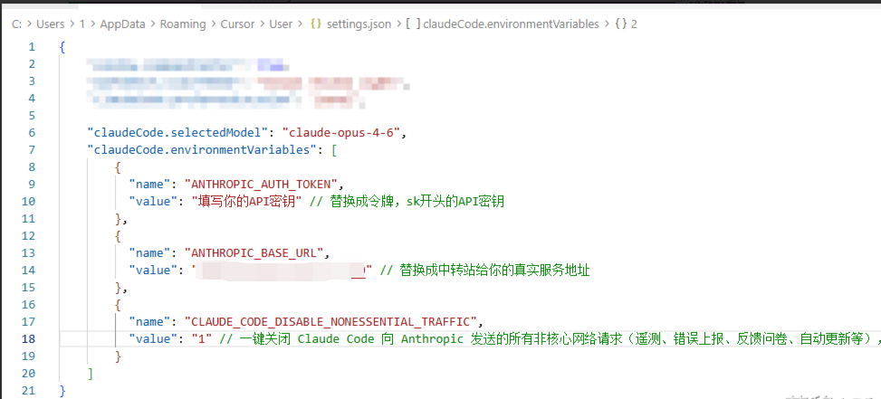

如图所示，Ctrl+A 全选，粘贴以下内容添加进去 Ctrl + S 保存即可

一定要记得保存！一定要记得保存！一定要记得保存！

（有重要配置请自行配置）

注意内容外面的括号，应如图所示一一对应

Claude Code配置文件

```json
{
  "claudeCode.disableLoginPrompt": true,
  // 禁用登录提示
  "claudeCode.environmentVariables": [
    {
      "name": "CLAUDE_CODE_OAUTH_TOKEN",
      "value": "替换成令牌，sk开头的API密钥"  
    },
    {
      "name": "ANTHROPIC_BASE_URL",
      "value": "https://api.yidianhub.com" 
    },
    {
      "name": "CLAUDE_CODE_DISABLE_NONESSENTIAL_TRAFFIC",
      "value": "1" 
  // 一键关闭 Claude Code 向 Anthropic 发送的所有非核心网络请求，更少的后台流量
    }
  ]
  
}
```

Claude Code配置额外模型（非必须）

```
  "claudeCode.selectedModel": "claude-haiku-4-5-20251001",
```

*旧版 ANTHROPIC_AUTH_TOKEN 已弃用*

**如果MacOS、Linux用户到这里，无法运行插件，请往下看，第六步中有一些解决办法。**

## 第五步：Claude Code插件运行

### 1 运行插件

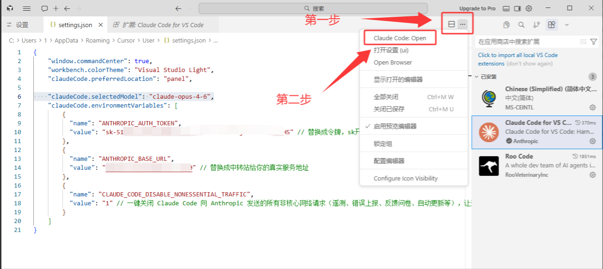

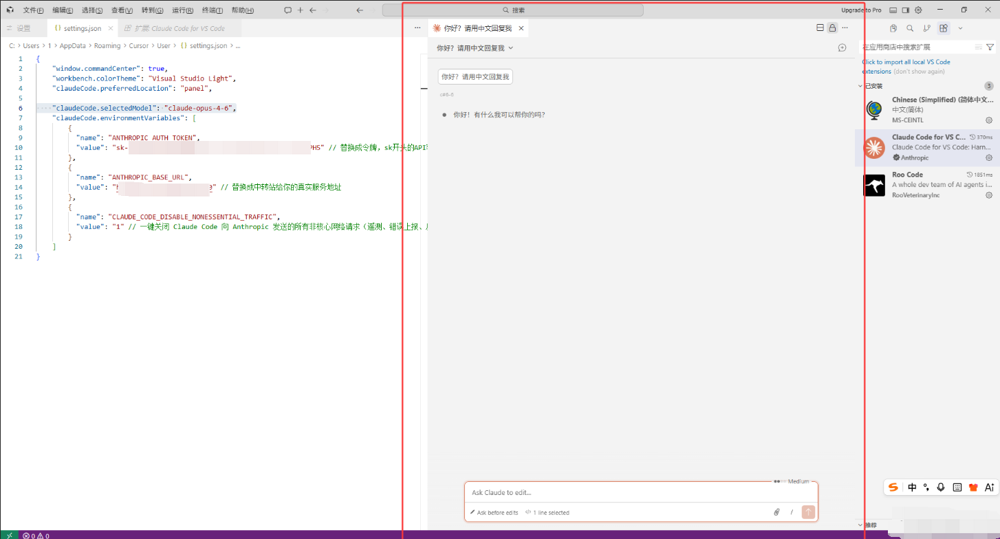

随后我们可以输入“你好，请用中文来回复我”，测试是否配置成功，有回复就算成功

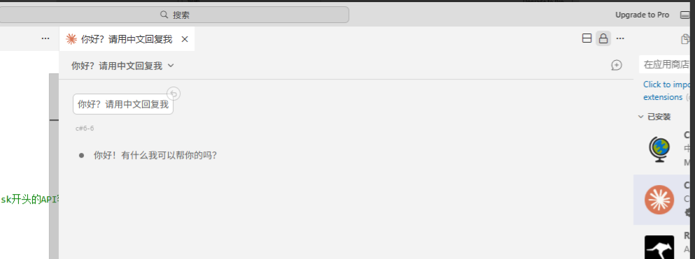

### 2 生成项目测试运行

*以下内容皆为测试内容，非必要内容，造成的TOKEN本公司、本教程概不负责，只要前面的教程中，有正常对话就算安装成功。*

---

随后我们可以让 **Cursor **创造一个HTML基础模板来测试一下

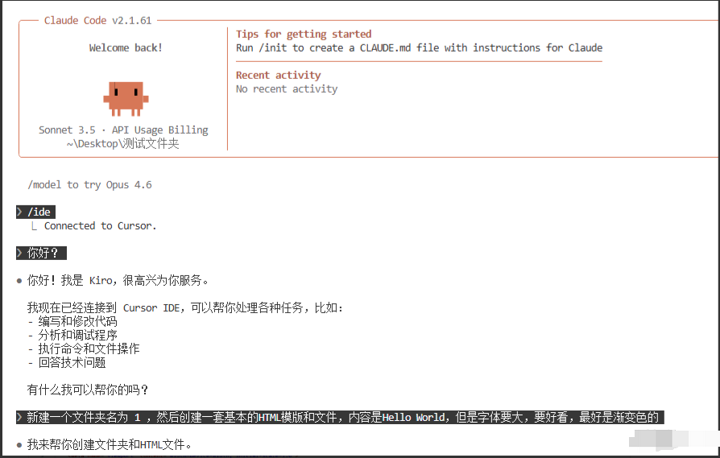

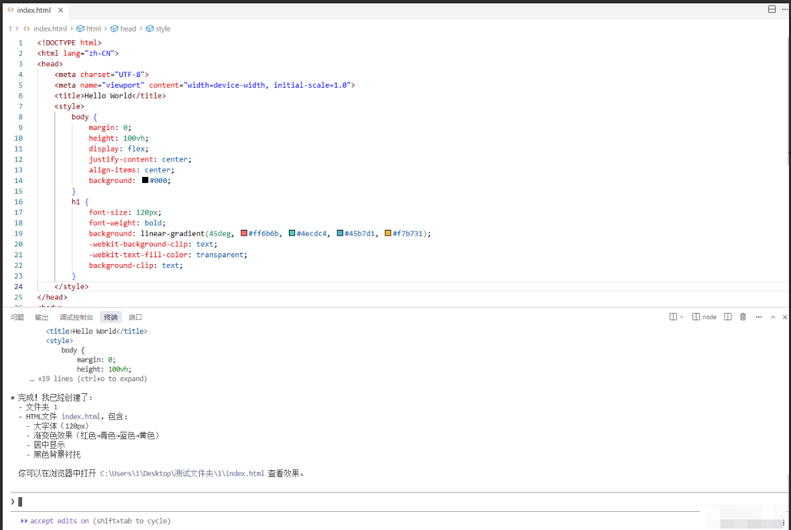

**最终结果：**


## 第六步：不能运行的一些解决方案

### 1 特殊报错

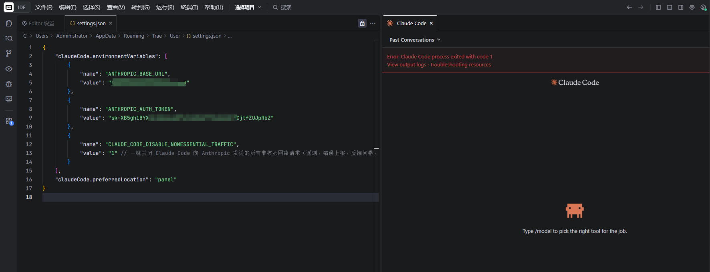

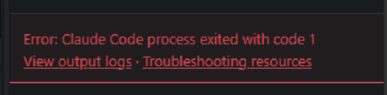

此报错大概率是因为用户安装Git（因为 Claude Code 依赖Git运行）后，安装地址不是默认的C盘，在其他盘导致Claude Code无法找到 bash.exe 启动文件。解决方案：

在桌面或者文件夹左侧找到 “此电脑”- “属性”（右键）

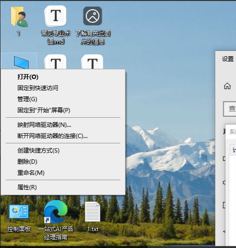

然后在找到高级系统设置

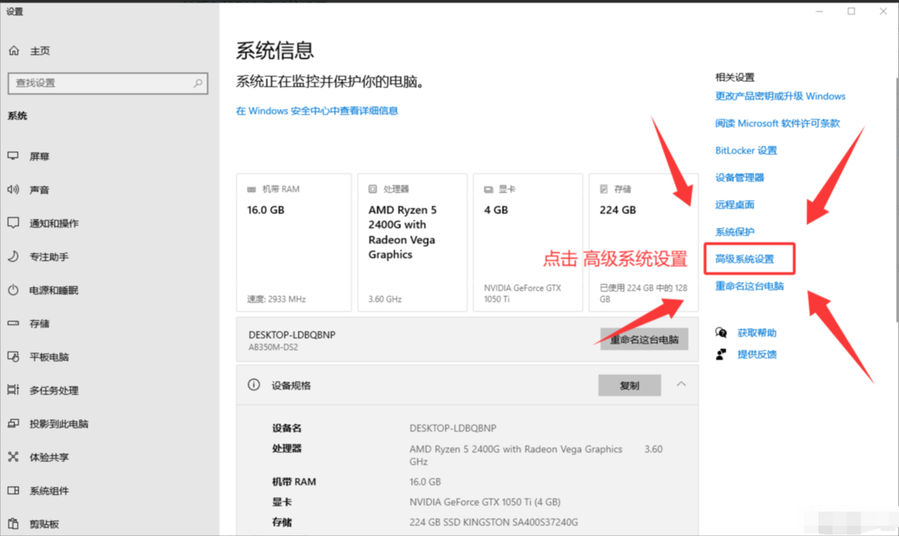

然后在系统属性中，第一步选择 “高级”，第二步选择 “环境变量”。

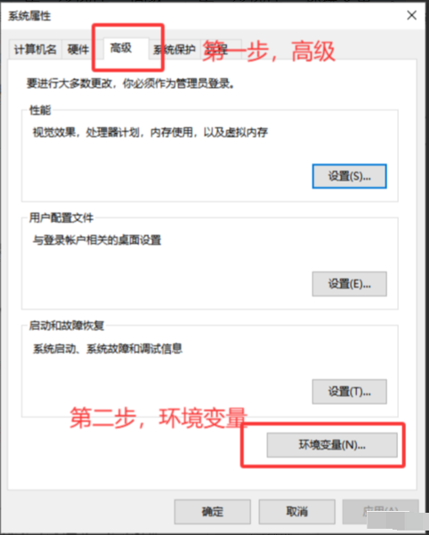

在环境变量中，新建用户变量

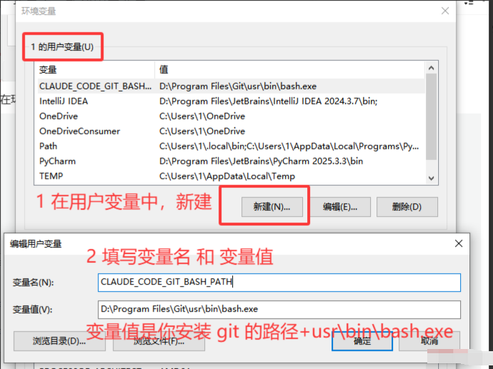

变量名

```
CLAUDE_CODE_GIT_BASH_PATH
```

变量值每个人可能都不一样。我的Git的安装路径是 D:\Program Files\Git

所以变量值是 D:\Program Files\Git\usr\bin\bash.exe

变量值就是 Git 安装路径 + usr\bin\bash.exe

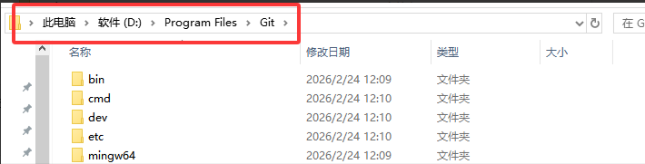

变量值（每个人可能都不一样）

```
D:\Program Files\Git\usr\bin\bash.exe
```

### 2 额外补充

如果实在配置Claude Code插件不成功（配置过其他家的API），预计需要安装Claude Code本体才能解决这个问题了
