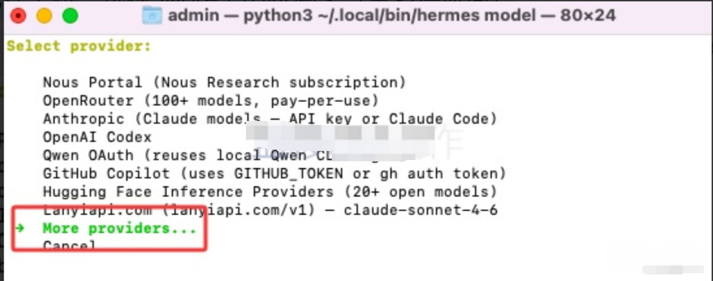
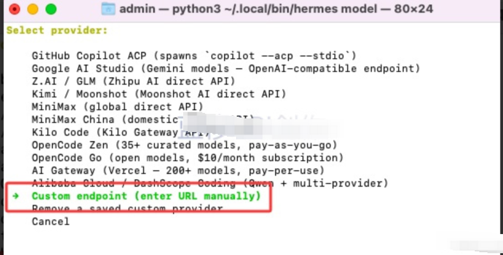
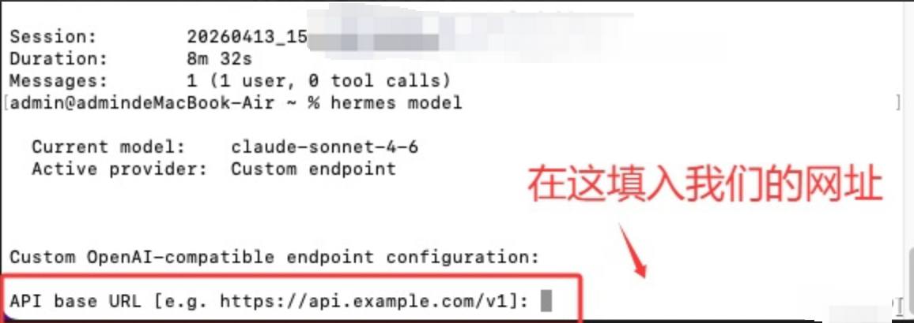
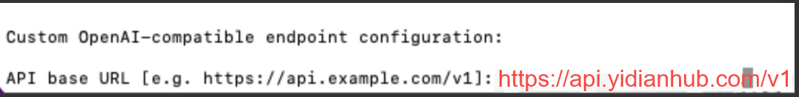
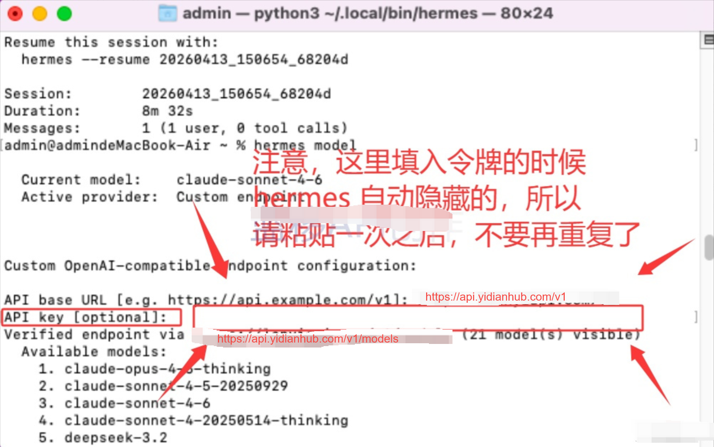
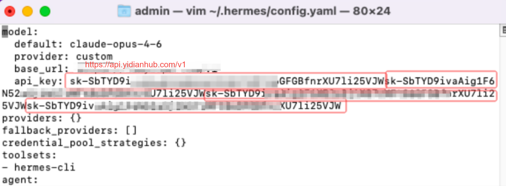
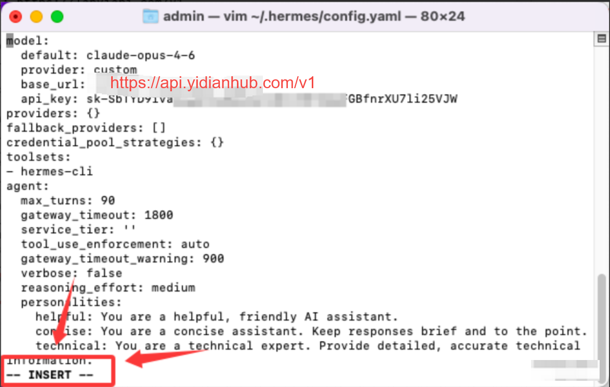
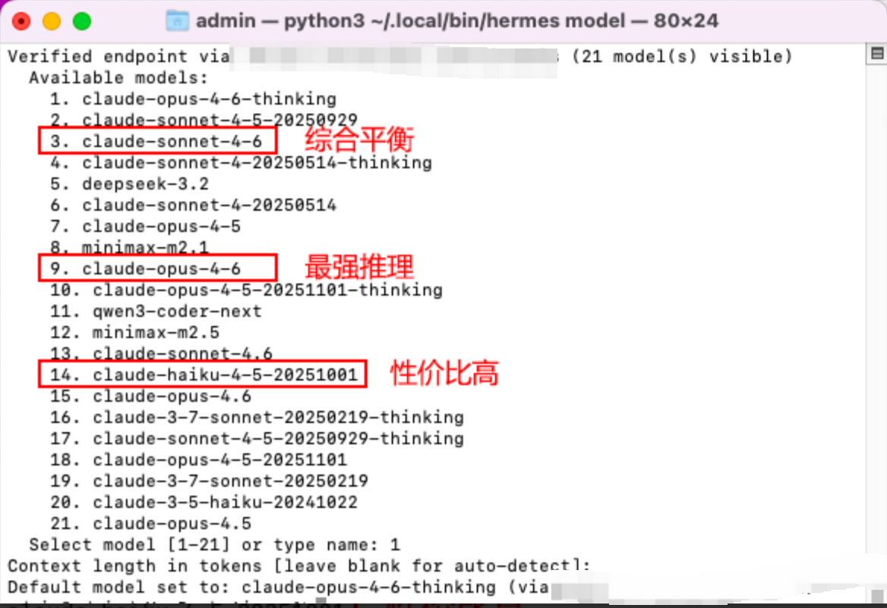
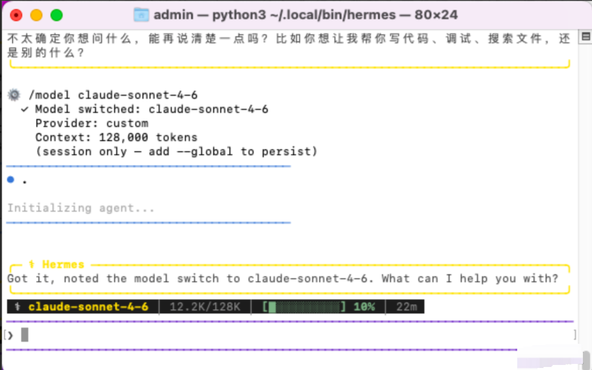

# 前言

**本教程不负责安装、部署问题，具体教程参考文档**

Hermes Agent** 详细安装参考 **[官方文档](https%3A%2F%2Fhermes-agent.nousresearch.com%2Fdocs%2Fgetting-started%2Fquickstart)

**建议使用 curl 一键安装命令**

Linux / macOS / WSL2 / Android (Termux)

```
curl -fsSL https://raw.githubusercontent.com/NousResearch/hermes-agent/main/scripts/install.sh | bash
```

默认客户已经安装好 Hermes     默认客户已经安装好 Hermes

# 配置一点API

本教程以Mac为例，但命令和流程，基本多系统（Win/Mac/Linux）通用

安装好Hermes之后，可以输入hermes model ，然后他会让我配置模型

配置模型

```
hermes model
```

## 第一步 选择供应商

这里我们先往下拉，选择 More Providers （更多供应商）



然后在所有供应商里面，找到 Custom endpoint （自定义供应商）



## 第二步 配置URL

回车确认后，会弹出URL填写



```
https://api.yidianhub.com/v1
```

就像下图这样



## 第三步 填写令牌

随后还会让我们填写令牌，但请注意，填写令牌的时候，是自动隐藏的。

也就是说，根本看不到到底有没有填进去，所以最好一次过，粘贴一次就好。



### 补充：如果配置令牌错误

如果你和作者一样，曾经一条令牌复制多次，可以使用如下方法解决这时候就需要从配置文件里面删掉多余的令牌了，首先在命令行执行如下命令，打开hermes的配置文件：

不同系统，配置文件的位置可能略有不同

Mac/Linux

```yaml
vim ~/.hermes/config.yaml
```

Windows

```yaml
C:\Users\用户名\AppData\Local\hermes\config.yaml
```

打开后可以看到你刚刚配置的模型有过长的api_Key，因为我们蓝移的 api_Key 都是以sk开头的，所以很容易分割辨认



在vim中，按下 i (输入法切换为ABC）进入编辑模式，左下角就有 **-- INSERT -- **字样

然后通过方向键，将api_Key删到只剩下一条就行了

再按下Esc退出输入模式，按下 :（冒号）进入命令行模式，输入 wq 保存并且退出即可



## 第四步 选择模型

随后选择模型即可，这里选择了 1 号。

*Context length in tokens [leave blank for auto-detect]：*

可以不管，直接回车跳过即可



# 完成配置

走完上述流程，你就可以 hermes 启动，然后正常跟他对话了



# **切换模型**至于 Hermes 如何切换模型，目前仅发现一种办法：

切换模型公式

```
/model <model name>
```

比如切换到 claude-sonnet-4-6 模型

```
/model claude-sonnet-4-6
```
