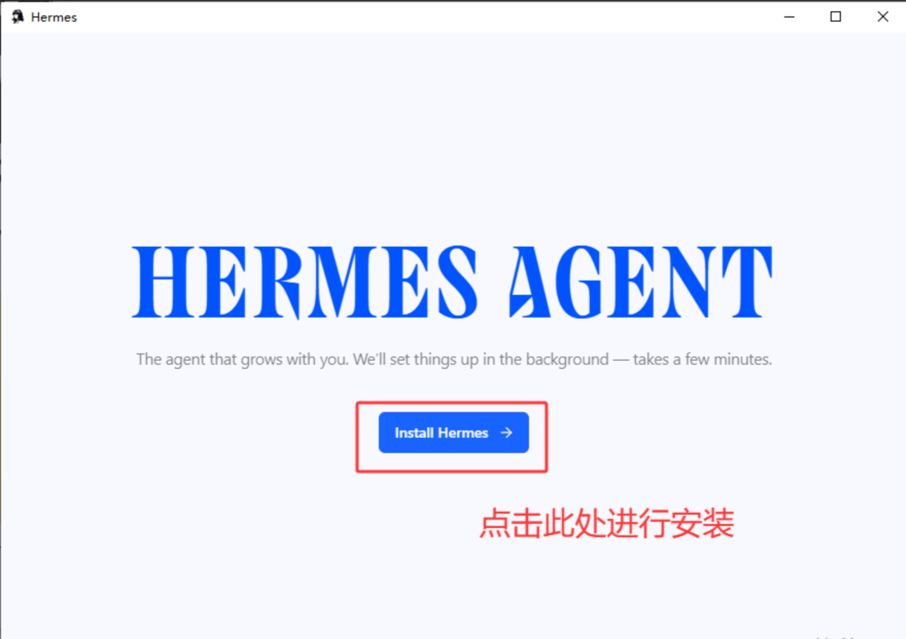
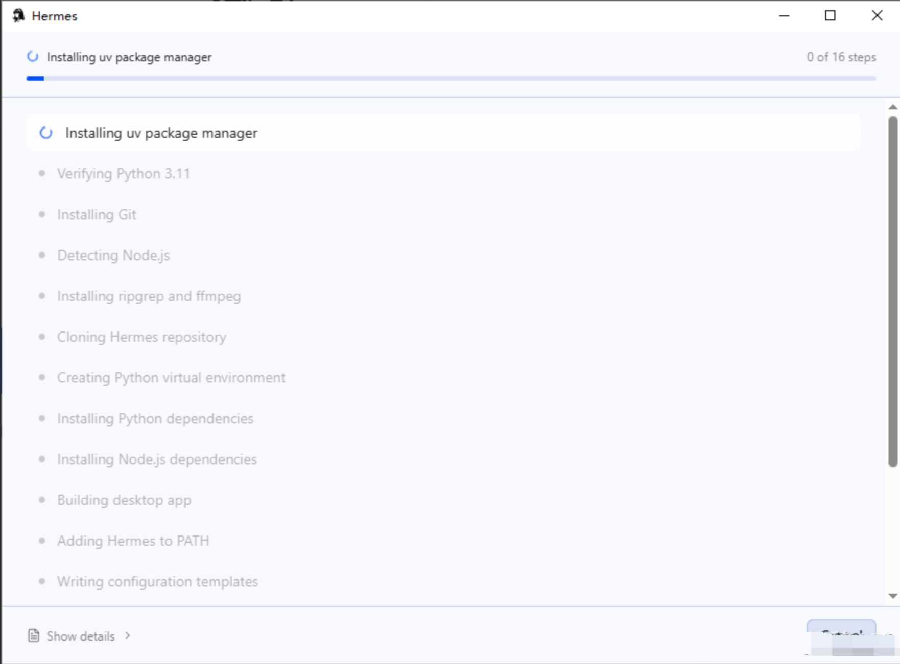
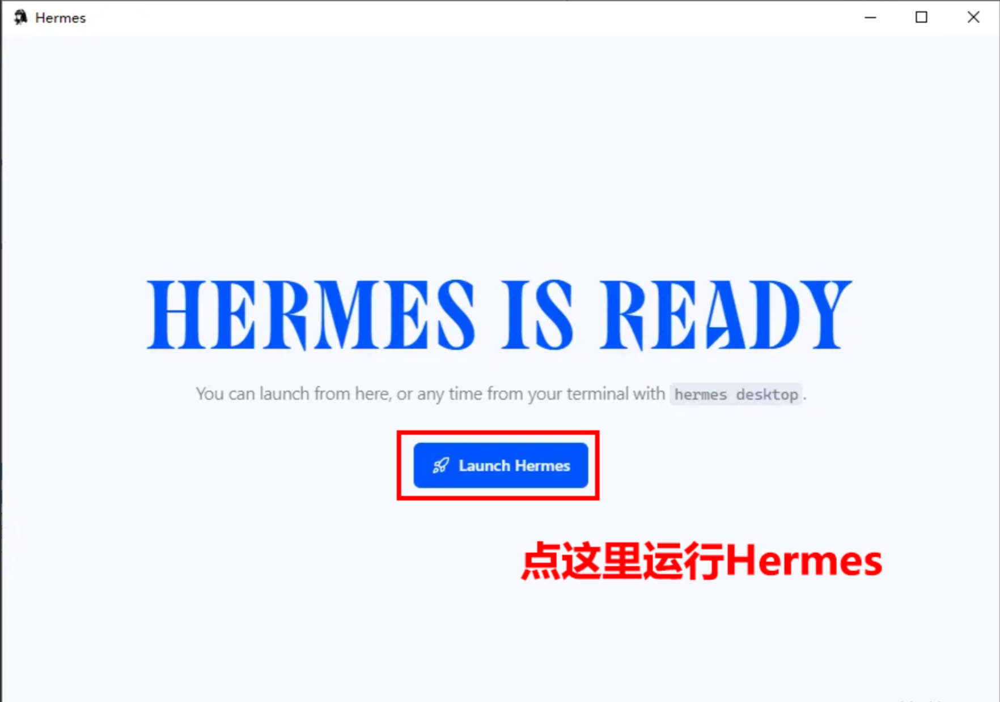
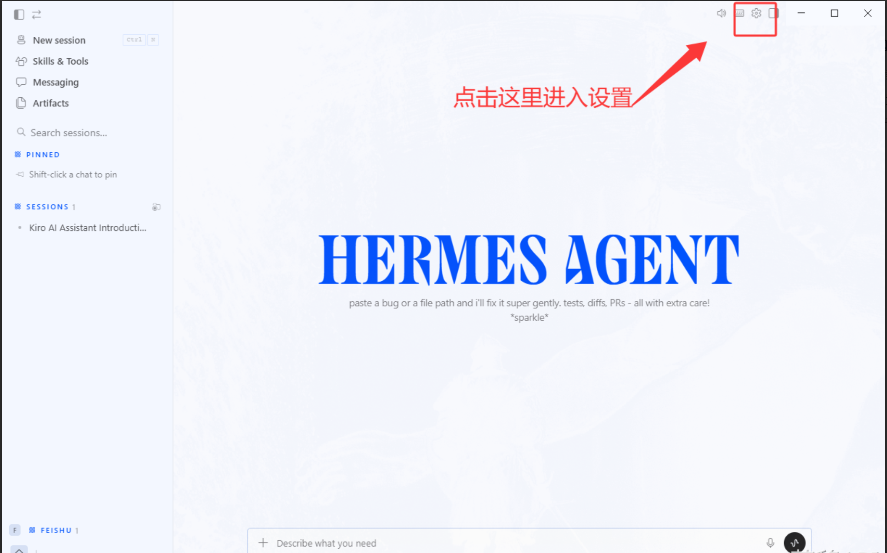
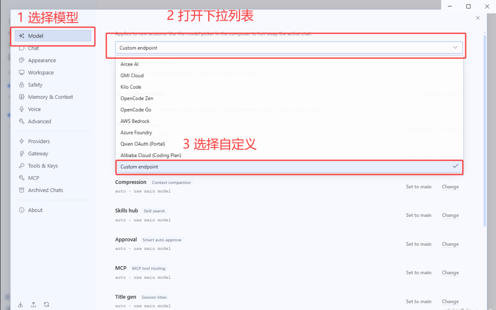
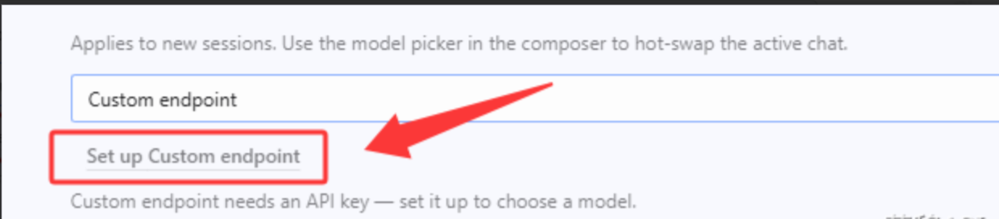
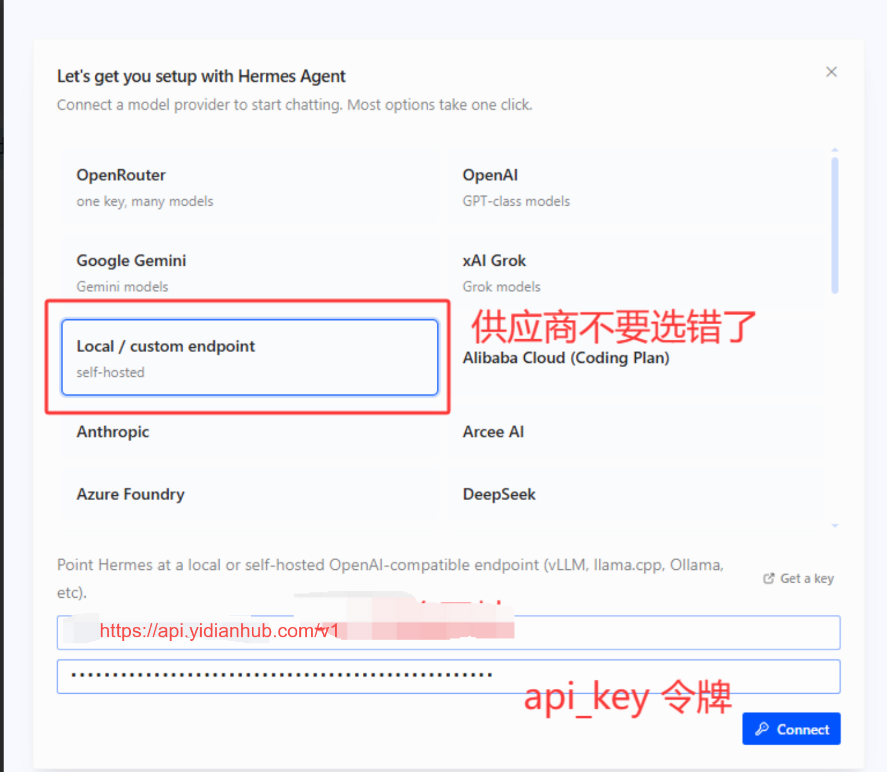
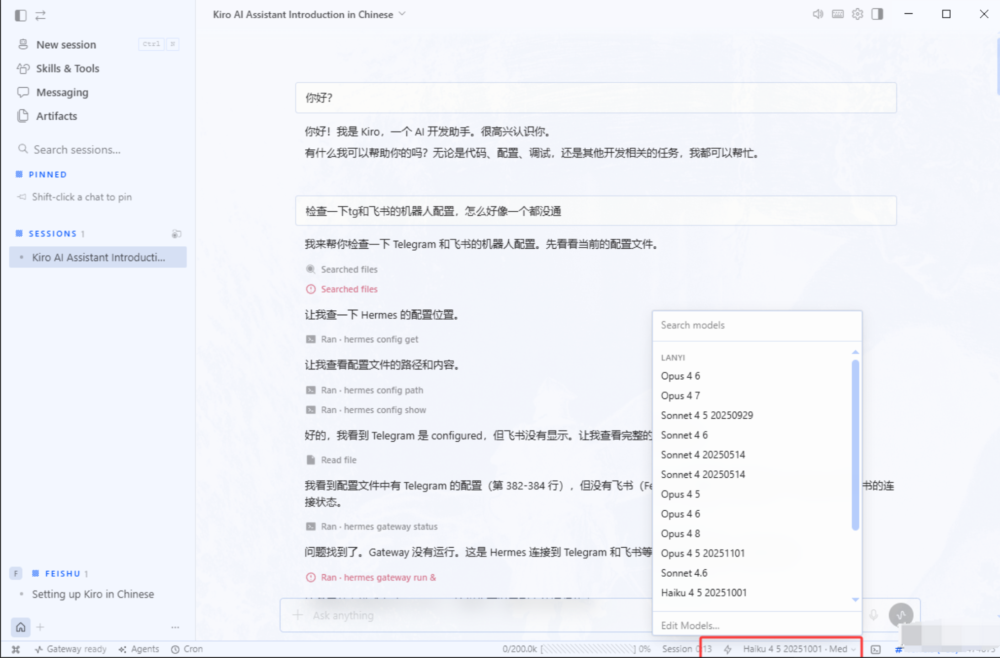
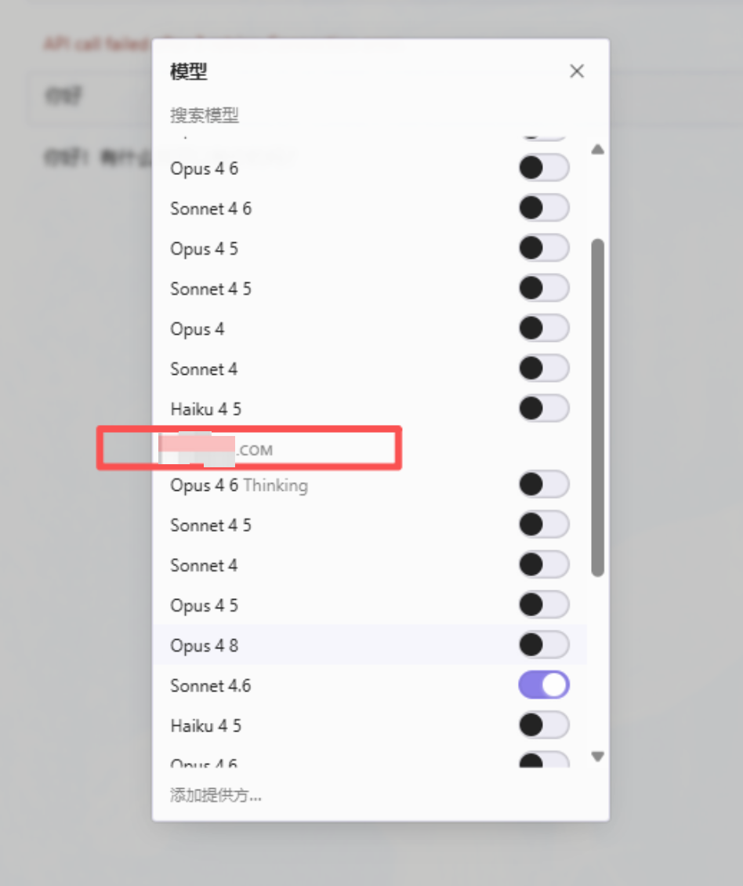

# 1 下载安装

[Hermes Desktop 下载地址 ](https%3A%2F%2Fhermes-agent.nousresearch.com%2Fdesktop)[https://hermes-agent.nousresearch.com/desktop](https%3A%2F%2Fhermes-agent.nousresearch.com%2Fdesktop)

Hermes 桌面端虽然降低了使用门槛，但目前仍处于刚发行的阶段，可能会有一些奇奇怪怪的 bug 无法解决，请用户自行决断

下载完成后，有如下安装包

双击打开后之后，直接点击 Install Hermes （安装爱马仕）



安装过程中请耐心等待，下图为安装过程（有很多需要安装的环境）



安装完成之后，点击 Launch Hermes 就可以运行 Hermes 爱马仕了



# 2 配置 API

运行之后有如下界面，点击右上角的小齿轮进入设置界面。



在设置界面中选择“自定义”供应商协议进行配置我们的 API



进一步选择，进入详细配置界面



填写 URL 和 API_KEY

url

```
https://api.yidianhub.com/v1
```



# 3 对话测试

配置好 API 之后，在右下角选择自己喜欢的模型即可正常对话。可以输入任意内容来测试 AI 的回复情况，比方说“你好”。



如果有多家 API 供应商的话，请自行挑选到我们的模型


