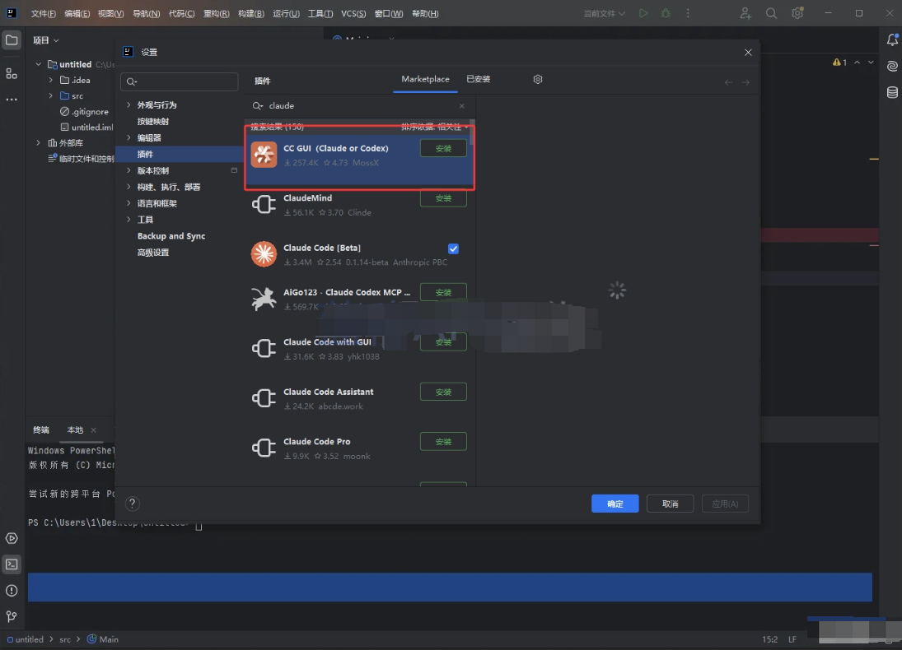
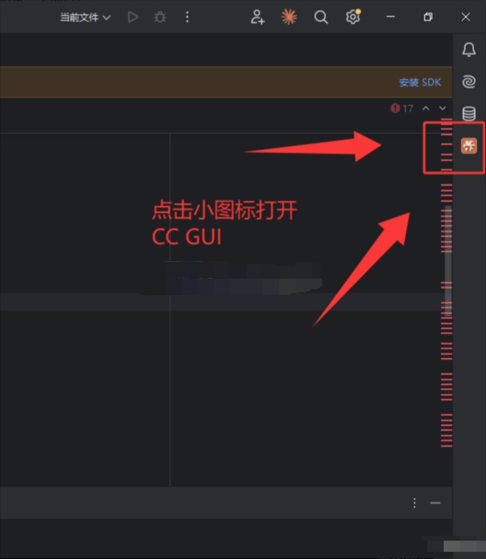
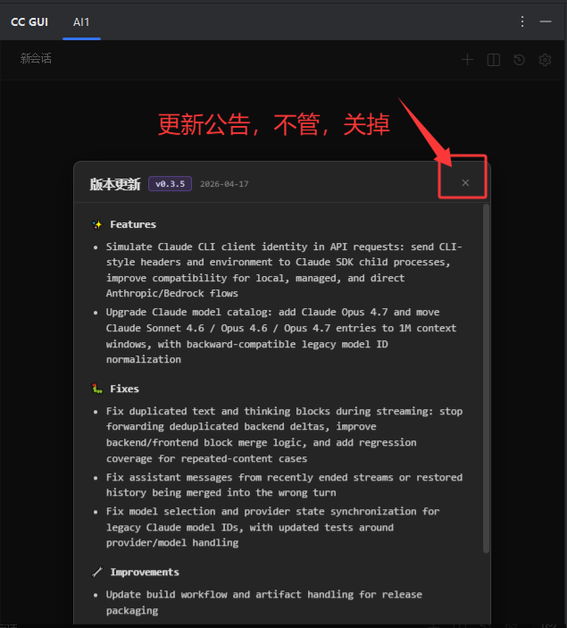
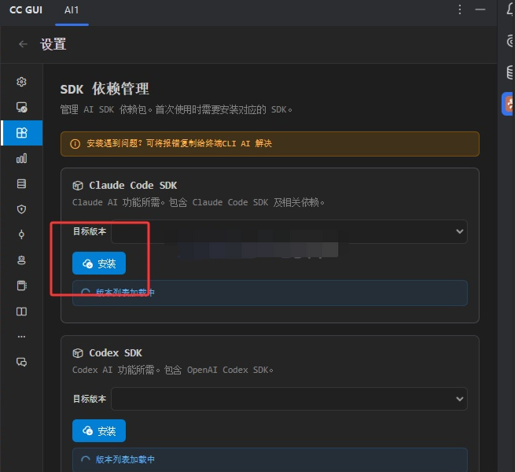
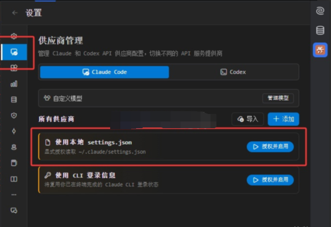
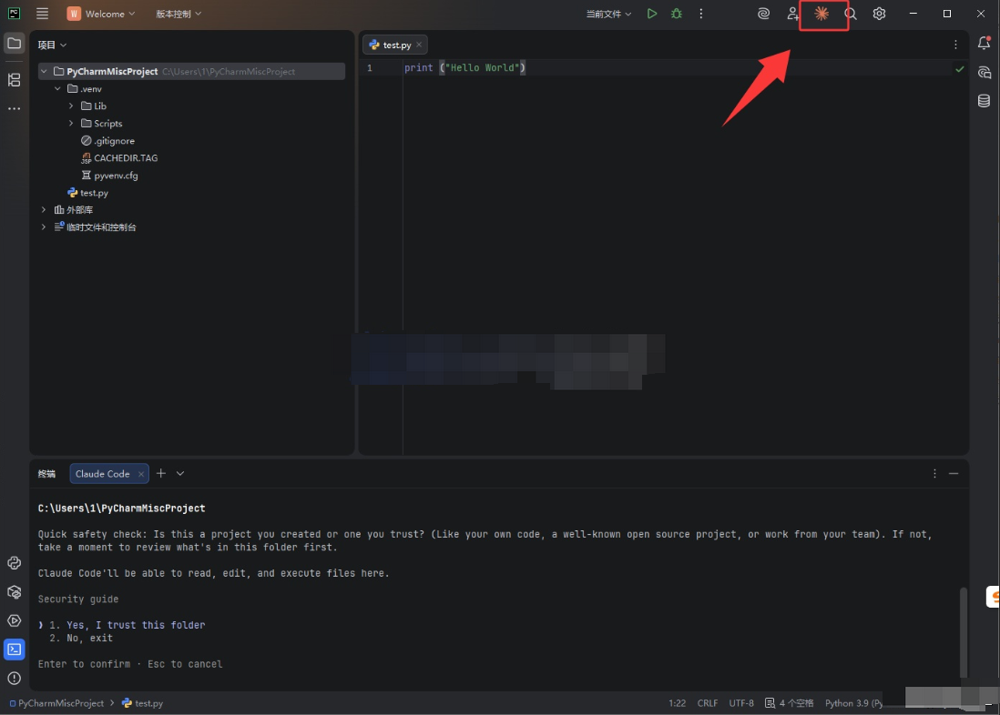
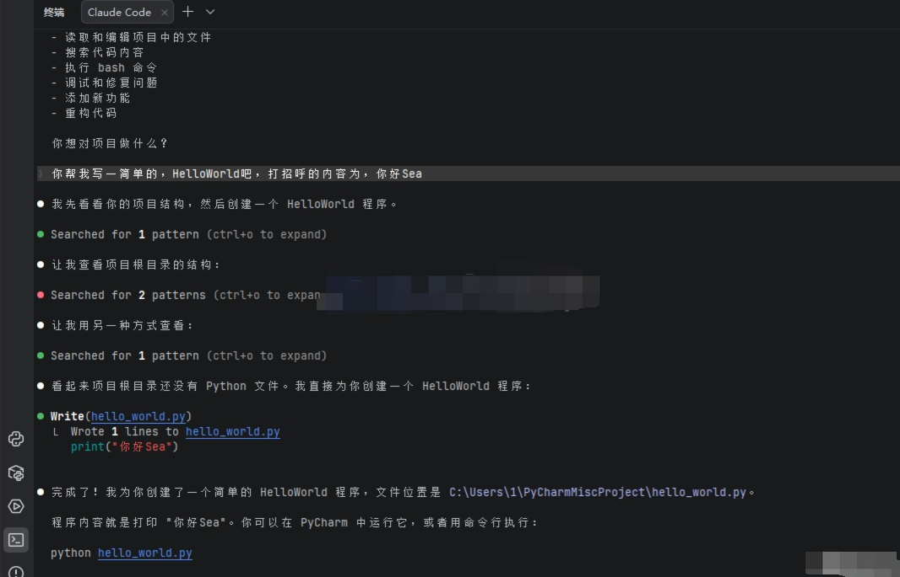
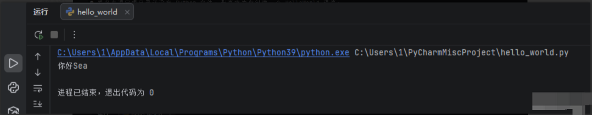
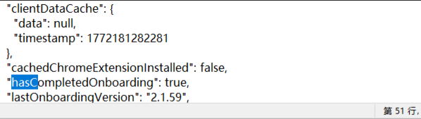

# 前言

*因API的用途相当之广泛并且拓展非常的复杂，故推出本教程，但本教程也仅供用户自行参考拓展探索，不做售后答疑和技术支持，希望用户大大们见谅。另外本教程中出现的Token过度消耗、系统损坏等问题，蓝移也不负任何责任。*

*本教程建议有一定编程基础或者经验的用户观看。*

*本教程一定程度上参考了*[*Claude Code 官方文档*](https%3A%2F%2Fcode.claude.com%2Fdocs%2Fzh-CN%2F)

# 共用内容

Claude Code（CC）安装

以下所有内容，都得先安装 Claude Code 本体

以下教程默认你已经安装 Claude Code 本体

# IntelliJ IDEA & Claude Code

## 1 前言&事前准备

*在 JetBrains IDEs（包括 IntelliJ、PyCharm、WebStorm 等）中使用 Claude Code，Claude Code 通过专用插件与 JetBrains IDEs 集成，提供交互式差异查看、选择上下文共享等功能。*

---

**本段教程支持的 IDEs**

Claude Code 插件适用于大多数 JetBrains IDEs，包括不限于：

因为逻辑原理都一样，故下述将用** IntelliJ IDEA **24.3.7版本（专业版）进行测试

---

**首先得安装Claude Code，参见：**

- 📘 Claude Code Windows版 使用教程

- 📘 Claude Code (命令行版) 零基础安装使用指南

**并且准备好 URL 、API KEY 和 模型名字**

## 2 安装插件

一般在 **设置Setting - 插件Plugin  - 市场Marketplace** 中搜索 Claude Code，

找到如下图的插件，进行安装即可：

## 3 安装配置

安装好之后，在IDEA右上角点击图标直接运行即可（因为事先配置好了Claude Code，无需二次配置，只需对接一下即可）

更新公告，不管，关掉就行

安装一些配置文件

点击安装 Claude Code SDK

等他安装好了大概长这样

然后顺手在左侧小电脑中，打开供应商管理，点击使用本地 settings.json 授权并使用

随后回到首页，发起对话即可

# PyChram & Claude Code

## 1 前言 & 事前准备

**需要先装好CC，前面说过了，故不复述了**

**先准备好 URL 、API KEY 和 模型名字**

*PyChram版本 PyCharm 2025.3.3（专业版）*

## 2 安装插件

一般在** 设置Setting** - **插件Plugin**  - **市场Marketplace** 中搜索 **Claude**，

找到如下图的**插件 Claude Code[Beta]**，进行安装即可：

## 3 运行测试

安装好之后，在IDEA右上角点击图标直接运行即可（因为事先配置好了Claude Code，无需二次配置）

然后随便回车确认一下，进入到对话框

可以随便输入点内容测试一下AI

# 常见问题

## 所在地区不可用

**配置之后如果出现以下情况（选做）（没有这种情况可以跳过）**

原因：缺了引导 下图为解决方案

部分人可能 .claude.json 空空如也，随便在任意一行的逗号后面添加内容即可

只添加  `"hasCompletedOnboarding": true,`

大概情况如下图，只需要添加`"hasCompletedOnboarding": true, `一行

