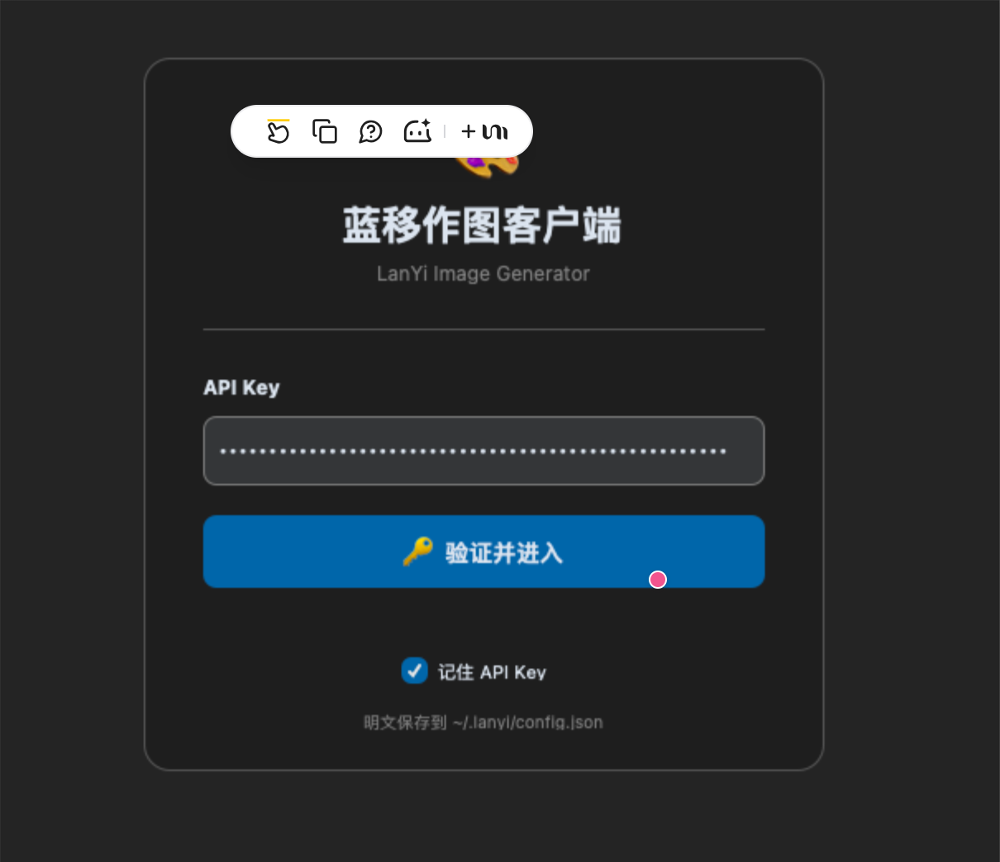
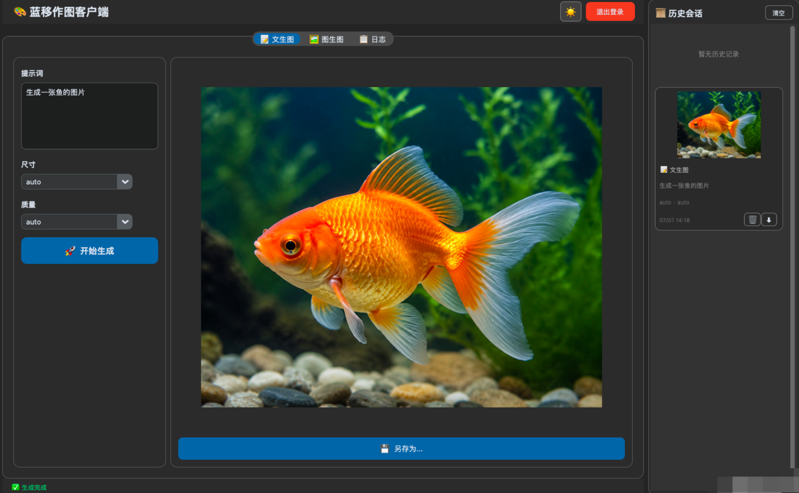
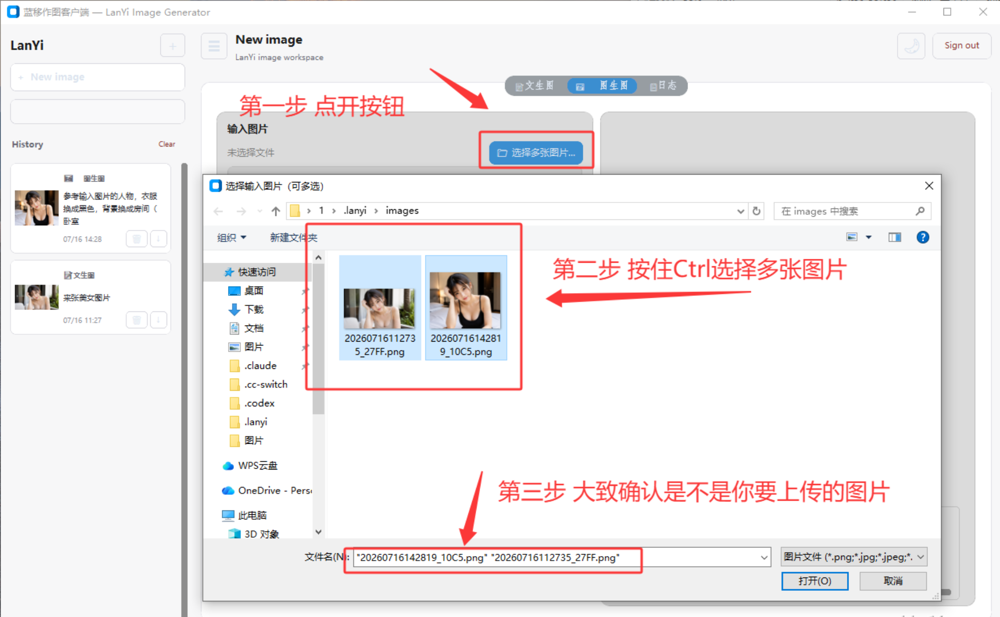
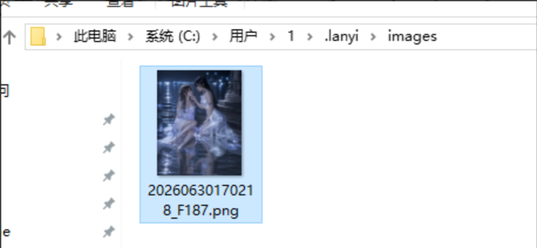
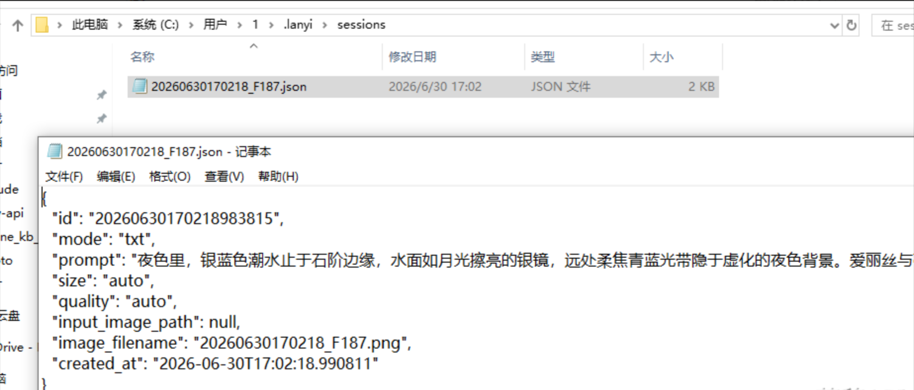

# 前言

Image-2 的作图，很多时候由于 Codex 官方的问题，导致在 Codex 上极其不稳定，而 API 的调用，对于不熟悉代码的客户朋友又非常不友好，所以这里提供一款作图软件：蓝移作图软件(软件由 **蓝移公司** 开发)，本质是封装了作图模型的接口调用，由于 Python 代码编写编译而成，目前已经适配 Windows 系统、MacOS Intel 系统。

# 蓝移作图软件下载

## Windows 系统

稳定老版本（推荐）（7.1 发布）

通过网盘分享的文件：LanYiClient.zip

链接: https://pan.baidu.com/s/1NxllG0jY-tADajxD7erkMQ?pwd=y8g6 提取码: y8g6

最新版（修改基础提示词、优化 bug）（8.5 发布）

通过网盘分享的文件：LanYiClient_New.zip

链接: https://pan.baidu.com/s/1CLJl6lf3Kh8oMt3psxh6KA?pwd=fgnq 提取码: fgnq

## MacOS Intel 芯片  系统用

通过网盘分享的文件：LanYiClient_x86_64.zip

链接: https://pan.baidu.com/s/1OHtepRNEetAE1EFuBy5rWA?pwd=uykt 提取码: uykt

## MacOS M 芯片  系统用

通过网盘分享的文件：LanYiClient_arm64.zip

链接: https://pan.baidu.com/s/1A0U8Vn4ISqTBwhaZ0dzodQ?pwd=3ea8 提取码: 3ea8

Windows 系统开箱即用，不用安装。苹果系统的软件暂且处于测试阶段。

# 使用说明

## 填入令牌

打开软件之后，会提示输入 API Key ，记得，是 CodeX / CodeX Pro 专用分组的令牌。

领取到令牌之后，打开软件填进去，点击进入即可，开箱即用，非常简单。

## 一般使用

进入之后，界面如图，主要功能分为 **文生图**、**图生图** 两个大板块。随便输入一点提示词，点击“开始生成”就可以作图了。

## 多选图片

最新版本中，图生图功能中，提供了多选图片的选择。只需要按住 **Ctrl+鼠标单击** 即可多选图片。

## 配置文件

生成之后的图片，右边有历史记录，可以直接点击右边的历史对话卡片也可以直接进入历史对话。

他们存储于 C:\Users\用户名\.lanyi 下，苹果系统的路径是 ~/.lanyi ，有需求的客户可以在里面找到历史对话记录和文件。在路径 images 里面，可以看到自己曾经生成过的图片，并且能找到配套的 json 文件，里面存储着一些信息和对应图片当时用的提示词。

