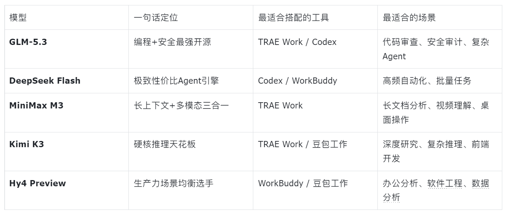

上一篇文章   聊完四款工具，很多人后台问：**这些工具用的是什么模型？我能不能换？**

能。而且换得好，体验差别巨大。字节的TRAE Work和豆包工作、腾讯的WorkBuddy、OpenAI的Codex，现在都支持接入第三方模型。国产模型这一波卷得厉害，GLM-5.3、DeepSeek Flash、MiniMax M3、Kimi K3、混元Hy4 Preview，各有绝活。

先认识一下这五个“心脏”，再说怎么换。

## 五个模型，一句话看懂

**GLM-5.3**——编程和智能体能力最强的开源模型。智谱8月发布，通过后训练把编程体感拉高了50%，在CyberGym漏洞推理评测中得分84.5%，发布前用它在真实环境里挖出了2404个潜在漏洞，其中1088个中高危。更关键的是执行效率：完成同样任务平均只用约5万tokens，而Claude Opus 4.8需要12万。**又快又省，适合代码审查和安全场景。**

**DeepSeek Flash**——极致性价比的Agent引擎。9月刚发布的V4.1 Flash是552B参数的MoE模型，输入激活只有8B，成本大幅压缩。KV Cache相比初代模型缩小了437倍，Agent场景下缓存费用直接砍到零头。DeepSeek官方称它在性能、费用、速度、总用时上已全面超越V4 Pro，正在有序下线V4 Pro。**便宜、快、Agent能力暴涨，适合高频调用的自动化任务。**

**MiniMax M3**——第一个把“前沿Coding + 1M上下文 + 原生多模态”三样都做进开源模型的选手。自研MSA稀疏注意力架构，100万上下文下单Token计算量只有上一代1/20。能直接看视频、操作桌面，实测连续跑12小时自主完成论文复现，产出18次commit和23张实验图表。**长上下文场景的性价比之王。**

**Kimi K3**——2.8万亿参数，全球最大的开源模型。原生视觉理解，100万token上下文，一发布就拿下Frontend Code Arena编程榜首，开源模型首次超越头部闭源登顶。马斯克在评论区留言“令人印象深刻”，OpenAI战略负责人评价其性能“无法依靠简单蒸馏实现”。**硬核复杂推理的天花板。**

**混元 Hy4 Preview**——腾讯的“为生产力而生”模型。770B总参数、49B激活，1M上下文，在腾讯内部163名专家、203个工程任务的盲测中，均分2.99/4，略优于GLM-5.3和Kimi K3。已开源，输入6元/百万tokens、输出18元，定价走普惠路线。**办公和软件工程场景的均衡选手。**

## 四款工具怎么“换心脏”

### TRAE Work：模型选择最自由

TRAE Work的内置模型列表基本把上面五个全包了。Work模式和Code模式下，GLM-5.3、DeepSeek-V4-Flash正式版、Kimi-K3、MiniMax-M3全部可用；Design模式则精选了GLM-5.2、DeepSeek-V4-Pro和Kimi-K2.7-Code。

如果内置列表不够，还能添加自定义模型，支持OpenAI兼容格式和Anthropic格式，填写API Key即可接入。**推荐搭配**：日常办公用GLM-5.3（执行路径短、响应快），Design模式用Kimi-K3（视觉理解强），代码审查切DeepSeek Flash（成本低）。

### WorkBuddy：腾讯生态内的“模型超市”

WorkBuddy内置了Hy3、GLM-5.2、Kimi-K3等模型，按积分计费。但它的自定义模型功能更值得用：只要提供商支持OpenAI兼容格式，DeepSeek官方API、Kimi、GLM、甚至本地Ollama跑的模型，三步就能接进来，费用直接走你自己的API额度，跟WorkBuddy积分完全独立。

配置信息存在本地`~/.workbuddy/models.json`，不上传云端。**推荐搭配**：既然WorkBuddy是腾讯系，Hy4 Preview是天然搭档，两者在腾讯内部已经深度协同优化过；如果追求极致性价比，换成DeepSeek Flash，Agent场景下缓存费用极低。

### 豆包工作：火山引擎的“全家桶”

豆包工作的底层是火山引擎的Agent Plan，本身就包含了Doubao系列、GLM-5.1、Kimi-K2.6等主流三方模型。方舟Coding Plan进一步支持在Doubao、GLM、DeepSeek、Kimi、MiniMax之间动态切换或使用Auto模式自动调度。

不过豆包工作的模型选择更多是平台侧预设，用户端可自定义的空间不如TRAE Work和WorkBuddy大。**推荐搭配**：跟着火山引擎的Auto模式走就行，它会根据任务类型自动选模型，省心。

### Codex：需要用“转接头”

Codex原生只吃OpenAI的Responses API，国产模型暴露的却是OpenAI Chat Completions协议，直连会404。需要靠CC Switch这类工具在本地起一个转换层，把Codex的Responses请求改写成Chat Completions再转发出去。好消息是DeepSeek原生支持Responses API，并提供官方一键配置脚本。**推荐搭配**：Codex + DeepSeek Flash是最顺滑的组合，官方适配、成本极低；如果做安全审计类任务，切GLM-5.3。

## 模型选型速查表

## 组合推荐

**“省钱拉满”组合**：WorkBuddy + DeepSeek Flash。WorkBuddy负责本地文件操作，DeepSeek Flash提供Agent推理，缓存费用极低，适合每天大量跑自动化任务的用户。

**“能力拉满”组合**：TRAE Work + GLM-5.3 + Kimi K3。GLM-5.3跑日常办公和代码审查，Kimi K3处理需要深度推理的硬任务，Design模式再用Kimi的视觉能力出界面。

**“生态拉满”组合**：豆包工作 + Hy4 Preview + 飞书。Hy4在腾讯内部盲测中略胜GLM和Kimi，豆包工作打通飞书企业上下文，适合深度依赖飞书协作的团队。

**“程序员专用”组合**：Codex + DeepSeek Flash（日常）+ GLM-5.3（安全审查）。DeepSeek官方适配Codex最顺滑，GLM-5.3在漏洞推理上的84.5%得分不是白拿的。

## 最后说一句

工具是壳，模型是芯。壳决定你能怎么用，芯决定你能用多好。

好消息是，现在两者都在加速开放。TRAE Work和WorkBuddy都支持自定义模型接入，Codex也有成熟的路由方案。**你不用再被单一模型锁死，完全可以按任务类型随时“换心脏”。**

坏消息是，选择变多了，纠结也变多了。但纠结总比没得选好。

需要了解具体怎么“换心脏”，请查阅 https://articles.yidianhub.com/ 相关文章
