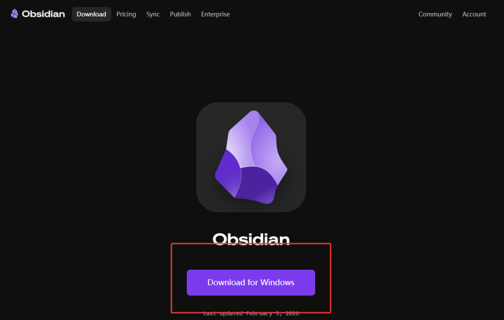
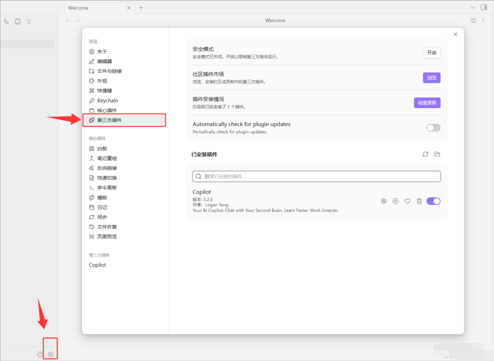
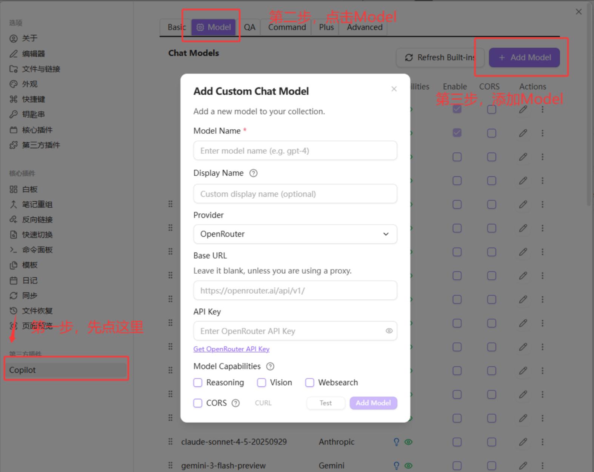
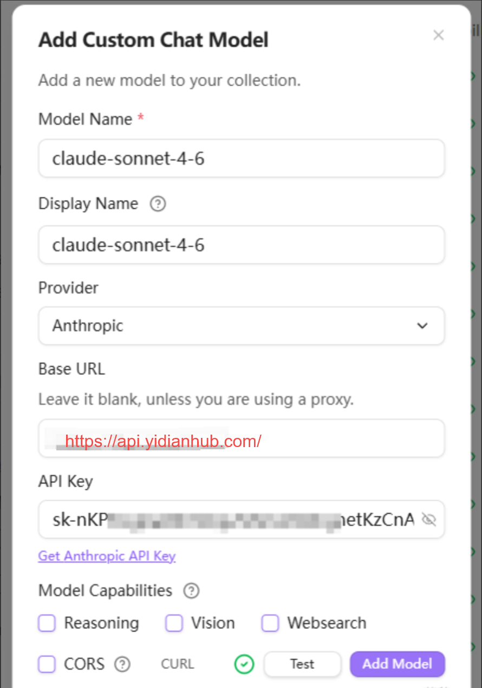
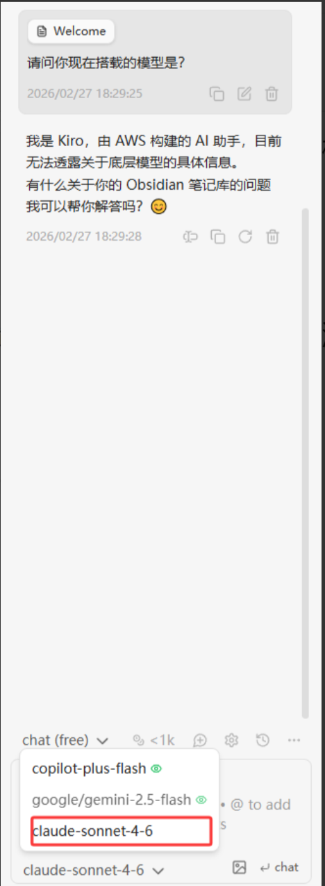
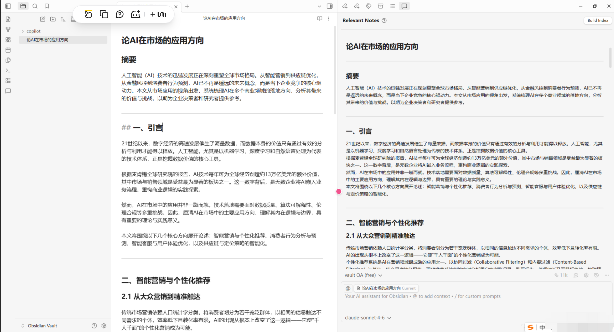

# 1 下载安装Obsidian

建议上 [Obsidian官网](https%3A%2F%2Fobsidian.md%2Fdownload) 下载



点击下载，然后无脑下一步（需要改路径的客户自行决定）安装

# 2 安装插件 & 配置API

第一次使用的时候记得设置中文

安装完毕后，打开 左下角设置 - 第三方插件 - 关闭安全模式 ，搜索并且安装插件 **Copilot**



安装完成后，还是在设置 - 最底下的 **第三方插件Copilot **里面选择 **Model**（模型），然后直接添加模型



安装如下图配置填写内容，Provider应商选 Anthropic



Base URl

```
https://api.yidianhub.com/v1
```

Model Name

```
claude-sonnet-4-6
```

随后点击 Add Model 进行添加。

# 3 可选模型



随后点击模型，进行切换，切换到我们自己的模型（这里以claude-sonnet-4-6模型举例）。

进行问答测试即可，如回复无误，说明配置成功。

支持的模型有如下（不完全）

```
claude-haiku-4-5-20251001

claude-sonnet-4-20250514
claude-sonnet-4-5-20250929
claude-sonnet-4-20250514-thinking
claude-sonnet-4-5-20250929-thinking
claude-sonnet-4-6

claude-opus-4-20250514
claude-opus-4-1-20250805
claude-opus-4-5-20251101
claude-opus-4-6
claude-opus-4-20250514-thinking
claude-opus-4-1-20250805-thinking
claude-opus-4-5-20251101-thinking
```

# 4 论文测试



尝试让AI生成论文

**obsidian**最大的便捷就在于，左边就是笔记区，右边就是搭载的AI，唯一美中不足的就是不如ClaudeCode那般强大，可以直接生成文件。生成好了的文章需要自己手动复制。
