# 0、准备工作

本教程所有内容都建立在用户已经安装好OpenClaw的前提下

已经安装好OpenClaw的前提！已经安装好OpenClaw的前提！

本教程只适用国际版、正规从官方下载部署的OpenClaw！

一键部署、快速部署、中文版OpenClaw等等非正规，修改过文件和代码版本，都有可能无法连接 一点 API，无法正常使用模型！

在开始前，请确认你已经具备以下信息 👇

## 你的中转 API 信息

先获取以下三项：

- **API Base URL（接口地址）**
一点API URL链接地址：

```
https://api.yidianhub.com/v1
```

- **API Key（密钥）**
您在蓝移API后台生成的key

```
sk-xxxxxxxxxxxxxxxx
```

- **支持的模型名称：**

```
# Haiku
claude-haiku-4-5-20251001

# Sonnet
claude-sonnet-4-5-20250929
claude-sonnet-4-5-20250929-thinking
claude-sonnet-4-6

# Opus
claude-opus-4-8
claude-opus-4-7
claude-opus-4-6
claude-opus-4-5-20251101
claude-opus-4-5-20251101-thinking
```

复制填写以上信息时，请注意千万不要有空格，会影响进程

# 一、特别篇：云服务器接入

以腾讯云服务器为例，先找到对应的配置画面，然后填入对应数据即可

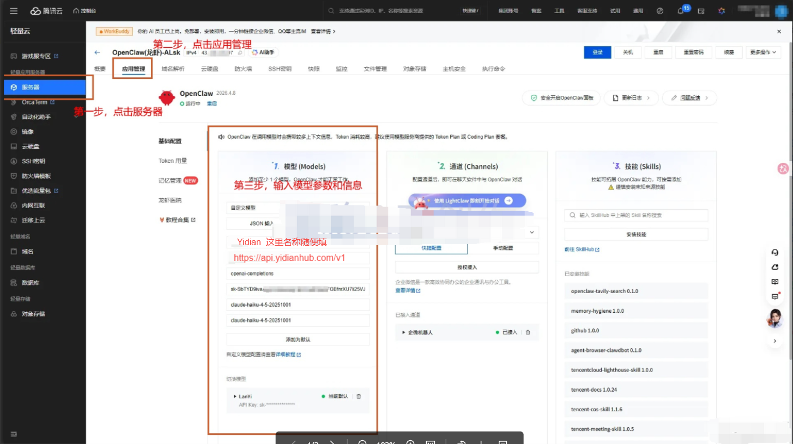

## 表单输入

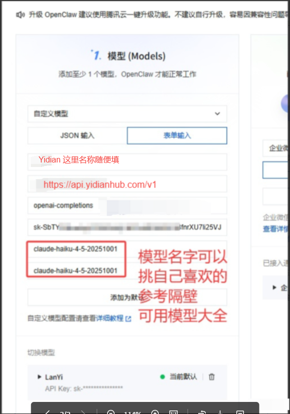

```
# Provider 供应商
Yidian //这里随便填

# base_url 网址
https://api.yidianhub.com/v1

# api API格式
openai-completions

# model id & name 模型id 和 名字 建议统一，三选一即可
claude-haiku-4-5-20251001

claude-sonnet-4-6

claude-opus-4-7
```

## JSON输入

```json
{
  "provider": "Yidian",
  "base_url": "https://api.yidianhub.com/v1",
  "api": "openai-completions",
  "api_key": "sk-*********填入你自己的令牌***************",
  "model": {
    "id": "claude-opus-4-7",
    "name": "claude-opus-4-7"
  }
}
```

# 二、Windows 配置 OpenClaw

*Windows教程仅适用于Windows本机适用，WSL2虚拟机可能会遇到更多不可预料的网络、端口、防火墙等问题，故不建议使用虚拟机部署OpenClaw，最推荐的还是使用Linux和Mac系统。*

## **0️⃣ 配置 ****OpenClaw**

在命令行使用命令进入** ****OpenClaw **初始化

OpenClaw 初始化

```
openclaw onboard
```

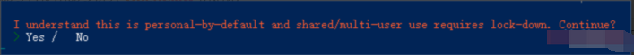

**选 Yes**

Yes ✔ / No

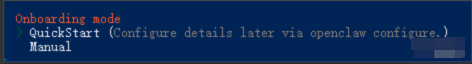

**选第一个 QuickStart**

- ✔QuickStart 快速开始

- Manual

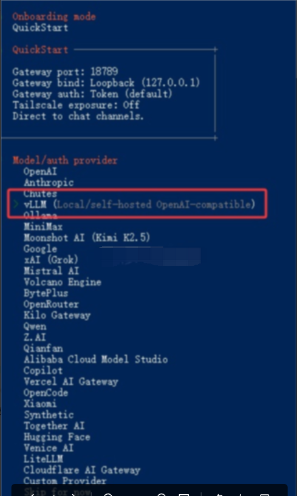

**一般选第三个 ✔ vLLM 供应商**

如果没有 **vLLM **再考虑** Custom Provider**（自定义）

（这种情况可以翻到本教程 第六章 添加/切换模型）

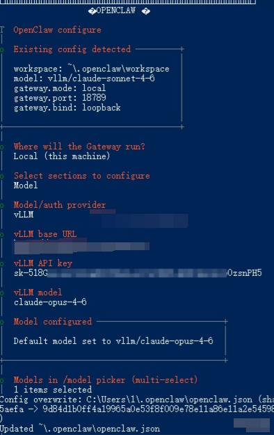

其中base URL，填写一点API：

```
https://api.yidianhub.com/v1
```

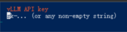

这里填写自己的令牌（API key）（sk- 开头的），然后回车确认即可


模型名称可以参考 🍺 常用模型列表 ，以下列举三种常用模型：

性价比模型

```
claude-haiku-4-5-20251001
```

综合推理模型

```
claude-sonnet-4-6
```

最强模型

```
claude-opus-4-6
```

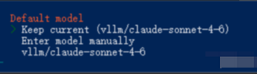

**选第一个就行** **Keep current**

✔ Keep current (保持默认

Enter model manually

vllm/claude-sonnet-4-6

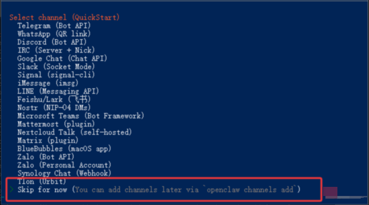

**选最底下那个 Skip for now**

我们先不设置机器人，选最底下的 ✔ Skip for now（现在跳过）

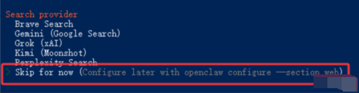

**选最底下那个 Skip for now**

联网搜索供应商，我们也暂且跳过✔ Skip for now（现在跳过）

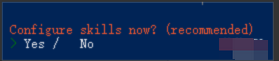

**选第二个 NO**

是否安装额外的 skills 技能？✔ No

我们也不装，先启动起来再说

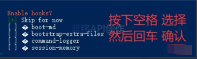

**选第一个 Skip for now**
选择网络钩子（hooks），还是先不选

## 1️⃣ 加载网关

**随后会弹出新页面，是 Gateway 网关 的信息（使用的时候不可关闭），可以不理会**

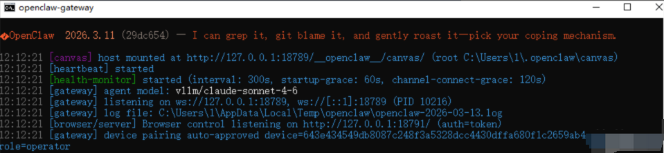

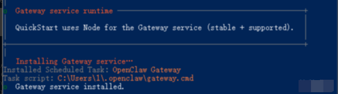

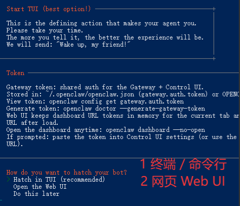

**安装完网关后，会让我们选择启动界面，选择1、2 其中都可以**

✔ Hatch in TUI（在命令行中启动）

✔ Open the Web UI（在网页Web UI中启动）

❌ Do this later （稍后再启动）

我们选择TUI（命令行中测试运行）

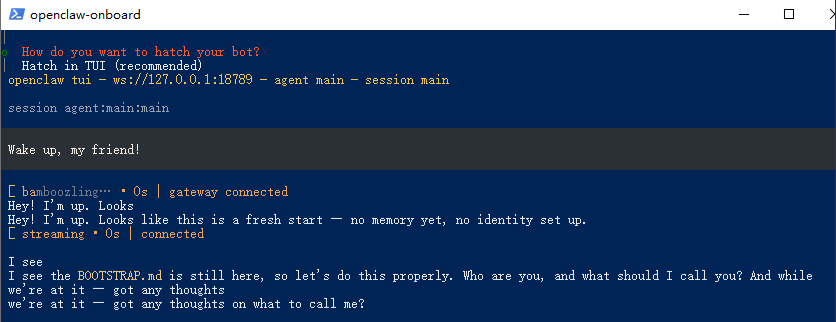

他自动加载了我们刚刚设置好的 vllm/claude-sonnet-4-6 模型

输入一些文字，他就会有回复。

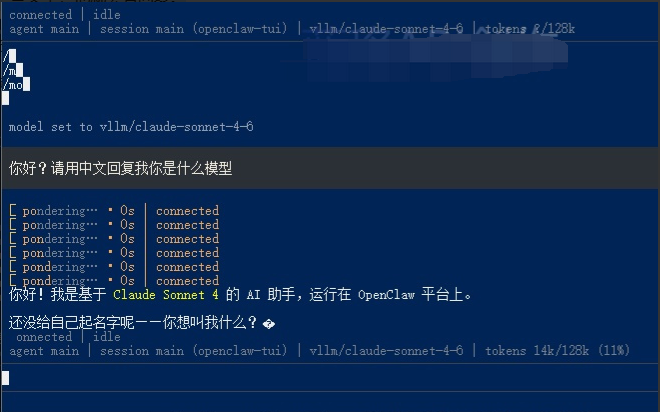

恭喜你！到此为止，你已算安装 OpenClaw 成功

## 2️⃣ 二次启动

如果下次在启动的时候，需要打开两个命令行窗口

一个执行打开网关命令（使用过程不可关闭）：

启动网关

```
openclaw gateway start
```

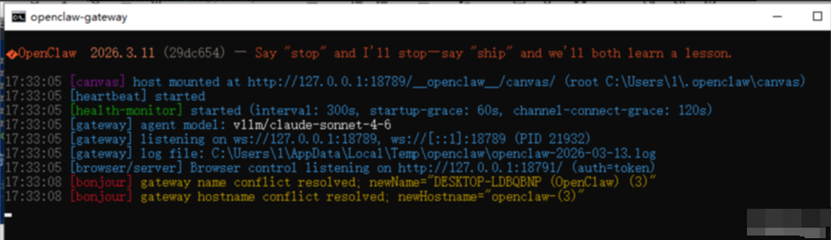

然后再启动命令行

```
openclaw tui
```

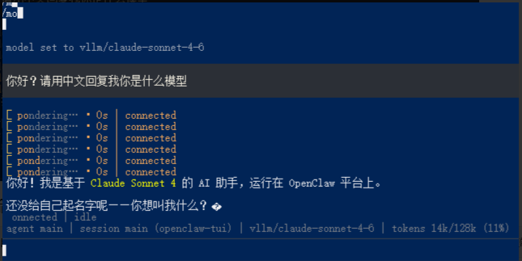

如果命令行能启动但不能回复，那么请使用自动修复命令

自动修复

```
openclaw doctor
```

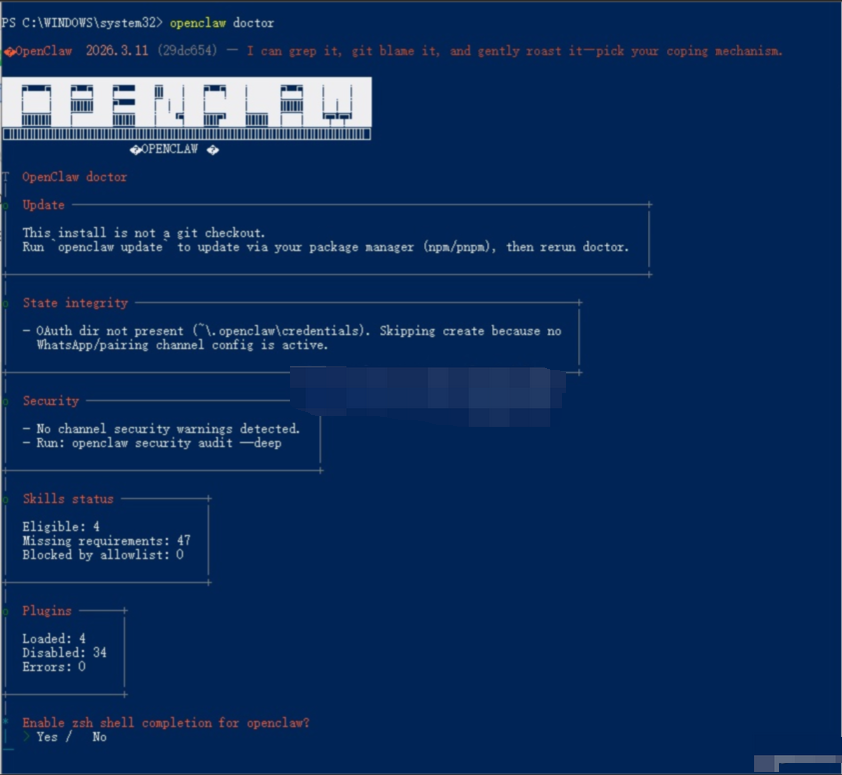

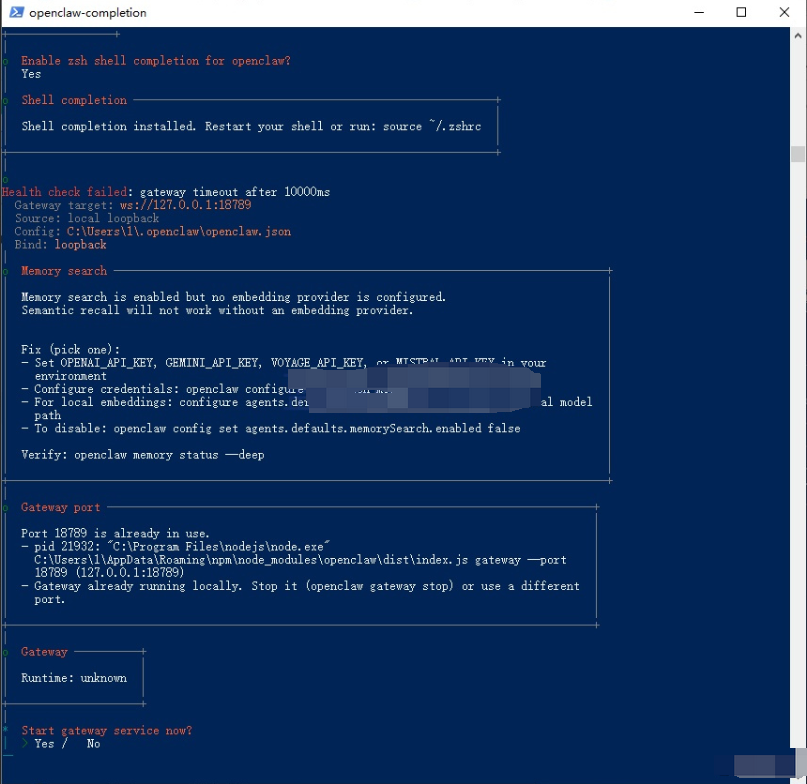

一般不能启动的问题，多为网关问题，在 Start gateway service now？时

选择✔Yes 修复，然后再启动 OpenClaw 即可

# 三、Mac /Linux 配置 OpenClaw

*本教程有多次修订更改，因为OpenClaw版本更新较快，部分内容可能需要客户自行调整*

*命令行基本多端通用，Mac与Linux配置教程合并了，因为本身流程也几乎一模一样*

## 0️⃣ 配置 OpenClaw

进入**OpenClaw **的初始化设置，空格选择，回车确认

```
openclaw onboard
```

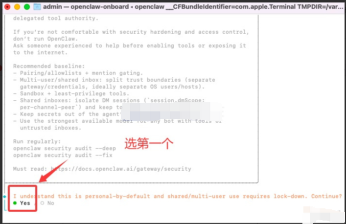

**选 Yes**

Yes ✔ / No

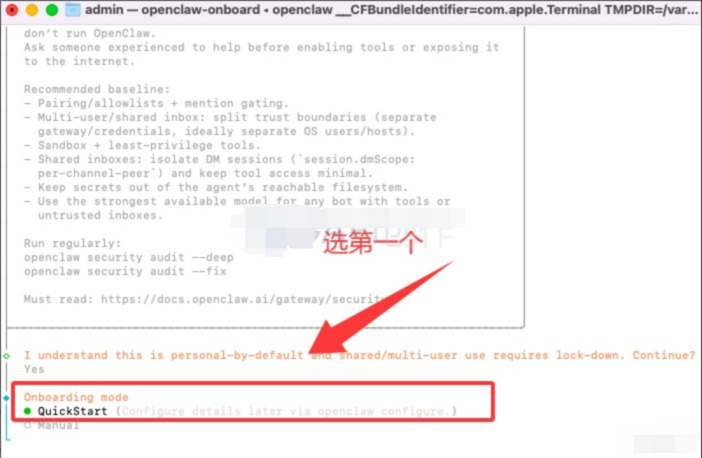

**选第一个 QuickStart**

- ✔QuickStart 快速开始

- Manual

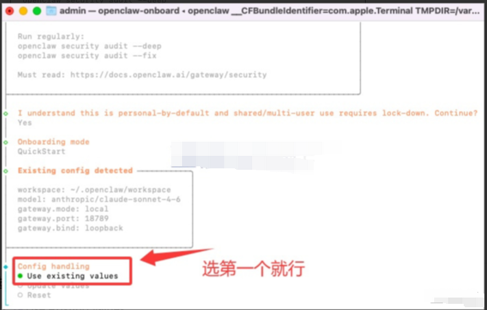

**选第一个 Use existing values**

- ✔Use existing values

- Update values

- Reset

## 1️⃣ Provider 选择

**优先选择**

自定义模型

```
Custom Provider
```

**如图所示**

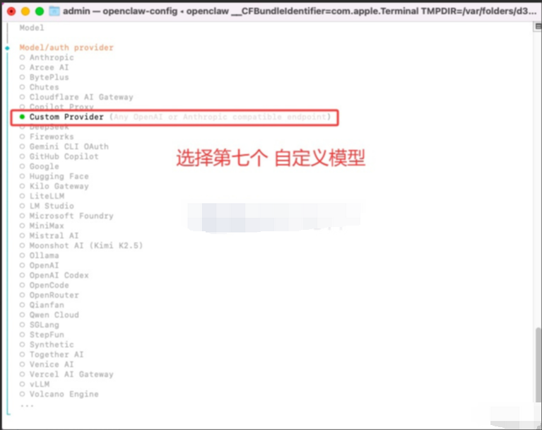

如果不行再考虑：

本地模型

```
vLLM
```

## 2️⃣ 填写URL & APi Key

删掉默认的URL，随后就可以填入我们的URL

我们的URL为：[https://api.yidianhub.com/v1](http%3A%2F%2F1.95.142.151%3A3000%2Fv1)

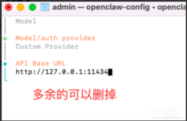

这里填写自己的令牌（API key）（sk- 开头的），然后回车确认即可

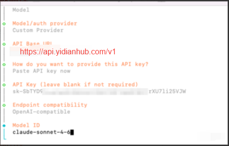

模型名称可以参考 🍺 常用模型列表 ，以下列举三种常用模型：

性价比模型

```
claude-haiku-4-5-20251001
```

综合推理模型

```
claude-sonnet-4-6
```

最强模型

```
claude-opus-4-6
```

Endpoint ID （供应商名称/标识）填 ** Yidian **

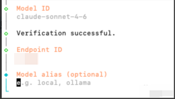

Model alias （模型标识）可填可不填

后续的APP、Skills因为每个人的设置需求都不一样，就不展示了，用户自己选择

## 3️⃣ 选择UI界面

如果前面设置一切正常，那么这一步只要不选第3个都无所谓。

熟悉 **OpenClaw **和有一定代码基础的客户朋友，一般都会选第1个

新手小白、第一次使用和摸索 **OpenClaw **的客户朋友建议选择第2个（网页UI界面）

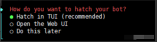

**How do you want to hatch your bot?**
你想用哪种方式来“启动/创建（初始化）”你的 bot？

- **Hatch in TUI (recommended)**
在 **TUI（终端文本界面）**

- **Open the Web UI**
打开 **网页界面**（Web UI）

- **Do this later**
以后再做 / 先跳过

# 四、验证是否连接成功（必做）

*一句话总结版，OpenClaw 本质是 OpenAI API 兼容客户端，只需要把*`URL`* 和*`API_KEY`*模型填写我们提供的模型ID。一般前面步骤没有问题之后，进入网页UI中，可以直接使用对话框进行对话，即可正常使用 ***OpenClaw。**

## ✅ 正常情况

- 发送一句简单对话，例如：“你好，请用一句话介绍你自己”

- **几秒内返回 Claude 风格回复**

- 后台能看到 Token 消耗记录

### 1）Web UI 版（对新人友好）

或者你也可以使用：

启动openclaw网关

```
openclaw gateway
```

然后在网页中输入：

openclaw默认端口

```
http://127.0.0.1:18789/
```

下面以正常启动后的Web UI 网页UI举例图：

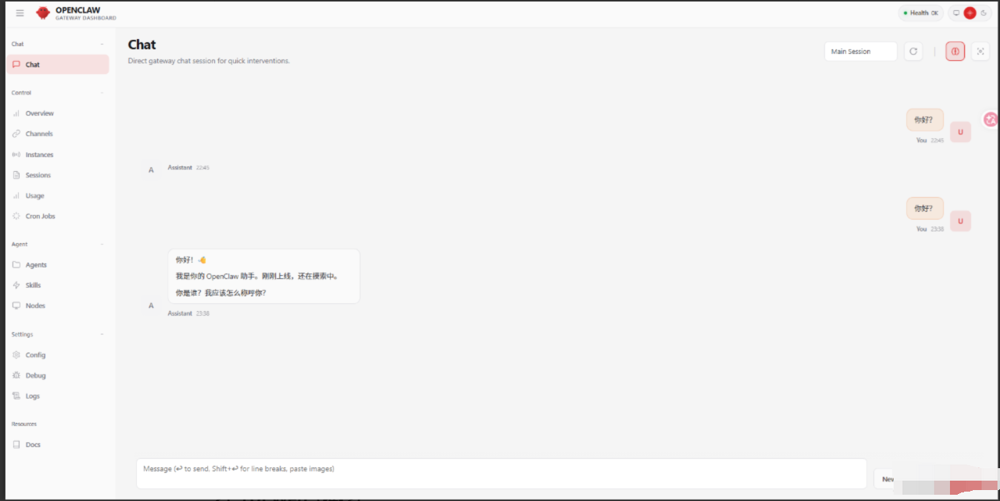

### 2）TUI Web（推荐）

启动命令

```
openclaw tui
```

正常启动后，互动的结果大概如下：

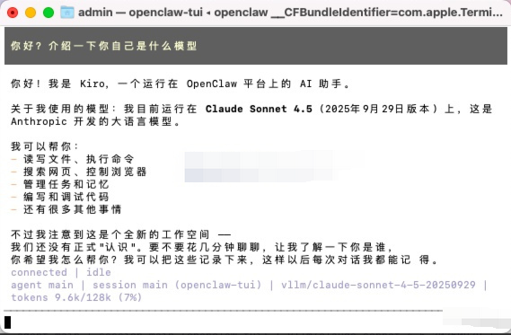

## ❌ 常见报错与解决

### 1️⃣ 401 / Unauthorized

**原因**：

- API Key 错误

- Key 未生效

**解决**：

- 重新复制 Key

- 确认没有多余空格

---

### 2️⃣ 404 / Not Found

**原因**：

- Base URL 没有 `/v1`

✅ 正确示例：

```
https://api.yidianhub.com/v1
```

### 3️⃣ 模型不存在 Model Not Found之类

**原因**：

- 模型ID名称填错/选择Provider不对

**解决**：

- 确认模型是否是跟我们提供的模型ID名称一定一致，且不能有空格！

---

### 4️⃣ Web UI前端没连接

unauthorized: gateway token missing (open the dash board URL and paste the token in Control Ul settings)

**原因**：

- 网页没有获取到token

**解决**：

Linux / MacOs

```bash
grep -n '"token"' ~/.openclaw/openclaw.json | head
```

Windows

```bash
Select-String -Path "$env:USERPROFILE\.openclaw\openclaw.json" -Pattern '"token"' | Select-Object -First 1
```

```bash
findstr /n /c:"\"token\"" "%USERPROFILE%\.openclaw\openclaw.json"
```

**比如：**

http://127.0.0.1:18789/?token=xxxxxxxxxxxxxxxx

---

### 5️⃣ 已断开与网关的连接。

已断开与网关的连接

unauthorized: device token mismatch (rotate/reissue device token)

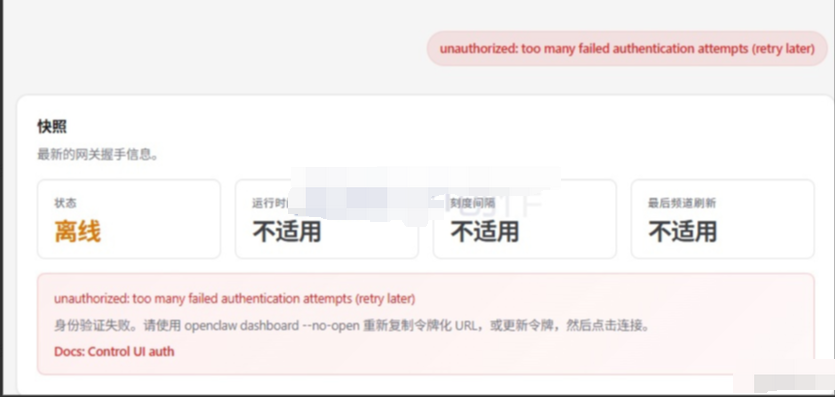

重新复制令牌化url

```
openclaw dashboard --no-open
```

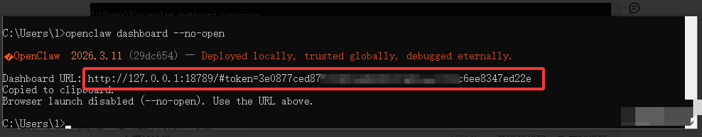

然后复制如图内容到浏览器中，即可打开WebUI

```
http://127.0.0.1:18789/#token=你自己的token
```

# 五、添加/切换模型

## 前言

理论上，方法有三种：

1. 在 命令行/终端 中里面通过 **openclaw config** 设置添加

1. 在 **OpenClaw Web UI** 直接添加新模型

1. 在 命令行/终端 通过修改配置文件添加新模型

一般建议使用方法1和3，较为稳定。方法2有时候会出现很多奇奇怪怪的问题。

---

## 1）在 OpenClaw TUI中添加新模型

进入配置

```
openclaw config
```

云服务器、或者配置表比较特殊的，使用 openclaw config配置时候可以找到隐藏起来的vllm或者custom，如果还没有，只能参考下面的其他方法了在诸多选项中选择 model 配置，然后按照前面的流程配置 model 即可

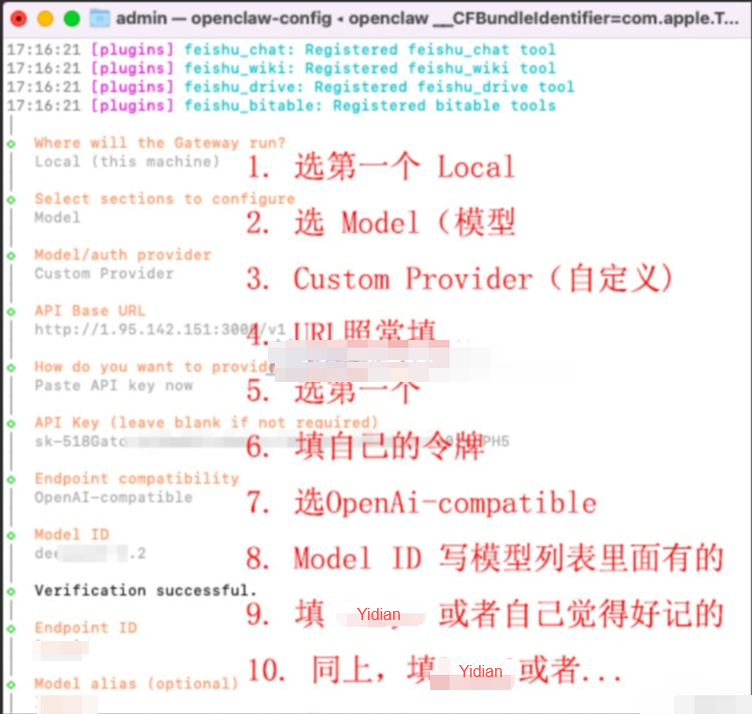

配置完了，选 Continue 退出

然后在终端中用 /model 切换模型选择，回车确认即可

选择模型

```
/model
```

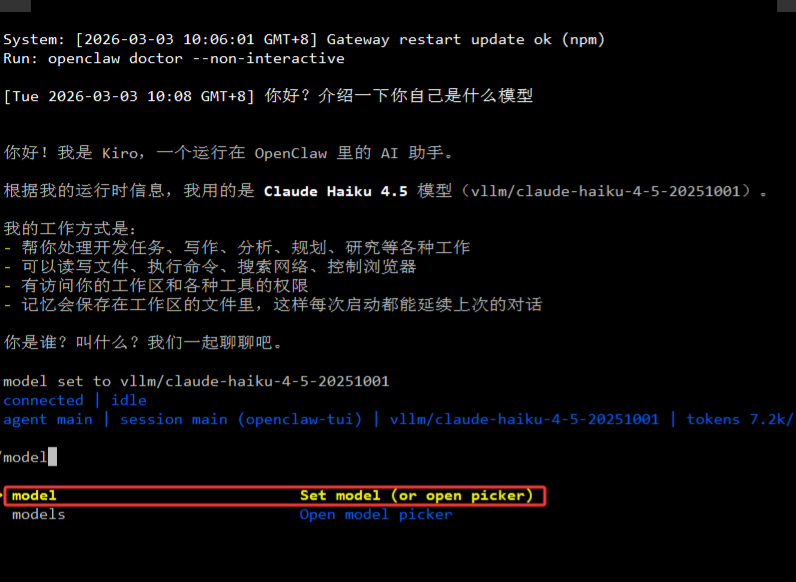

最底下就是我们新加的模型

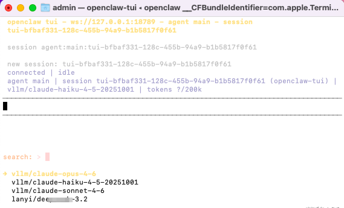

## 2）在命令行终端通过修改配置文件添加新模型

查看模型配置文件所在

```
openclaw models
```

如图所示，可以看到模型的配置文件大概在 ~/.openclaw/openclaw.json 中

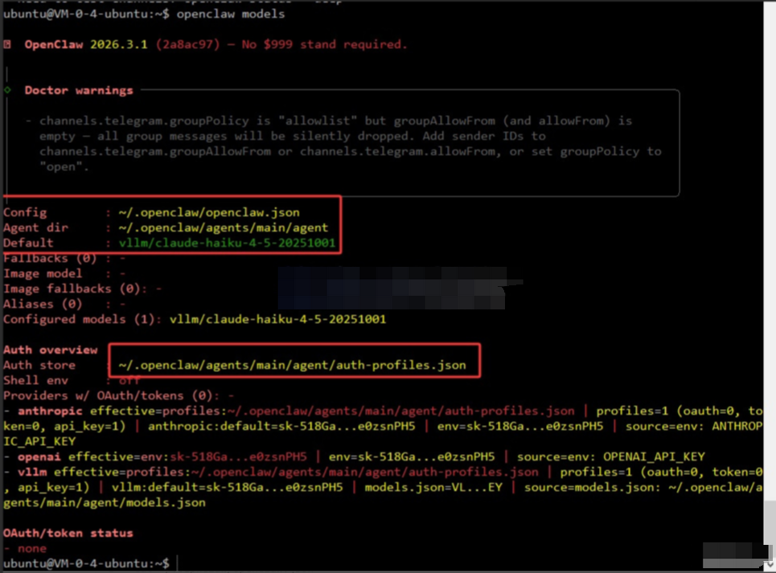

当你启动查看命令查看配置文件的时候，你会发现：

查看openclaw配置单

```
cat ~/.oepnclaw/openclaw.json
```

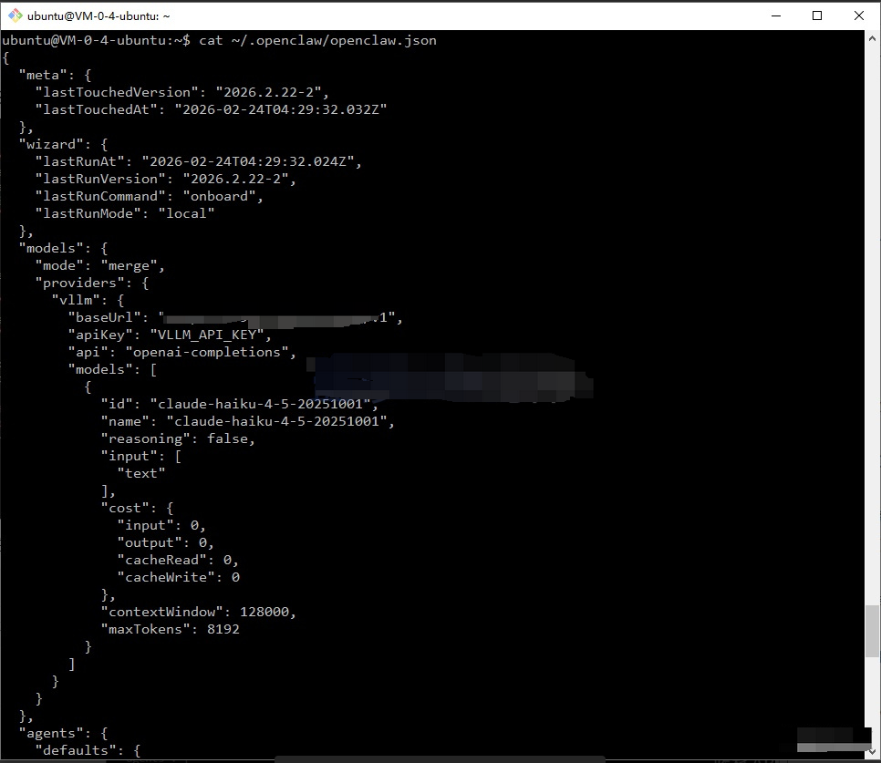

其实这里的文件配置，和OpenClaw Web UI打开的Raw 格式配置单，是一模一样的东西

```json
{
  "meta": {
    "lastTouchedVersion": "2026.2.22-2",
    "lastTouchedAt": "2026-02-24T04:29:32.032Z"
  },
  "wizard": {
    "lastRunAt": "2026-02-24T04:29:32.024Z",
    "lastRunVersion": "2026.2.22-2",
    "lastRunCommand": "onboard",
    "lastRunMode": "local"
  },
  "models": {
    "mode": "merge",
    "providers": {
      "vllm": {
        "baseUrl": "https://api.yidianhub.com/v1",
        "apiKey": "__OPENCLAW_REDACTED__",
        "api": "openai-completions",
        "models": [
          {
            "id": "claude-haiku-4-5-20251001",
            "name": "claude-haiku-4-5-20251001",
            "reasoning": false,
            "input": [
              "text"
            ],
            "cost": {
              "input": 0,
              "output": 0,
              "cacheRead": 0,
              "cacheWrite": 0
            },
            "contextWindow": 128000,
            "maxTokens": 8192
          }
        ]
      }
    }
  },
  "agents": {
    "defaults": {
      "model": {
        "primary": "vllm/claude-haiku-4-5-20251001"
      },
      "models": {
        "vllm/claude-haiku-4-5-20251001": {}
      },
      "workspace": "/home/ubuntu/.openclaw/workspace"
    }
  },
  "commands": {
    "native": "auto",
    "nativeSkills": "auto",
    "restart": true,
    "ownerDisplay": "raw"
  },
  "session": {
    "dmScope": "per-channel-peer"
  },
  "hooks": {
    "internal": {
      "enabled": true,
      "entries": {
        "boot-md": {
          "enabled": true
        },
        "bootstrap-extra-files": {
          "enabled": true
        },
        "command-logger": {
          "enabled": true
        },
        "session-memory": {
          "enabled": true
        }
      }
    }
  },
  "channels": {
    "telegram": {
      "enabled": true,
      "dmPolicy": "pairing",
      "groupPolicy": "allowlist",
      "streaming": "off"
    }
  },
  "gateway": {
    "port": 18789,
    "mode": "local",
    "bind": "loopback",
    "auth": {
      "mode": "token",
      "token": "__OPENCLAW_REDACTED__"
    },
    "tailscale": {
      "mode": "off",
      "resetOnExit": false
    },
    "nodes": {
      "denyCommands": [
        "camera.snap",
        "camera.clip",
        "screen.record",
        "calendar.add",
        "contacts.add",
        "reminders.add"
      ]
    }
  }
}
```

***以上JSON配置单仅供参考，用户未必能运行，作者也暂未通过此方式成功配置/添加新模型。还请用户自行摸索探究。***

如果你想修改的话

```
vim ~/.oepnclaw/openclaw.json
```
