# 一、简介

***OpenCode**** 是一个开源的 AI 驱动本地开发工具，可与多种模型引擎（如 OpenAI、Claude、Gemini 等）对接，提供 ****代码生成、解释、补全、重构、测试辅助**** 等功能，简化开发流程。*

*本教程有参考 *[*OpenCode官方指南*](https%3A%2F%2Fopencode.ai%2Fdocs%2Fzh-cn)

# 二、下载安装

## ✅ 1. 选择操作系统

前往OpenCode下载页面：[https://opencode.ai/download](https%3A%2F%2Fopencode.ai%2Fdownload)

根据你的系统选择对应版本：

- **Windows**

- **macOS**

- **Linux**

点击下载后，解压或安装即可。

一般 Windows 是 `.exe` 或 `.zip`，macOS 是 `.pkg` 或 `.zip`，Linux 通常是 `.tar.gz`。

# 三、启动&配置

1. 安装完毕后打开 **OpenCode 应用**

1. 初次使用会提示你 **配置模型引擎和 API key**

1. 输入你选择的服务提供商（Provider）的 **API Key**（如 OpenAI、Anthropic 等）

1. 选择默认模型（如 GPT-4、Claude 2、Gemini Pro）

1. 配置后点击“保存 & 测试”，对话后，确认连接成功

## 1️⃣ Windows 桌面UI版

连接提供商

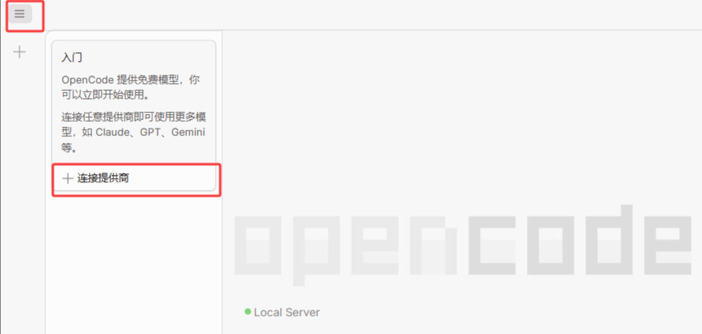

安装完成后，会有如上图界面，此时直接点击 **连接供应商** 即可。

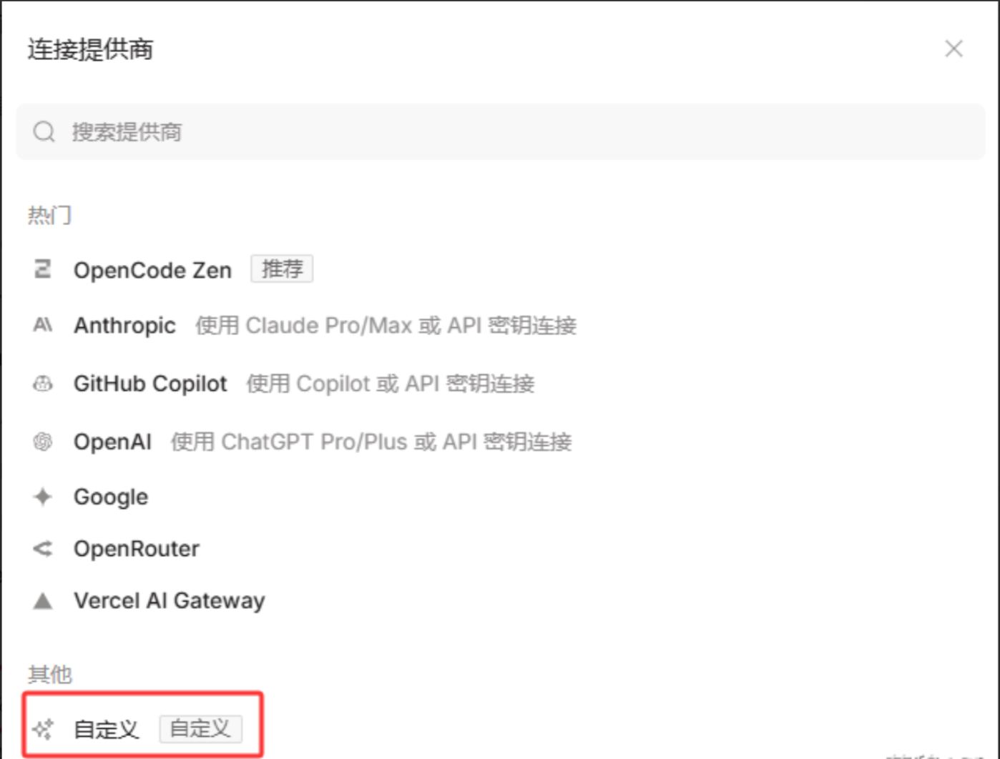

在弹出的界面中，找到 **自定义 。**

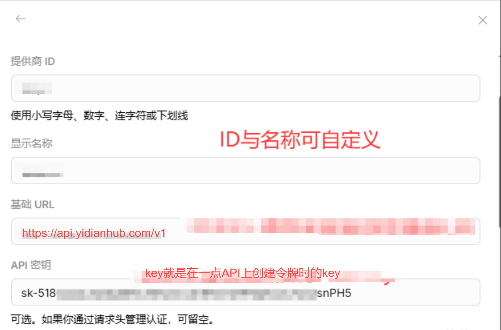

基本情况如示例图所说，URL可以填写 https://api.yidianhub.com/v1** **，API-Key 密钥是 **sk-** 开头的，❗ **千万不要有空格** ❗ 。

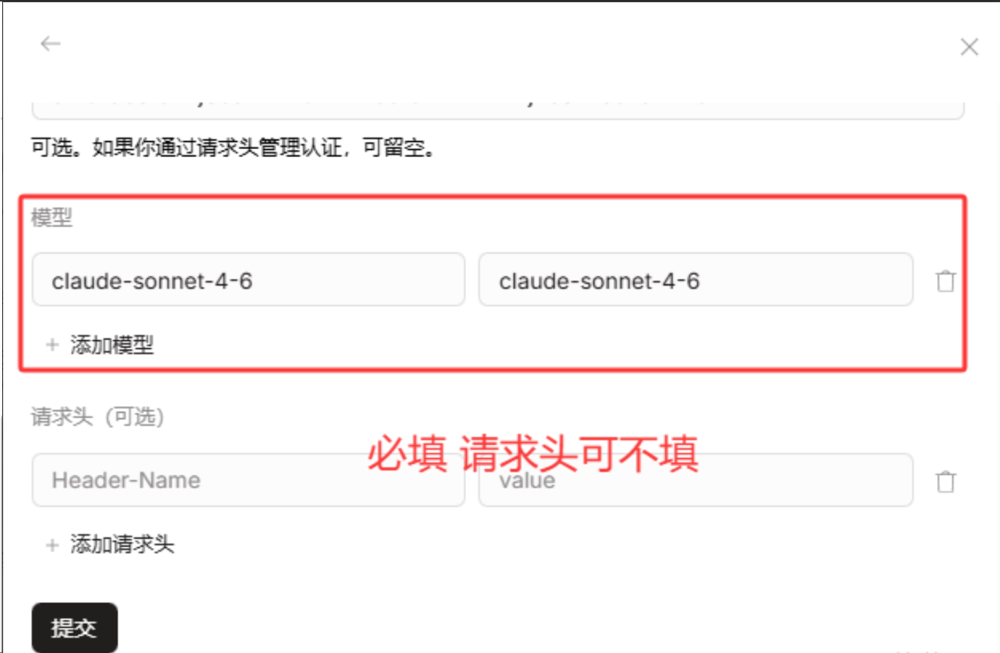

填写完各项后，直接点击最底下的** 提交 **即可运行。（当然你也可以同时配置多个模型，让你的事务解决的更快），随后点击对话框，就会变化成如下界面，❗ **发送你好，可以正常对话（很重要）就没问题了 **❗

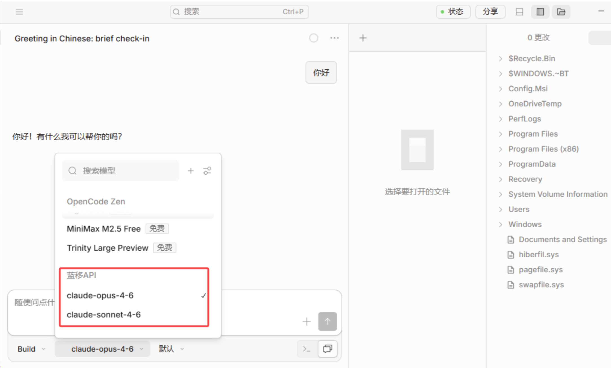

## 2️⃣ Linux 命令行版本

*本教程一定程度上参考*[*OpenCode 官网教程*](https%3A%2F%2Fopencode.ai%2F)

### 1 安装Node.js

#### 方法一：使用官方仓库（推荐）

```bash
sudo apt-get install -y nodejs
```

#### 方法二：使用系统包管理器

虽然版本可能不是最新的，但对于基本使用已经足够：

```bash
sudo apt update
sudo apt install nodejs npm
```

**⚠Linux 注意事项**

某些发行版可能需要安装额外的依赖

如果遇到权限问题，使用 `sudo`

确保你的用户在 npm 的全局目录有写权限

安装完成后，验证安装是否成功，打开终端，输入以下命令：

```bash
node --version
npm --version
```

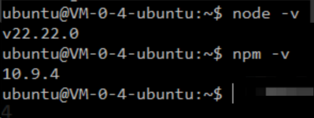

如果显示版本号，说明安装成功了！

### 2 安装OpenCode CLI

1. 通过NPM安装（比较通用成功率高）

```bash
npm i -g opencode-ai
```

1. 或者通过安装脚本进行安装（有时候会报错）。

```bash
curl -fsSL https://opencode.ai/install | bash
```

---

**安装完成后，使用命令启动 Open Code，可以发送一些字体进行验证**

```
opencode
```

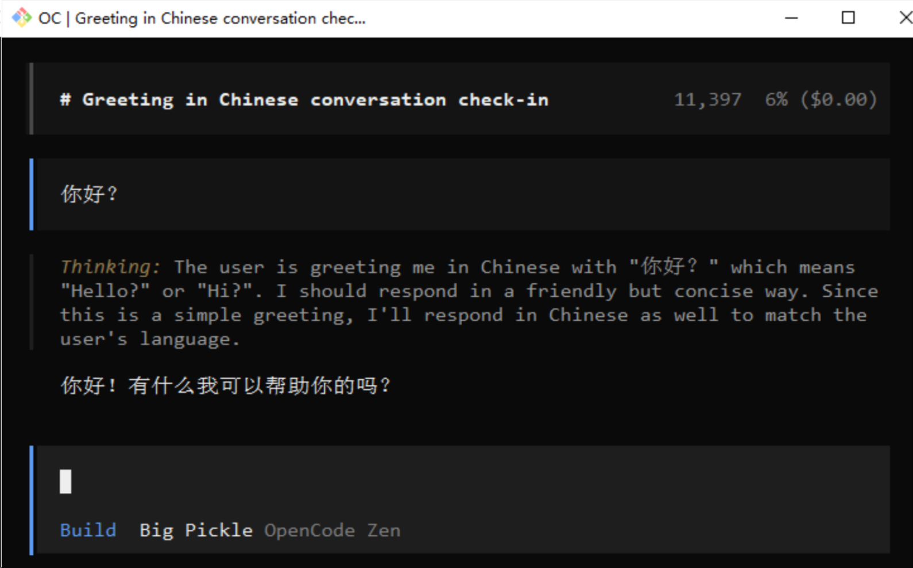

### 3 配置模型和API

#### 3-1）方法1 通过CC-Switch配置

❗ OpenCode 没有提供Provides 供应商和协议，故需要在 CC-Switch 中配置好才会有下列界面

输入 /models 然后按下回车进行确认：

```
/models
```

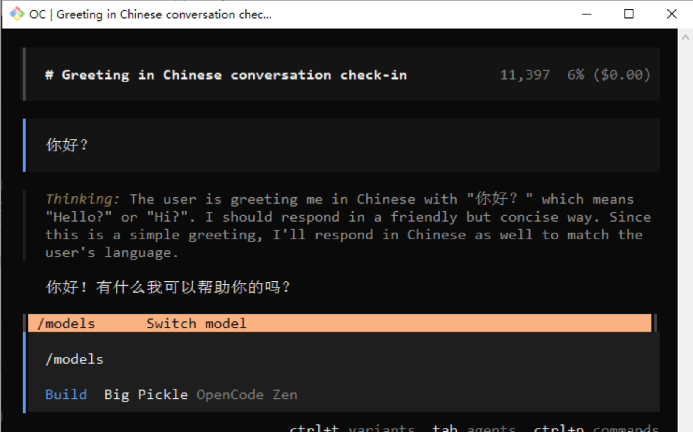

上下

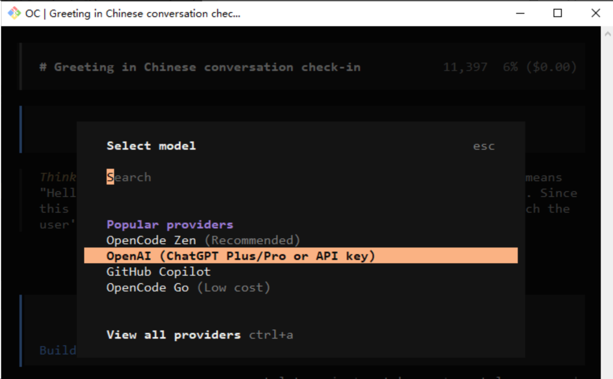

找到并选择我们配置好的API

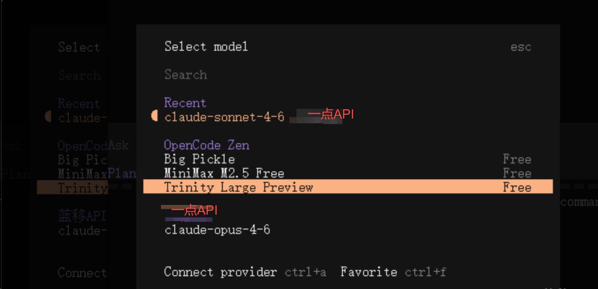

#### 3-2）方法2 通过配置文件配置

一般可以用一些查看文件内容：

```vb
type %USERPROFILE%\.config\opencode\opencode.json
```

```bash
Get-Content $HOME\.config\opencode\opencode.json
```

```bash
cat ~/.config/opencode/opencode.json
```

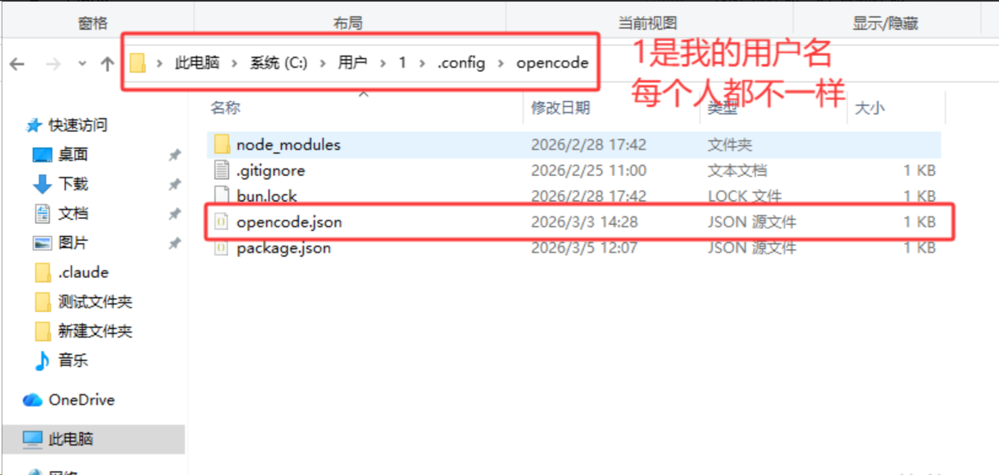

---

随后可以通过命令行进行JSON编辑

```bash
vim ~/.config/opencode/opencode.json
```

大概如图（仅供参考）

opencode.json

```json
{
  "provider": {
    "YiDian": {
      "npm": "@ai-sdk/openai-compatible",
      "name": "YiDian",
      "options": {
        "baseURL": "https://api.yidianhub.com/v1",
        "apiKey": "填写自己的API令牌"
      },
      "models": {
        "claude-haiku-4-5-20251001": {
          "name": "claude-haiku-4-5-20251001"
        },
        "claude-sonnet-4-6": {
          "name": "claude-sonnet-4-6"
        },
        "claude-opus-4-7": {
          "name": "claude-opus-4-7"
        }
      }
    }
  }
}
```

# 四、基本使用指南

## 👨‍💻 1. 创建新项目 / 打开代码目录

打开你要操作的代码仓库。然后让AI接管你的文件。

推荐实践：

✔ 为不同项目设置独立配置

✔ 在 VS Code 等编辑器中结合插件提升效率

✔ 给常用提示语写成模板提高重复使用率

## 🧠 2. 调用 AI 功能

在编辑器/界面中你可使用以下功能：


---

# 五、常见问题

## 可选模型

```markdown
# Haiku
# 快速响应模型
  claude-haiku-4-5-20251001
  
# Sonnet
# 综合、推理
  claude-sonnet-4-20250514-thinking
  claude-sonnet-4-5-20250929-thinking
  claude-sonnet-4-5-20250929
  claude-sonnet-4-6

# Opus
# 偏思考模型、适合各种疑难杂症
  claude-opus-4-5-20251101-thinking
  claude-opus-4-5-20251101
  claude-opus-4-6
  claude-opus-4-7
  claude-opus-4-8

# Fable
# 仅支持在vip分组中使用
  claude-fable-5

# 1m 上下文特殊模型
# Claude Code和Claude客户端专用
# 测试阶段，尽可能通过 /model 或者软件自带设置去选择
# 和原模型同价格，但可能会因为读取更多上下文消耗更大
  claude-sonnet-4-6[1m]
  claude-opus-4-6[1m]
  claude-opus-4-7[1m]
  claude-opus-4-8[1m]
```
