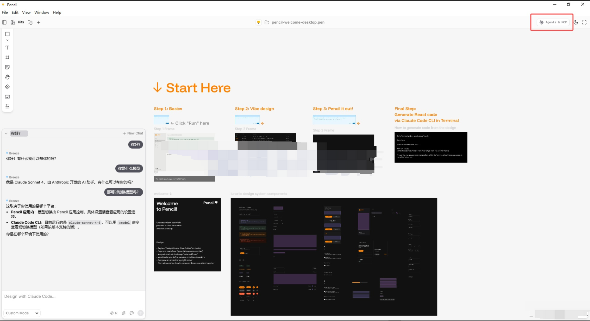
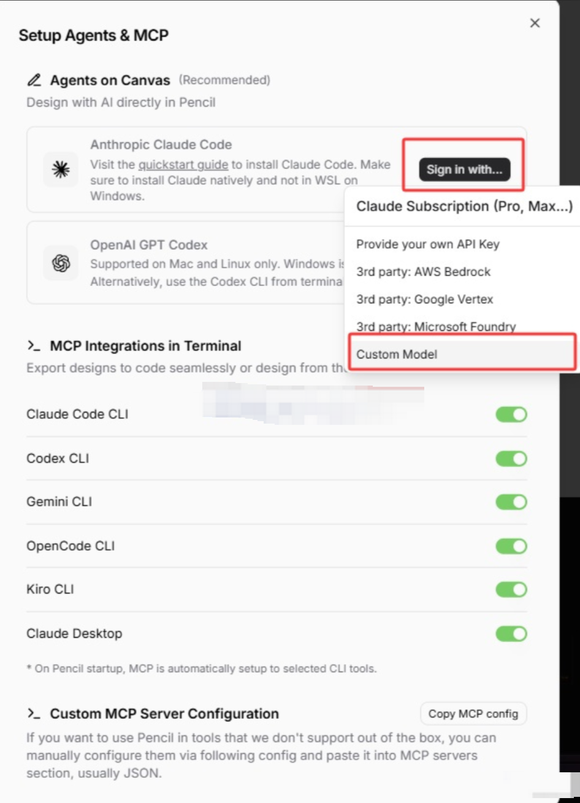
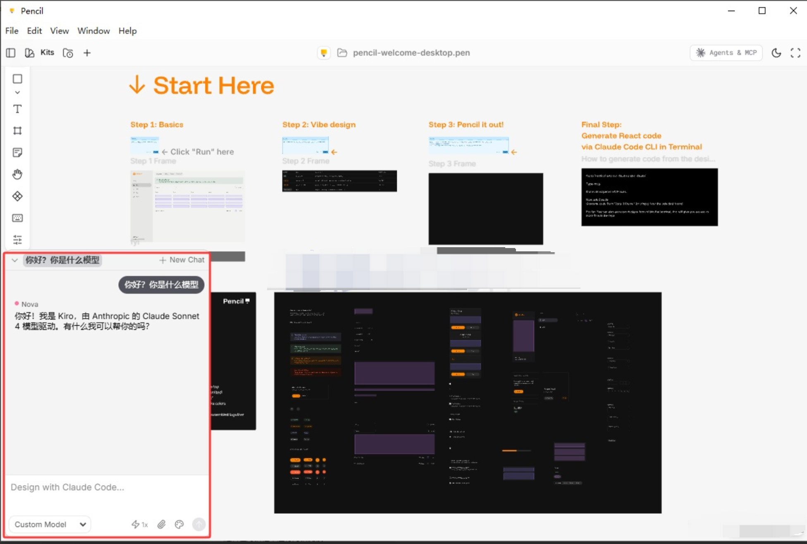
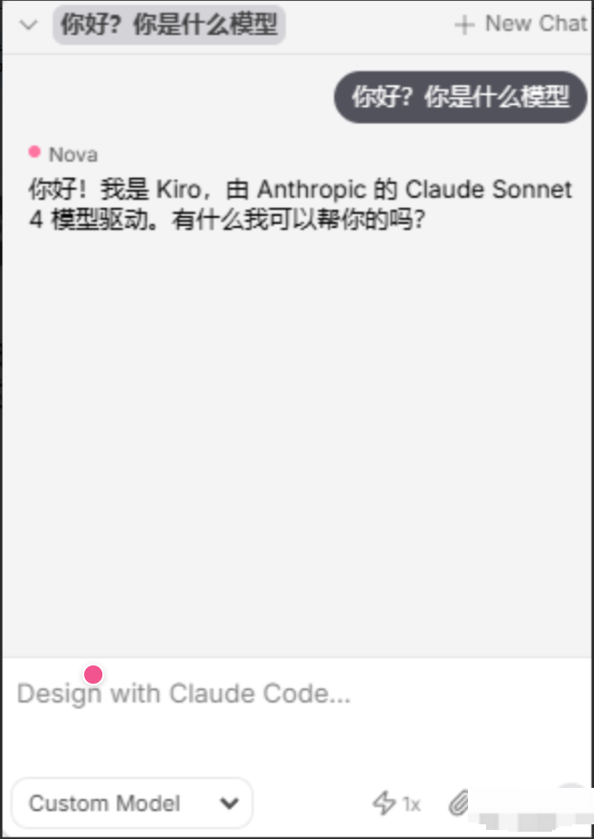
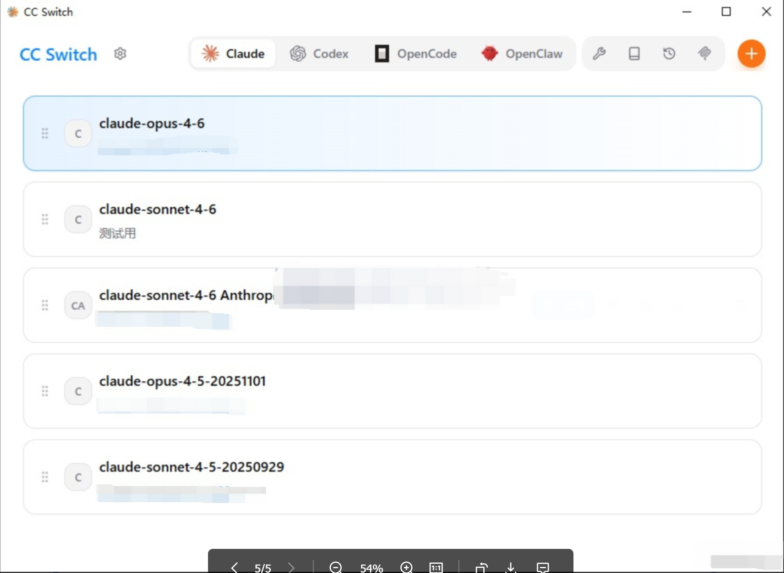

**Claude Code（CC）安装**

**使用Pencil之前，得先安装 **

**Claude Code（搭载API）+CC-Switch（管理模型）**

安装教程参见：

- 📘 Claude Code Windows版 使用教程

- 📘 Claude Code Mac版使用教程

- 🚀 CC Switch 简明使用指南

# Pencil 下载地址

[Pencil 下载官网](https%3A%2F%2Fwww.pencil.dev%2Fdownloads)

或者在各大编辑器里面下载Pencil插件

# Pencil 安装和配置

在官方下载Pencil安装好之后，大概有如下界面，选择右上角进行配置 Agents 和 MCP

在展开的节目中，选择 “**Sign in with ...**”（登陆选项） - 选择“**Custom Model**”（自定义模型），即可搭载我们的API

随后在对话框中进行对话测试

输入你好，有正常对话反馈就算正常

# 添加/切换模型

在CC-Switch中配置ClaudeCode即可

切换模型后，需要重启Pencil才能生效
