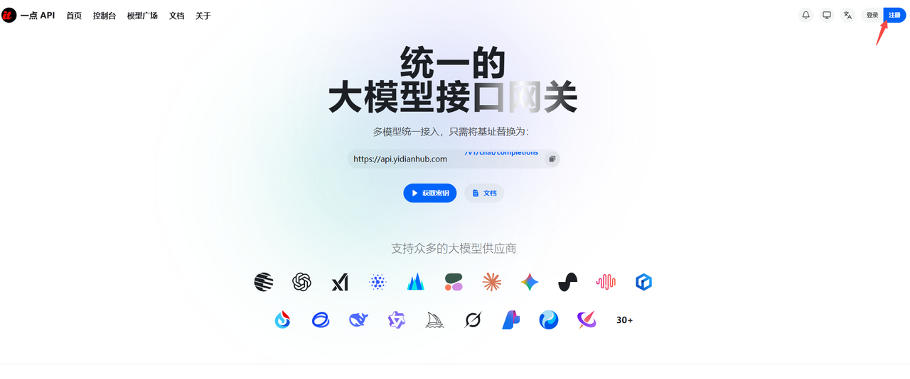
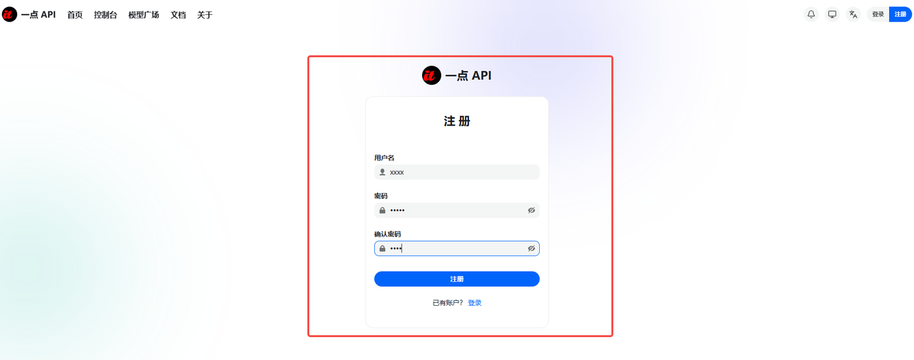
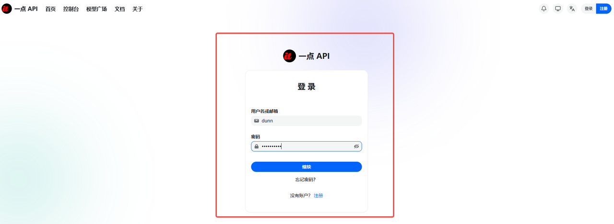
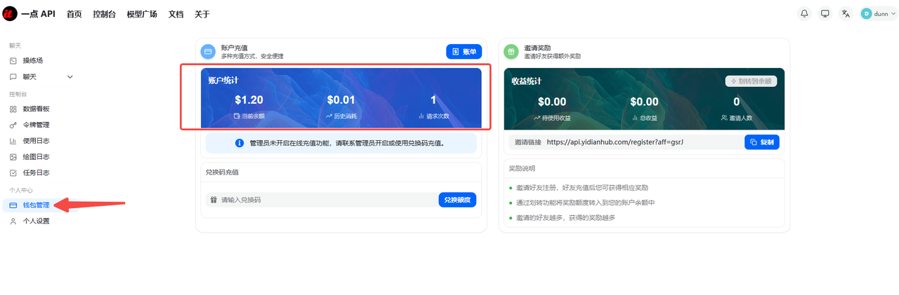
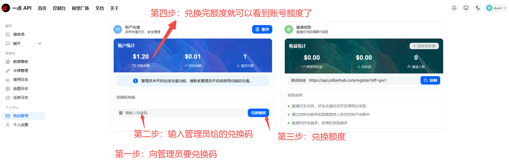
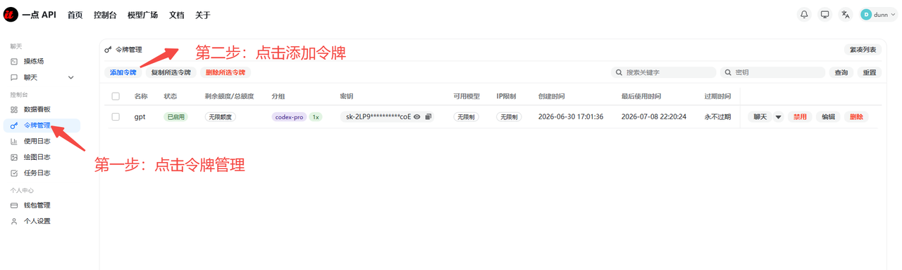
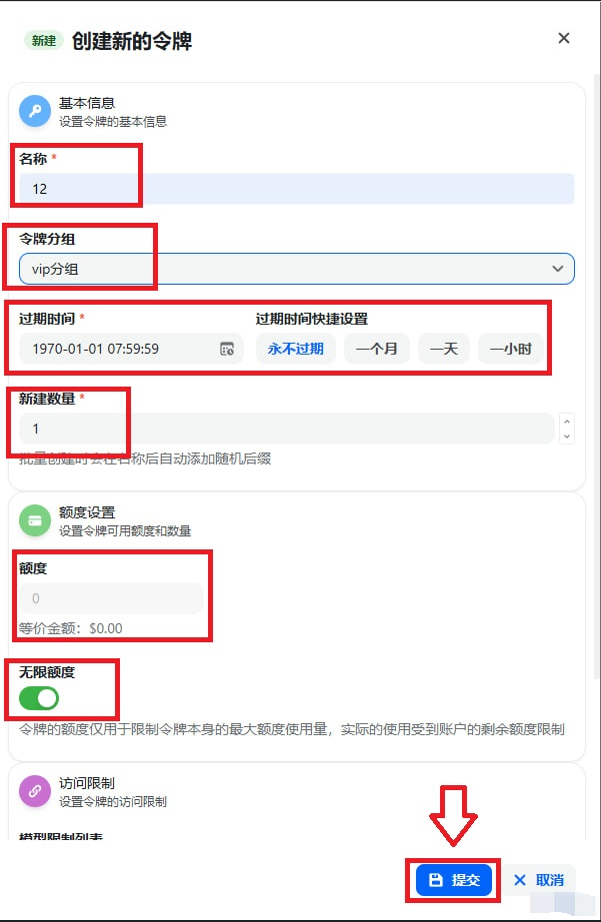
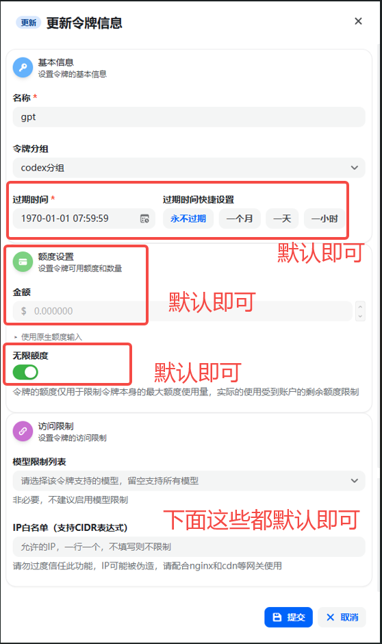
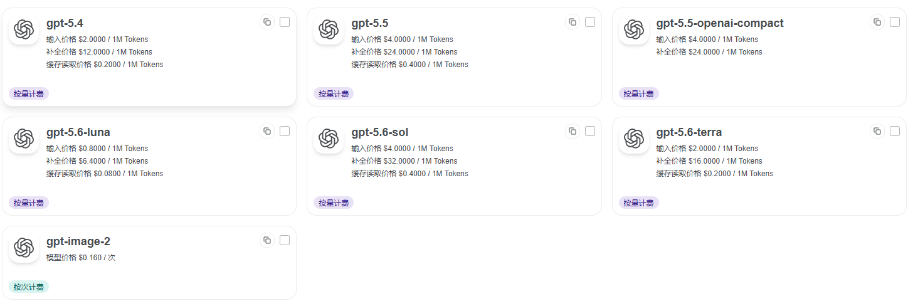
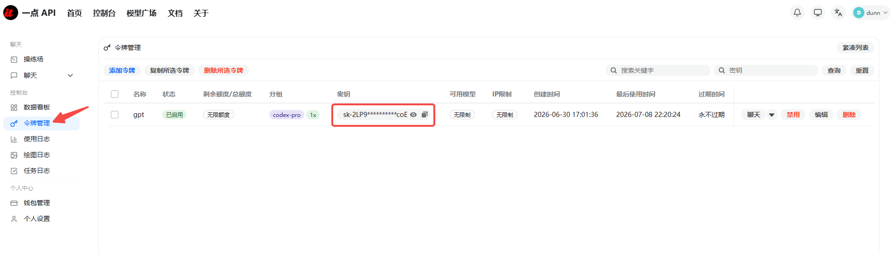

首先在浏览器中打开一点API的网址：

[https://api.yidianhub.com/](https://api.yidianhub.com/)

## 一、注册登录账户



第一步：注册一个账户根据个人喜好填写，用户名,密码 （一定要记住用户名，不然找回不了）



第二步：注册完之后登陆刚刚注册好的账户



## 二、登录后领取令牌

第一步：点击钱包管理，查看当前账号额度



第二步：兑换额度



兑换完之后你会看到当前额度

## 三、创建令牌，也即key

第一步：点击令牌管理，然后点击添加令牌



打开添加令牌之后

名称：随便填

令牌分组：可以根据自己需求选择default/codex/codex-pro分组，推荐就使用codex分组，性价比最高

```text
default分组：一些供体验的免费模型
codex分组：0.8倍率的GPT模型
codex-pro分组：1倍率的GPT模型，因为线路更稳，所以是1倍率
```

过期时间：默认

新建数量：默认

额度设置：默认

无限额度：默认

最后一步点击提交





到这里，key就创建完成了。

## 四、模型须知

如果你创建令牌的时候，选择的是codex、codex-pro分组，那么你能使用目前Chat gpt的主流模型



## 五、外部软件工具接入一点API

外部软件工具、智能体使用模型，不外乎就是登录官方账号，或者接入key使用。我们这种是属于接入key使用的方式。

第一步：在令牌管理中，你可以复制你的key



第二步：关于base url

我们的base url是：

`base_url = "https://api.yidianhub.com/v1"`

下面给出codex的配置案例：

```text
model_provider = "OpenAI"
model = "gpt-5.6-sol"
model_reasoning_effort = "high"
disable_response_storage = true
network_access = "enabled"
windows_wsl_setup_acknowledged = true
model_context_window = 1000000
model_auto_compact_token_limit = 900000

[model_providers.OpenAI]
name = "YiDian"
base_url = "https://api.yidianhub.com/v1"
wire_api = "responses"
requires_openai_auth = true
```
