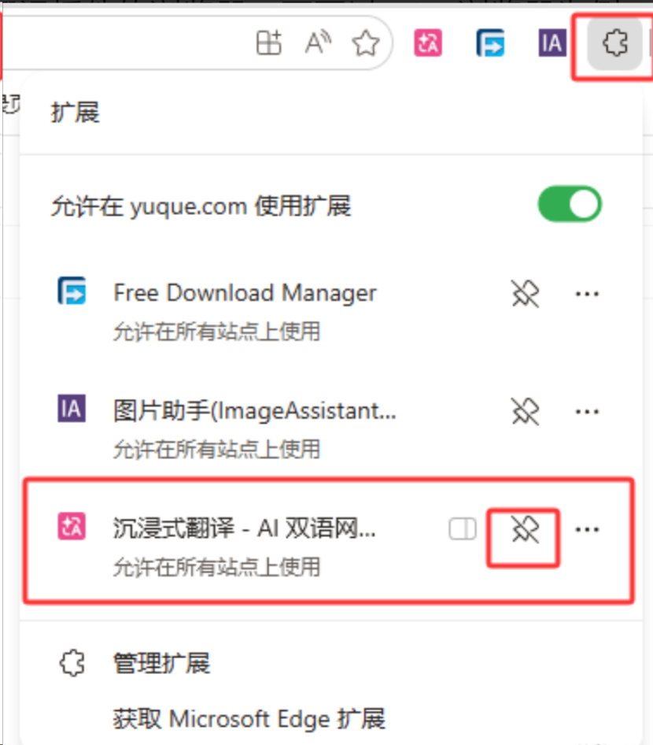
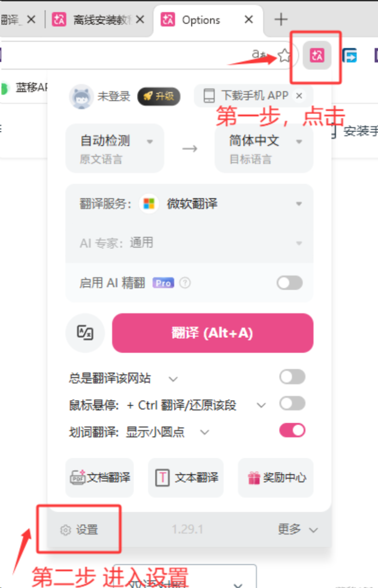
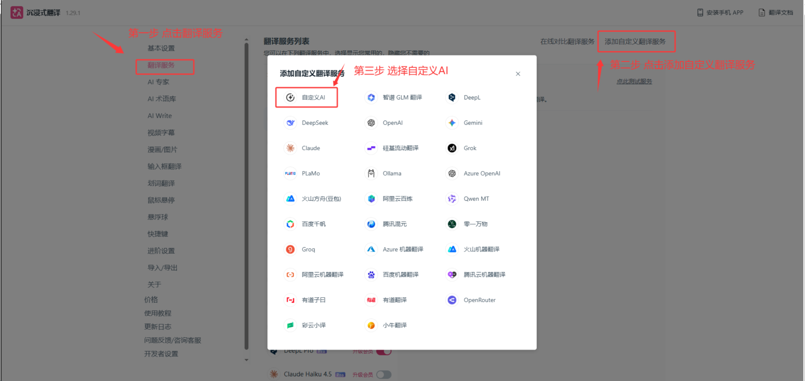
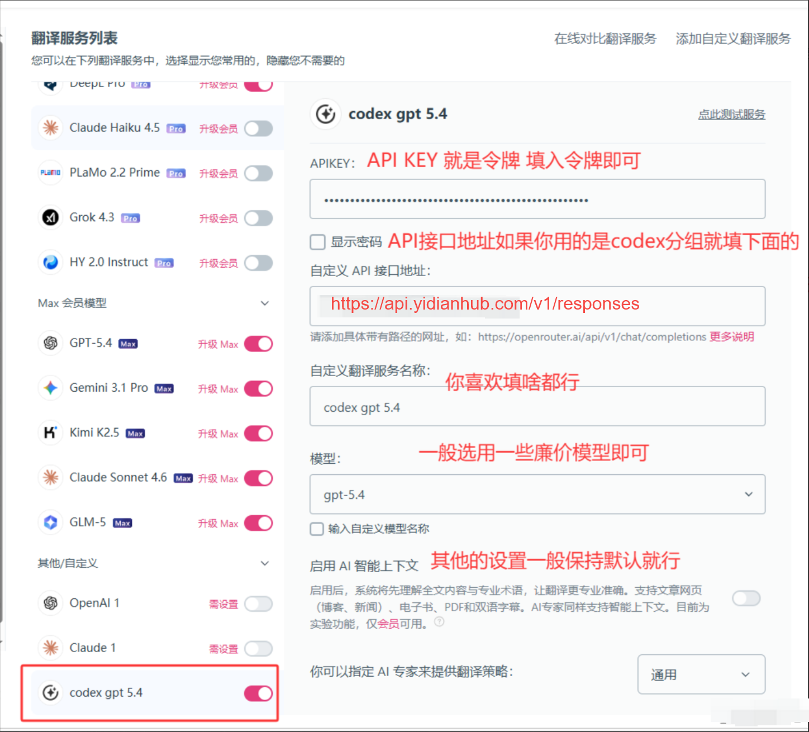
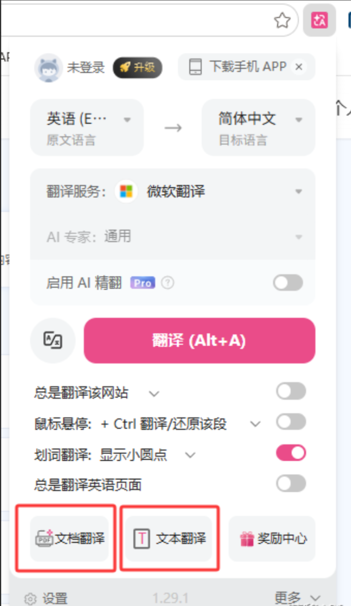
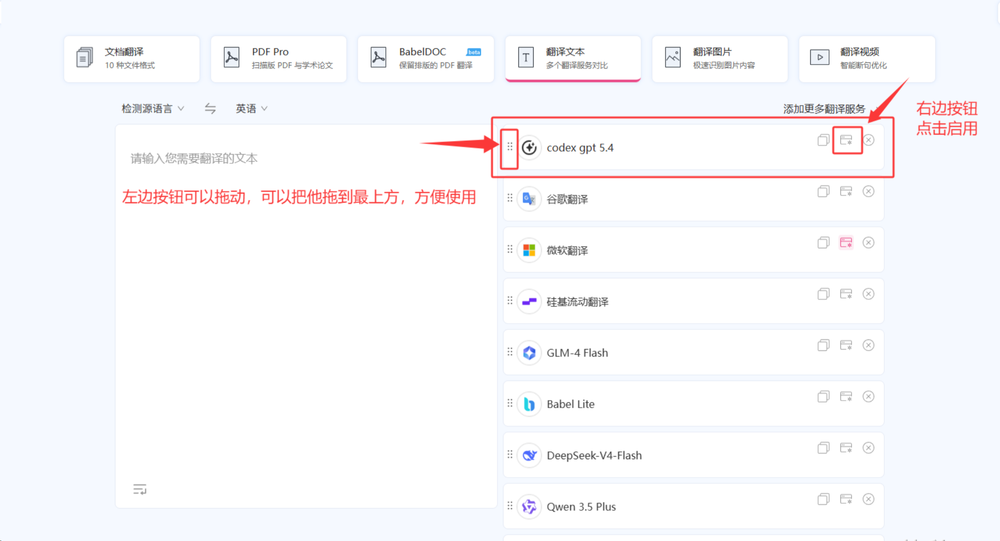
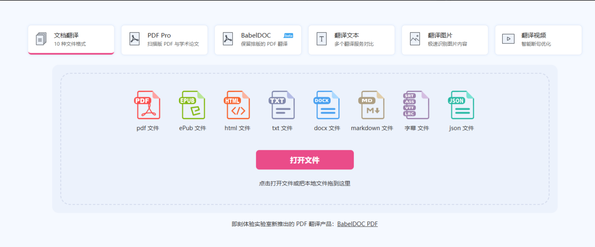
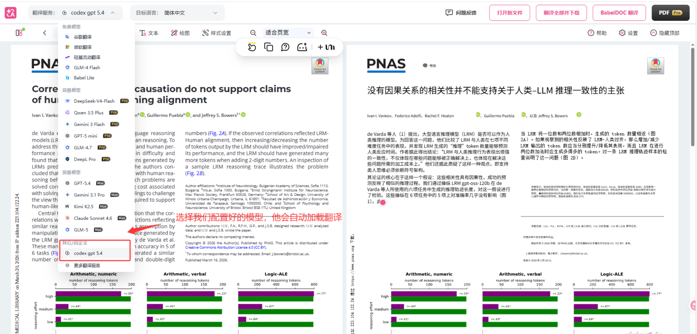

# 前言

本教程默认用户已经安装好沉浸式翻译插件

[沉浸式翻译官网 ](https%3A%2F%2Fwww.immersivetranslate.net%2Fzip-install)[https://www.immersivetranslate.net/zip-install](https%3A%2F%2Fwww.immersivetranslate.net%2Fzip-install)

# 配置

## 打开设置

打开你安装好沉浸式翻译插件的浏览器，下面以Edge浏览器为例，你大概可以通过以下的一些方式找到插件





无论哪一种，找到插件，打开设置按钮

## 配置API





codex分组专用

```
https://api.yidianhub.com/v1/responses
```

几乎通用

```
https://api.yidianhub.com/v1/chat/completions
```

模型建议

```
# codex 分组下的 gpt-5.4 极致性价比
gpt-5.4

# 低价分组下的 haiku 高性价比
claude-haiku-4-5-20251001
```

填写完毕后，就可以了。你要选择什么功能，你就点击哪个就行了



## 翻译文本

点击翻译文本功能后，会跳转到如下界面，找到我们配置好的API翻译就可以使用了。



## 翻译文档

翻译文档更简单了，打开后有如下界面



把文件拖进去，选择我们设置好的API翻译，就能自动加载翻译了


