# 下载TRAE Work

https://www.trae.cn/work

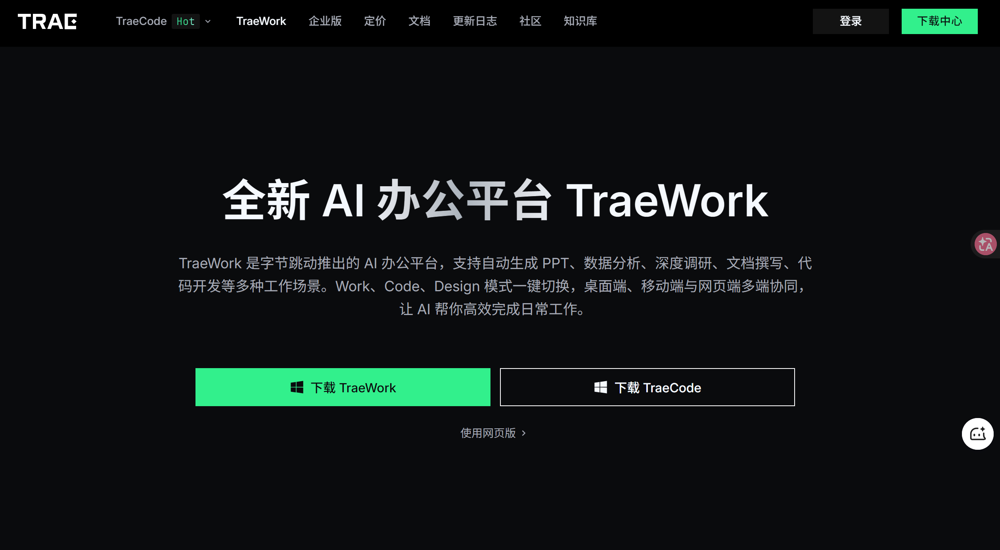

# 给 TRAE Work 换心脏

会话页面 模型选择中 添加模型

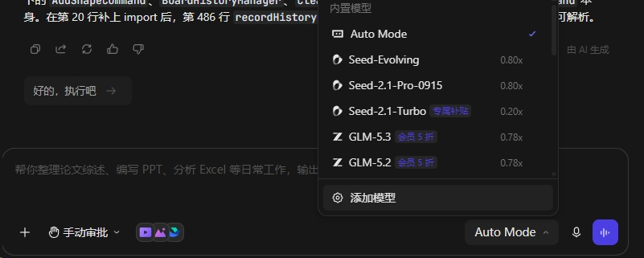

或者 设置/模型/添加模型

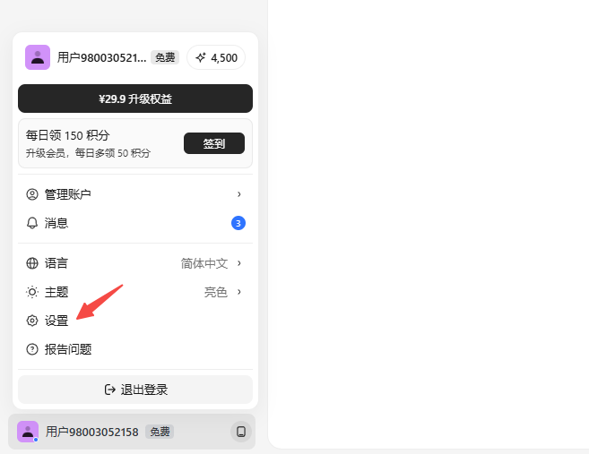

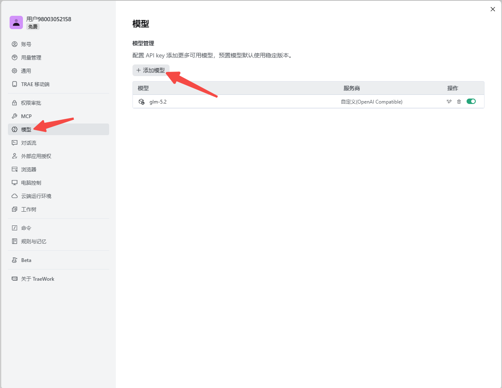

使用glm-5.3模型

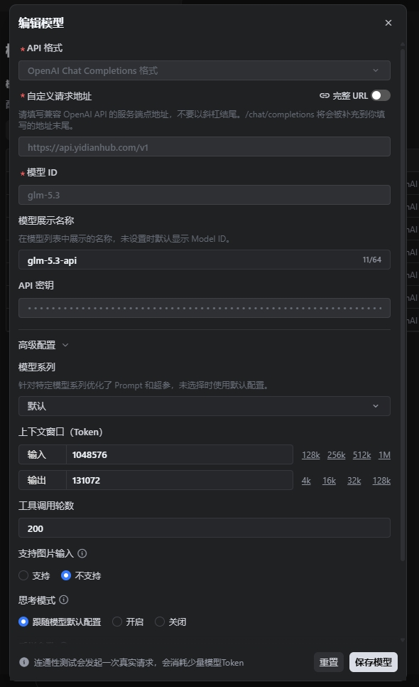

使用hy4-preview模型

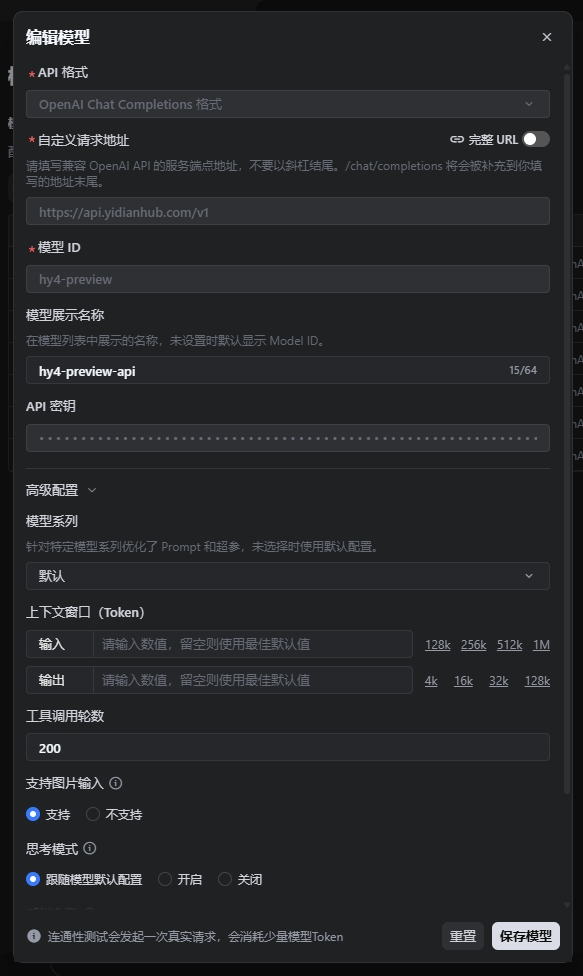

使用kimi-k3模型

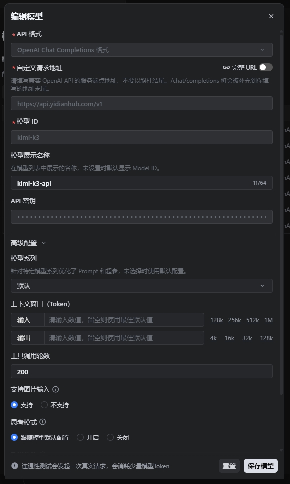

使用minimax-m3模型

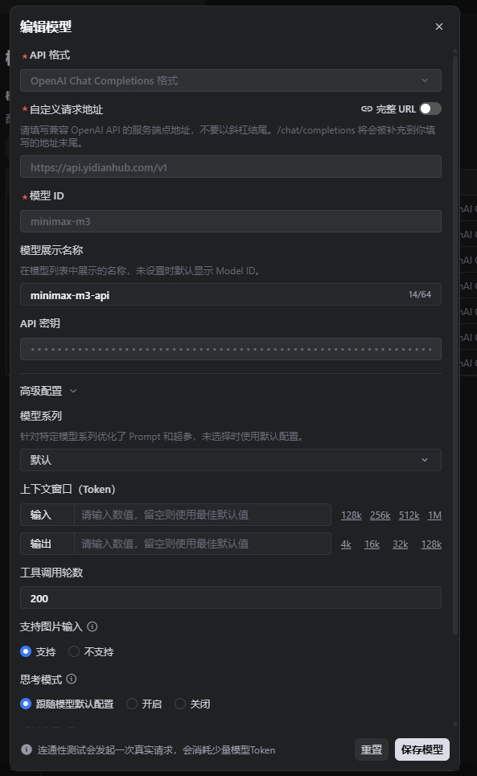

使用deepseek/deepseek-flash模型

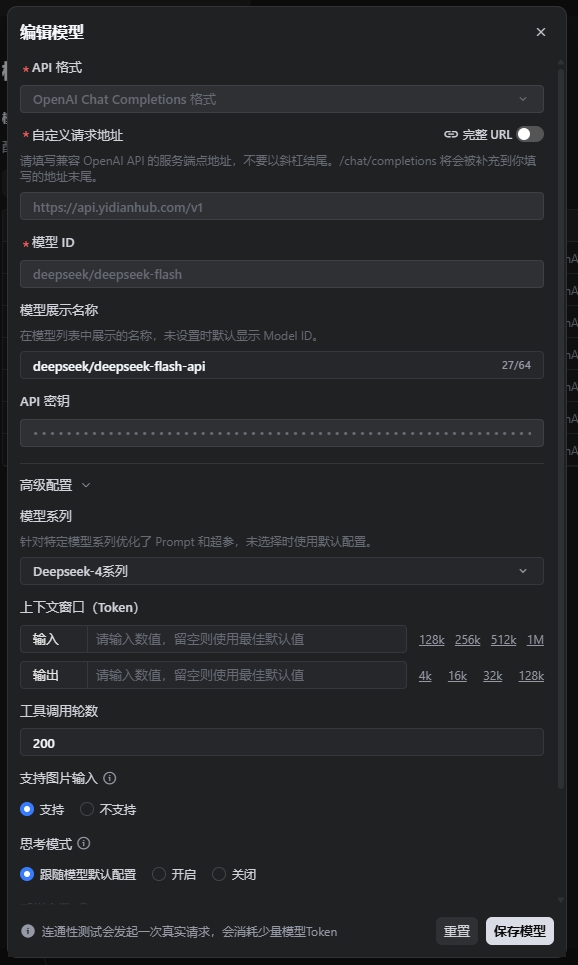

使用gpt-5.6-sol模型

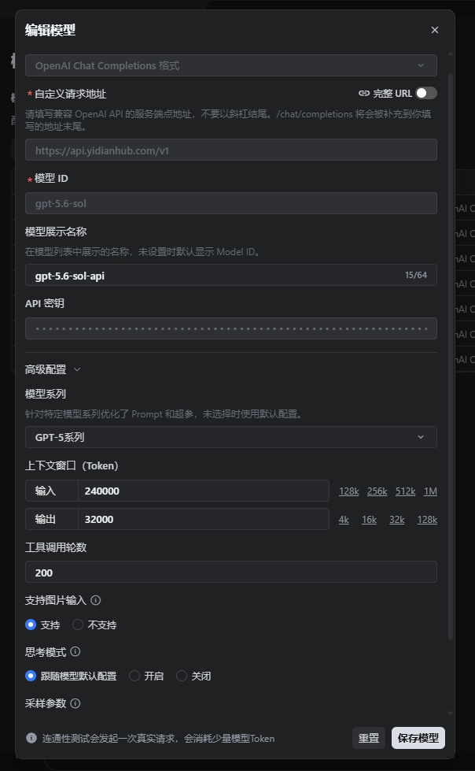

最终在会话页面 模型中看到所有添加的模型，且使用中可以随意切换模型使用

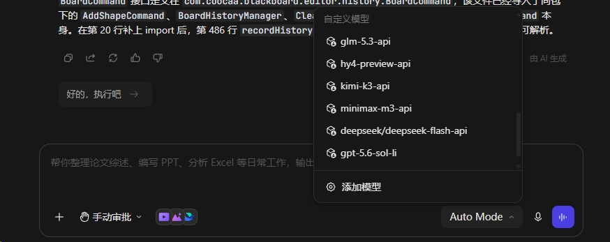
