# Trae  配置教程

本教程默认观看者拥有可以登录Trae的账号（谷歌账号/GitHub账号）

本教程不支持配置 CodeX 分组以及 CodeX Pro 分组的模型

# Trae IDE

## 1. 事前准备

**在开始之前，请确保你手边已经有了令牌**

**API Key (密钥)：这个是您在令牌创建的时候的key**

## 2. 安装Trae

此处 **Trae 为国际版**，下载地址为 [Trae 国际版官网（](https%3A%2F%2Fwww.trae.ai%2Fdownload)[https://www.trae.ai/download](https%3A%2F%2Fwww.trae.ai%2Fdownload)[）](https%3A%2F%2Fwww.trae.ai%2Fdownload)

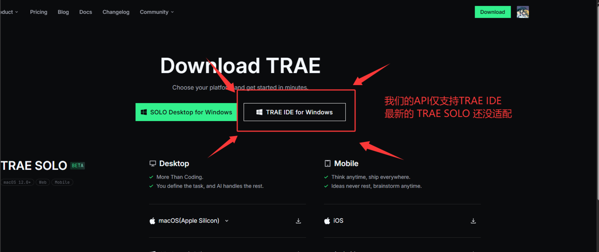

在浏览器右上角打开下载界面，打开 Trae 的安装包

开始安装，基本默认下一步就行了

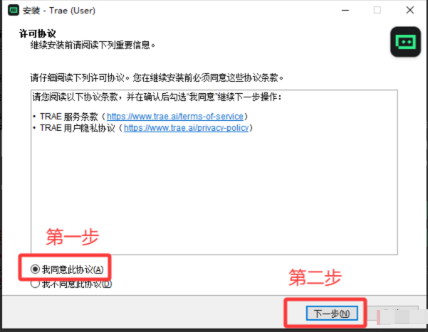

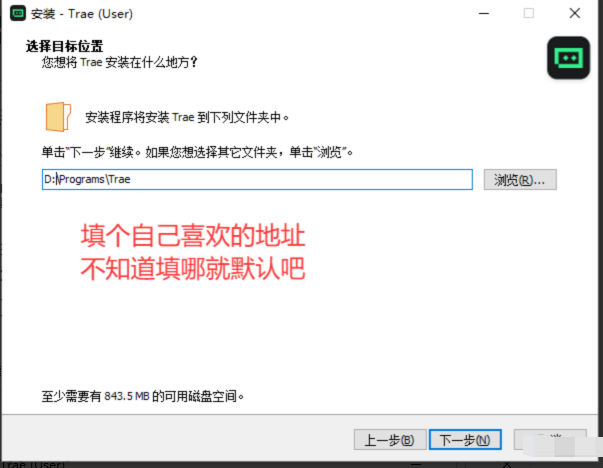

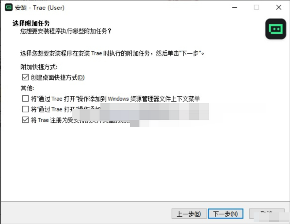

**默认下一步直到安装完成即可**

## 3. 配置API以及模型

打开Trae后，可以看到类似界面，登录自己的账号

本教程默认客户拥有可以登录Trae的账号（github或者谷歌）

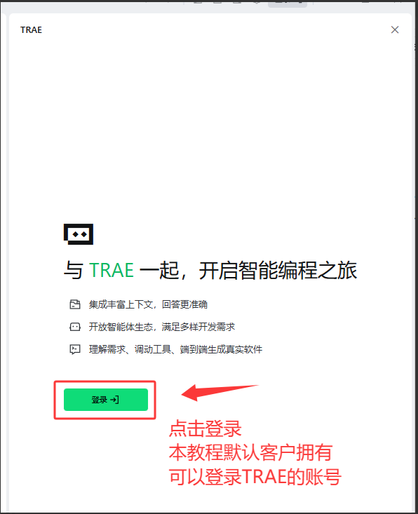

这里我已经登录过账号了，所以直接登录就行。没登录过的，可能要自己想办法去处理Github或者Google账号。

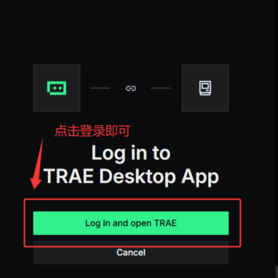

登录过后，可以在Trae里面看到类似下图的界面，这时候我们先创建一个 Agent 智能体，后续才能配置模型。

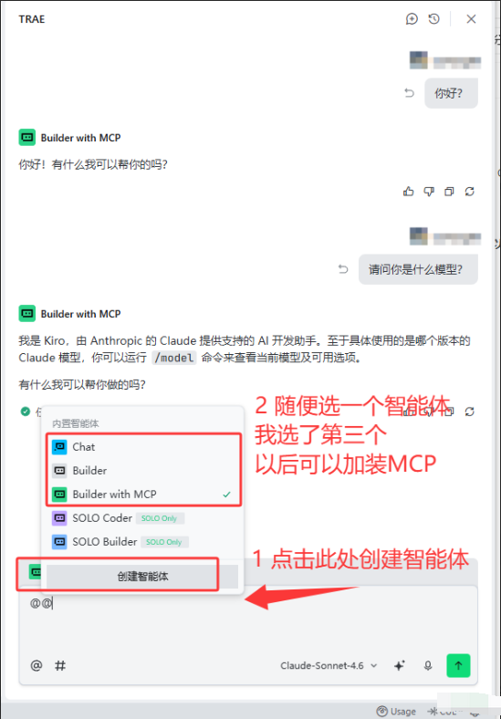

创建好智能体之后，继续下右下方选择“添加模型”。

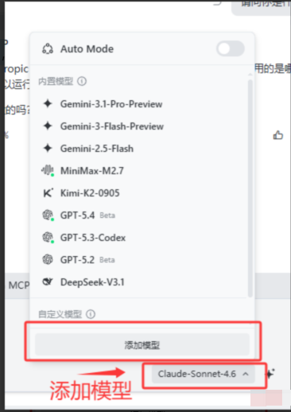

配置内容如下图

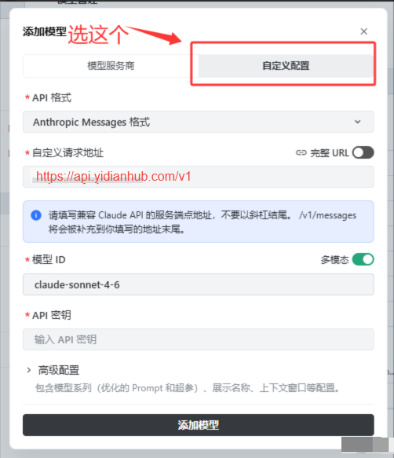

文章开篇就提到过令牌，API 密钥就是令牌，大概像上图示范那样，sk开头的。

自定义请求地址，就是我们官网（https://api.yidianhub.com）+请求路径（/v1/messages），下面可以直接复制。

自定义请求地址

```
https://api.yidianhub.com/v1
```

模型 ID在下面挑一个自己喜欢的就行，不知道用什么就用 claude-sonnet-5

模型 ID

```
claude-sonnet-5
```

模型 ID

```
# Haiku
claude-haiku-4-5-20251001

# Sonnet
claude-sonnet-4-6
claude-sonnet-5

# Opus  
claude-opus-4-6
claude-opus-4-7
claude-opus-4-8
claude-opus-5
```

配置完成后，添加模型，然后回到对话窗口。把自动模式给关了，我们手动选择我们刚刚配置好的模型。

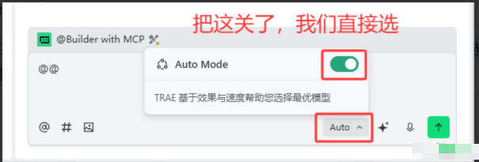

关闭之后，我们往下滑就可以看到我们刚刚配置好的自定义模型，然后我们点击选中他，就可以回到对话框尝试对话。

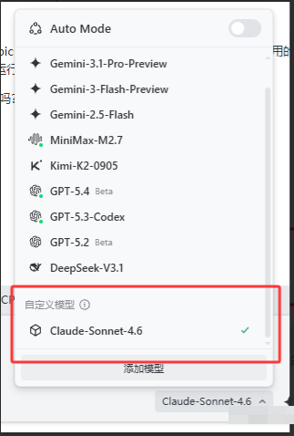

## 4. 测试对话

发送你好，询问什么模型，大概能得到如下回答。就算配置成功。

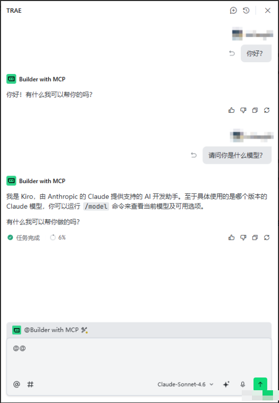

# TRAE SOLO

## 1. 事前准备

**在开始之前，请确保你手边已经有了令牌**

**API Key (密钥)：这个是您在令牌创建的时候的key**

## 2. 安装Trae SOLO

此处 **Trae SOLO 为国际版**，

下载地址为 [Trae SOLO 国际版官网（](https%3A%2F%2Fwww.trae.ai%2Fdownload%3Futm_source%3Dsolo_web%26utm_medium%3Ddownload_button%26utm_campaign%3Ddesktop_download%26utm_content%3Dsidebar_logged_out%23solo-download)[https://www.trae.ai/download](https%3A%2F%2Fwww.trae.ai%2Fdownload%3Futm_source%3Dsolo_web%26utm_medium%3Ddownload_button%26utm_campaign%3Ddesktop_download%26utm_content%3Dsidebar_logged_out%23solo-download)[）](https%3A%2F%2Fwww.trae.ai%2Fdownload%3Futm_source%3Dsolo_web%26utm_medium%3Ddownload_button%26utm_campaign%3Ddesktop_download%26utm_content%3Dsidebar_logged_out%23solo-download)

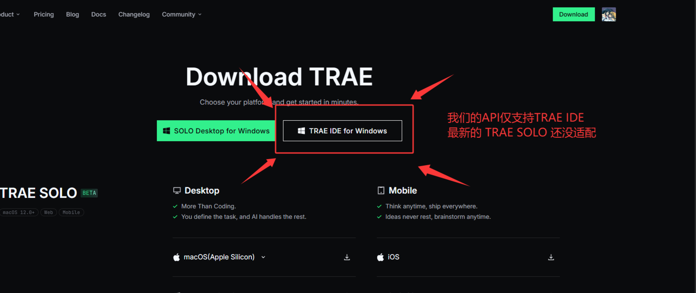

在浏览器右上角打开下载界面，打开 Trae 的安装包

开始安装，基本默认下一步就行了

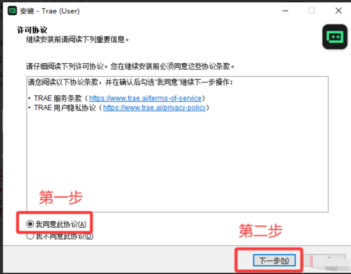

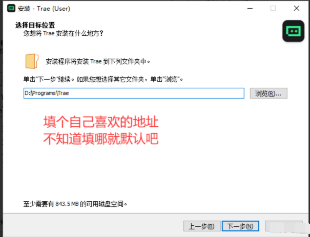

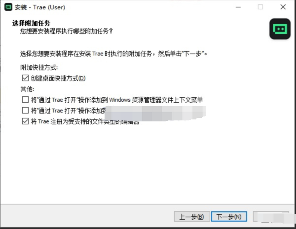

**默认下一步直到安装完成即可**

## 3. 配置API以及模型

首先需要登录一下 Trae SOLO 的账户，怎么注册这个账户不在本教程讨论范围内。

默认用户拥有可登录的账号！默认用户拥有可登录的账号！

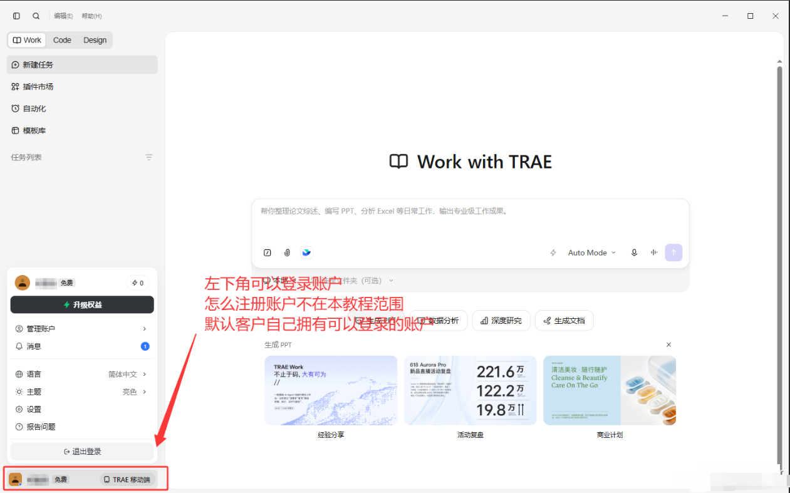

登录完成之后，可以在对话框的中设置模型，配置 API

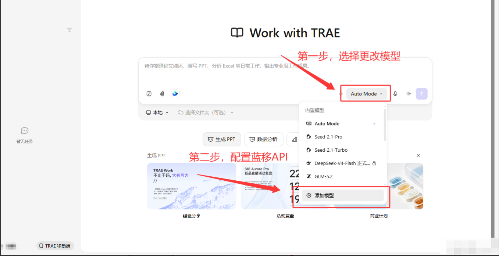

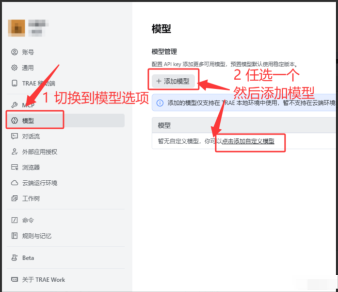

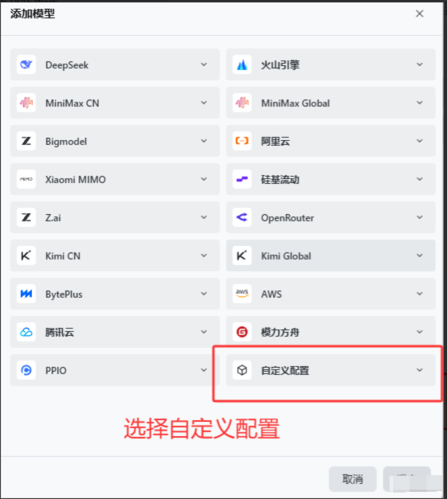

随后配置如下图，配置好 API 格式、请求地址、模型 ID、API 密钥就可以了

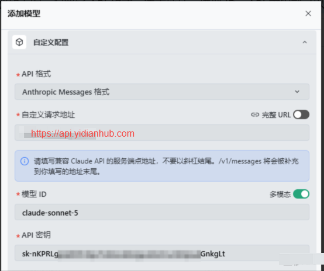

文章开篇就提到过令牌，API 密钥就是令牌，大概像上图示范那样，sk开头的。

自定义请求地址，就是我们官网（https://api.yidianhub.com）+请求路径（/v1/messages），下面可以直接复制。

自定义请求地址

```
https://api.yidianhub.com
```

模型 ID在下面挑一个自己喜欢的就行，不知道用什么就用 claude-sonnet-5

模型 ID

```
claude-sonnet-5
```

模型 ID

```
# Haiku
claude-haiku-4-5-20251001

# Sonnet
claude-sonnet-4-6
claude-sonnet-5

# Opus  
claude-opus-4-6
claude-opus-4-7
claude-opus-4-8
claude-opus-5
```

## 4. 关于高级设置的一些参数

主要是调整输入的上下文大小，新模型一般都能有 1m 上下文（100k），输出可改可不改，工具调用轮次建议调低（感觉 API 调用 Trae 的工具很容易报错）。

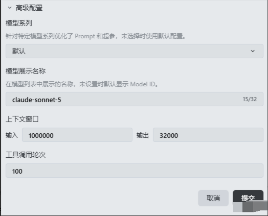

配置完成后，添加模型，然后回到对话窗口。我们往下滑就可以看到我们刚刚配置好的自定义模型，然后点击选中他，回到对话框尝试对话。

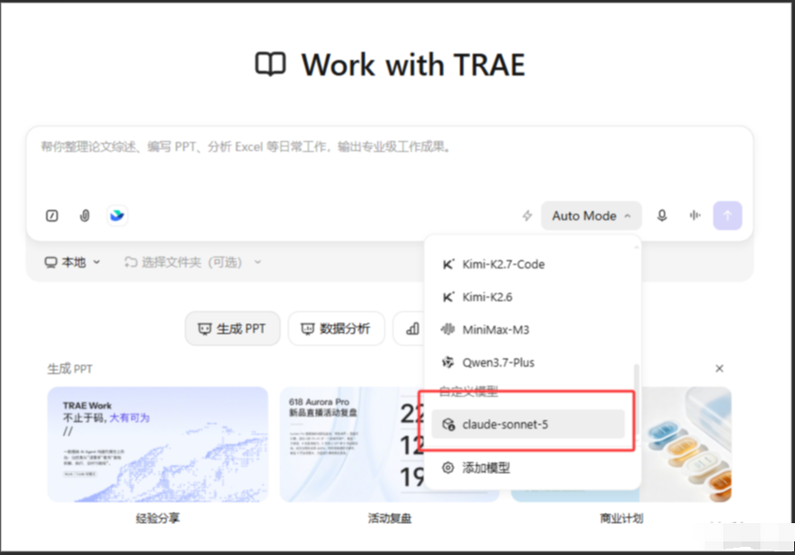

## 5. 测试对话

发送你好，询问什么模型，大概能得到如下回答。就算配置成功。

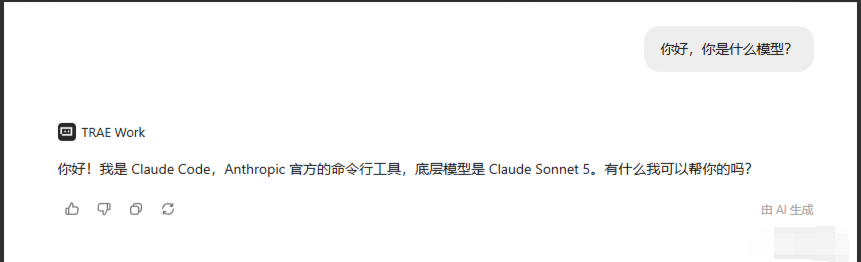
