# VSCode & Claude code 插件

## 准备工作

在开始之前，请确保你手边已经有了这三样东西（如果缺少，请先去获取）：

**API Key (密钥)：**

```html
sk-518GatoLXXXXXXXXXXXXXXXXXXXXXXXXsSLYe0zsnPH5
```

**Base URL (中转接口地址)：这个是我们固定的中转接口：**[**https://api.yidianhub.com**](http%3A%2F%2F1.95.142.151%3A3000)

（复制的时候看看前后有没有空格，要确保没有空格，否则使用的时候会报错）

```html
https://api.yidianhub.com
```

## 1. 安装VSCode

第一步：下载安装包 (官网)

请务必去官网下载，不要去第三方软件园，以免下载到被篡改的版本。
** **[**VSCode官网地址（**](https%3A%2F%2Fcode.visualstudio.com%2F)[**https://code.visualstudio.com/**](https%3A%2F%2Fcode.visualstudio.com%2F)[**）**](https%3A%2F%2Fcode.visualstudio.com%2F)

操作： 点击首页大大的蓝色按钮 "Download" 或者点击 "Download for Windows"（下载到现在你的系统）

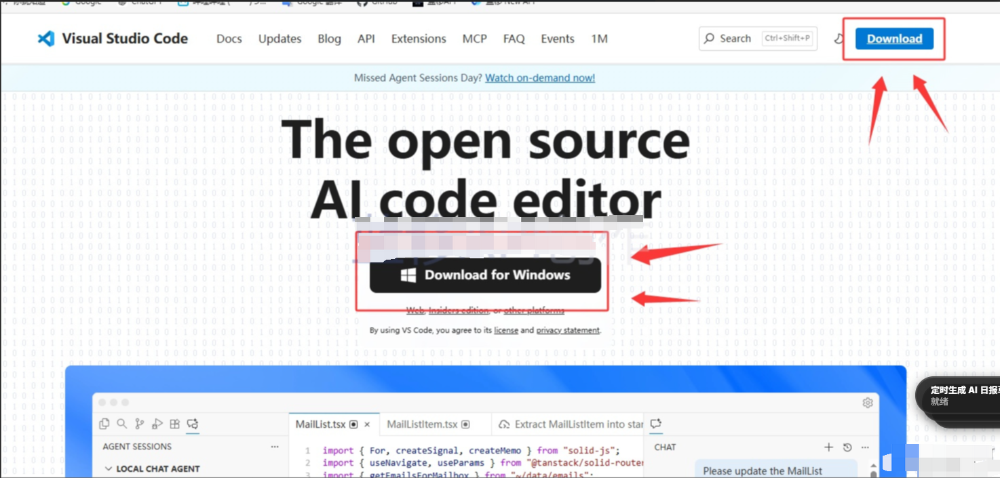

第二步，安装步骤

如果您是 Windows 用户，点击Windows下载

如果您是macOS 用户，点击MAC下载

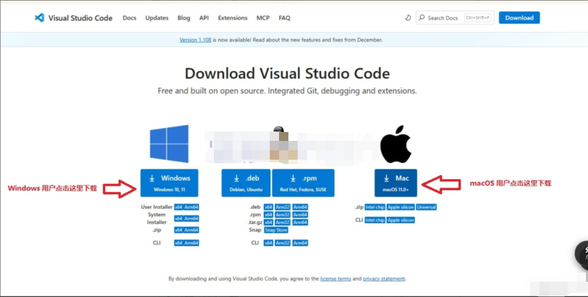

运行安装包： 双击下载好的 .exe 文件

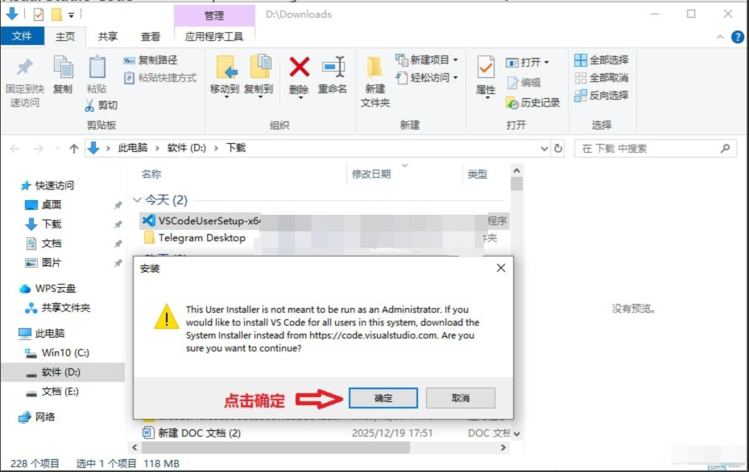

同意协议： 勾选“我同意此协议”，点击“下一步”

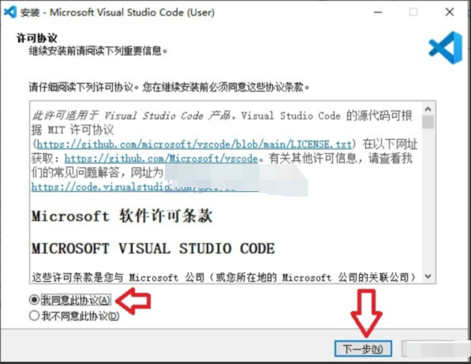

安装路径： 默认即可（通常在 C 盘），也可以改到 D 盘

⚠️ 关键步骤（必看）： 在“选择附加任务”这一步，建议全部勾选！

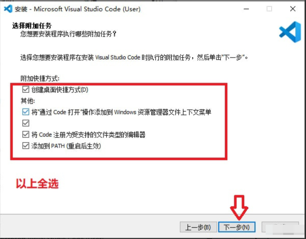

完成： 点击“安装”，最后点击“完成”

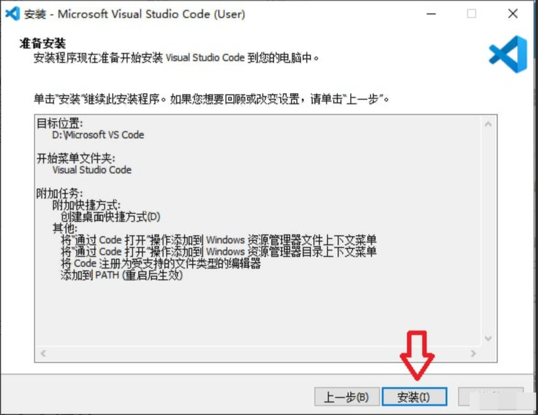

到这里已经完成了。

## 2. 安装中文插件

**1.如果您觉得英文太复杂，您可以按照一个中文插件改成中文**

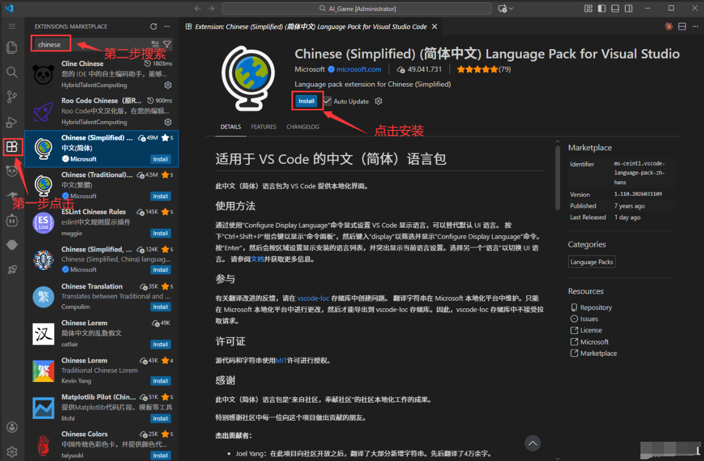

注意：


安装过程中会有一步这样的英文：

**上图是中文版的，点击蓝色的按钮即可）**

**2.安装完后点击右下角重启**

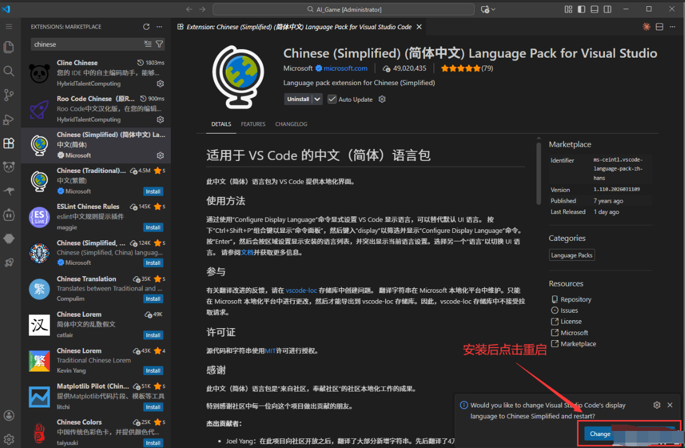

自动重启后就是中文版的了

## 3. 安装Claude code并配置

打开vs code点击左侧边栏的扩展

搜索：Claude code并安装，点击信任发布者和安装开始安装

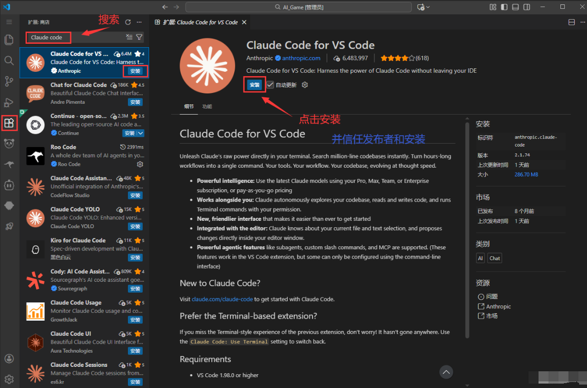

安装完之后

**第一步：**点击左下角小齿轮

**第二步：**点击设置（win快捷键Ctrl+，）（mac快捷键Cmd+，）

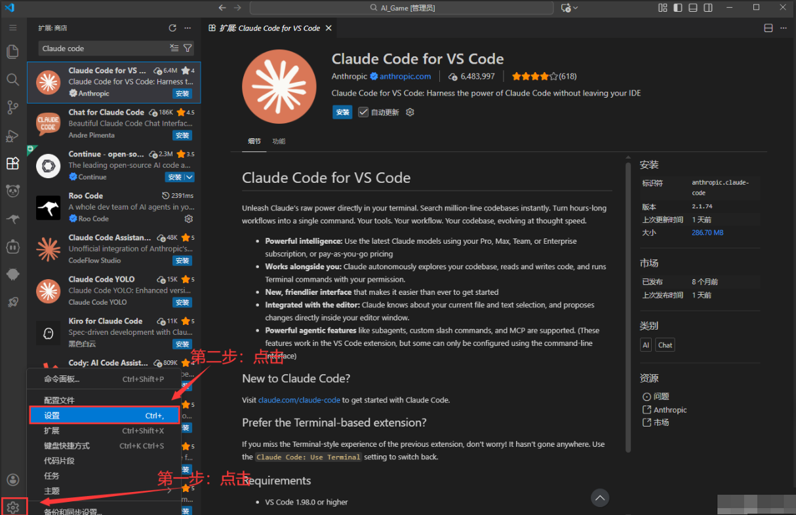

**打开之后**

**第一步：**在顶部的搜索框里直接搜索：Claude Code Environment
**第二步：**找到 "Claude Code: Environment Variables" 这一项，点击它下面的 “在 settings.json 中编辑” (Edit in settings.json)。

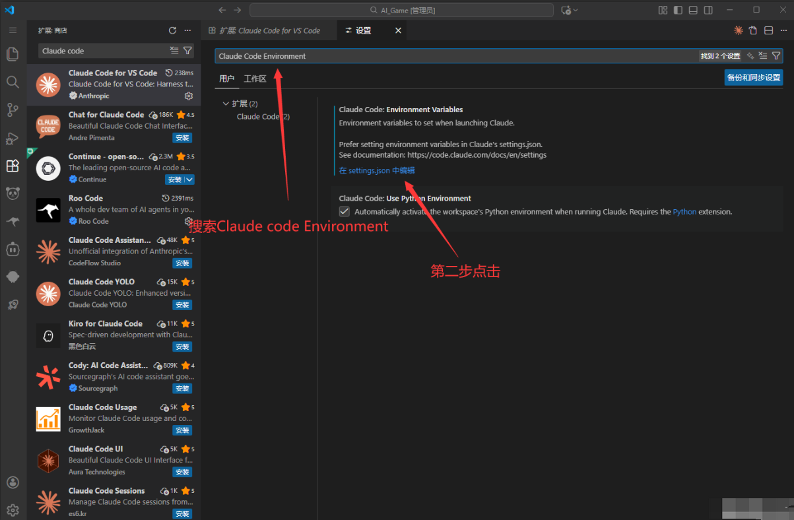

如果你搜不到，可以右键插件打开

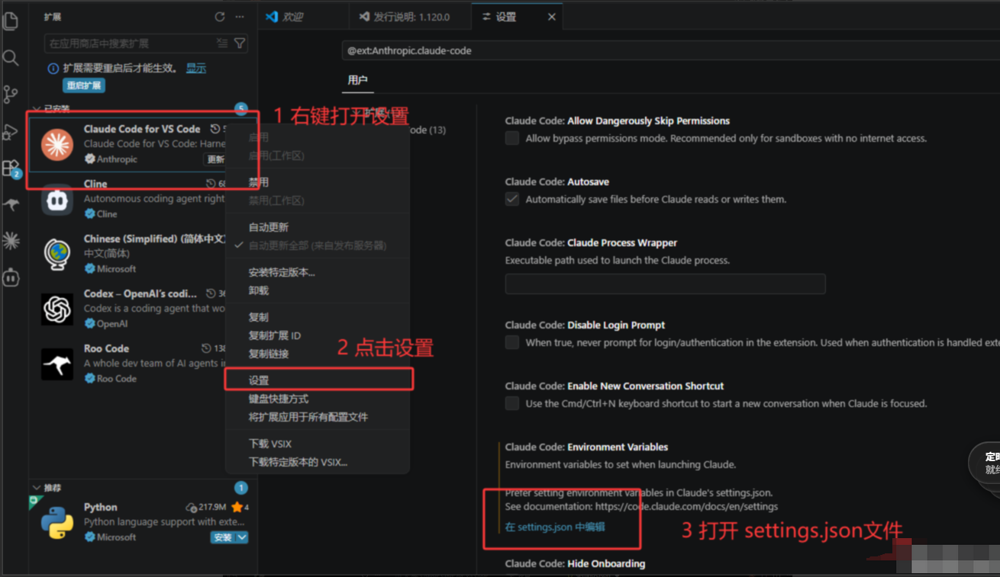

### 打开后

新设备第一次开始打开的配置是这样的

**注意**：如果您们之前配置过别家的东西，或者是别的ai的配置，需要删掉，不然会有冲突 接不上

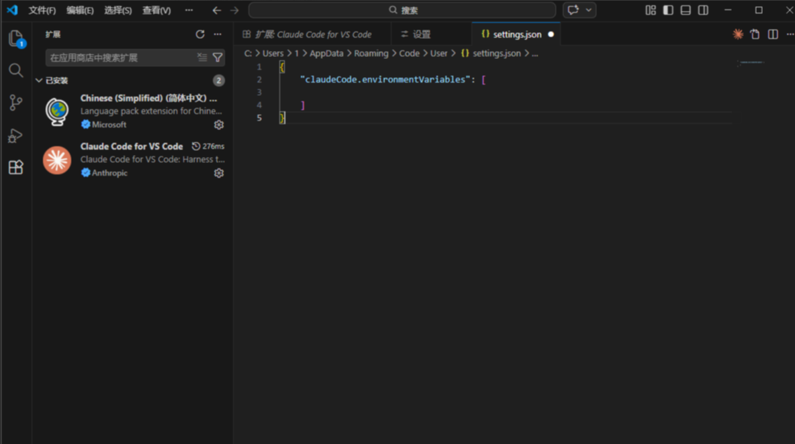

### 接下来：填入内容

为了绝对不出错，直接把截图里的第 1 行到第 5 行**全部删掉**，**（根据个人情况删除之前的配置，确保与我们的配置不会冲突）**然后直接把我下面这段完整的代码复制粘贴进去（记得把里面的sk开头的换成您去令牌获取的密钥）：

```json
{
  "claudeCode.disableLoginPrompt": true,
  // 禁用登录提示
  "claudeCode.environmentVariables": [
    {
      "name": "CLAUDE_CODE_OAUTH_TOKEN",
      "value": "替换成令牌，sk开头的API密钥"  
    },
    {
      "name": "ANTHROPIC_BASE_URL",
      "value": "https://api.yidianhub.com" 
    },
    {
      "name": "CLAUDE_CODE_DISABLE_NONESSENTIAL_TRAFFIC",
      "value": "1" 
  // 一键关闭 Claude Code 向 Anthropic 发送的所有非核心网络请求，更少的后台流量
    }
  ]
  
}
```

*旧版 ANTHROPIC_AUTH_TOKEN 已弃用*

填完之后再上面可以看到有个小圆点，按 `Ctrl + S` 确保文件上面那个小白点消失（代表保存成功

保存完之后关掉一整个vs code重新打开

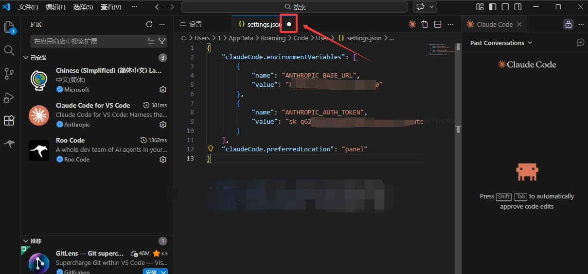

重新打开之后输入”你好“运行一下试试

### 第一注意事项！！！

**如果输入对话之后就看以下步骤，如果没有就跳过此步骤**

输入之后如果跳出这个之后就点击“Skip for now”

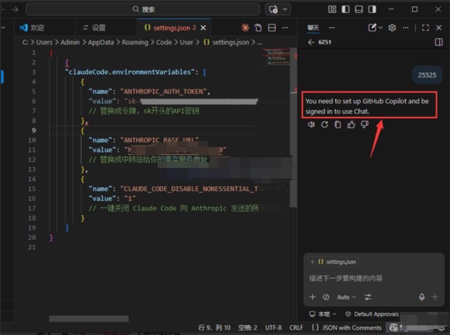

**点击“Skip fornow”之后就会出现对话内容**

**这句话代表着你缺少了GitHub**

**看下一步“第二注意事项”下载安装Git**

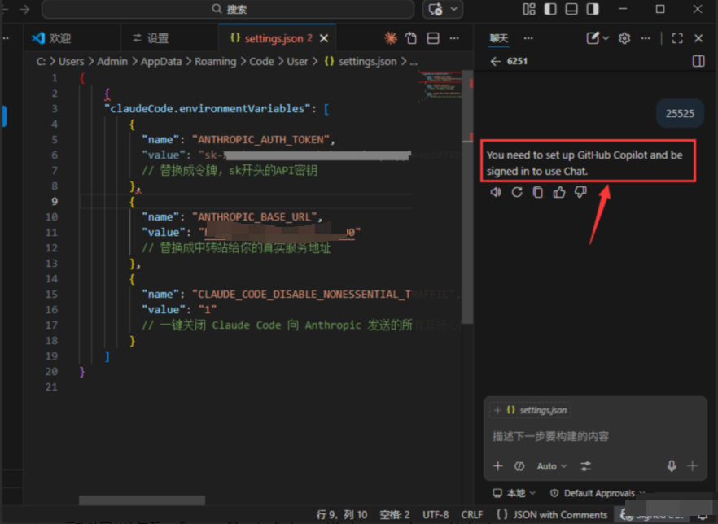

### 第二注意事项！！！

重新打开之后如果出现以下报错

这段红字开头写着：`Error: Claude Code on Windows requires git-bash`

** Claude Code 这个插件在咱们 Windows 电脑上干活时，必须借用一个叫 Git 的底层工具 **

**您只是缺少了这个Git**

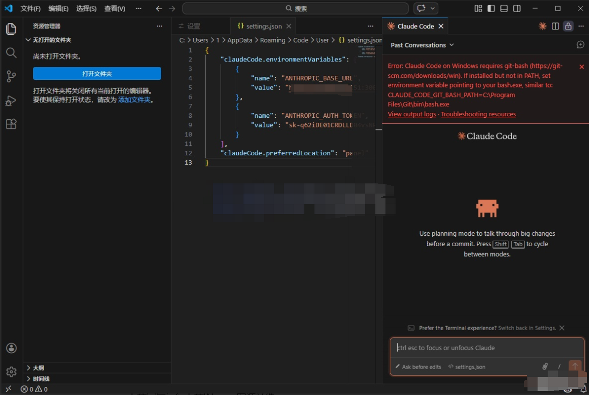

1. ** 第一步：下载 Git 工具  **

您直接在浏览器里打开这个官方链接并下载：[**https://git-scm.com/downloads/win**](https%3A%2F%2Fgit-scm.com%2Fdownloads%2Fwin)

- 点击 "Download for Windows" 下载安装包

- 下载完后运行下载的 .exe 安装文件

- **极其关键：安装过程中您什么设置都不需要改！** 绝对不要改安装路径，就无脑疯狂点击右下角的 “Next（下一步）”，一直点到最后完成安装。

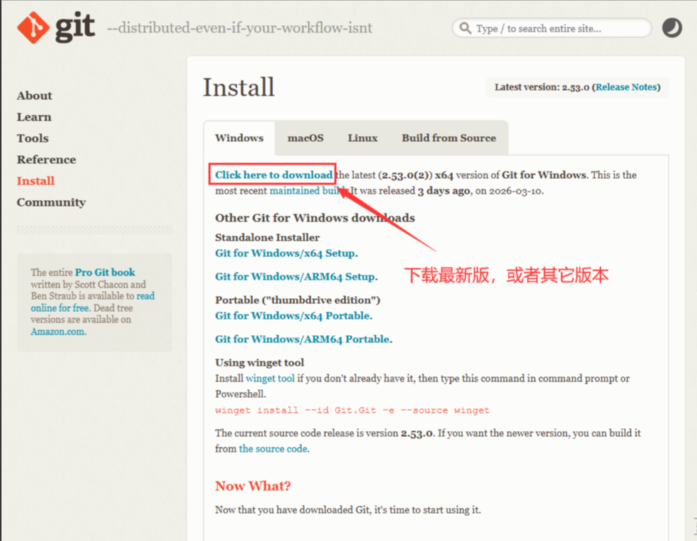

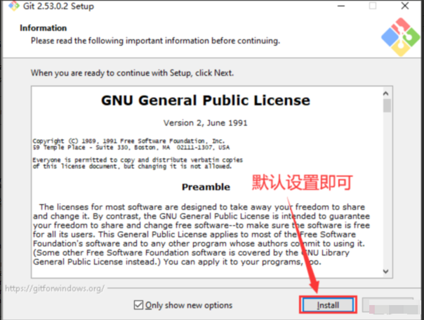

1. 安装完Git之后重新打开vs code中的Claude code插件

输入”你好“运行一下

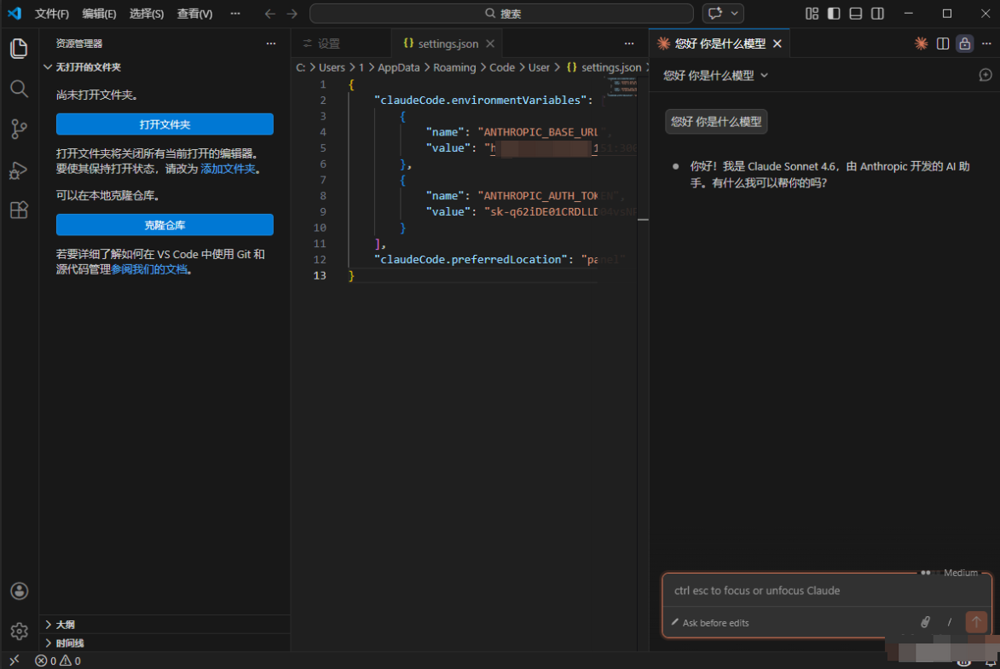

### 切换模型方法

在对话框输入：/model

然后回车

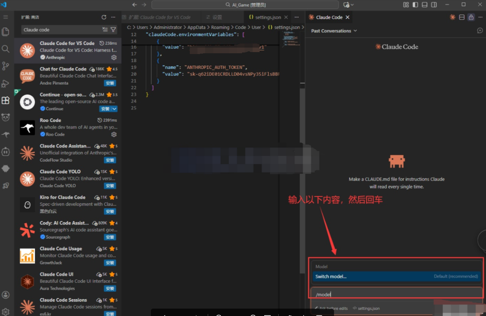

用上下键选择模型，然后回车选定就行了

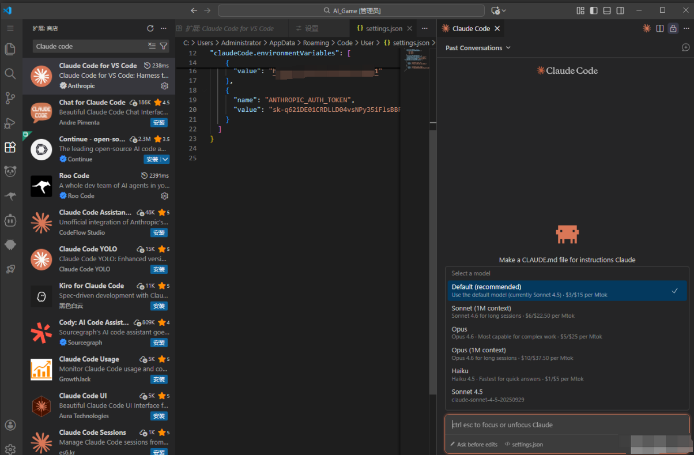

最后输入你好测试一下！

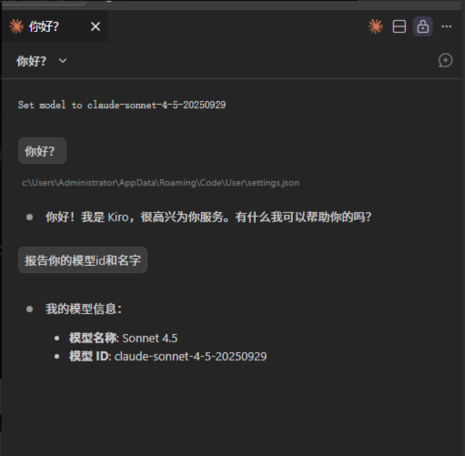

### 如果显示登陆页面可以通过系统环境变量配置

**为了让 Claude Code 连接到你的中转服务，需要设置几个环境变量：**

**图形界面配置（推荐）**右键`【此电脑】->【属性】->【高级系统设置】->【环境变量】`

新建用户变量

ANTHROPIC_AUTH_TOKEN: sk-XXXXXXXXXXXXXXXXXXXXXXXXXXXXXXXX

ANTHROPIC_BASE_URL: [https://api.yidianhub.com](http%3A%2F%2F1.95.142.151%3A3000%2F)

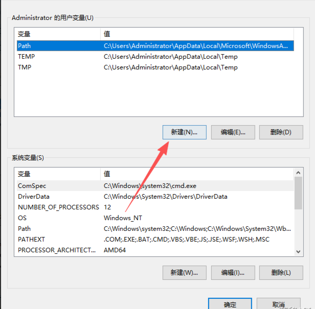

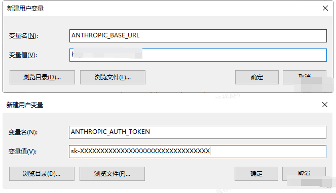

## 4. 额外补充

如果实在配置Claude Code插件不成功（配置过其他家的API），预计需要安装Claude Code本体才能解决这个问题了
