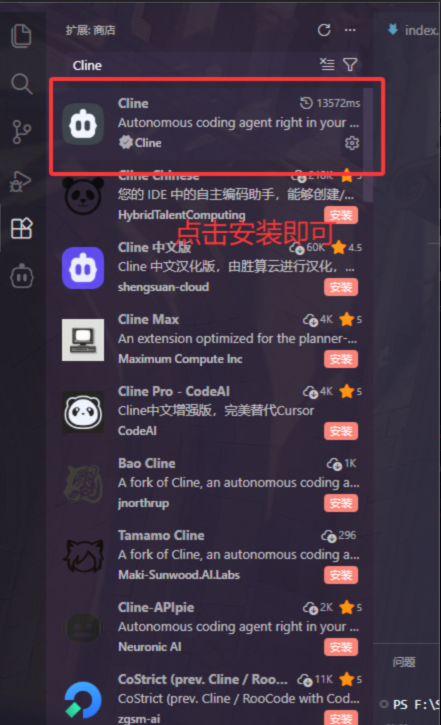
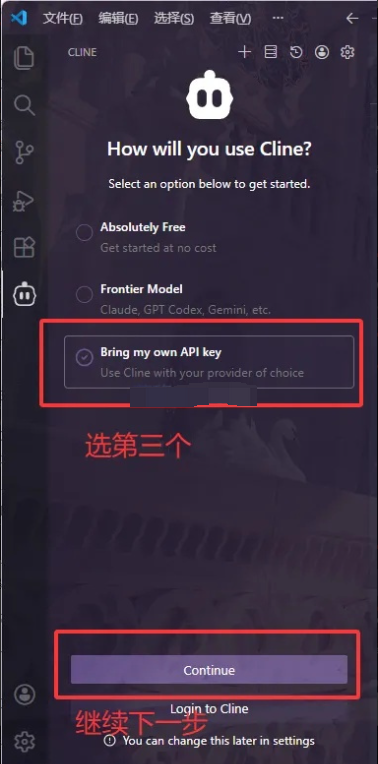
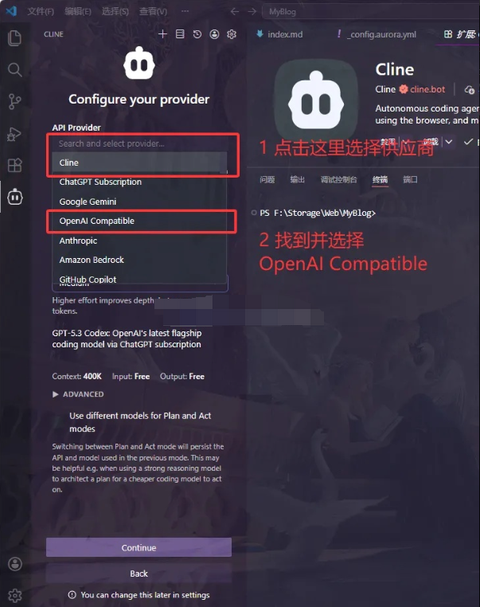
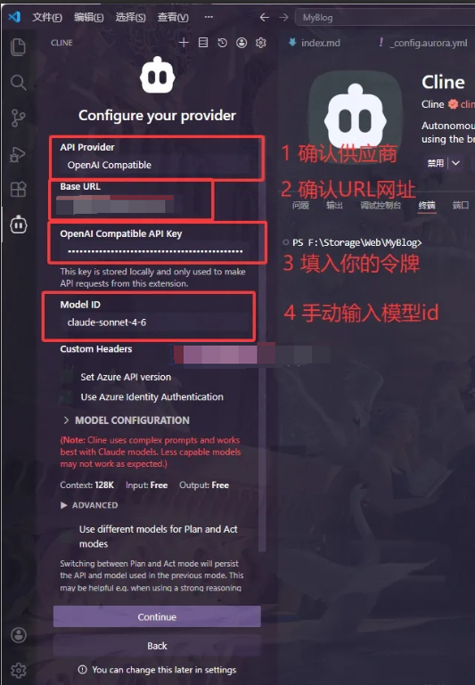
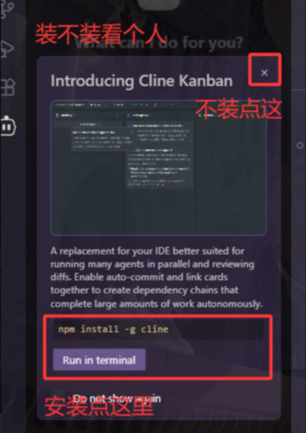
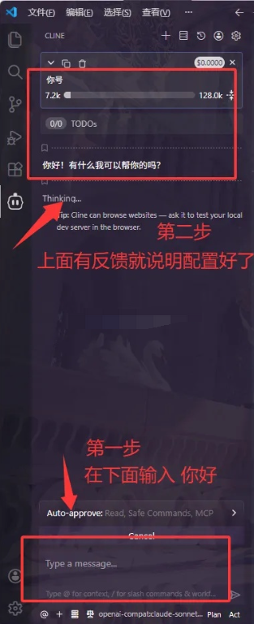

# 前言

本教程建立在默认客户已经安装了VSCode的基础上。

本教程建立在默认客户已经安装了VSCode的基础上。

另外，Trae、Cursor也同样适用本教程（因为他们都是同一个内核）。

# 安装配置 Cline

第一步，下载安装Cline插件



第二步，选择自定义供应商







Base URL

```
https://api.yidianhub.com/v1
```

Model ID

```
# Haiku
  claude-haiku-4-5-20251001
  
# Sonnet
  claude-sonnet-4-6

# Opus  
  claude-opus-4-6
  claude-opus-4-7
```

这个是说，是否要安装Cline的命令行，这个装不装看个人需求




