## 准备工作

在开始之前，请确保你手边已经有了这两样东西（如果缺少，请先去获取）：

API Key (密钥)：这个是您在一点API中创建令牌时的key

```text
sk-518GatoLXXXXXXXXXXXXXXXXXXXXXXXXsSLYe0zsnPH5
```

Base URL (中转接口地址)：这个是我们固定的中转接口：https://api.yidianhub.com

（复制的时候看看前后有没有空格，要确保没有空格，否则使用的时候会报错）

```text
https://api.yidianhub.com
```

## 1. 安装VSCode

### 第一步：下载安装包 (官网)

请务必去官网下载，不要去第三方软件园，以免下载到被篡改的版本。

VSCode官网地址：[https://code.visualstudio.com/](https://code.visualstudio.com/)

操作：点击首页大大的蓝色按钮 "Download" 或者点击 "Download for Windows"（下载到现在你的系统）

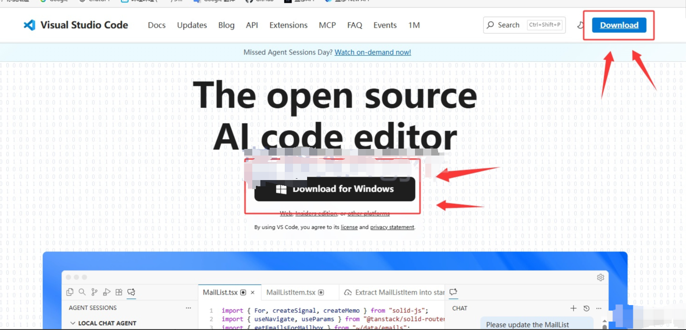

### 第二步，安装步骤

如果您是 Windows 用户，点击Windows下载。

如果您是macOS 用户，点击MAC下载。

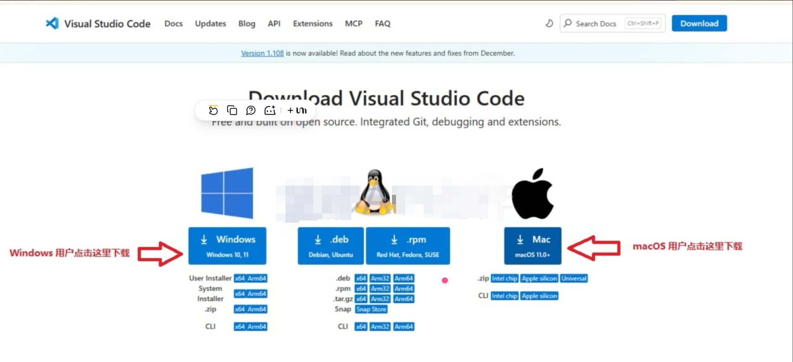

运行安装包：双击下载好的 `.exe` 文件。

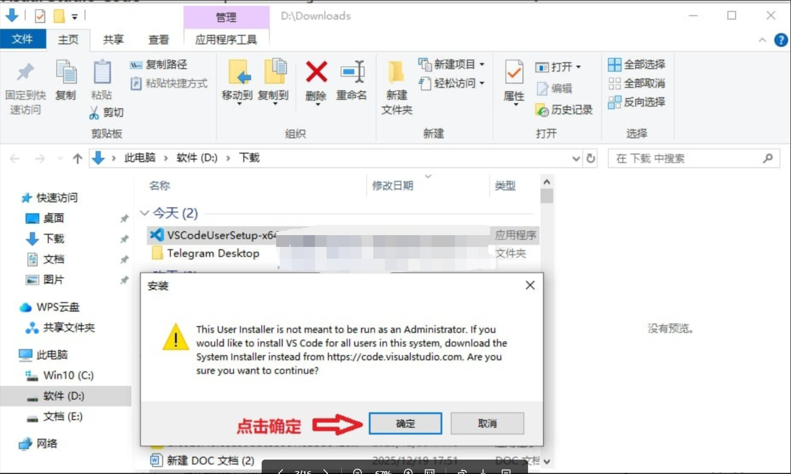

同意协议：勾选“我同意此协议”，点击“下一步”。

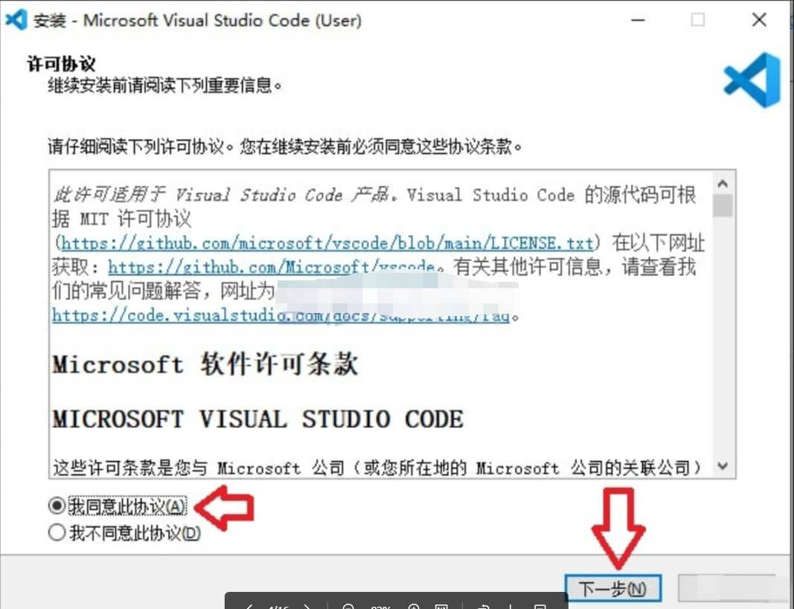

安装路径：默认即可（通常在 C 盘），也可以改到 D 盘。

⚠️ 关键步骤（必看）：在“选择附加任务”这一步，建议全部勾选！

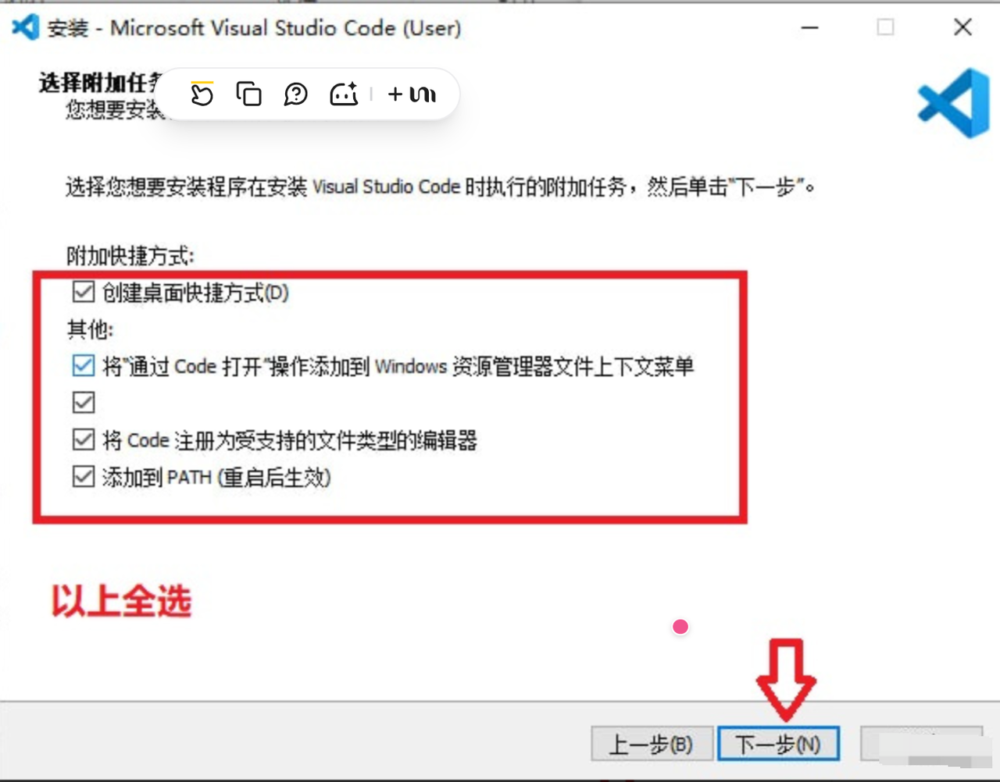

完成：点击“安装”，最后点击“完成”。

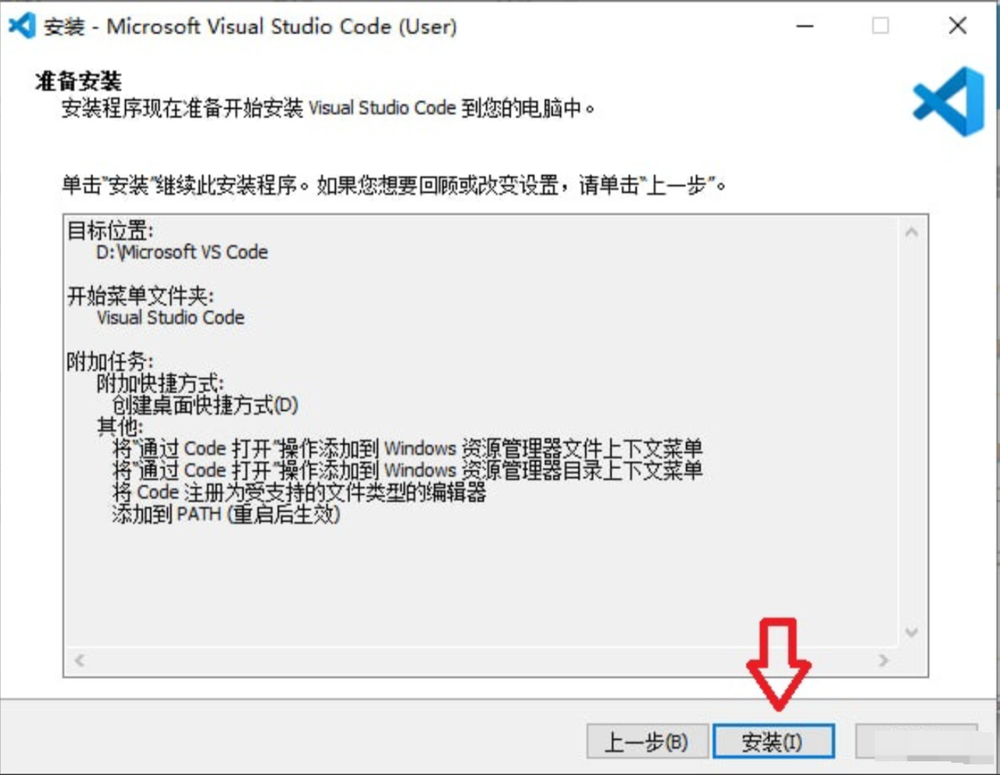

到这里已经完成了。

## 2. 安装插件

### 2.1. 安装中文插件

如果您觉得英文太复杂，您可以按照一个中文插件改成中文（非必要）。

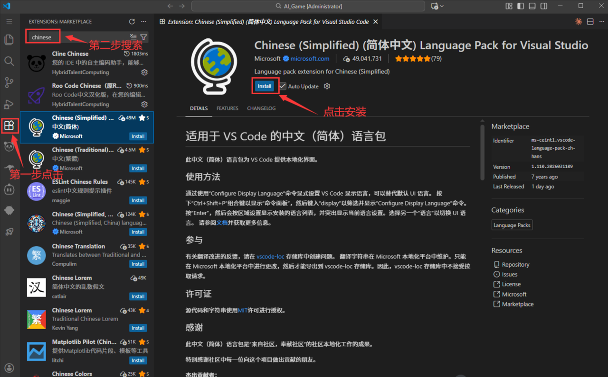

注意：安装过程中会有一步这样的英文：

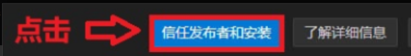

（上图是中文版的，点击蓝色的按钮即可）

安装完后点击右下角重启。

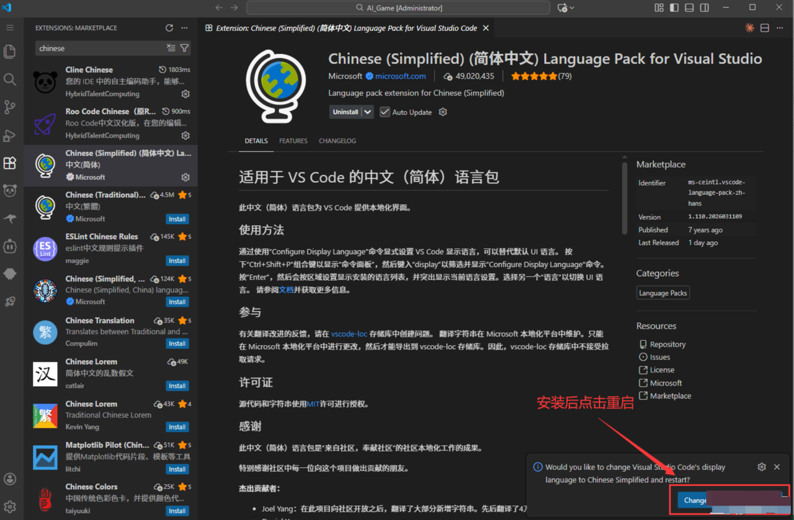

自动重启后就是中文版的了。

### 2.2. 安装 CodeX 插件

在插件市场，输入codex进行搜索，一般第一个就是。

随后就可以点击安装codex的插件。

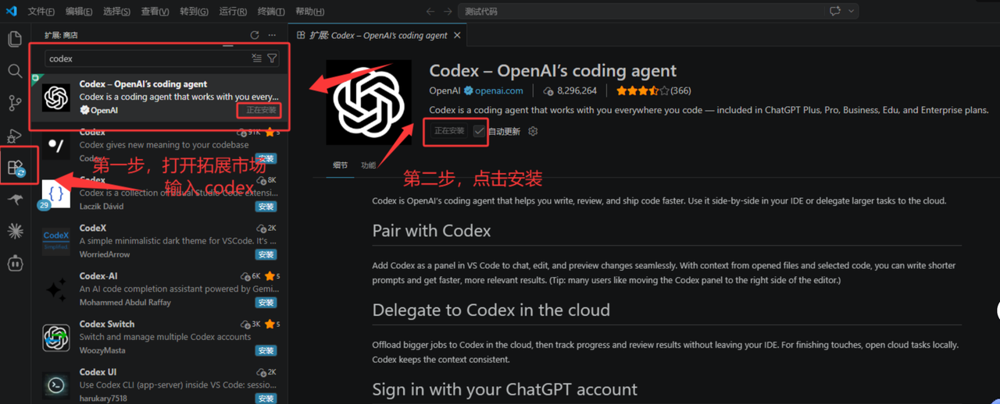

安装完成后，可以在右上角找到并打开 CodeX 插件。

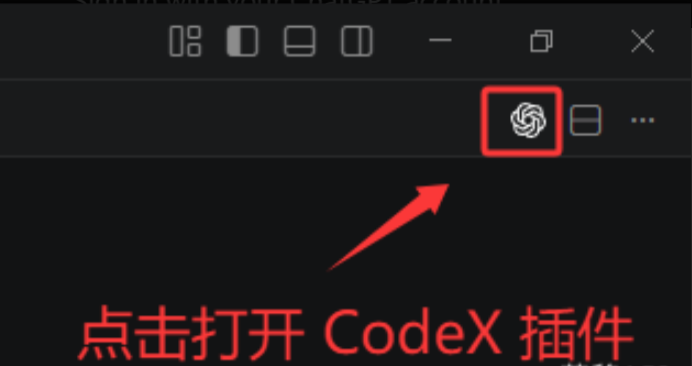

打开后如下图，点击 Continue 继续下一步。

（这里可能是我已安装过的缘故，如果没有这一步也不打紧）

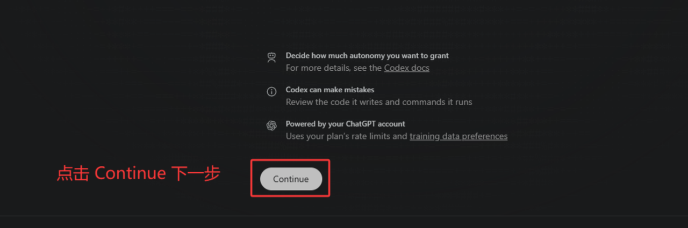

### 2.3. 配置一点 API

选择第二个，使用 API Key 登录。

随后，按下图三步走：

- 第一步，在右上角找到并打开设置（⚙️）
- 第二步，打开 Configuration 设置选项
- 第三步，打开 Config.toml 配置文件


打开文件如下图，复制粘贴下面内容进去就行。

```toml
model_provider = "OpenAI"
model = "gpt-5.5"
review_model = "gpt-5.5"
model_reasoning_effort = "xhigh"
disable_response_storage = true
network_access = "enabled"
windows_wsl_setup_acknowledged = true
model_context_window = 1000000
model_auto_compact_token_limit = 900000

[model_providers.OpenAI]
name = "YiDian"
base_url = "https://api.yidianhub.com/v1"
wire_api = "responses"
requires_openai_auth = true
```

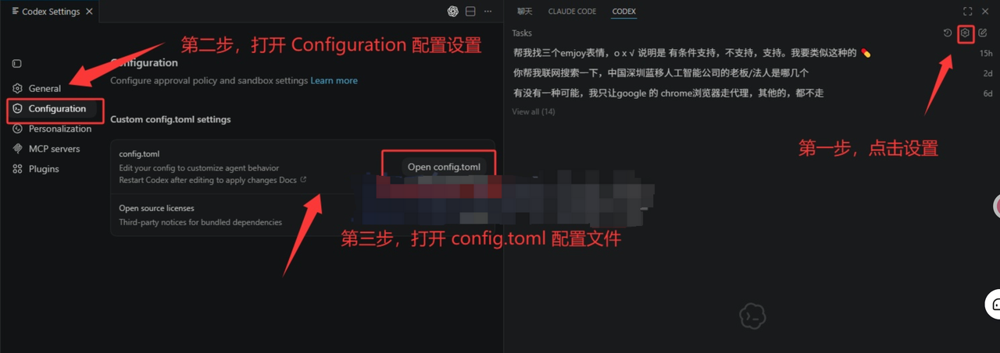

完成后大概如下图，记得按 Ctrl + S 保存你的更改。

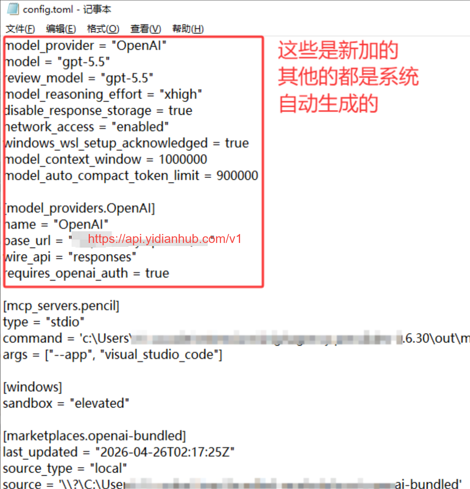

### 2.4. 测试对话

到此为止，我们就算配置完毕 Codex 了，之后只需要重启一下 VSCode，重新打开CodeX，即可正常对话使用。第一次回复可能会比较慢，请耐心等待，后续会正常的。

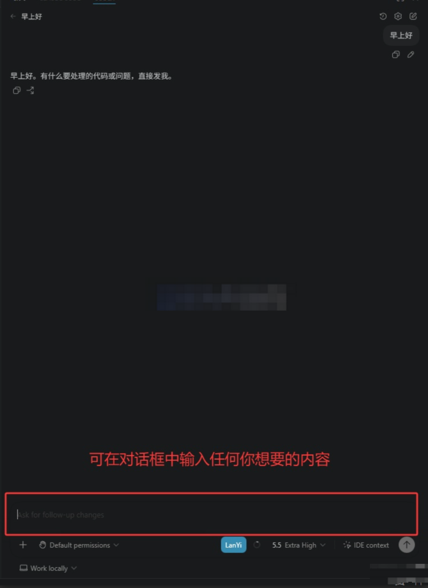
