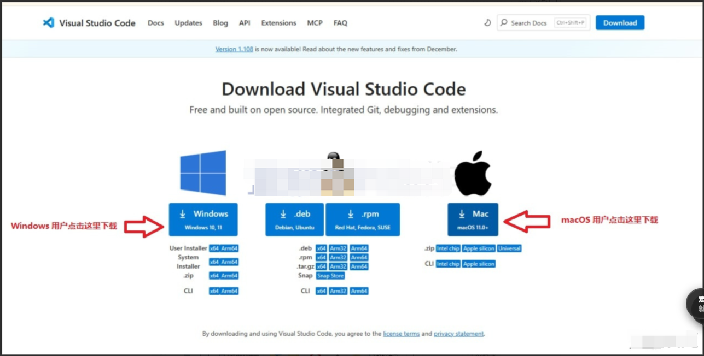
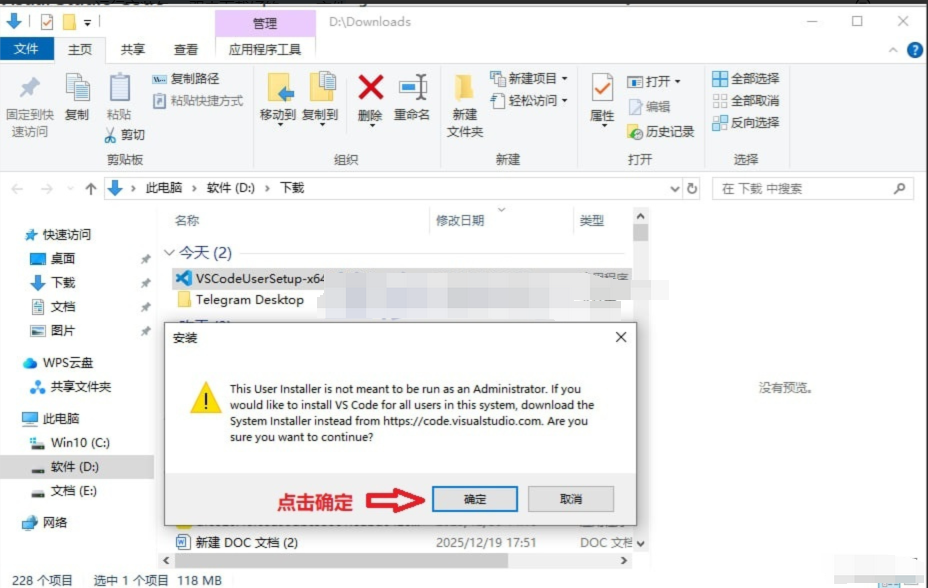
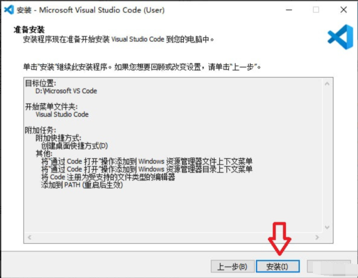
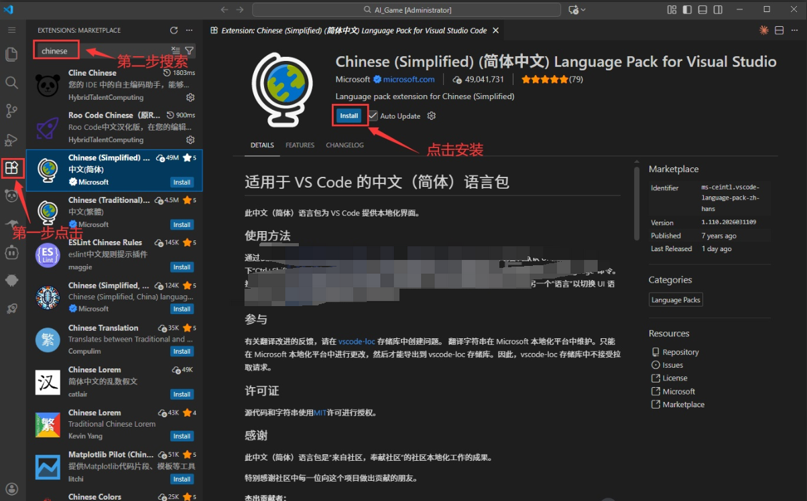
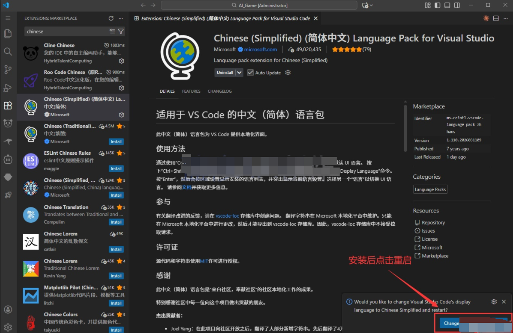
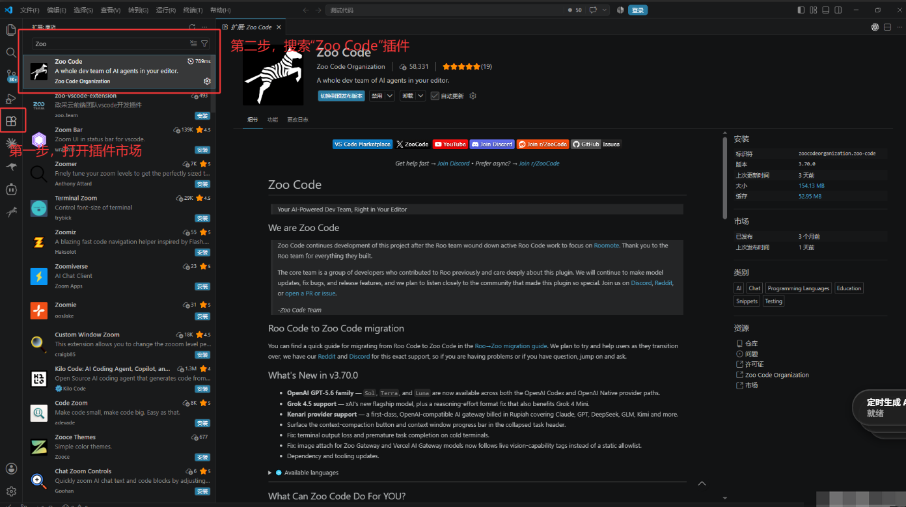
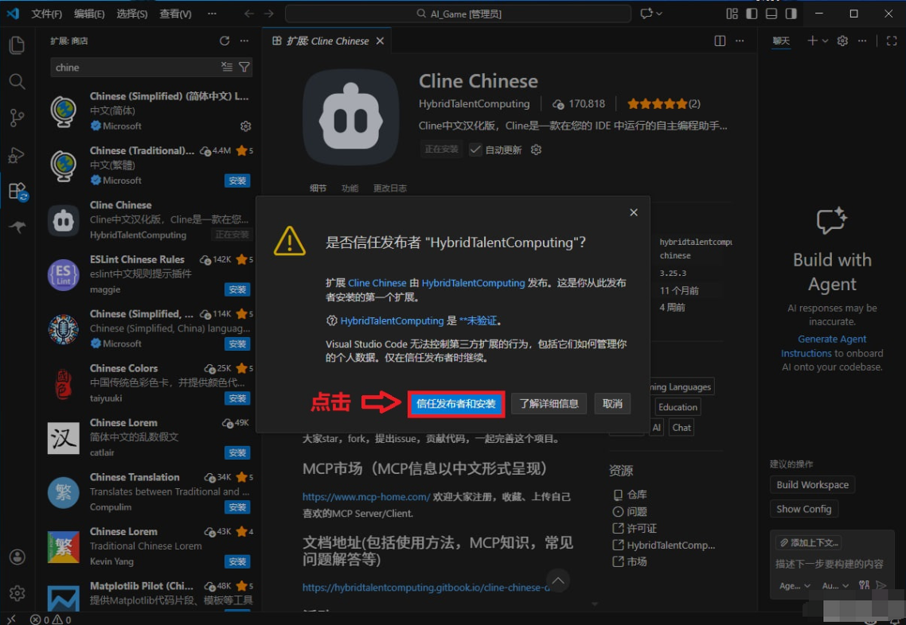
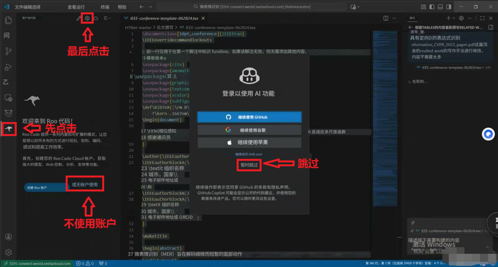
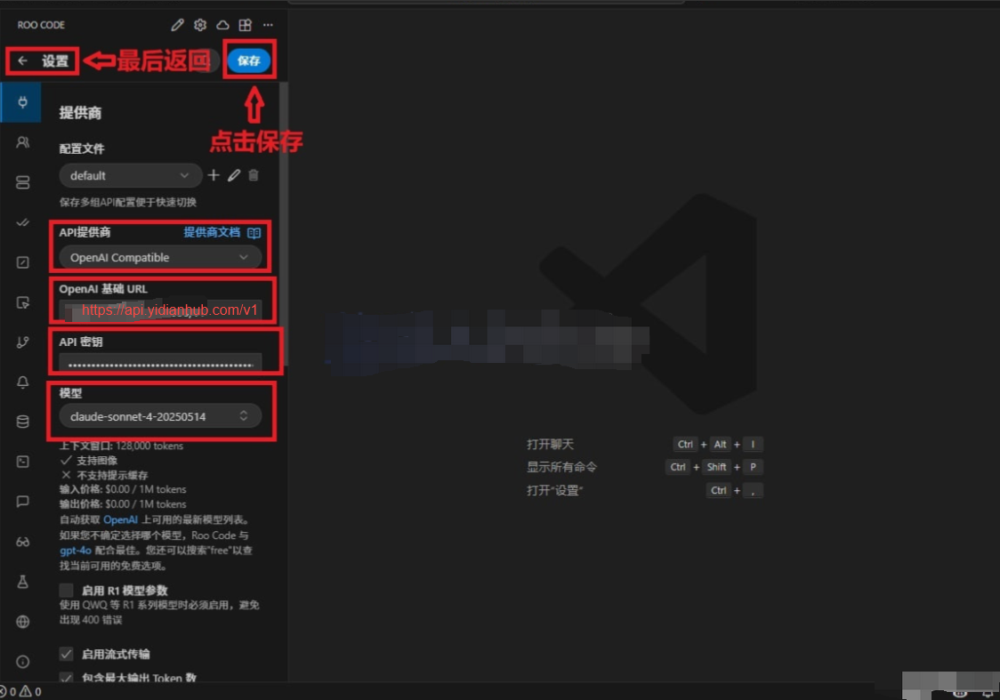
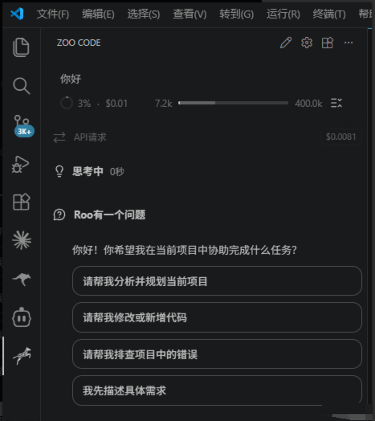

# VSCode & Zoo Code 插件

## 0 准备工作

在开始之前，请确保你手边已经有了这三样东西（如果缺少，请先找你的我们获取）：

API Key (密钥)：这个是您在令牌领取教程兑换出来的令牌

Base URL (中转接口地址)：这个是我们固定的中转接口：[https://api.yidianhub.com/v1](http%3A%2F%2F1.95.142.151%3A3000%2Fv1)（复制的时候看看前后有没有空格，要确保没有空格，否则使用的时候会报错）

## 1. 安装VS Code

第一步：下载安装包 (官网)

请务必去官网下载，不要去第三方软件园，以免下载到被篡改的版本。
官网地址： [https://code.visualstudio.com/](https%3A%2F%2Fcode.visualstudio.com%2F)，操作： 点击首页大大的蓝色按钮 "Download"


第二步，安装步骤

如果您是 Windows 用户，点击Windows下载

如果您是 macOS 用户，点击MAC下载



运行安装包： 双击下载好的 .exe 文件



同意协议： 勾选“我同意此协议”，点击“下一步”


安装路径： 默认即可（通常在 C 盘），也可以改到 D 盘

⚠️ 关键步骤（必看）： 在“选择附加任务”这一步，建议全部勾选！


完成： 点击“安装”，最后点击“完成”



到这里已经完成了。

**安装完成之后打开vs code**

** 如果您觉得英文太复杂，那就装个中文插件**

**第一步：**点击左侧边栏“扩展”

**第二步：**搜索“Chinese”

**第三步：**点击安装



注意：


安装过程中会有一步这样的英文：

**（上图是中文版的，点击蓝色的按钮即可）**

**2.安装完后点击右下角重启**



自动重启后就是中文版的了

## 2 安装插件 (Zoo code)

打开 VS Code。
**第一步：**点击左侧侧边栏的 “扩展”图标（或者按下快捷键 Ctrl + Shift + X）

**第二步：**在搜索框输入：**Zoo code，**找到插件。

**第三步：**点击 Install (安装)。



点击信任发布者和安装（教程有更新，图不一样，但是操作步骤不变哈）



## 3 关键配置 (最重要的一步)

安装好后，左侧侧边栏会出现一个对应的小图标

1. 先点击 zoo code

1. 然后点击跳过

1. 不使用账户

1. 最后点击上方小齿轮



**请严格按照以下步骤填写**

API提供商：选择**OpenAl Compatible**

API Key (密钥)：粘贴你 sk- 开头的密钥（令牌）

勾选使用自定义基础URL：


然后填入我们给你的URL:[https://api.yidianhub.com/v1](http%3A%2F%2F1.95.142.151%3A3000%2Fv1)

**最后是模型ID：模型选择很重要，请跳转到共用内容中自行选择**

填完之后点击上方保存，然后返回

**这里的模型是要手动输入的，不是选择的哦，我们的模型有以下几种**

**选择你想要使用的模型，复制粘贴进去就行了（注意不要复制多了空格哦）**

模型大全

```markdown
# Haiku
# 快速响应模型
  claude-haiku-4-5-20251001
  
# Sonnet
# 综合、推理
  claude-sonnet-4-20250514-thinking
  claude-sonnet-4-5-20250929-thinking
  claude-sonnet-4-5-20250929
  claude-sonnet-4-6
  claude-sonnet-5

# Opus
# 偏思考模型、适合各种疑难杂症
  claude-opus-4-5-20251101-thinking
  claude-opus-4-5-20251101
  claude-opus-4-6
  claude-opus-4-7
  claude-opus-4-8

# Fable
# 仅支持在max分组中使用
  claude-fable-5

# 1m 上下文特殊模型
# Claude Code和Claude客户端专用
# 测试阶段，尽可能通过 /model 或者软件自带设置去选择
# 和原模型同价格，但可能会因为读取更多上下文消耗更大
  claude-sonnet-4-6[1m]
  claude-opus-4-6[1m]
  claude-opus-4-7[1m]
  claude-opus-4-8[1m]
```

## 4 测试验证是否配置成功

1. **这里的保存如果是灰色的点不了，那就是保存成功了！**

1. **直接点击返回就可以了**

1. **返回之后是在左下角的对话栏对话，而不是右下角的**



点击完成之后返回聊天栏可以发送你好测试一下



至此，Zoo插件就算配置完成
