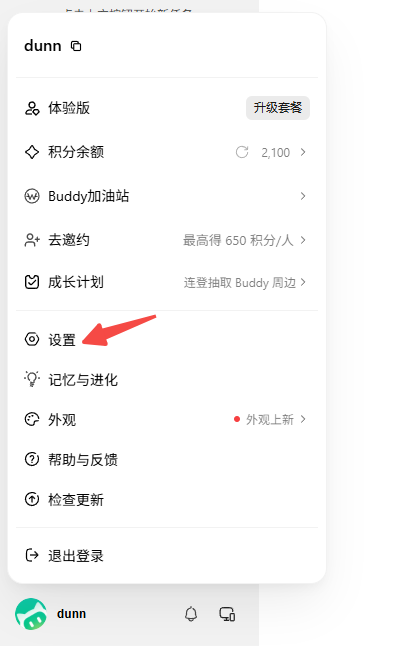
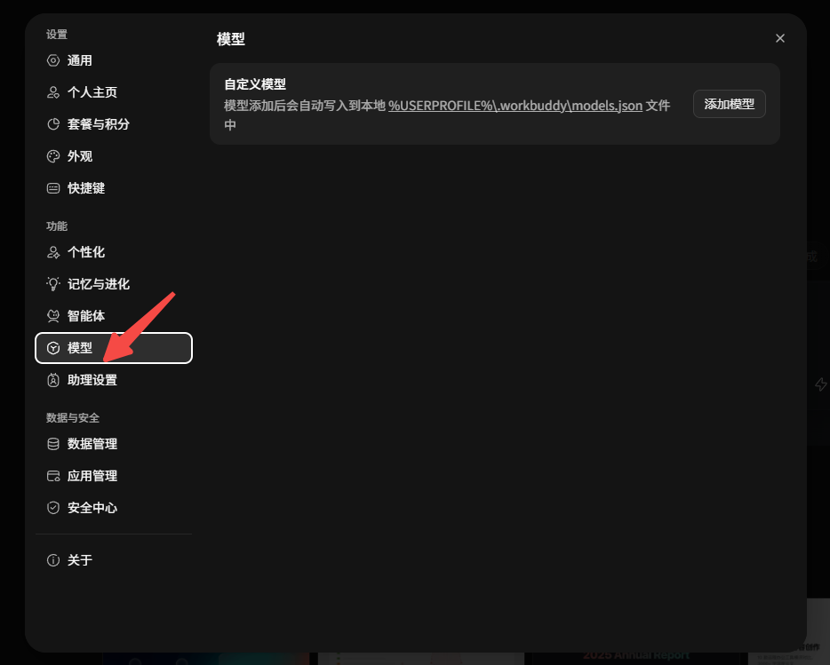
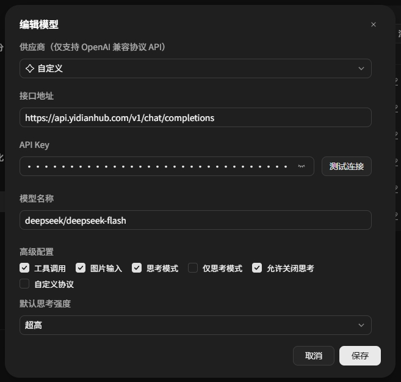
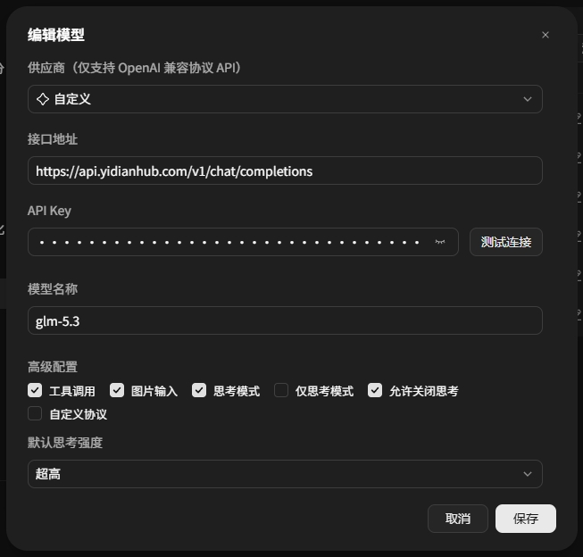
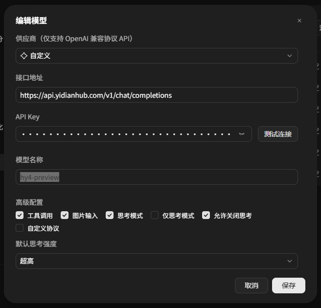
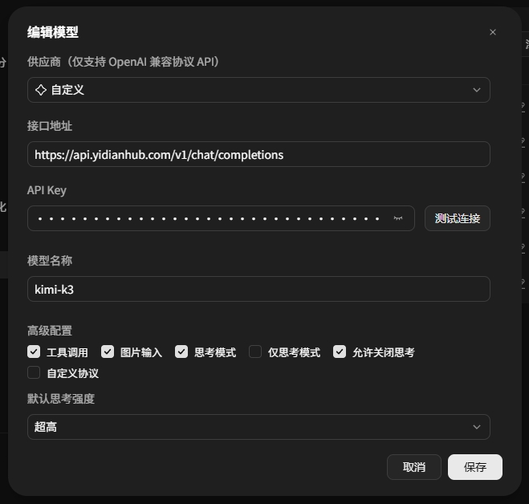
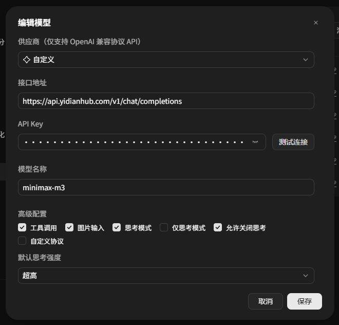
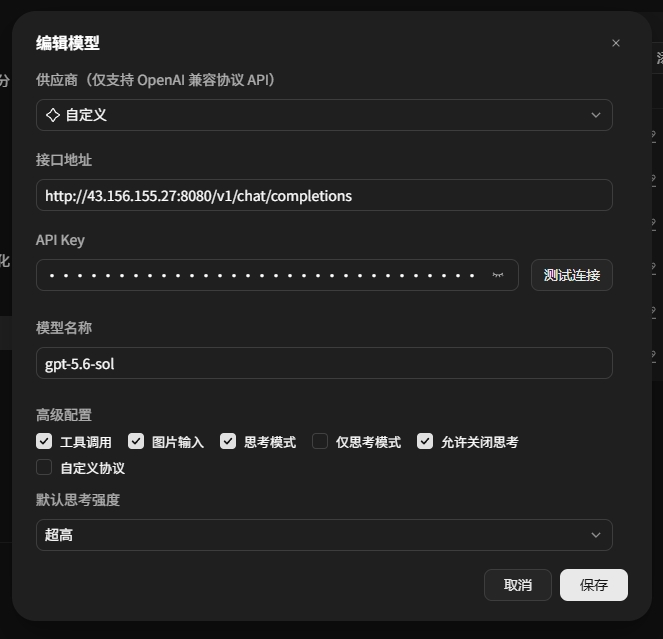
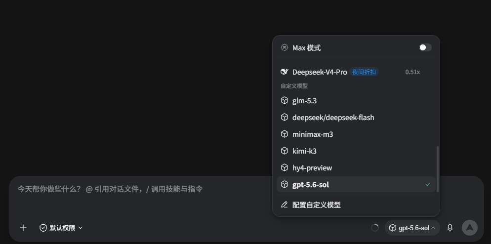

# 下载 WorkBuddy

在 [WorkBuddy 官网 ](https%3A%2F%2Fcopilot.tencent.com%2Fwork%2F)[https://copilot.tencent.com/work/](https%3A%2F%2Fcopilot.tencent.com%2Fwork%2F) 下载

安装过程无脑下一步即可，WorkBuddy没什么需要抉择的地方。

# 给 WorkBuddy 换心脏

安装过程无脑下一步即可，安装好之后打开登录如下图

修改协议，选择 自定义 / Custom

或者直接进 设置/模型/添加模型/自定义

使用deepseek/deepseek-flash模型

使用glm-5.3模型

使用hy4-preview模型

使用kimi-k3模型

使用minimax-m3模型

使用gpt-5.6-sol模型

所有添加的自定义模型如下，之后就可以在会话中随意切换模型使用了

