# 下载 WorkBuddy

在 [WorkBuddy 官网 ](https%3A%2F%2Fcopilot.tencent.com%2Fwork%2F)[https://copilot.tencent.com/work/](https%3A%2F%2Fcopilot.tencent.com%2Fwork%2F) 下载

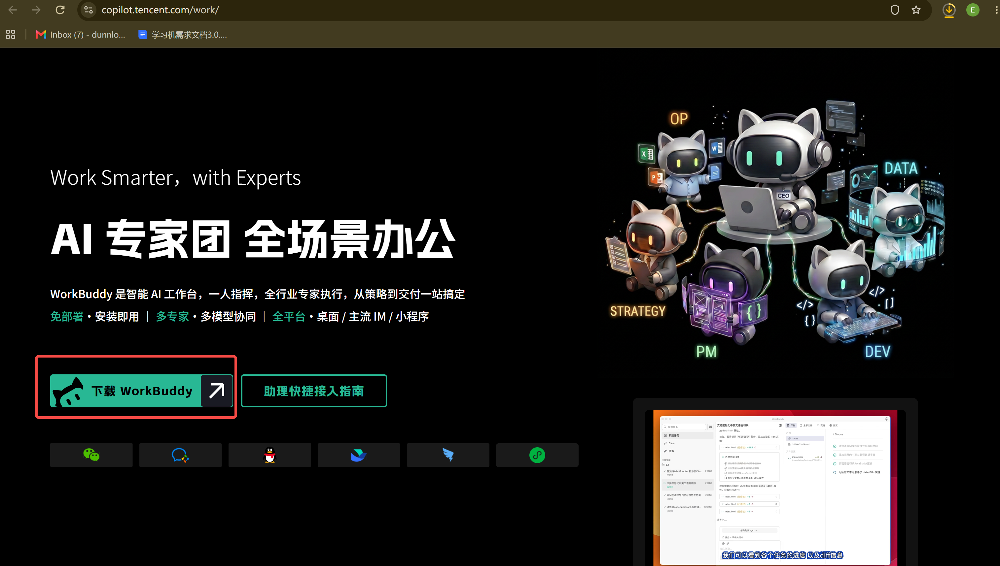

安装过程无脑下一步即可，WorkBuddy没什么需要抉择的地方。

# 配置 WorkBuddy

安装过程无脑下一步即可，安装好之后打开登录如下图

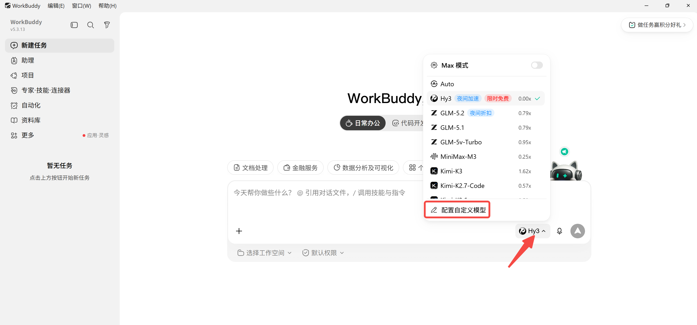

修改协议，选择 自定义 / Custom

填入下述内容（继续往下翻可以复制粘贴）

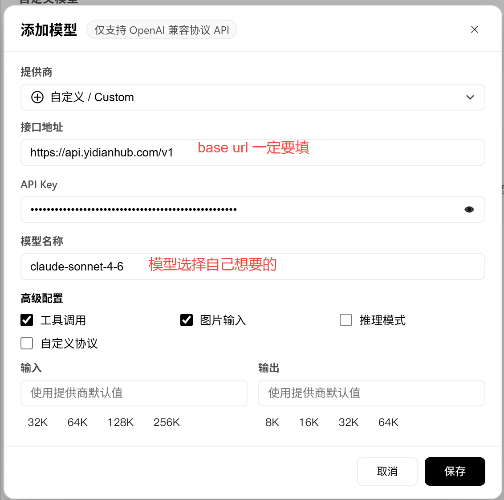

接口地址

```
https://api.yidianhub.com/v1
```

模型名称（任选一个即可）

```
claude-sonnet-4-6

claude-opus-4-7
claude-opus-4-6

claude-haiku-4-5-20251001
```

配置好后大概长这样

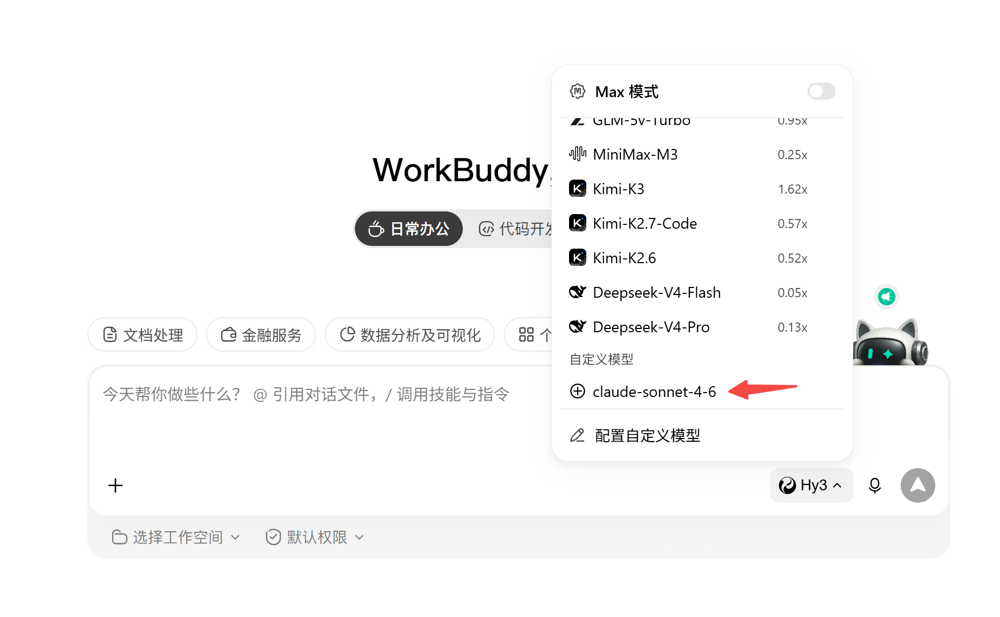

配置成功之后，输入文字“hi”或者“你好”，能正常对话反馈就算成功

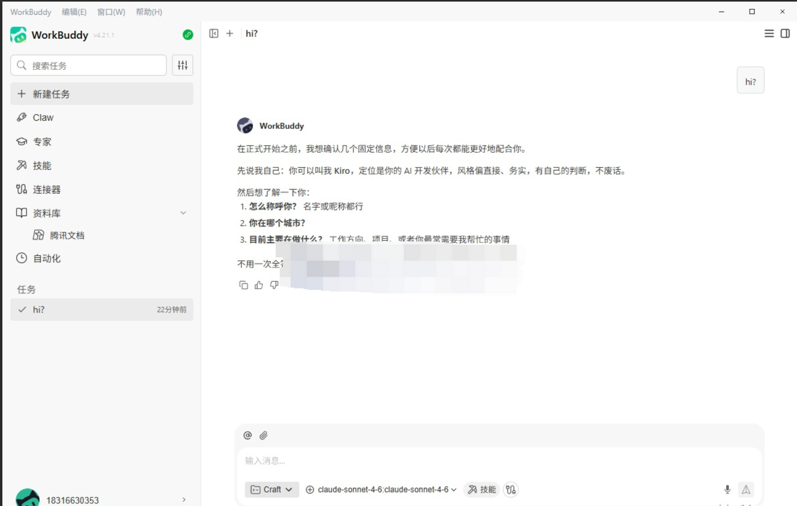

# 使用测试

## 联网搜索

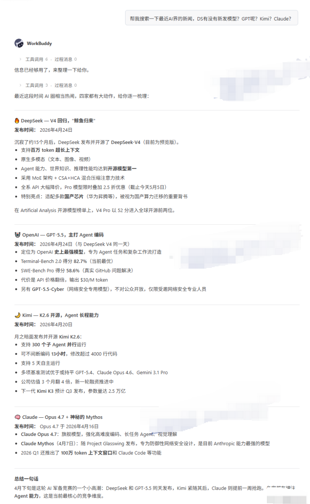

## 读取PDF测试

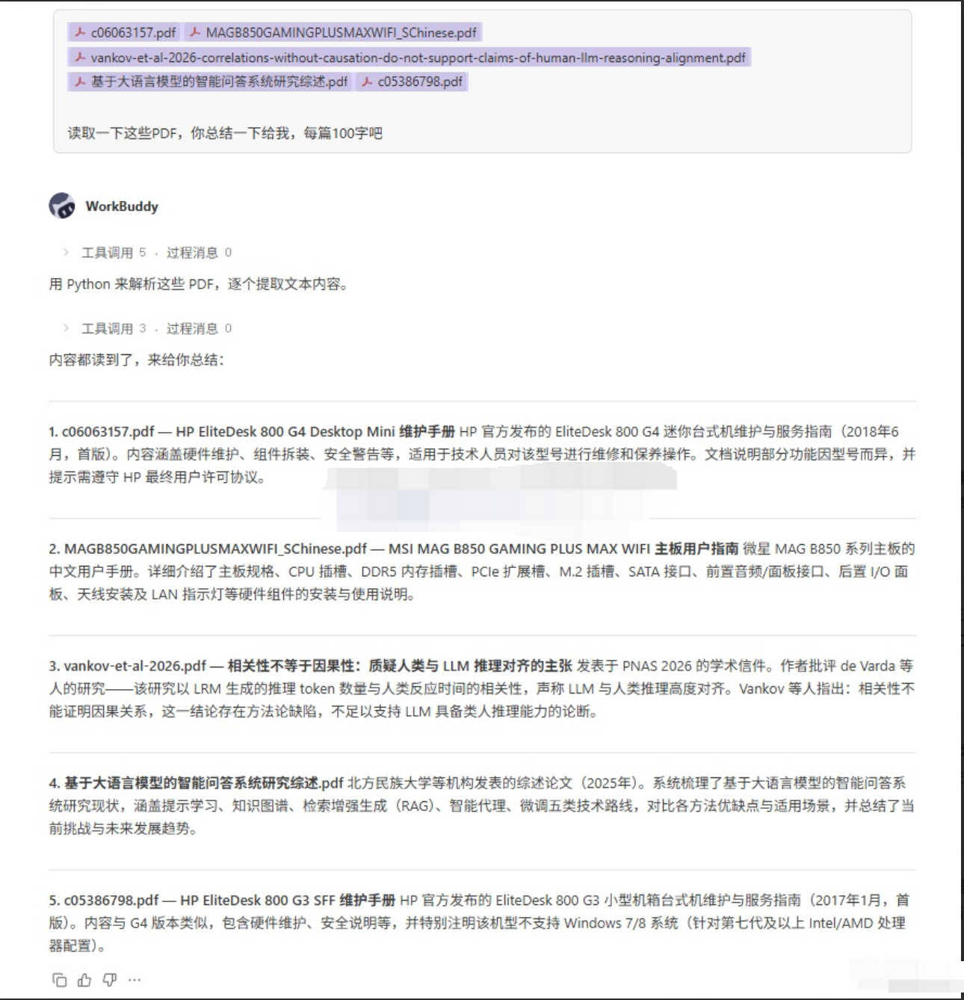

## 撰写论文测试

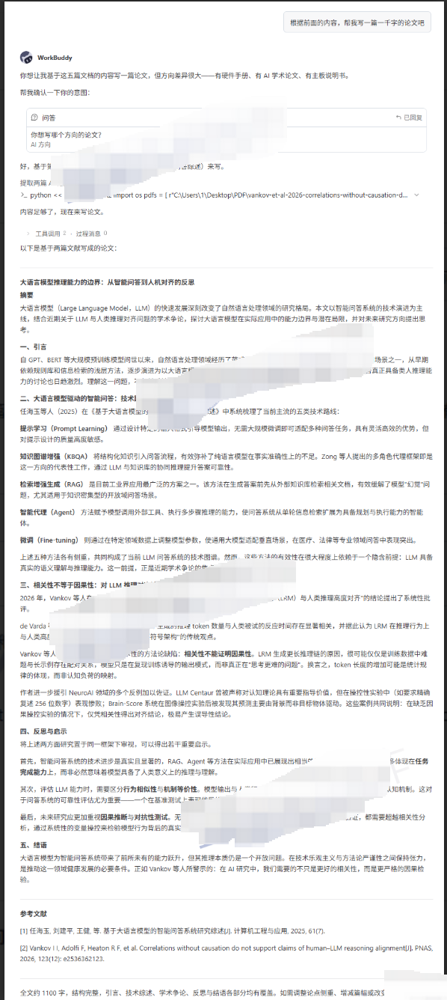

## 读取图片测试

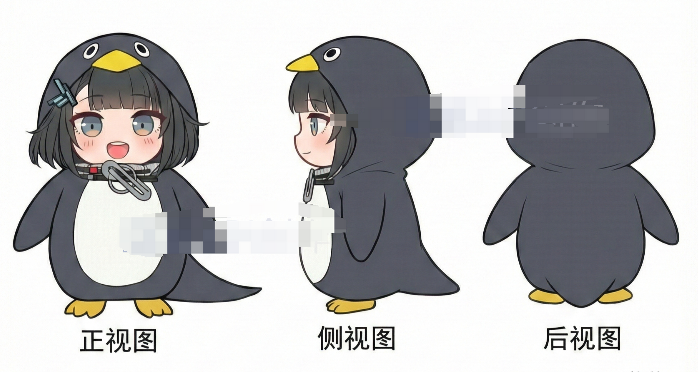

在读取图片之前，要确保自己开启了图片输入

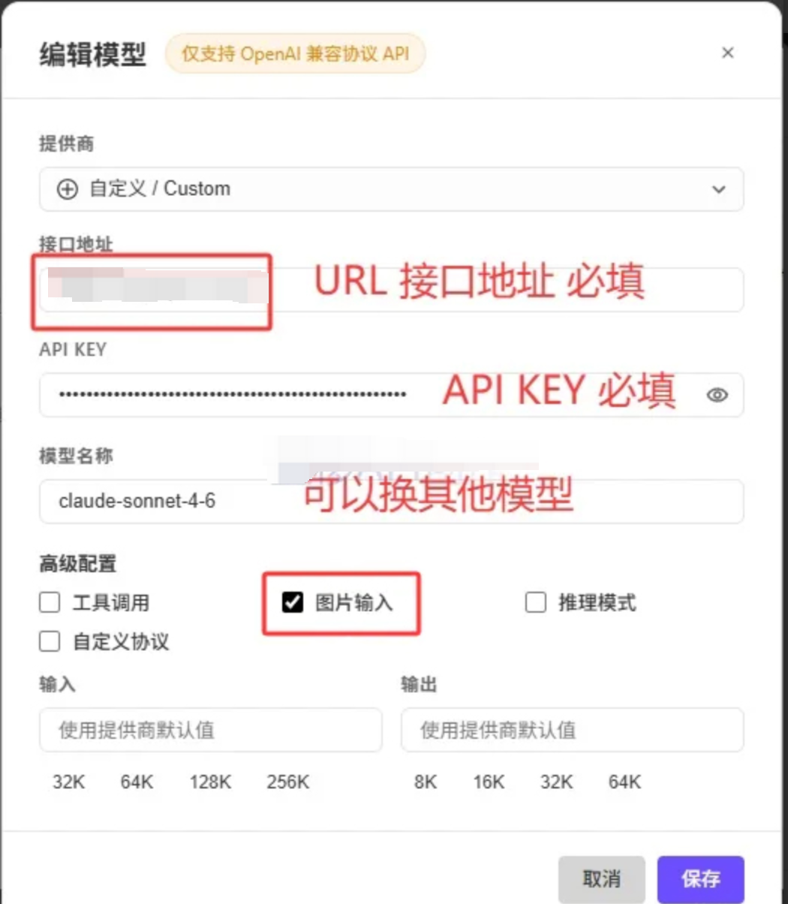

随后就能正常读取图片了

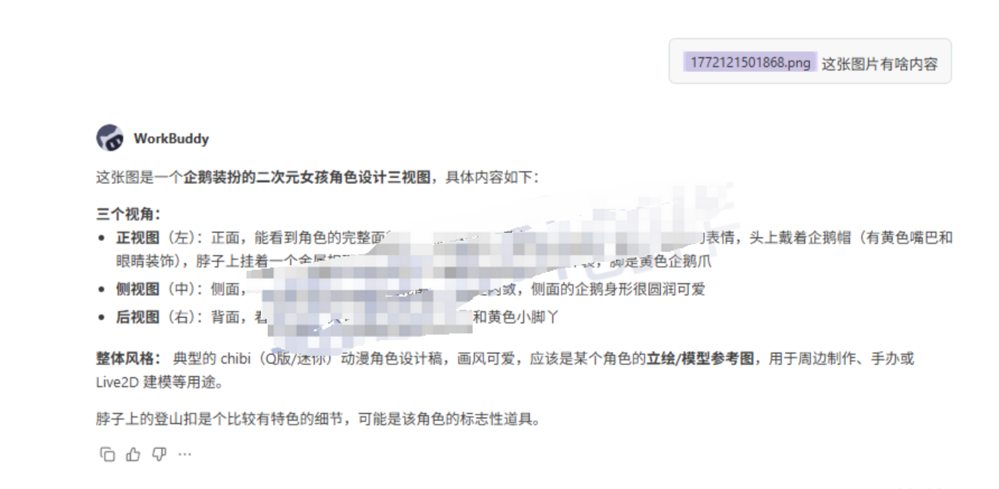

## 生成图片测试

搭载 5.5 之后，workbuddy 也是可以生成图片的，但感觉 default / 默认分组的 5.5搭载到 workbuddy 上面，生成出来的图片，质量没想象中那么理想？还给我打上了“图片由AI生成”的水印。

质量方面，感觉被 *CodeX+gpt5.5 *吊打，同提示词，差距不是一般的大，不过好歹他是能作图的，就当豆包用了吧。

提示词

```
你可以制造一张，千禧年中国家庭的合影吗？如果不能请说不能
```

WorkBuddy

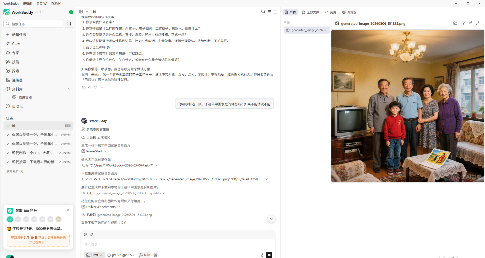

CodeX Image-2

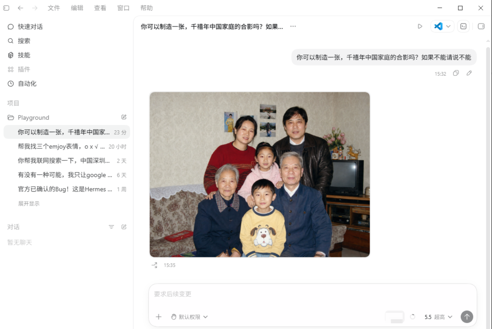
